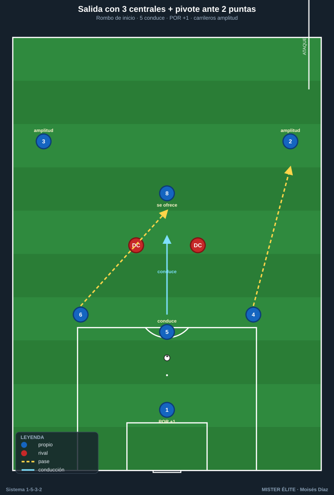
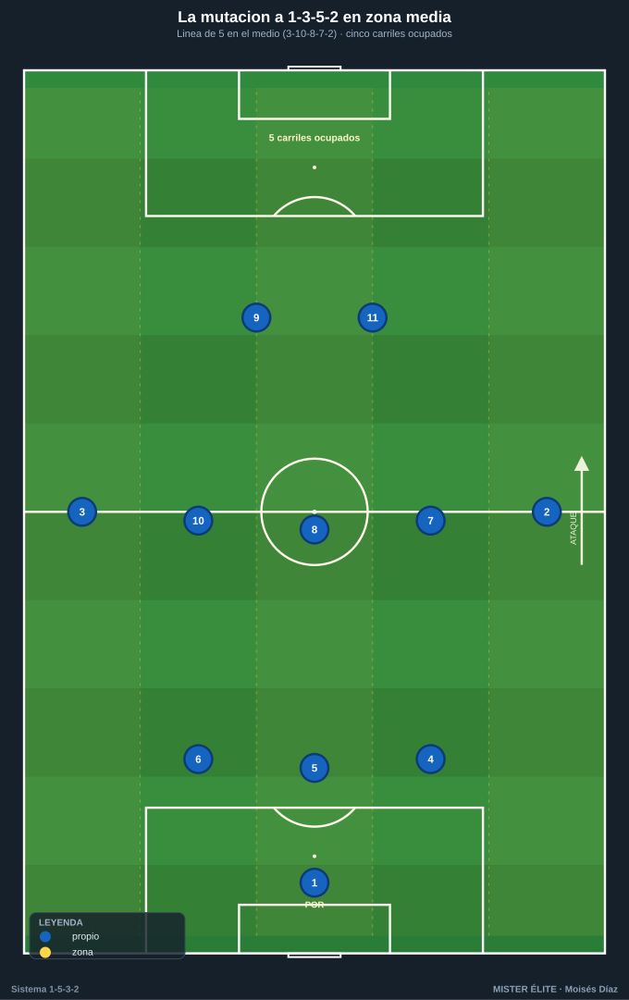
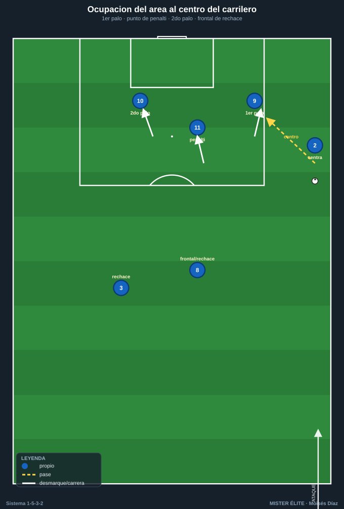
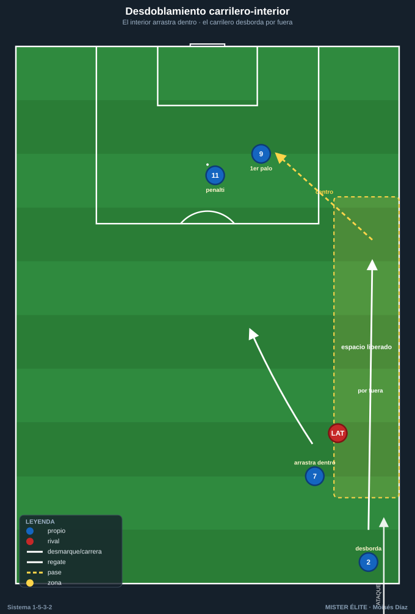

# Módulo 03 · Fase ofensiva

> Con balón el equipo es un **1-3-5-2**: los carrileros suben, atrás quedan 3 centrales y en el medio se forma una línea de 5. Se ataca **ancho y largo**, sin extremos.

---

## 1. Inicio de juego (salida desde atrás)

### Estructura base de salida

La salida se construye con los **3 DFC + el pivote (8)** formando un rombo por delante del portero:

- **Líbero (5)** en el centro: recibe del portero y **conduce hacia la línea de medios** para fijar y romper la primera presión. Es el regulador de la salida.
- **DFC laterales (4 y 6)** se abren a la altura del área, dando ángulo.
- **Pivote (8)** se ofrece por delante de los centrales, en el corredor central.
- **Carrileros (2 y 3)** dan la **primera amplitud alta**, fijando al primer presor rival.
- **POR (1)** como +1 permanente: permite jugar al lado contrario del que presiona.

### Superioridad numérica según la presión

| Punta(s) rival | Mecanismo | Resultado |
|---|---|---|
| **1 punta** | 3 DFC vs 1 → 3v1 | El líbero conduce libre; se progresa por dentro. |
| **2 puntas** | 3 DFC vs 2 → 3v2 (+1 portero = 4v2) | Un DFC lateral queda libre y conduce; el 8 da la tercera salida. |
| **2 puntas + 1 MC al pivote** | El 8 **baja entre los centrales** (salida en 4) o el portero juega largo/cambio | Se recupera línea de 3 detrás del balón y el 8 libera al líbero. |

### Mecanismos clave de la salida

- **El líbero conduce:** si nadie le presiona, avanza hasta atraer a un rival y entonces suelta.
- **Bajada del pivote (8):** baja a formar línea de 3 solo cuando le saltan al hombre; si hay 3v1/3v2 limpio, se queda alto (no quitar un apoyo interior sin necesidad).
- **Carrileros como válvula de escape:** cuando el centro se cierra, cambio de orientación al carrilero del lado débil con campo por delante.
- **Regla anti-pérdida:** el DFC del lado contrario al balón nunca sube por encima de la línea del balón → siempre 2 hombres de seguro + portero.

---

## 2. Construcción en zona media — la mutación a 1-3-5-2

### La subida de los carrileros

Al superar la primera línea, **los carrileros (2 y 3) suben a la línea de medios**:

- Atrás quedan **3 DFC** (4-5-6) sosteniendo la última línea.
- En el medio se forma una **línea de 5**: CAR (2) – interior (7) – pivote (8) – interior (10) – CAR (3).
- **Anchura máxima por ambos lados** sin perder el bloque central de 3.

### Relación pivote–interiores

- **Pivote (8):** pivota la circulación, se sitúa en el medio espacio para recibir de cara y dar apoyo de seguridad.
- **Interiores (7 y 10):** reciben en los **medios espacios**, perfilados para girar. El 10 (creativo) se asocia con el 11; el 7 (box-to-box) ataca el área.
- **Rotaciones:** si el interior recibe presión de espaldas, descarga (pared) y se gira al espacio.
- **Cambios de orientación:** el pivote o el líbero cambian de carrilero a carrilero para mover el bloque rival.

---

## 3. Último tercio (creación y finalización)

### Amplitud y centros de los carrileros

Son los proveedores naturales de centro: llegan al fondo y ponen el balón al área.

- **Tipos de centro:** raso al primer palo (para el DC de ruptura), tenso al punto de penalti, atrás (cut-back) a la frontal para el interior.

### Desmarques coordinados de los 2 DC

El sistema vive de la **complementariedad de los 2 delanteros**:

- **DC referencia (9):** ataca el primer palo / apoyo, fija al central, abre espacio. Hace de ancla ofensiva.
- **DC ruptura (11):** ataca el espacio a la espalda / segundo palo. Cruza sobre la diagonal del 9.
- **Patrón "uno apoya, uno rompe":** cuando uno baja a pie, el otro ataca la profundidad. Nunca los dos a la vez.

### Llegada de interiores y ocupación del área

- **Llegada del interior (sobre todo el 7)** desde segunda línea a rematar el cut-back o atacar la frontal: sin marca natural.
- **Regla de remate (cada centro):** 1er palo (9) – punto de penalti (11) – 2º palo (interior 7/10 lejano) – frontal/rechace (pivote 8 o carrilero lejano).

---

## 4. Automatismos clave

1. **Pared (1-2):** interior o punta recibe de espaldas, descarga al pivote/carrilero y se gira al espacio.
2. **Tercer hombre:** el líbero (5) o el pivote (8) juega al interior; este descarga de primeras a un tercer jugador que llega lanzado a la espalda de la línea rival. Mecanismo estrella para progresar entre líneas.
3. **Desdoblamiento carrilero–interior:** el interior arrastra hacia dentro al lateral rival y el carrilero desborda por fuera en el espacio liberado (o a la inversa). El automatismo de banda más importante.
4. **Llegada desde atrás:** el interior box-to-box (7) o un DFC lateral llega en segunda oleada cuando la jugada se trabaja por el lado contrario — sin marca.
5. **Fijar para liberar:** carrilero alto fija al lateral rival → el líbero/pivote cambia al lado débil donde el otro carrilero ataca el 1v1 con campo.

---

## Ideas clave

- La salida explota la **superioridad de 3 centrales** (3v2 / 4v2); el líbero conduce para fijar y soltar.
- La **subida de los carrileros** transforma el 1-5-3-2 en 1-3-5-2 y ocupa los cinco carriles.
- El **medio espacio** es la zona de oro: que los interiores reciban entre líneas, perfilados para girar.
- Los **2 DC se reparten el trabajo:** uno apoya, uno rompe — nunca el mismo movimiento.
- En cada centro se **ocupan los dos palos + la frontal**; el carrilero lejano ataca como un delantero más.

## Errores comunes

- Bajar el pivote (8) sin necesidad y quitar un apoyo interior.
- Carrileros que reciben **metidos por dentro** en vez de pegados a la cal (pierden la amplitud).
- Los dos delanteros haciendo **el mismo movimiento** (los dos bajan o los dos rompen).
- Centros sin ocupar los puntos del área (falta el segundo palo o la frontal de rechace).
- Subir el DFC del lado contrario por encima del balón y exponer la espalda en transición.
