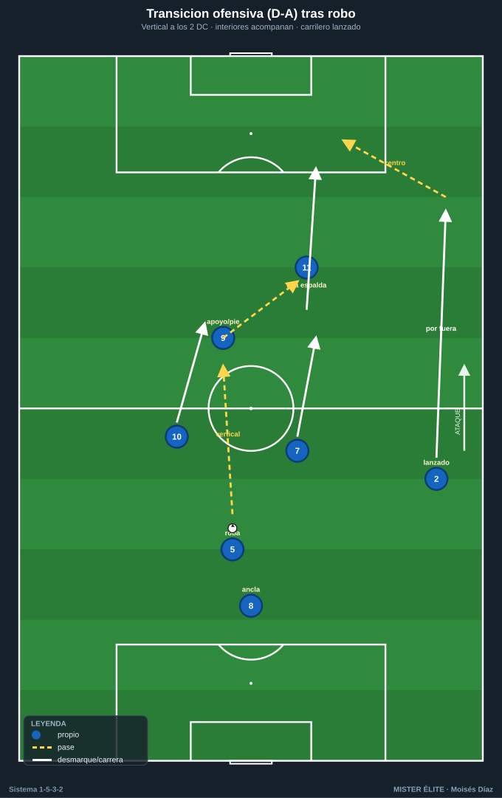
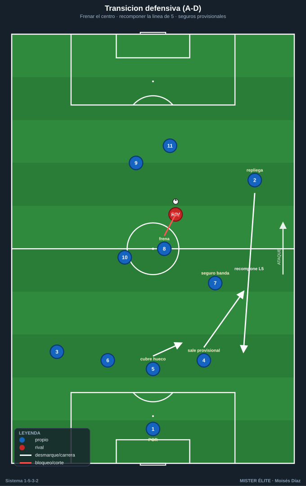
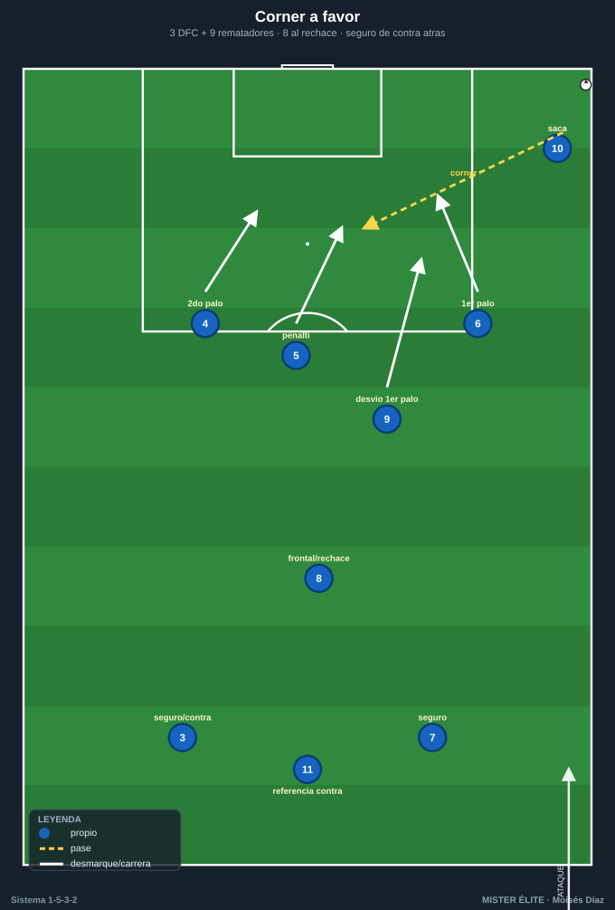

# Módulo 04 · Transiciones y balón parado

> El 1-5-3-2 es sólido en transición defensiva si los carrileros recomponen la línea de 5; peligroso en transición ofensiva por la profundidad de sus dos puntas. Su riesgo específico: perder el balón con los carrileros arriba.

---

## 1. Transición ofensiva (robo → ataque)

La ventaja del sistema: **2 puntas siempre arriba** como referencia inmediata de contraataque.

- **1.ª opción — vertical a los puntas:** tras robar, balón rápido al 9 (apoyo/pie) o al 11 (a la espalda). El 9 sostiene y descarga; el 11 corre el espacio.
- **2.ª opción — interiores que acompañan:** los 2 interiores (7/10) llegan en apoyo y conducción para dar continuidad.
- **3.ª opción — carrileros lanzados:** si el robo es alto/estable, los carrileros (2 y 3) arrancan por fuera para dar amplitud al contra. Se llega a 4-5 atacantes (2 DC + 2 interiores + carrilero).
- **Principio:** atacar el espacio que dejó el rival al perder; si no hay contra clara, fijar y pasar a ataque organizado (mutar a 1-3-5-2).

---

## 2. Transición defensiva (pérdida → repliegue)

Objetivo inmediato: **recuperar la línea de 5** y no quedar abiertos por el flanco que estaba arriba.

- **Frenar el balón:** el jugador más cercano (interior o pivote) presiona para retrasar el primer pase y dar tiempo al repliegue. Presión tras pérdida 2–3 s si el robo permite contra-robo.
- **Replegar el carrilero adelantado:** el CAR del lado donde se perdió **baja a recomponer la línea de 5** lo antes posible; mientras llega, el DFC lateral de ese lado **sale a cubrir la banda** y el líbero (5) bascula a tapar el hueco.
- **Los 3 DFC sostienen la última línea**; el pivote (8) tapa el carril central; los interiores recuperan posición.
- **Riesgo a cubrir:** la espalda del carrilero que estaba arriba. Si no llega: **DFC lateral ataja en banda + líbero cubre el centro** (basculación de 3 a 4 temporal).
- **Regla:** nunca defender en transición con la línea de 3 estirada; ante la duda, achicar hacia el balón y caer todos por detrás formando el 1-5-3-2.

---

## 3. Contrapresión inmediata (3–5 s)

Al perder en zonas altas/medias, los más cercanos (delanteros e interiores) saltan de inmediato:

- Saltan los **2–3 jugadores más cercanos**; el resto cierra líneas de pase interiores (no todos al balón).
- El **pivote (8)** es el ancla: tapa el pase interior de salida del rival.
- Si la contrapresión falla, los lejanos replegan de inmediato a su línea (los carrileros a la de 5). La contrapresión **compra tiempo** para recomponer.

---

## 4. Balón parado a favor

### La ventaja estructural

El 1-5-3-2 cuenta con **3 DFC altos y potentes (4-5-6)** + el DC referencia (9) → ventaja física natural en el juego aéreo ofensivo.

### Córners y faltas laterales

- **Rematadores principales:** los 3 DFC (4, 5, 6) + el 9 → bloque de 4 rematadores de envergadura.
- **Estructura:** 1 al primer palo (desvío), 2-3 atacando punto de penalti y segundo palo con carreras cruzadas, 1 al segundo palo. Bloqueos para liberar al rematador más alto.
- **Resto:** pivote (8) en la frontal para el rechace; **1-2 atrás (carrilero + 1 DFC o interior)** vigilando la contra — clave porque el sistema sube mucha gente al área.

### Frontales y saques de banda

- **Frontal directa:** lanzador según lado; 1-2 al rechace y bloque de seguridad atrás.
- **Saques de banda en campo rival:** el carrilero saca con el interior y el DC del lado (paredes), u opción de saque largo al área por la altura de los centrales.

---

## 5. Balón parado en contra

- **Córner defensivo:** con tanta altura, **marcaje mixto** (zona en los palos + hombre a los rematadores rivales). 1 en cada palo, zona en la zona de remate, hombre a los más peligrosos.
- **Cobertura de transición:** dejar a los **2 puntas (9 y 11) arriba** como amenaza de contra → desincentiva que el rival suba a todos.

---

## Ideas clave

- Transición defensiva = **recuperar la línea de 5**: frenar el centro primero, recomponer bandas después.
- El **interior es el seguro provisional** de la banda mientras el carrilero baja.
- Transición ofensiva = explotar la **profundidad de los 2 DC** y el desdoblamiento del carrilero.
- El **ABP ofensivo es un arma real** por la altura de los 3 centrales, sin descuidar el seguro de contra.
- Dejar siempre **2 puntas arriba** en ABP defensivo para amenazar la contra.

## Errores comunes

- Replegar persiguiendo por fuera y dejar el **centro abierto** (primero se frena el balón central).
- Carrilero que tarda en bajar tras pérdida con él arriba (la banda descubierta es el gol del rival).
- Subir a todo el equipo en córners ofensivos sin **seguro de contra**.
- Contrapresionar todos al balón a la vez (hay que cerrar las líneas de pase interiores).
- En ABP defensivo, no dejar referencia arriba y permitir que el rival suba a todos sin riesgo.
