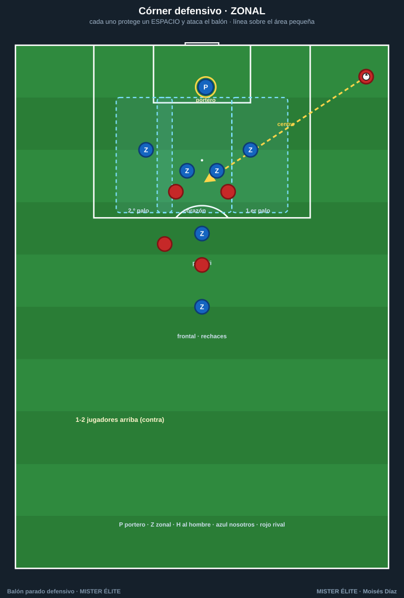
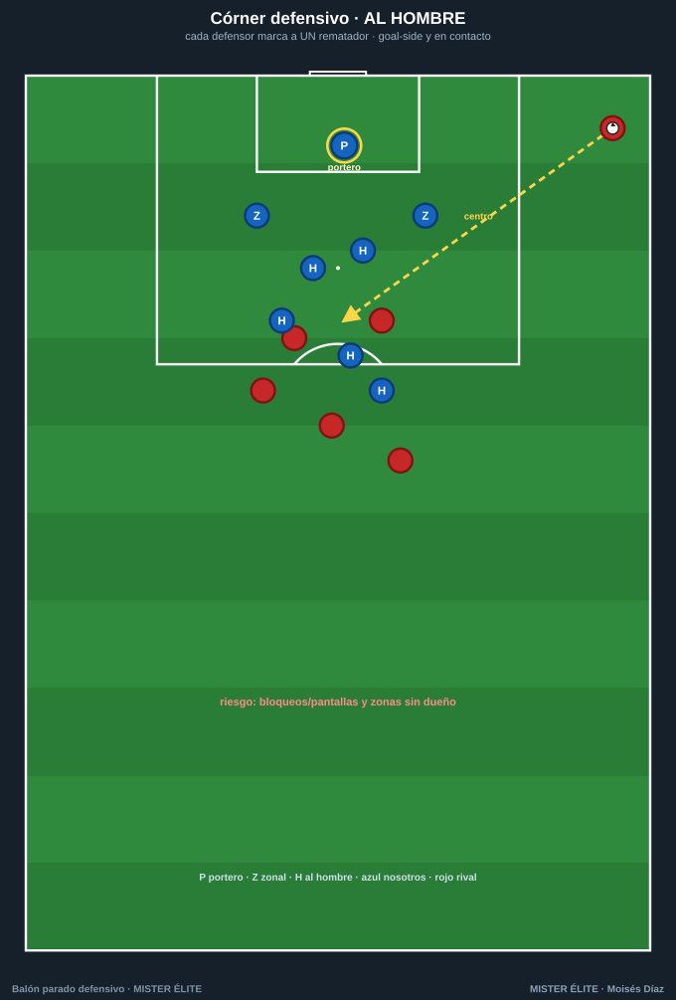
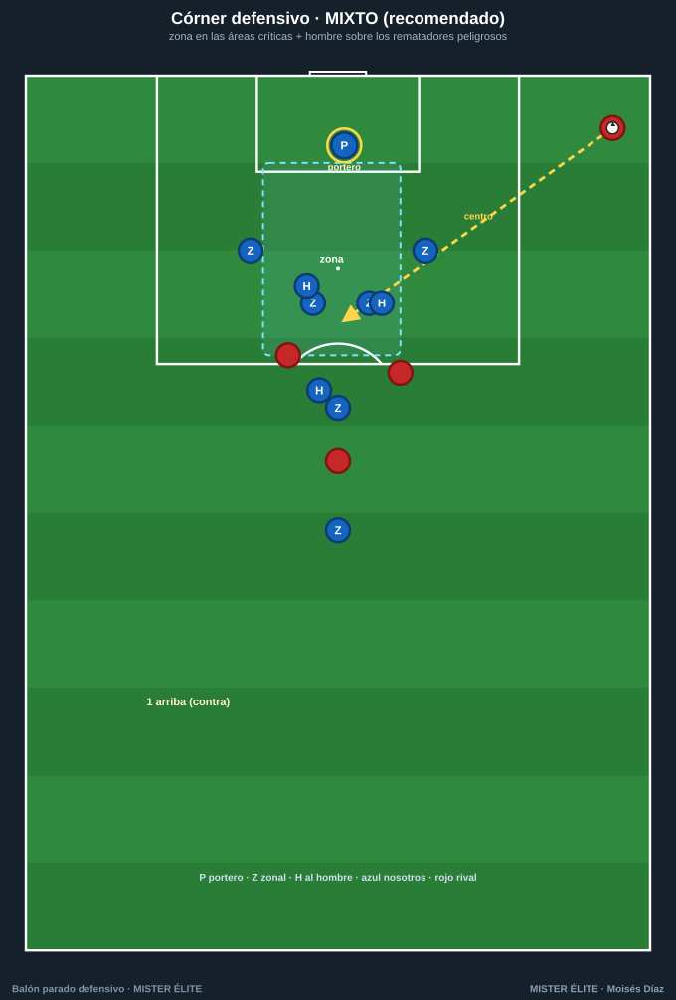
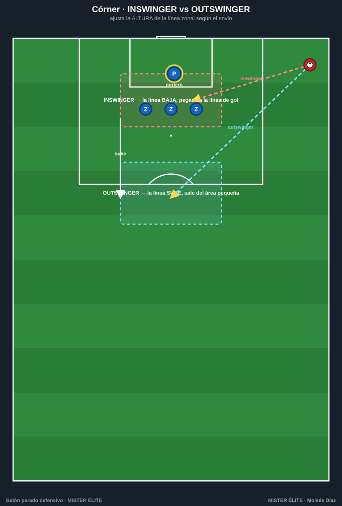
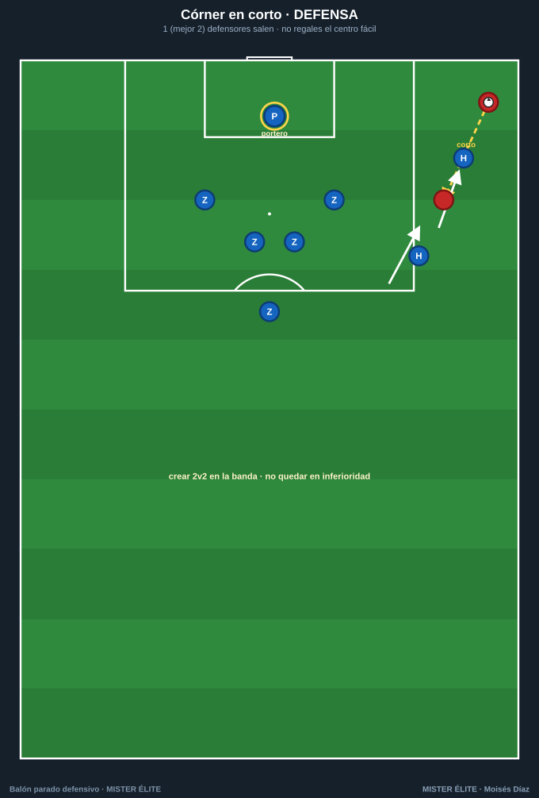
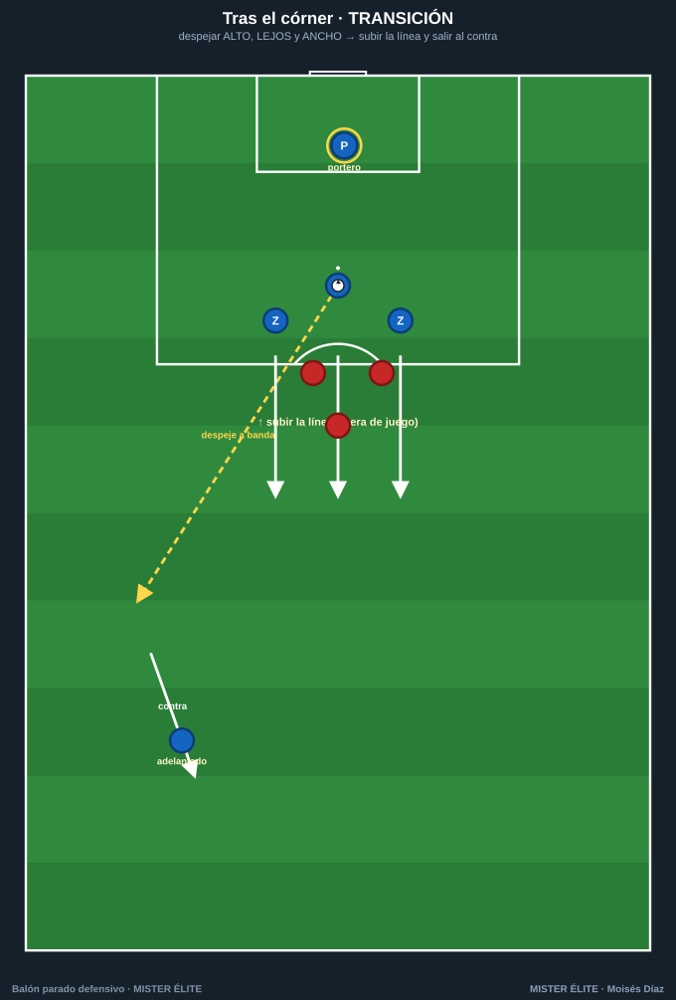

# Defender el córner

Tres formas de organizarlo (zonal, al hombre, mixto) y cómo defender las variantes del rival. Recomendación del curso: **mixto con dominancia zonal**.

---

## Córner ZONAL

- **Idea:** cada uno protege un **espacio** y ataca todo lo que entra en él, mirando el balón desde el saque.
- **Estructura:** línea de zonales sobre el **área pequeña** (1.er palo · corazón × 2 · 2.º palo · penalti) + 1 en el **frontal** para rechaces + portero.
- **Reglas de oro:** **espaciado** sin huecos · **escalonar** (el central algo más profundo) · ante **inswinger baja**, ante **outswinger sube**.
- **Coaching:** atacar el balón, no a los rivales; ningún hueco aprovechable entre dos zonas.

## Córner AL HOMBRE

- **Idea:** cada defensor marca a **un rematador** y gana el balón antes que él.
- **Estructura:** emparejamientos por **peligro/altura** + jugadores en los palos para achicar la portería.
- **Reglas de oro:** **goal-side y en contacto** · ante una pantalla, **comunica y cambia de marca** (no choques).
- **Riesgo:** bloqueos/pantallas y **zonas sin dueño**. Por eso casi nadie lo usa puro.

## Córner MIXTO (recomendado) ⭐

- **Idea:** **zona** en las áreas críticas + **hombre** sobre los 3 rematadores más peligrosos. Lo más sólido (Mundial 2022: solo 2,2 % de córners encajados).
- **Estructura tipo:** 4-6 zonales (palos + corazón + penalti + frontal) · 3 al hombre · **1 arriba** para el contra.
- **Coaching:** tus mejores cabeceadores en zona en el área pequeña; los "bloqueadores" pegados a sus rematadores para que ni reciban.

---

## Defender las variantes del rival

### Inswinger vs outswinger (altura de la línea)

- **Inswinger** (cerrado, entra a portería): la línea zonal **BAJA** y se pega a la línea de gol; portero prudente; blindar el **primer palo** y la peinada. Es el más peligroso.
- **Outswinger** (abierto, se aleja): la línea **SUBE** y sale del área pequeña; cubrir los **cut-backs**; la línea más alta bloquea las carreras.

### Córner en corto

- **1 (mejor 2) defensores salen** ~10 m hacia el lanzador para impedir el centro fácil al primer palo.
- **Crear 2v2** en la banda, no quedar en inferioridad. **No regales** el córner en corto ignorándolo.

### Transición tras despejar

- **Despeja ALTO, LEJOS y ANCHO**, idealmente hacia tu jugador adelantado.
- **Sube la línea en bloque** (deja en fuera de juego a los rematadores) y **sal al contra**: el rival ha dejado espacios enormes.

---

> **Checklist del córner:** sistema elegido (mixto) · primer palo cubierto · 2 mejores cabeceadores en el corazón · 3 hombre sobre los peligrosos · 1 en el frontal (rechaces) · 1 arriba (contra) · portero mandando · altura ajustada al tipo de envío.
