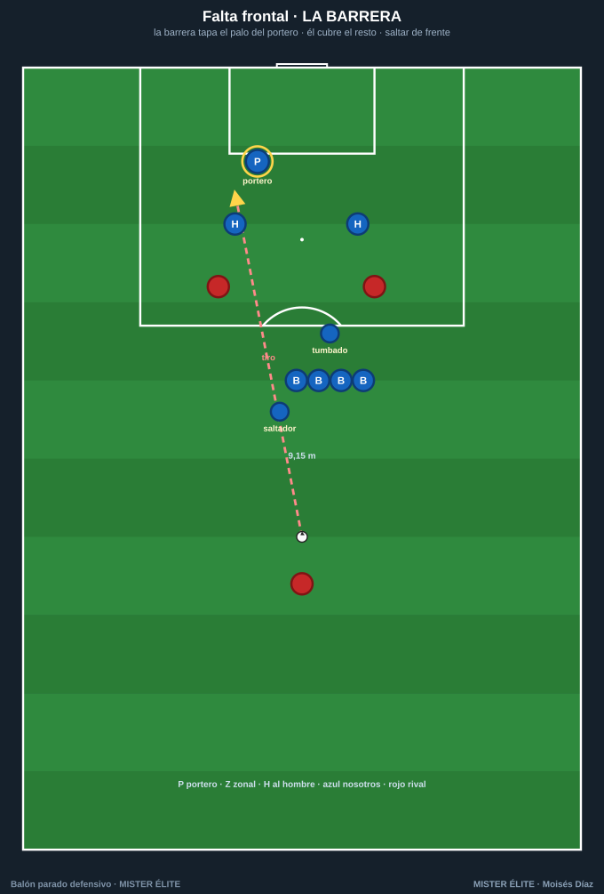
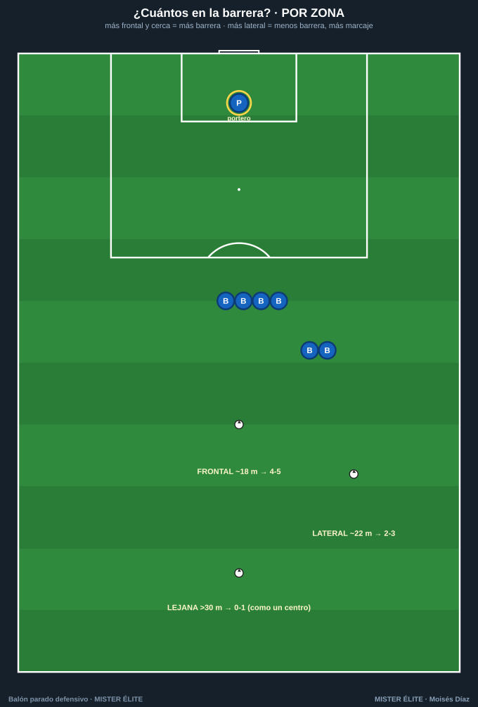
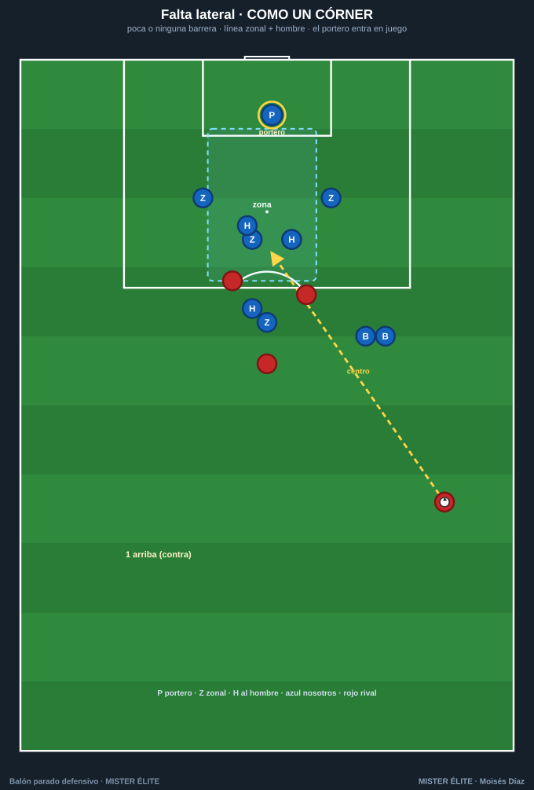

# Defender las faltas

La falta se defiende según **dónde** esté: frontal (tiro) → barrera; lateral (centro) → como un córner. Y siempre, un detalle reglamentario: **un hombre sobre el balón** para impedir el saque rápido hasta tener todo colocado.

---

## La barrera (falta frontal)

- **La barrera tapa el palo del portero** (el más cercano a la falta); el portero **cubre el resto** de la portería. La barrera protege un lado, el portero el otro.
- **Quién la alinea:** el **portero** (ve el ángulo balón-palo), a través de un **anclaje** (el jugador del extremo de la barrera, que mira al portero hasta que lo fija y luego gira al balón).
- **Cómo se salta:** hombro con hombro, **compactos sin huecos**, **de frente** (nunca girarse), **saltar al golpeo** con los **brazos pegados al cuerpo** (manos arriba = penalti).
- **El tumbado:** un defensor **tumbado de costado detrás de la barrera**, cabeza al primer palo, para tapar el **disparo raso por debajo** de la barrera al saltar. Imprescindible en faltas frontales cercanas.
- **El saltador:** un jugador valiente que **sale de la barrera hacia el balón** al golpeo, para achicar el ángulo de un pase raso/ensayado.
- **Fuera de la barrera:** marcaje **mixto** (hombre sobre los peligrosos + zonas en los puntos calientes).

> **Regla práctica del nº de jugadores:** **6 para un balón a ~18 m central**, y quita uno por cada ~3 m que se aleje. Frontal-central peligrosa → 4-5; diagonal → 2-3; lejana → 0-1.

## ¿Cuántos en la barrera? (por zona)

- **Frontal ~18 m** → **4-5** (tapar el tiro y el raso bajo la barrera).
- **Lateral ~22 m** → **2-3** (ya es más centro que tiro).
- **Lejana > 30 m** → **0-1**: no hay barrera, se defiende **como un centro/córner**.

## Falta lateral (defender como un córner)

- **Poca o ninguna barrera** (1-2 solo para tapar el tiro al palo si el ángulo lo permite).
- **Línea zonal cerca del propio gol** + **marcaje** de los rematadores; el **portero entra en juego** (sale a su zona).
- **Vigila el bloqueo** sobre el último defensor de la línea (recurso típico de las faltas laterales).

---

## El fuera de juego como arma

En faltas laterales y al área, la **línea sube de forma coordinada en el momento del golpeo** para dejar en fuera de juego a los rematadores que esperan al fondo.

- **Un solo líder** (normalmente un central) ordena la subida; **todos suben a la vez**.
- El fallo más común: **un defensor llega tarde** y deja a todos en juego.
- Requiere jugadores **rápidos y sincronizados**; **no abusar** (1-2 veces por partido); voz alta y clara.

---

## Errores comunes y reglas de oro

| Error | Regla de oro |
|---|---|
| Conceder el **saque rápido** | **Siempre un hombre sobre el balón** hasta tener la barrera |
| Barrera con **huecos** o mal alineada | **El portero alinea, el anclaje ejecuta**; tapa el primer palo |
| Saltar **girándose** o con los **brazos arriba** | Compactos, **de frente**, brazos abajo |
| **Nadie tumbado** → gol raso | **Un tumbado** en faltas frontales cercanas |
| Rematadores **sin marca** | Cada hombre peligroso marcado (zona + hombre) |
| Línea **descoordinada** | **Un solo líder** para la subida / fuera de juego |
