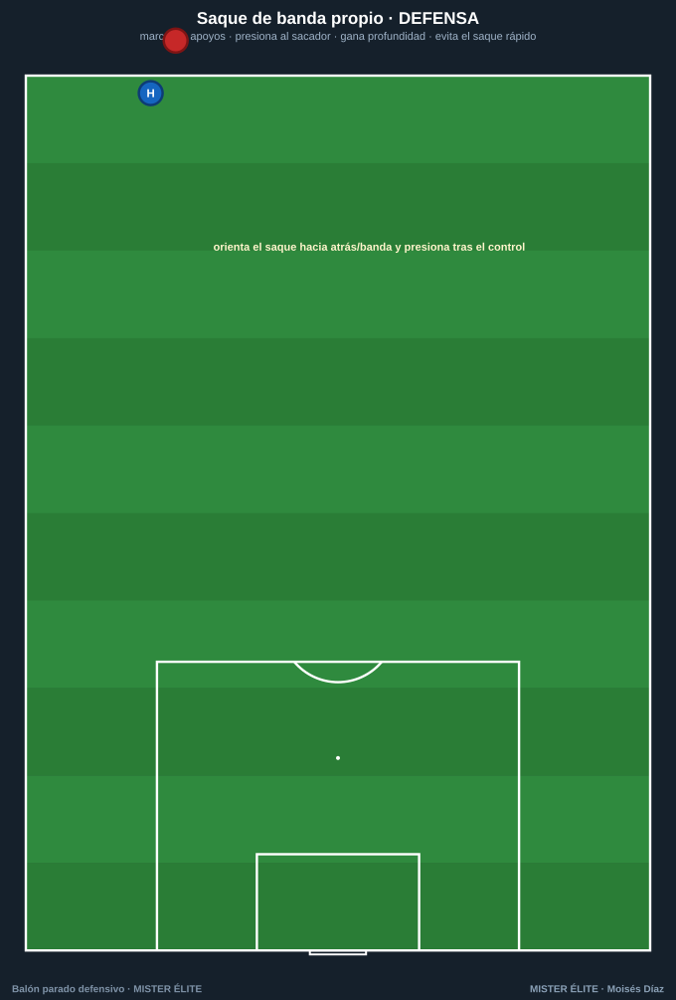
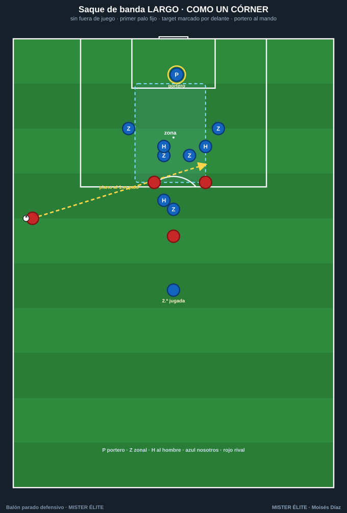

# Defender los saques de banda

Una regla lo cambia todo: **no existe fuera de juego en el saque de banda.** Así que el fuera de juego **no es un arma** aquí; hay que **marcar al hombre y ganar profundidad** rápido, no fiarse de la línea.

---

## Saque de banda en campo propio

- **No concedas el apoyo fácil:** marca las opciones cercanas del sacador (el receptor de pie, el apoyo interior, el de banda). Quita la **primera línea de pase**.
- **Cuidado con la pared con el sacador:** coloca un jugador **cerca/detrás del sacador** para anular el devolver-y-recibir y la superioridad.
- **Orienta:** deja abierta a propósito la opción **hacia atrás/banda** (zona pobre) y **presiona tras el primer control** para recuperar orientado hacia fuera.
- **Evita el saque rápido:** **gana profundidad de inmediato** del lado del saque (el lateral/extremo esprinta a su posición en cuanto se pierde el balón).

## Saque de banda LARGO (tipo Delap)

El saque largo, **plano y rápido** cerca del área, es tan peligroso como un córner (y, al no haber fuera de juego, el rival **satura el área pequeña**). Se defiende **como un córner**:

- **Marca al target del flick-on** (el rematador que prolonga, casi siempre al **primer palo**): **por delante**, para que no peine.
- **Defensor fijo en el PRIMER PALO** (zona): corta la peinada, el remate más peligroso.
- **Portero al mando:** posición un paso por delante del primer palo, a un brazo, **cuerpo de cara**; sale a **blocar o despejar con puños** lo que llegue a su zona. Decide de antemano: **sale** o se **llena el área pequeña**.
- **Segundas jugadas:** jugadores **fuera del área** para recoger los rechaces.
- **Roles memorizados:** cada uno sabe si va al **primer palo**, al **segundo / por detrás** o **mantiene su zona**.

---

## Reglas de oro

| Situación | Regla de oro |
|---|---|
| Cualquier saque | **Sin fuera de juego → marca al hombre y gana profundidad ya** |
| El sacador | **Presiónalo/condiciónalo**; cierra la primera línea de pase; orienta hacia atrás |
| Saque rápido | **Esprinta a tu posición** del lado del saque |
| Saque largo | **Como un córner:** primer palo fijo, target marcado por delante, portero al mando, segundas jugadas cubiertas |
| El portero | **Decide** (salir o llenar el área), pero **comunicado de antemano** |

> **Recuerda:** el error nº1 en el saque de banda es **subir la línea creyendo en el fuera de juego**. No existe. Marca y gana profundidad.
