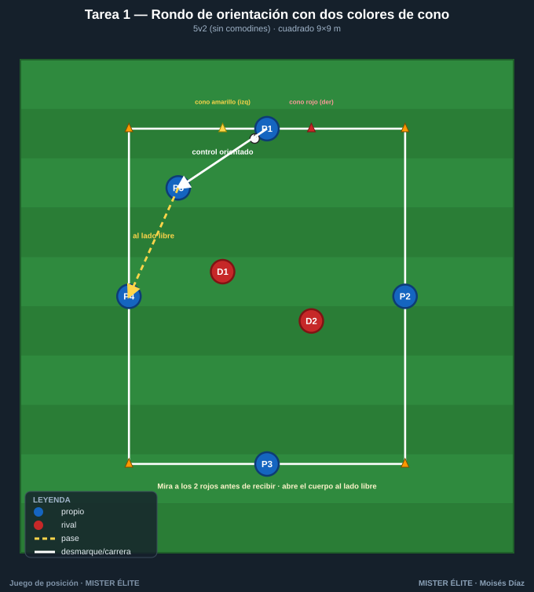
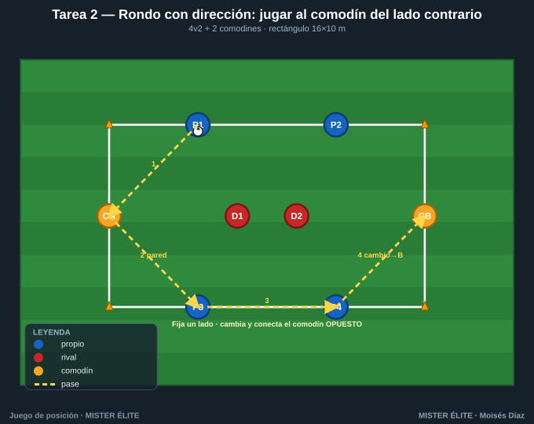
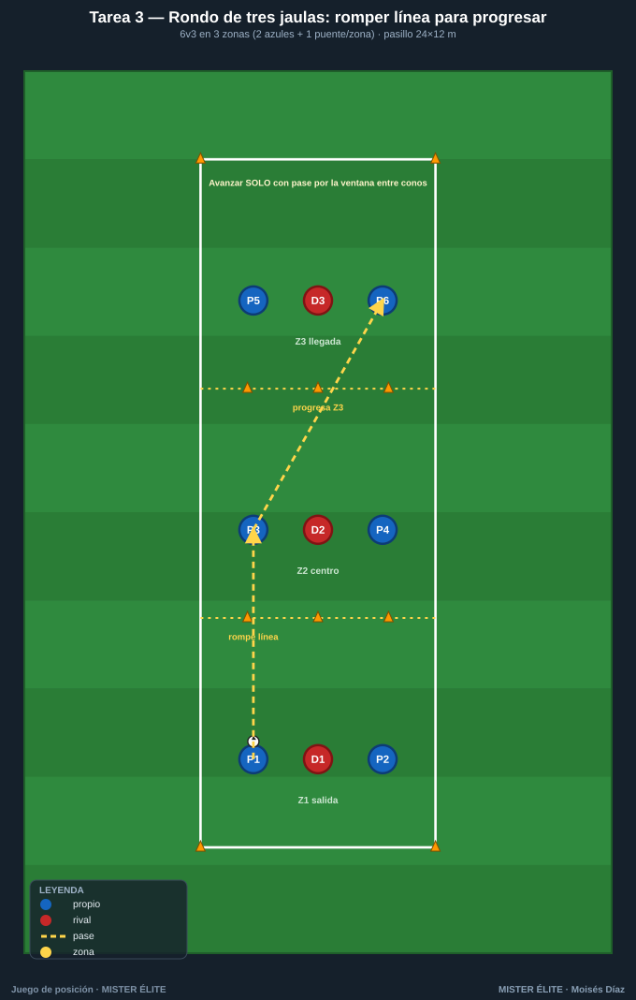
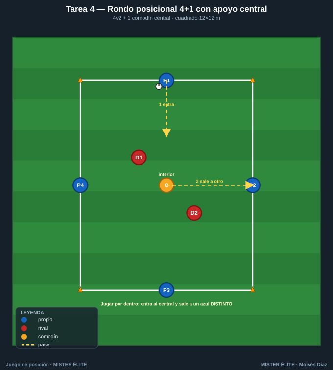
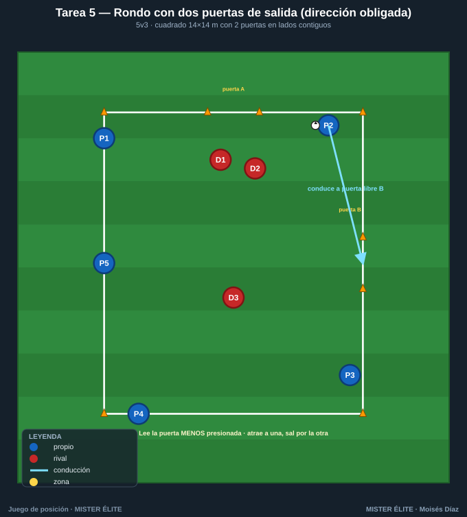

# Familia 1 · Rondos posicionales y de orientación (T1–5)

> Notación: poseedores **azules**, defensores **rojos**, comodines **ámbar**. Flechas: pase (amarillo discontinuo), conducción (azul), desmarque (blanco), presión (rojo). Secuencias numeradas 1-2-3.
> El rondo entrena **el qué y el cómo del pase** (perfil, primer toque, lectura) con máxima densidad. Aquí se le añade un primer **sentido de orientación y dirección** para enlazar con el juego de posición.

---

## Tarea 1 — Rondo de orientación con dos colores de cono

**Objetivo.** Orientación corporal y perfil de recepción. El poseedor aprende a abrir el cuerpo para jugar SIEMPRE hacia el lado libre (lejos del defensor), no por inercia.

**Organización.**
- Relación: **5v2** (5 azules en cuadrado + 2 rojos dentro). Sin comodines.
- Medidas: cuadrado de **9×9 m**.
- Material: 4 conos esquina; en cada lado un **cono amarillo a la izquierda y uno rojo a la derecha** del jugador (referencia de orientación). Balones de repuesto en 2 esquinas.

**Desarrollo.** Rondo clásico 5v2 a uno-dos toques. La diferencia: antes de recibir, el azul **mira dónde están los 2 rojos** y orienta el primer apoyo (control orientado) hacia el cono amarillo o rojo que deje libre la presión.

**Provocaciones (medibles).**
- **Máximo 2 toques.** Si el primer control no va orientado a un lado libre (control "de frente y parado"), balón perdido → rotan los rojos.
- **Punto de equipo** cada **8 pases** con al menos 1 control orientado por jugador.
- Si los rojos roban o tocan, entra el azul que perdió y sale un rojo.

**Variantes (fácil → difícil).**
1. *Fácil*: 3 toques, rondo 6v2.
2. *Media*: 2 toques, 5v2.
3. *Difícil*: **1 solo toque** y prohibido devolver al que te pasó (fuerza orientación a un tercer apoyo).

**Coaching.**
- "Recibe medio cuerpo girado": pie de apoyo apuntando al lado por el que vas a salir.
- Ver antes de recibir: cabeza arriba en el momento del pase del compañero.
- El control resuelve el pase: si el control es bueno, el pase es fácil.

**Duración.** 4 series de 3 min, 1 min descanso (rota la pareja de rojos cada serie).

---

## Tarea 2 — Rondo con dirección: jugar al comodín del lado contrario

**Objetivo.** **Cambio de orientación** y uso del **hombre libre lejano**. El punto solo vale conectando con el comodín del lado opuesto a la presión.

**Organización.**
- Relación: **4v2 + 2 comodines** (4 azules, 2 rojos dentro, 2 comodines ámbar fijos en bandas cortas opuestas).
- Medidas: rectángulo **16×10 m**.
- Material: 4 conos esquina + 2 conos para las casillas de comodines. Petos.

**Desarrollo.** Los azules circulan; objetivo: conectar con un comodín ámbar, que devuelve de pared al primer toque, y entonces **cambiar y conectar con el comodín del extremo OPUESTO**.

**Provocaciones (medibles).**
- **Punto SOLO si se conecta comodín A → circulación → comodín B** sin pérdida. Repetir el mismo comodín no puntúa.
- Comodines a **1 toque**.
- Si los rojos roban, entra el azul perdedor.

**Variantes (fácil → difícil).**
1. *Fácil*: comodines a 2 toques, rectángulo 18 m de largo.
2. *Media*: comodines a 1 toque, 16 m.
3. *Difícil*: añadir un 3.er rojo (4v3+2) → obliga a circular más rápido.

**Coaching.**
- "Fija a un lado, juega al otro": atraer la presión a una banda para liberar la opuesta.
- Cambio con el menor número de pases posible (pausa-aceleración).
- El comodín libre pide con el cuerpo abierto al campo.

**Duración.** 4 series de 4 min, 90 s descanso.

---

## Tarea 3 — Rondo de tres jaulas: romper línea para progresar

**Objetivo.** **Romper líneas** con pase interior. El rondo deja de ser circular y adquiere **dirección de avance** entre tres zonas.

**Organización.**
- Relación: **6v3 en 3 zonas** (2 azules + 1 azul "puente" por zona; 1 rojo por zona).
- Medidas: pasillo de **24×12 m** dividido en **3 cuadrículas de 8×12 m**.
- Material: 8 conos que delimitan las 3 zonas (Z1 salida – Z2 centro – Z3 llegada). Petos.

**Desarrollo.** El balón nace en Z1. Para avanzar de zona hay que **romper la línea de conos con un pase** (no se puede conducir a la zona siguiente). Los rojos defienden su zona sin salir. Llegar a Z3 = punto.

**Provocaciones (medibles).**
- **Solo se progresa con pase entre zonas** (vertical/diagonal que cruce la línea). Conducir cruzando = pérdida.
- **Máx. 3 toques de equipo** por zona antes de progresar.
- El azul que recibe en la zona nueva debe estar **ya dentro** cuando llega el balón.

**Variantes (fácil → difícil).**
1. *Fácil*: se permite conducir Z1→Z2; pase obligatorio solo Z2→Z3.
2. *Media*: pase obligatorio en las dos transiciones.
3. *Difícil*: un rojo puede **saltar** a presionar la zona del balón (2v2 puntual) → exige timing del pase.

**Coaching.**
- Esperar a que el receptor entre en zona (no pasar antes de tiempo).
- Pase al pie contrario del defensor para fijar la línea.
- Reconocer la "ventana": el hueco entre conos = la línea de pase que rompe.

**Duración.** 5 series de 3 min; cambiar los 3 rojos cada serie.

---

## Tarea 4 — Rondo posicional 4+1 con apoyo central (jugar por dentro)

**Objetivo.** Uso del **jugador interior / pivote** y juego "por dentro". Entrena la decisión exterior↔interior y la protección del balón del comodín central.

**Organización.**
- Relación: **4v2 + 1 comodín central** (4 azules en cuadrado, 1 comodín ámbar en el centro, 2 rojos).
- Medidas: cuadrado **12×12 m**.
- Material: 4 conos esquina + 1 aro/cono que marca la casilla central. Petos.

**Desarrollo.** Los azules circulan por fuera; el comodín se mueve dentro buscando líneas de pase. Cada vez que el balón **entra al central y sale al lado opuesto** (entra-sale = "jugar por dentro"), suma. El comodín NO puede devolver al mismo jugador.

**Provocaciones (medibles).**
- **Punto cada vez que el balón pasa por el comodín y sale a un azul distinto** del que se lo dio (tercer hombre embrionario).
- Comodín a **1 toque** salvo que reciba de espaldas (2: control orientado + pase).
- Si los rojos cierran el central, los azules juegan exterior, pero solo la conexión interior puntúa.

**Variantes (fácil → difícil).**
1. *Fácil*: comodín 2 toques, cuadrado 14 m.
2. *Media*: comodín 1 toque.
3. *Difícil*: **2 comodines centrales**; ambos deben tocar antes de salir (juego de pivotes).

**Coaching.**
- El central recibe entre los dos rojos, perfil abierto.
- Exterior fija, interior libera: provocar el pase interior con el cuerpo del exterior.
- Soltar rápido tras recibir dentro (no enamorarse del balón en zona de presión).

**Duración.** 4 series de 3 min, 1 min descanso.

---

## Tarea 5 — Rondo de orientación con dos puertas de salida (dirección obligada)

**Objetivo.** **Orientación + finalidad**: dos "puertas" y hay que decidir hacia cuál salir según dónde esté la presión. Transición rondo → conducción dirigida.

**Organización.**
- Relación: **5v3** (5 azules, 3 rojos). Sin comodines.
- Medidas: cuadrado **14×14 m** con **2 mini-puertas de conos (1,5 m)** en dos lados contiguos (no opuestos).
- Material: 4 conos esquina + 4 conos para las 2 puertas. Petos.

**Desarrollo.** Rondo 5v3. La posesión "vale" cuando los azules consiguen **conducir el balón controlado a través de una de las dos puertas** tras una secuencia de pases. Dos puertas obligan a leer cuál está libre.

**Provocaciones (medibles).**
- **Punto = salir conducido por la puerta del lado MENOS presionado** (decisión correcta). Salir por la puerta con un rojo encima no puntúa.
- Mínimo **5 pases** antes de buscar la puerta.
- Pérdida o salida forzada por la puerta cerrada → rotan rojos.

**Variantes (fácil → difícil).**
1. *Fácil*: puertas de 2,5 m; 5v2.
2. *Media*: puertas de 1,5 m; 5v3.
3. *Difícil*: la salida debe hacerse **de primer pase** a un compañero situado fuera (no conducida).

**Coaching.**
- Escanear ambas puertas antes de decidir.
- Atraer a los rojos a una puerta para abrir la otra (provocar-fijar).
- Cambio de ritmo justo al salir por la puerta libre.

**Duración.** 5 series de 2,5 min; rotación de rojos cada serie.

---

*MISTER ÉLITE — Moisés Díaz · Familia 1 · Rondos posicionales y de orientación.*
