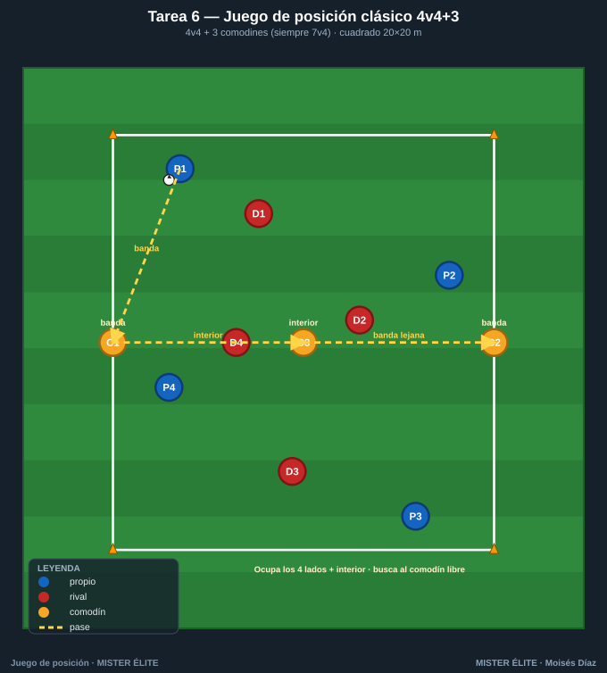
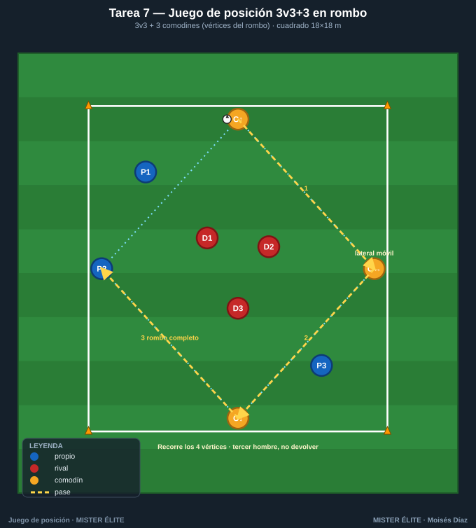
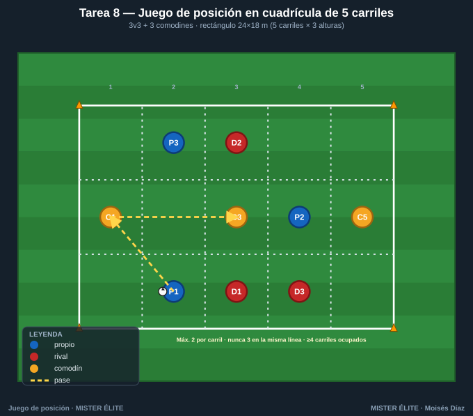
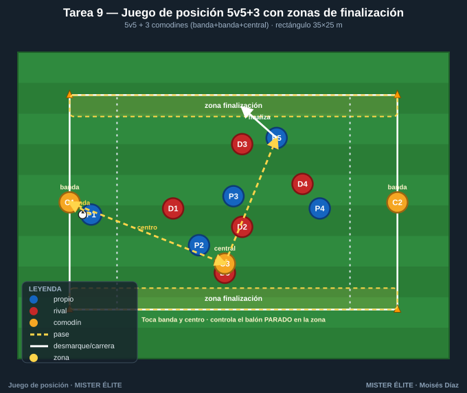
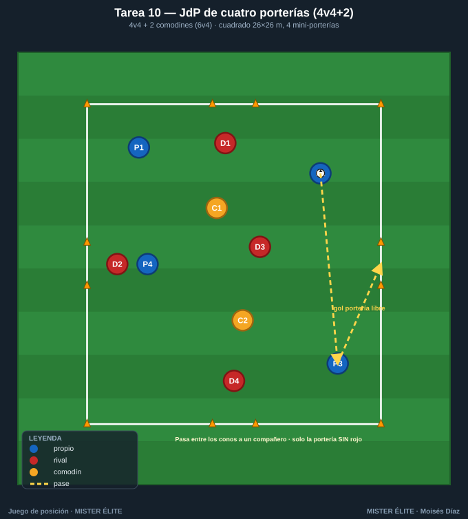

# Familia 2 · Juegos de posición clásicos (T6–10)

> Notación: poseedores **azules**, defensores **rojos**, comodines **ámbar**. El juego de posición añade al rondo **dirección, estructura y superioridad posicional**: porterías/zonas, carriles y líneas, comodines posicionados.

---

## Tarea 6 — Juego de posición clásico 4v4+3

**Objetivo.** El JdP de referencia: **superioridad por comodines (4+3 vs 4)** y ocupación racional. Conservar y orientar bajo presión real de equipo.

**Organización.**
- Relación: **4v4 + 3 comodines** (3 comodines ámbar con el poseedor → siempre 7v4).
- Medidas: cuadrado **20×20 m**.
- Material: 4 conos grandes esquina; conos de referencia para 3 comodines (2 en lados opuestos + 1 central). Petos 3 colores.

**Desarrollo.** Dos equipos de 4 dentro; 3 comodines neutrales juegan con quien posee. Conservar; al perder, los comodines apoyan al otro equipo. Los 2 comodines de banda dan amplitud, el central profundidad/interior.

**Provocaciones (medibles).**
- Comodines de banda a **2 toques**; comodín central a **1 toque**.
- **Punto cada 6 pases** consecutivos; **doble si tocan los 3 comodines** en la secuencia.
- Tras pérdida, **5 s de contrapresión** para recuperar antes de organizarse.

**Variantes (fácil → difícil).**
1. *Fácil*: campo 22×22, comodines libres de toques.
2. *Media*: reglas estándar.
3. *Difícil*: comodín central no puede devolver al que se la dio (tercer hombre) y campo 18×18.

**Coaching.**
- Ocupar los 4 lados + el interior: no amontonarse.
- Buscar al comodín libre (casi siempre el central o el de banda lejana).
- Cuerpo orientado a la portería virtual (al espacio libre).

**Duración.** 4 series de 4 min, 2 min descanso. Rotar comodines a mitad.

---

## Tarea 7 — Juego de posición 3v3+3 en rombo (dos pivotes)

**Objetivo.** **Superioridad central** con estructura de rombo. Conexión pivote-interiores en espacio reducido.

**Organización.**
- Relación: **3v3 + 3 comodines** (3 comodines ámbar formando eje: 1 arriba, 1 abajo, 1 lateral móvil).
- Medidas: cuadrado **18×18 m**.
- Material: conos esquina + 3 conos de posición de comodines. Petos.

**Desarrollo.** 3 azules + 3 comodines (=6) contra 3 rojos. Mantener la estructura de rombo (siempre alguien arriba, abajo y a los lados) para circular por el comodín libre. Al perder, los comodines cambian de bando.

**Provocaciones (medibles).**
- **Prohibido tres pases seguidos entre los mismos 2 jugadores** (rompe el ping-pong).
- **Punto cada vez que el balón recorre el rombo completo** (4 vértices distintos) sin pérdida.
- Comodines a 2 toques.

**Variantes (fácil → difícil).**
1. *Fácil*: 3v2+3, campo 20×20.
2. *Media*: 3v3+3.
3. *Difícil*: rombo a 1 toque en los comodines; un rojo puede saltar al vértice del balón.

**Coaching.**
- Mantener el rombo: si un compañero ocupa tu altura, ajusta tú.
- Tercer hombre: el comodín de un vértice juega al del siguiente, no devuelve.
- Velocidad de circulación = ventaja; el balón corre más que el defensor.

**Duración.** 5 series de 3 min, 90 s descanso.

---

## Tarea 8 — Juego de posición en cuadrícula de 5 carriles (3v3+3)

**Objetivo.** **Ocupación racional del espacio**: regla "no más de 2 por carril, no 3 en la misma línea". Escalonamiento posicional.

**Organización.**
- Relación: **3v3 + 3 comodines** (reparten amplitud y profundidad).
- Medidas: rectángulo **24×18 m** dividido en **5 carriles verticales** (4,8 m c/u) y **3 líneas horizontales** → cuadrícula 5×3.
- Material: conos de carril (colores alternos para ver los 5 carriles). Petos.

**Desarrollo.** Posesión 3v3+3 con condición POSICIONAL: el poseedor debe cumplir las reglas de ocupación mientras circula. Un supervisor (o el entrenador) vigila infracciones.

**Provocaciones (medibles).**
- **Infracción si 3+ azules en el mismo carril o 3 en la misma línea** → pérdida de posesión.
- **Punto cada 8 pases** manteniendo ocupados **≥4 carriles distintos**.
- Comodines ocupan carriles exteriores (1 y 5) o central (3) según falte amplitud o interior.

**Variantes (fácil → difícil).**
1. *Fácil*: solo regla de carriles, 4 carriles.
2. *Media*: 5 carriles + ambas reglas.
3. *Difícil*: añadir **dirección** (puntúa más progresar de línea 1 a 3 ocupando bien).

**Coaching.**
- "Si un compañero entra en tu carril, sal tú": ajuste permanente.
- Escalonar alturas para crear líneas de pase diagonales.
- Amplitud y profundidad máximas para estirar al rival.

**Duración.** 4 series de 4 min, 2 min descanso.

---

## Tarea 9 — Juego de posición 5v5+3 con direccionalidad a zonas de finalización

**Objetivo.** **JdP con finalidad**: superioridad 8v5 con dirección. Progresar de banda a banda y "finalizar" estabilizando el balón en una zona objetivo.

**Organización.**
- Relación: **5v5 + 3 comodines** (1 por banda + 1 central; siempre 8v5).
- Medidas: rectángulo **35×25 m**.
- Material: conos para 2 **zonas de finalización** (franjas de 3 m en cada extremo corto) + carriles de banda. Petos.

**Desarrollo.** Posesión con dirección: llevar el balón y **controlarlo dentro de la zona objetivo** del extremo que se ataca (un jugador recibe y para el balón en la franja). El otro equipo, al recuperar, ataca la zona contraria.

**Provocaciones (medibles).**
- **Gol = controlar el balón parado dentro de la zona** tras pase (no conducido a dentro).
- **El balón debe haber tocado banda y centro** (un comodín de banda + el central) antes de finalizar.
- Comodines de banda 2 toques, central 1 toque.

**Variantes (fácil → difícil).**
1. *Fácil*: zonas de 4 m, finalización conducida válida.
2. *Media*: reglas estándar.
3. *Difícil*: el último pase debe venir del comodín de la banda contraria a donde empezó la jugada.

**Coaching.**
- Atraer la presión a una banda y cambiar a la libre para finalizar.
- El central conecta las dos bandas (jugar por dentro para cambiar).
- Ritmo: pausa para fijar, aceleración para la finalización.

**Duración.** 4 series de 5 min, 2 min descanso.

---

## Tarea 10 — Juego de posición de cuatro porterías (4v4+2) con cambio de zona

**Objetivo.** Decisión de **a qué espacio progresar** entre varias opciones. Cuatro porterías obligan a leer la menos defendida = hombre libre del espacio.

**Organización.**
- Relación: **4v4 + 2 comodines** (2 comodines ámbar con el poseedor → 6v4).
- Medidas: cuadrado **26×26 m** con **4 mini-porterías de conos** (una al centro de cada lado).
- Material: 8 conos (4 porterías) + esquinas + petos.

**Desarrollo.** Cada equipo ataca las porterías disponibles. Se marca pasando el balón raso entre los conos de una portería válida a un compañero al otro lado. Los comodines mantienen la superioridad.

**Provocaciones (medibles).**
- **Gol solo si la portería se cruza con un pase a un compañero** (no conduciendo) y solo en la **menos defendida** (si hay un rojo delante, no cuenta).
- **No repetir la misma portería dos goles seguidos.**
- Tras gol, sigue el juego: contraataque inmediato.

**Variantes (fácil → difícil).**
1. *Fácil*: cada equipo defiende 2 fijas, comodines libres.
2. *Media*: 4 porterías abiertas, reglas estándar.
3. *Difícil*: 1 solo comodín (5v4) y obligación de tocar al comodín antes de cada gol.

**Coaching.**
- Mirar las 4 porterías = mirar todos los espacios; ir donde no está el rival.
- Fijar a un lado para liberar la portería opuesta.
- Cabeza arriba constante: la mejor portería cambia cada 2-3 segundos.

**Duración.** 4 series de 4 min, 2 min descanso.

---

*MISTER ÉLITE — Moisés Díaz · Familia 2 · Juegos de posición clásicos.*
