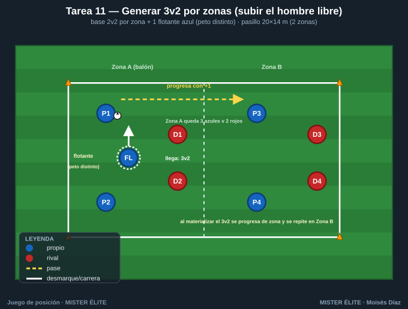
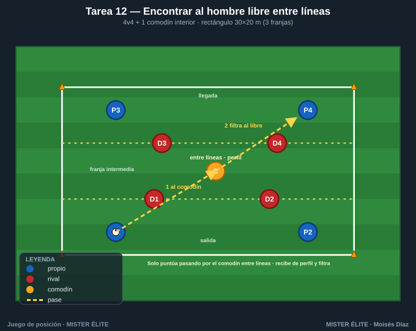
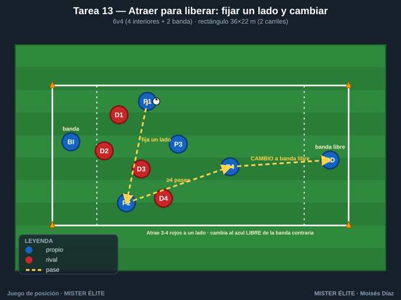
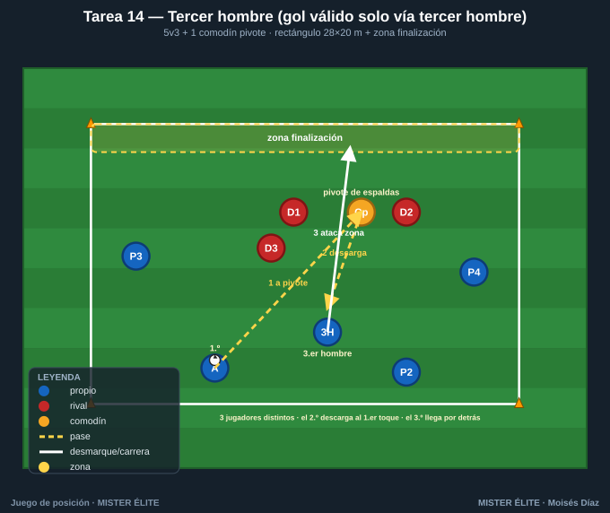
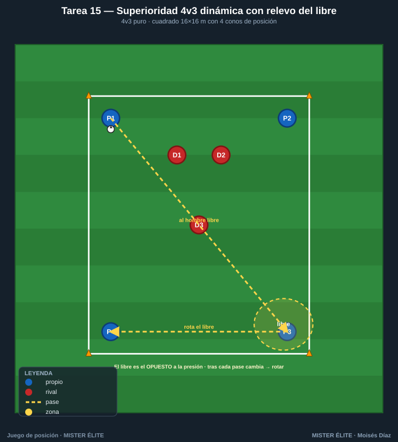

# Familia 3 · Crear y usar superioridades / hombre libre (T11–15)

> Notación: poseedores **azules**, defensores **rojos**, comodines **ámbar**. El objetivo de toda la familia: **crear** una superioridad (numérica, posicional o cualitativa), **reconocer al hombre libre** que produce y **usarlo** antes de que el rival ajuste.

---

## Tarea 11 — Generar 3v2 por zonas (subir el hombre libre)

**Objetivo.** **Crear superioridad numérica 3v2** en la zona del balón: un jugador "llega" para fabricar el +1 que decide.

**Organización.**
- Relación: **base 2v2 + 1 flotante** por zona (el flotante crea el 3v2 al sumarse).
- Medidas: pasillo **20×14 m** dividido en **2 zonas de 10×14 m**.
- Material: conos de la línea divisoria + esquinas. Peto distinto para el flotante azul. Petos.

**Desarrollo.** Hay 2v2 en cada zona. Un azul flotante decide a qué zona sumarse para crear un **3v2** en la zona del balón. Conservar y, con la superioridad, progresar a la otra zona, donde se repite.

**Provocaciones (medibles).**
- **El balón solo pasa de zona cuando se ha materializado un 3v2** y se progresa con pase.
- Los rojos NO cambian de zona (2 fijo) → el flotante siempre puede generar el +1.
- **Punto cada vez que se crea el 3v2 y se progresa de zona** sin pérdida.

**Variantes (fácil → difícil).**
1. *Fácil*: flotante libre, 3 toques.
2. *Media*: flotante a 2 toques, debe entrar DESPUÉS del primer pase (timing).
3. *Difícil*: 2 flotantes pero solo 1 en la zona del balón (decide quién sube).

**Coaching.**
- El flotante llega tarde y por sorpresa (timing > velocidad).
- Crear el 3v2 = un libre garantizado: hay que encontrarlo y usarlo, no solo crearlo.
- Tras progresar, reorganizar rápido el siguiente 3v2.

**Duración.** 5 series de 3 min; cambiar el flotante cada serie.

---

## Tarea 12 — Encontrar al hombre libre entre líneas (4v4+1 con dos líneas de presión)

**Objetivo.** **Pase entre líneas al hombre libre** posicional. Reconocer y conectar al jugador situado entre las dos líneas rojas.

**Organización.**
- Relación: **4v4 + 1 comodín interior** (el comodín ámbar vive entre líneas).
- Medidas: rectángulo **30×20 m** con **3 franjas horizontales**: salida – franja intermedia (comodín + presión) – llegada.
- Material: conos para 2 líneas horizontales. Petos.

**Desarrollo.** Los azules de salida hacen llegar el balón a los de llegada, pero la única vía "limpia" es **conectar primero con el comodín entre líneas**, que orienta y filtra hacia delante (pase entre líneas / tercer hombre). Los rojos defienden las dos líneas.

**Provocaciones (medibles).**
- **Punto SOLO si el balón pasa por el comodín entre líneas** antes de la zona de llegada. Pase largo directo = no puntúa.
- Comodín entre líneas a **2 toques** (control orientado + filtrado).
- El comodín debe recibir **de perfil** (si recibe de frente y parado, no cuenta como "entre líneas").

**Variantes (fácil → difícil).**
1. *Fácil*: franja intermedia ancha (8 m), 1 rojo en ella.
2. *Media*: franja 5 m, 2 rojos.
3. *Difícil*: 2 comodines entre líneas; el balón pasa por uno y sale al otro (tercer hombre entre líneas).

**Coaching.**
- Reconocer la ventana entre líneas: pase con ritmo, al pie de perfil abierto.
- El hombre libre se ofrece en el momento justo (no antes).
- Tras recibir entre líneas: cara al frente y filtrar rápido.

**Duración.** 5 series de 3 min, 90 s descanso.

---

## Tarea 13 — Atraer para liberar: fijar un lado y cambiar (6v4 con dos bandas)

**Objetivo.** **Atraer para liberar.** Fijar la presión en una banda con pases cortos y cambiar al hombre libre de la banda opuesta.

**Organización.**
- Relación: **6v4** (4 azules interiores + 2 azules de banda fijos; 4 rojos). Superioridad por estructura.
- Medidas: rectángulo **36×22 m** con **2 carriles de banda de 4 m**.
- Material: conos de los 2 carriles + esquinas. Petos.

**Desarrollo.** Los azules atraen a los 4 rojos hacia una banda con pases cortos. Cuando 3+ rojos están en ese lado, ejecutan un **cambio de orientación** al azul de la banda contraria, que recibe **libre** y progresa.

**Provocaciones (medibles).**
- **Punto SOLO con cambio a banda libre** habiendo antes ≥4 pases en la banda fijada (se debe "ver" la atracción).
- El cambio debe ser **máx. 2 pases** (directo o con un apoyo interior).
- Si cambian sin haber fijado (rivales repartidos), no puntúa.

**Variantes (fácil → difícil).**
1. *Fácil*: banda contraria siempre con su jugador libre; 6v3.
2. *Media*: 6v4, reglas estándar.
3. *Difícil*: un rojo "lee" y puede anticipar el cambio → obliga a cambiar con disfraz (mirar a un lado, jugar al otro).

**Coaching.**
- Fijar = pases reales que obligan al rival a desplazarse, no amagos.
- El cambio se prepara con el último apoyo interior orientado al lado libre.
- Banda libre: prepararse a recibir de cara y atacar el espacio.

**Duración.** 4 series de 4 min, 2 min descanso.

---

## Tarea 14 — Tercer hombre (gol válido solo vía tercer hombre)

**Objetivo.** **Tercer hombre**: A juega a B (que fija), B descarga y un TERCER jugador aparece para recibir en el espacio que B liberó. La provocación lo hace obligatorio.

**Organización.**
- Relación: **5v3 + 1 comodín** (apoyo de espaldas / pivote).
- Medidas: rectángulo **28×20 m** con **zona de finalización** (franja de 4 m) en un extremo.
- Material: conos de la zona de finalización + esquinas. Peto distinto al comodín pivote. Petos.

**Desarrollo.** Mecánica de tercer hombre: un azul juega al pivote de espaldas (1.º→2.º), este descarga, y un **tercer jugador** que llega desde atrás recibe de cara y ataca la zona de finalización. El gol exige completar la cadena de tres.

**Provocaciones (medibles).**
- **Gol válido SOLO si la jugada pasa por 3 jugadores distintos en secuencia** con el 2.º jugando de cara a su propia portería (pivote).
- El **2.º hombre a 1 toque** (descarga directa, no se gira).
- El **3.er hombre debe llegar en movimiento** desde detrás de la línea del 2.º.

**Variantes (fácil → difícil).**
1. *Fácil*: 5v2+1, 2 toques para el pivote.
2. *Media*: 5v3+1, pivote 1 toque.
3. *Difícil*: sin comodín (el pivote es un azul de campo) y cadena en menos de 4 s.

**Coaching.**
- El tercer hombre ve la jugada completa: temporiza su llegada.
- 2.º hombre: descarga al primer toque hacia el espacio del tercero.
- Romper la marca por detrás del defensor que sigue el balón.

**Duración.** 5 series de 3,5 min, 90 s descanso.

---

## Tarea 15 — Superioridad 4v3 dinámica con relevo del libre (rotaciones)

**Objetivo.** **Usar el 4v3 de forma sostenida**: el hombre libre cambia tras cada pase; reconocer al nuevo libre y mantener la ventaja con rotaciones.

**Organización.**
- Relación: **4v3** puro (la superioridad es del juego de los 4).
- Medidas: cuadrado **16×16 m** con **4 conos de referencia** (4 posiciones base, un azul por esquina aprox.).
- Material: 4 conos posición + esquinas + petos.

**Desarrollo.** 4 azules contra 3 rojos: **siempre hay 1 azul libre**. Identificar al libre, jugarle, y como los rojos se ajustan, el libre cambia → rotar para mantenerlo. Cada pérdida, entra un rojo de refresco para presión alta.

**Provocaciones (medibles).**
- **Obligatorio jugar al hombre libre**: si hay un compañero claramente libre y se juega a otro presionado, pérdida.
- **Punto cada 6 pases consecutivos al libre.**
- **No más de 2 toques** (la ventaja se mantiene con velocidad, no con conducción).

**Variantes (fácil → difícil).**
1. *Fácil*: 4v2, 3 toques.
2. *Media*: 4v3, 2 toques.
3. *Difícil*: 4v3 en 14×14 y los rojos hacen presión orientada para cerrar al libre evidente → crear al libre con un pase previo (atraer-liberar dentro del 4v3).

**Coaching.**
- El libre casi nunca es el más cercano: suele ser el opuesto a la presión.
- Reconocer al libre ANTES de recibir (escaneo) para jugarlo a 1-2 toques.
- Rotar para que siempre exista una línea de pase al libre.

**Duración.** 5 series de 3 min, 90 s descanso; rotar el trío de rojos cada serie.

---

*MISTER ÉLITE — Moisés Díaz · Familia 3 · Crear y usar superioridades / hombre libre.*
