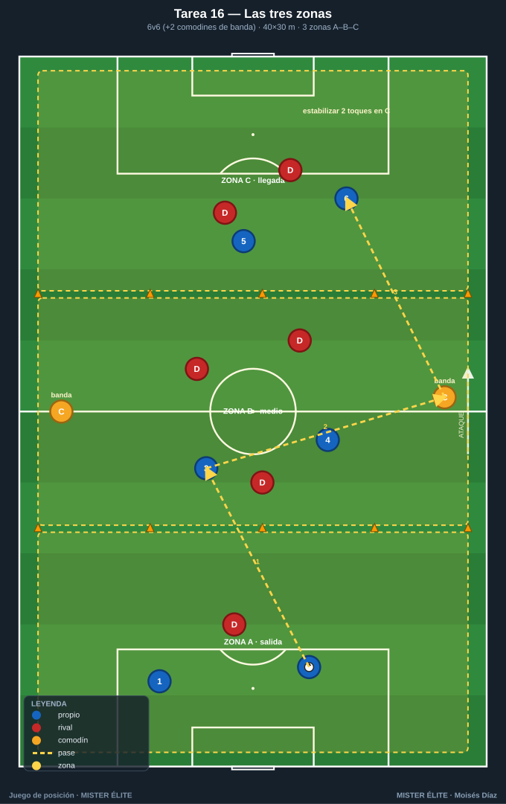
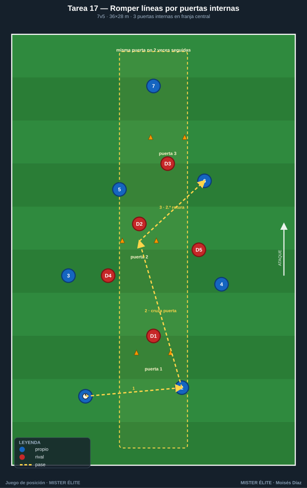
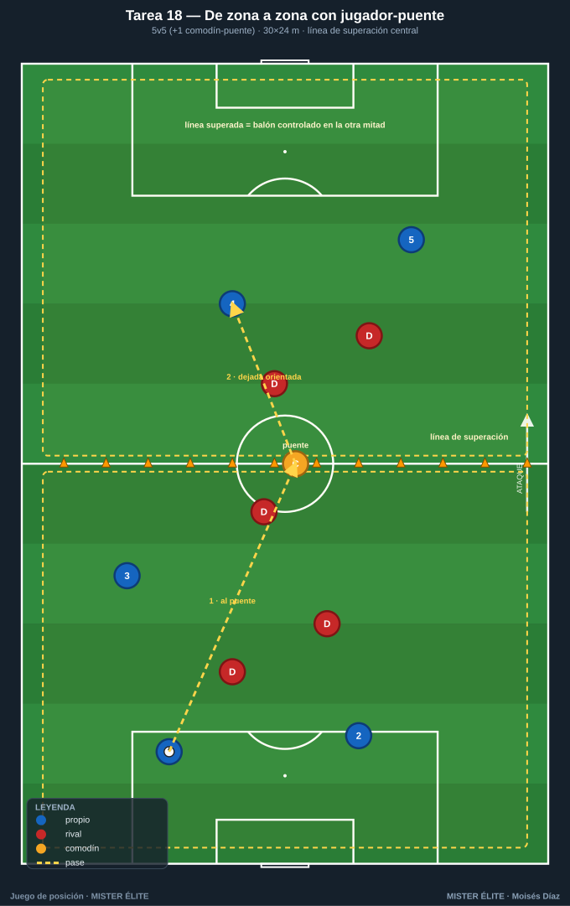
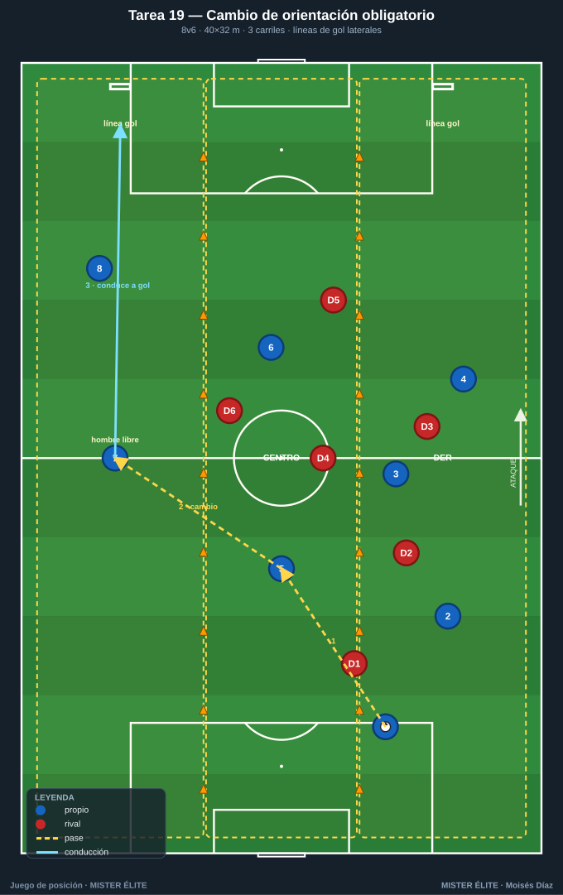
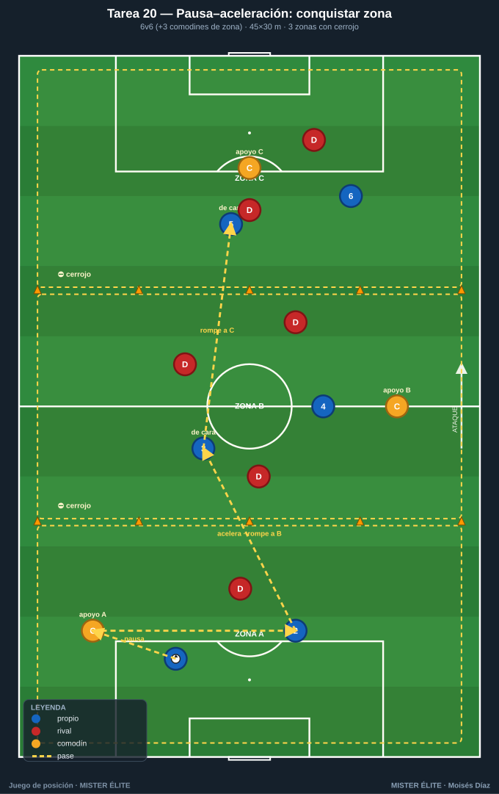

# Familia 4 · Posesión con progresión y dirección (T16–20)

> Notación: poseedores **azules**, defensores **rojos**, comodines **ámbar**, 2.º equipo poseedor **azul-cian**. Progresar = avanzar el balón **rompiendo líneas** en condiciones de seguir jugando, no "tirarlo hacia delante".

---

## Tarea 16 — Las tres zonas (posesión orientada salida–medio–llegada)

**Objetivo.** Progresar con sentido de juego: dominar el balón sin perder la dirección de ataque; **atraer en una zona para progresar a la siguiente**.

**Organización.**
- Relación: **6v6 + 2 comodines** (ámbar móviles, uno por banda).
- Medidas: rectángulo **40×30 m** en **3 zonas iguales** (≈13,3 m): A (salida) – B (medio) – C (llegada).
- Material: petos, 2 ámbar, conos de líneas, balones en cada zona. Sin porterías.

**Desarrollo.** Posesión libre de A hacia C. Punto = **conducir o recibir controlado un balón en la Zona C** tras haber pasado por las tres zonas. Si los rojos roban, atacan de C hacia A. Los comodines juegan siempre con el poseedor y solo por las bandas (amplitud + pase de progresión).

**Provocaciones (medibles).**
- Punto = balón **estabilizado** (2 toques) en Zona C habiendo tocado en A o B antes (no vale largo directo A→C).
- Mínimo **5 pases** antes de entrar a Zona C.
- Progresar A→B→C en **menos de 12 s** = punto doble.

**Variantes (fácil → difícil).**
1. *Fácil*: comodines también dentro del campo (4 apoyos).
2. *Media*: límite de 2 toques para los azules.
3. *Difícil*: prohibido que más de 1 jugador retroceda de zona con el balón.

**Coaching.**
- Atraer para liberar: fijar rojos en A para encontrar al libre en B.
- Orientación del receptor en B mirando a C antes de recibir.
- Tempo: pausa en A, aceleración en el pase que rompe a B/C.

**Duración.** 4 series de 4 min, 90 s descanso. ≈ 22 min.

---

## Tarea 17 — Romper líneas por puertas internas

**Objetivo.** Premiar el **pase que rompe línea** (vertical entre defensores) frente al pase de seguridad; identificar y usar el pasillo interior.

**Organización.**
- Relación: **7v5** (azules en superioridad para favorecer la circulación que crea ventanas).
- Medidas: **36×28 m**.
- Material: **3 "puertas"** de 2 m de ancho con conos, repartidas en la franja central a distintas alturas (ventanas entre líneas). Petos, balones. Sin portería.

**Desarrollo.** Posesión de los azules. Punto cada vez que completan un **pase que atraviesa una puerta y es recibido y controlado** al otro lado. La misma puerta no se usa dos veces seguidas. Los rojos tapan puertas con su cuerpo; si roban, conservan 6 s para 1 punto de transición.

**Provocaciones (medibles).**
- Pase a través de puerta + control = **1 punto**.
- Si el receptor da un toque y **filtra otro pase a puerta** (dos roturas encadenadas) = **3 puntos** (tercer hombre).
- Objetivo: **8 roturas** por serie como equipo.

**Variantes (fácil → difícil).**
1. *Fácil*: puertas de 3 m, 4 puertas.
2. *Media*: puertas de 1,5 m, 3 puertas, 6v5.
3. *Difícil*: 6v6, las puertas se desplazan (el coach las mueve cada 60 s).

**Coaching.**
- Ver la ventana antes de recibir; convocar el pase con el cuerpo abierto.
- Romper línea con el pie adecuado, al pie de progresión del receptor.
- Tras la rotura, fijar y buscar la siguiente puerta sin retroceder.

**Duración.** 3 series de 5 min, 2 min descanso. ≈ 21 min.

---

## Tarea 18 — De zona a zona con jugador-puente (líneas de superación)

**Objetivo.** Progresar superando líneas mediante **apoyo–dejada–tercer hombre**; usar el jugador-puente para saltar líneas.

**Organización.**
- Relación: **5v5 + 1 comodín central** (ámbar) que vive en la **línea media**.
- Medidas: **30×24 m**, dividido por una **línea de superación** central; el comodín es el único que se mueve libre entre mitades.
- Material: petos, conos de línea media, balones. Sin portería.

**Desarrollo.** El poseedor arranca en su mitad. Punto = **pasar el balón a la otra mitad y que sea controlado** por un compañero (línea superada). El comodín central actúa de pivote: recibe de espaldas, descarga o gira. Tras superar, encadenar y volver a superar en sentido inverso (combo).

**Provocaciones (medibles).**
- Línea superada por **pase directo** = 1 punto.
- Línea superada usando al **comodín-puente con dejada de primer toque** (pared) = 2 puntos.
- 3 superaciones consecutivas sin pérdida = punto bonus.

**Variantes (fácil → difícil).**
1. *Fácil*: 2 comodines-puente.
2. *Media*: el comodín solo da 1 toque.
3. *Difícil*: añadir **2.º equipo poseedor** (azul-cian): 3 equipos de 4, el que pierde sale; superar línea da derecho a seguir.

**Coaching.**
- Calidad del apoyo: aparecer cuando el poseedor levanta la cabeza, no antes.
- Dejada **orientada** hacia el espacio de progresión, no neutra.
- Tercer hombre: el que recibe la dejada ya debe tener decidida la siguiente.

**Duración.** 4 series de 3,5 min. ≈ 18 min.

---

## Tarea 19 — Posesión con cambio de orientación obligatorio (atraer y progresar al lado débil)

**Objetivo.** Progresar **atrayendo a un carril para liberar el opuesto**; ejecutar el cambio de orientación como herramienta de progresión.

**Organización.**
- Relación: **8v6** (sin comodines).
- Medidas: **40×32 m** en **3 carriles verticales** (izq–centro–der, ≈10,7 m c/u).
- Material: petos, conos de carril, balones, **2 mini-líneas de gol** (líneas de 6 m al fondo de cada carril lateral).

**Desarrollo.** Azules progresan para conducir el balón sobre **cualquiera de las 2 líneas de fondo laterales**. Para validar deben haber **circulado de un carril lateral al otro** (cambio de orientación) al menos una vez. Regla de ocupación viva: **máx. 2 azules por carril**.

**Provocaciones (medibles).**
- Gol válido solo si el balón **cruzó del carril izq al der (o viceversa) en ≤4 pases** antes de finalizar.
- Cambio con **un solo pase largo de un lateral a otro** controlado = punto extra.
- Si tardan **más de 20 s** sin cambiar de carril, balón al rival.

**Variantes (fácil → difícil).**
1. *Fácil*: cambio permitido en cualquier nº de pases.
2. *Media*: el cambio debe iniciarlo un jugador de **carril central** (tercer hombre).
3. *Difícil*: 8v7 y los rojos pueden saltar a presionar el cambio.

**Coaching.**
- Sobrecargar un lado para abrir el contrario; ver al hombre libre lejos.
- El cambio llega al pie que orienta hacia delante.
- Cambiar cuando la presión bascula, no antes.

**Duración.** 3 series de 5 min, 2 min descanso. ≈ 21 min.

---

## Tarea 20 — Pausa–aceleración: conquistar zona y romper a la siguiente (ritmo)

**Objetivo.** Gestionar el **ritmo (pausa–aceleración)** como herramienta de progresión: **pausar** para fijar y consolidar la zona conquistada y **acelerar** en el pase que rompe a la siguiente. Conservar el terreno ganado sin caer en posesión estéril.

**Organización.**
- Relación: **6v6 + 3 comodines de zona** (ámbar): uno fijo en cada zona, solo apoya, no roba.
- Medidas: **45×30 m**, 3 zonas de 15 m (A–B–C).
- Material: petos (2 colores + 3 ámbar), conos, balones, **cronómetro del coach**. Sin portería.

**Desarrollo.** Progresar A→B→C. **Cerrojo de zona:** una vez el balón llega controlado a B, NO puede volver a A; igual de B a C. En cada zona el equipo **pausa** (asegura con los apoyos y obliga a bascular a los rojos) y solo cuando un compañero se ofrece de cara en la zona siguiente, **acelera** el pase que rompe. Punto = 3 pases consecutivos en Zona C tras conquistar A→B→C en orden.

**Provocaciones (medibles).**
- **Pausa obligada:** mínimo **3 pases dentro de cada zona** (A y B) antes de romper. Romper sin esos 3 pases no consolida (se repite la zona).
- **Aceleración premiada:** si el pase que rompe llega a un compañero de cara que progresa al primer toque, esa rotura **vale doble**.
- Si el balón **vuelve a una zona ya conquistada**, posesión al rival.
- Comodín de zona máximo 2 toques.

**Variantes (fácil → difícil).**
1. *Fácil*: solo el cerrojo de zona (sin mínimo de pausa ni reloj).
2. *Media*: pausa de 3 pases + aceleración al primer toque.
3. *Difícil*: ventana de aceleración con **tope de 3 s** desde que aparece el hombre libre de la zona siguiente.

**Coaching.**
- **Pausa = fijar**, no dormirse: circular para atraer y abrir la ventana.
- **Acelerar cuando el rival bascula**: la señal es el hombre libre de cara en la zona siguiente.
- Cambiar de marcha con el cuerpo ya orientado; primer toque que rompe, no que para.

**Duración.** 4 series de 4 min, 90 s descanso. ≈ 22 min.

---

*MISTER ÉLITE — Moisés Díaz · Familia 4 · Posesión con progresión y dirección.*
