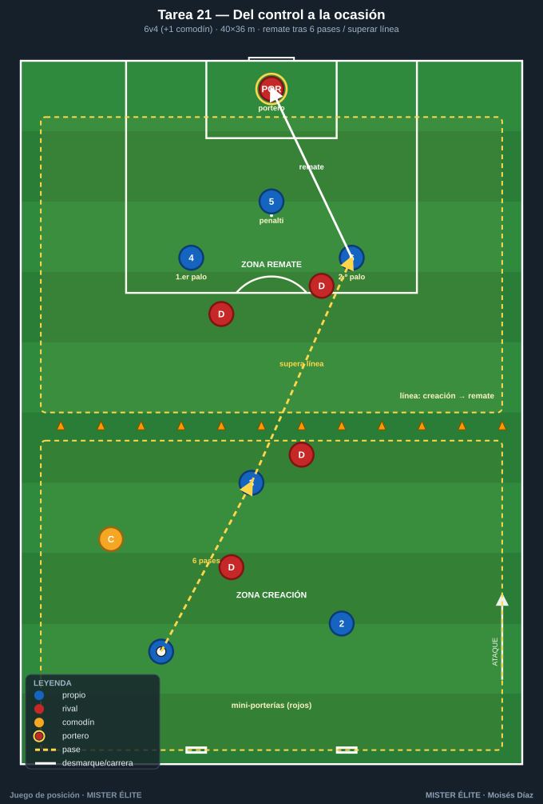
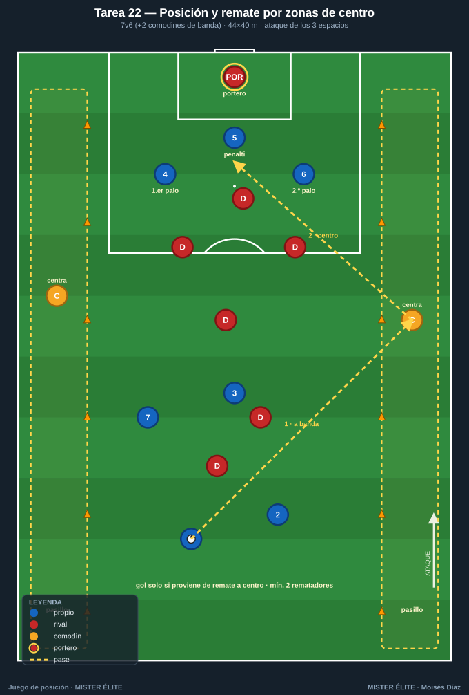
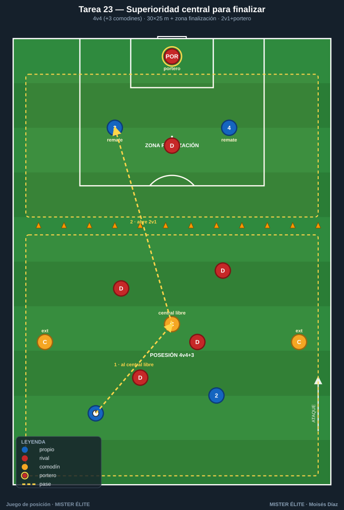
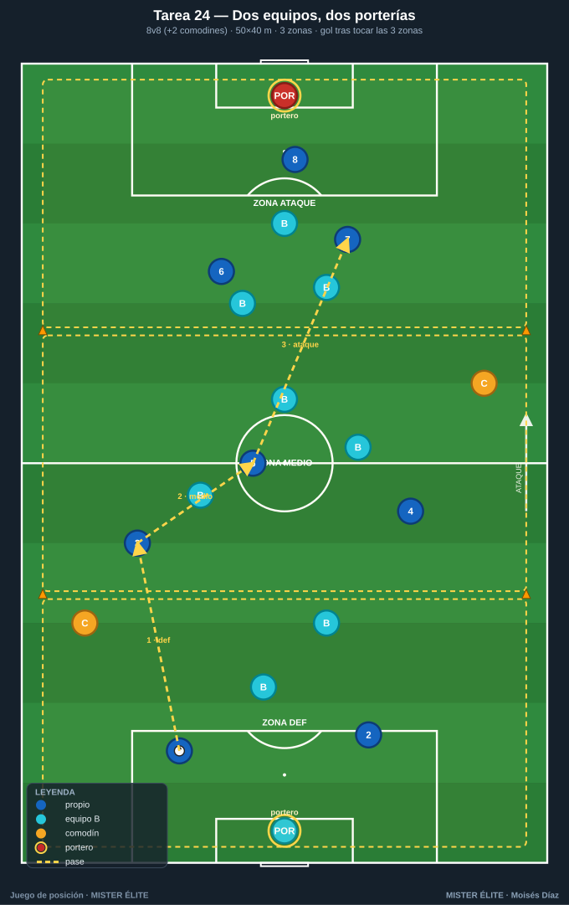
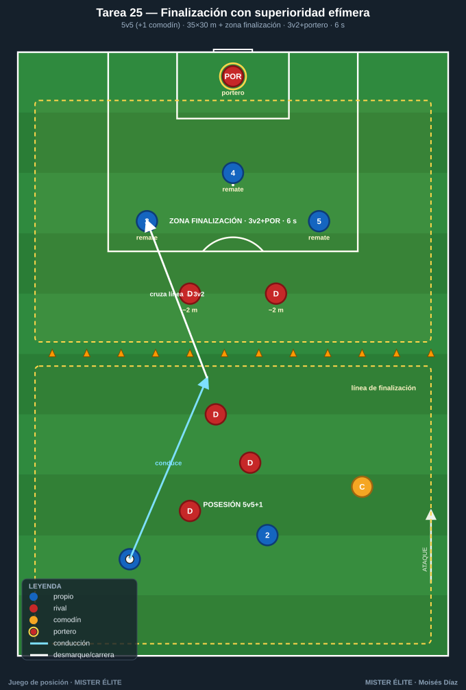

# Familia 5 · Posesión para finalizar (T21–25)

> Notación: poseedores **azules**, defensores **rojos**, comodines **ámbar**. La posesión es el medio, el **remate** es el fin. Estas tareas exigen **posición + remate**: el gol vale si se ha construido (romper línea, ocupar el área), no "de churro".

---

## Tarea 21 — Del control a la ocasión (posesión + remate a portería real)

**Objetivo.** Convertir la superioridad en posesión en **finalización**; entender que la posesión es medio, el remate es fin.

**Organización.**
- Relación: **6v4 + 1 comodín** (ámbar, con el poseedor). **1 portero** en portería reglamentaria.
- Medidas: **40×36 m**. **Portería grande con portero** en un fondo; en el opuesto, **2 mini-porterías** (1 m, sin portero) para los rojos.
- Material: portería + portero, 2 mini-porterías, petos, balones junto a la portería grande para reposición.

**Desarrollo.** Los azules mantienen y progresan para **rematar a la portería grande con portero**. Condición para rematar: **mínimo 6 pases** o haber **superado una línea media** (zona de creación → zona de remate). Si los rojos roban, atacan a las 2 mini-porterías.

**Provocaciones (medibles).**
- Gol válido solo tras cumplir la condición (6 pases o superación de línea).
- Remate de **primera tras centro/pase de la última zona** = vale doble.
- Rematar en **≤8 s** desde que se supera la línea media = +1.

**Variantes (fácil → difícil).**
1. *Fácil*: 6v3 + comodín, condición de 4 pases.
2. *Media*: base (6v4+1).
3. *Difícil*: 5v5 sin comodín, condición de superar línea **y** tocar en banda antes de rematar.

**Coaching.**
- Diferenciar el ritmo de circulación (paciencia) del de finalización (explosión).
- El último pase: al pie de remate, con ventaja, no "de seguridad".
- Ocupar el área en 3 alturas (1.er palo, 2.º palo, punto de penalti).

**Duración.** 4 series de 4 min. ≈ 22 min con reposiciones.

---

## Tarea 22 — Posición y remate por zonas de centro (juego por bandas a finalizar)

**Objetivo.** Usar la amplitud para finalizar; **posesión interior → liberar banda → centro → remate**.

**Organización.**
- Relación: **7v6**, con **2 comodines de banda** (ámbar) fijos en pasillos exteriores. **1 portero**.
- Medidas: **44×40 m**. **1 portería con portero**; dos **pasillos de banda** de 5 m con conos donde solo entran los comodines y disponen de toque libre para centrar.
- Material: portería + portero, conos de pasillo, petos, balones.

**Desarrollo.** Azules circulan en zona interior. Para finalizar deben **dar el balón a un comodín de banda**, que **centra al área**. El gol solo cuenta si proviene de **remate a un centro** (no de jugada interior directa). El comodín no es presionado dentro de su pasillo (premia el timing del remate).

**Provocaciones (medibles).**
- Gol de cabeza o de primera tras centro = **2 puntos**; tras controlar el centro = 1 punto.
- Mínimo **2 rematadores** entran al área en el centro o el gol no vale.
- Dos goles seguidos por la misma banda: el segundo no puntúa (obliga a variar).

**Variantes (fácil → difícil).**
1. *Fácil*: 2 comodines por banda, centro sin oposición.
2. *Media*: base.
3. *Difícil*: añadir 1 defensor central rojo que puede entrar al pasillo a tapar el centro (7v7).

**Coaching.**
- Timing de la llegada al área: salir desde atrás hacia el balón.
- Tipos de centro según el rematador (raso al 1.er palo, tenso, atrás).
- Ataque de los 3 espacios del área coordinado.

**Duración.** 4 series de 4 min. ≈ 22 min.

---

## Tarea 23 — Superioridad central para finalizar (4v4+3 que termina en portero)

**Objetivo.** Llevar el clásico **4v4+3** hasta la portería: usar al hombre libre del centro para crear el último pase.

**Organización.**
- Relación: **4v4 + 3 comodines** (ámbar; 2 exteriores + 1 central).
- Medidas: **30×25 m** + **zona de finalización** de 8 m al fondo con **portería y portero**.
- Material: portería + portero, conos que separan posesión y finalización, petos, balones.

**Desarrollo.** En la zona de posesión se juega 4v4+3 buscando al hombre libre. Cuando los azules logran **un pase filtrado al comodín central** o **6 pases**, se **abre** la zona de finalización: 2 azules entran a rematar **2v1 + portero** (un rojo defiende). Tras el remate, vuelve a empezar la posesión.

**Provocaciones (medibles).**
- La finalización se "desbloquea" solo con la condición (pase al central libre o 6 pases).
- Finalizar en **≤6 s** desde que se abre la zona = vale doble.
- El defensor solo sale a por el balón cuando este cruza la línea (ventaja inicial al atacante).

**Variantes (fácil → difícil).**
1. *Fácil*: 2v0 + portero en finalización.
2. *Media*: 2v1 + portero (base).
3. *Difícil*: 3v2 + portero y condición de pase al central obligatoria.

**Coaching.**
- El hombre libre central como **gatillo** de la finalización.
- Transición posesión→ataque: el primer apoyo tras abrir la zona ya es de progresión.
- Definición: portería corta, primer toque orientado a portería.

**Duración.** 5 series de 3 min, rotando rematadores. ≈ 20 min.

---

## Tarea 24 — Dos equipos, dos porterías: posesión orientada a finalizar (juego direccional completo)

**Objetivo.** Integrar todo: posesión con dirección, progresión y finalización en **partido reducido con 2 porterías y porteros**.

**Organización.**
- Relación: **8v8 + 2 comodines** (ámbar) que juegan con quien ataca (uno por mitad).
- Medidas: **50×40 m**, **2 porterías con portero**.
- Material: 2 porterías + 2 porteros, petos (2 colores + 2 ámbar), conos para **3 zonas** (defensa–medio–ataque), balones en porterías.

**Desarrollo.** Partido direccional: cada equipo ataca su portería; los comodines dan superioridad permanente al poseedor. **Condición de finalización:** para que el gol valga, el equipo debe haber tenido el balón controlado en las **3 zonas** en la misma posesión (obliga a construir). Reposiciones siempre desde el portero (trabaja la salida).

**Provocaciones (medibles).**
- Gol estándar (3 zonas tocadas) = 1 punto.
- Gol tras **superar línea con pase entre líneas + finalización en ≤10 s** = 2 puntos.
- Cada equipo alterna el portero que inicia; los comodines no pueden estar en la misma mitad.

**Variantes (fácil → difícil).**
1. *Fácil*: sin condición de 3 zonas (libre) para calentar.
2. *Media*: condición de 3 zonas (base).
3. *Difícil*: 3 zonas + mínimo 1 cambio de orientación antes del gol.

**Coaching.**
- Construir desde el portero con paciencia, acelerar al superar líneas.
- Ocupar el campo para finalizar **sin** quedar expuestos a la transición rival.
- La cadena completa: salida limpia → progresión → finalización.

**Duración.** 3 bloques de 6 min, 2 min descanso. ≈ 24 min.

---

## Tarea 25 — Finalización con superioridad efímera (posesión que crea el 3v2 final)

**Objetivo.** Crear y **explotar inmediatamente** una superioridad de finalización antes de que el rival se reorganice; del control a la ocasión en pocos segundos.

**Organización.**
- Relación: **5v5 + 1 comodín** en zona de posesión; al finalizar se genera un **3v2 + portero**.
- Medidas: **35×30 m** de posesión + **zona de finalización** de 12 m con **portería y portero**.
- Material: portería + portero, conos de zona, petos, balones de reposición rápida.

**Desarrollo.** 5v5+comodín en la zona de posesión. Cuando un azul **conduce cruzando la línea de finalización**, se desbloquea el ataque: **3 atacantes vs 2 defensores + portero**, pero los defensores arrancan **2 m por detrás** (superioridad efímera real). El ataque tiene **6 s** para rematar desde que se cruza (cronómetro del coach).

**Provocaciones (medibles).**
- Reloj de **6 s** para finalizar el 3v2 (obliga a resolver rápido).
- Gol con **≤2 toques del rematador** = vale doble.
- Si los defensores recuperan antes del remate, contra a 2 mini-porterías en el otro fondo.

**Variantes (fácil → difícil).**
1. *Fácil*: 3v1 + portero, 8 s.
2. *Media*: 3v2 + portero, 6 s (base).
3. *Difícil*: 3v3 + portero, 5 s, con un defensor pudiendo salir antes.

**Coaching.**
- Atacar la superioridad **antes** de que llegue el repliegue: velocidad de decisión.
- Fijar a un defensor para liberar al tercero (2v1 dentro del 3v2).
- Primer toque siempre hacia portería.

**Duración.** 5 series de 3 min rotando, 60 s descanso. ≈ 20 min.

---

*MISTER ÉLITE — Moisés Díaz · Familia 5 · Posesión para finalizar.*
