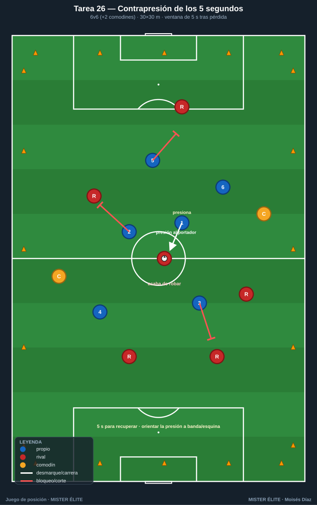
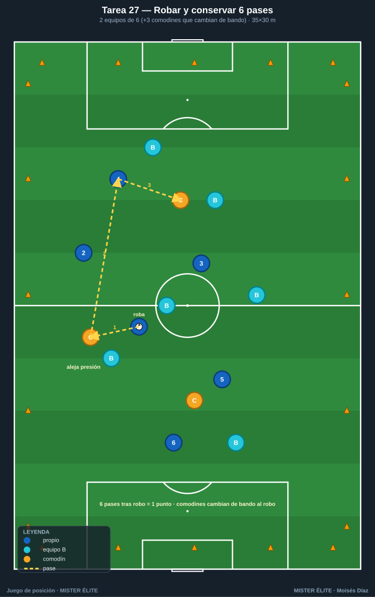
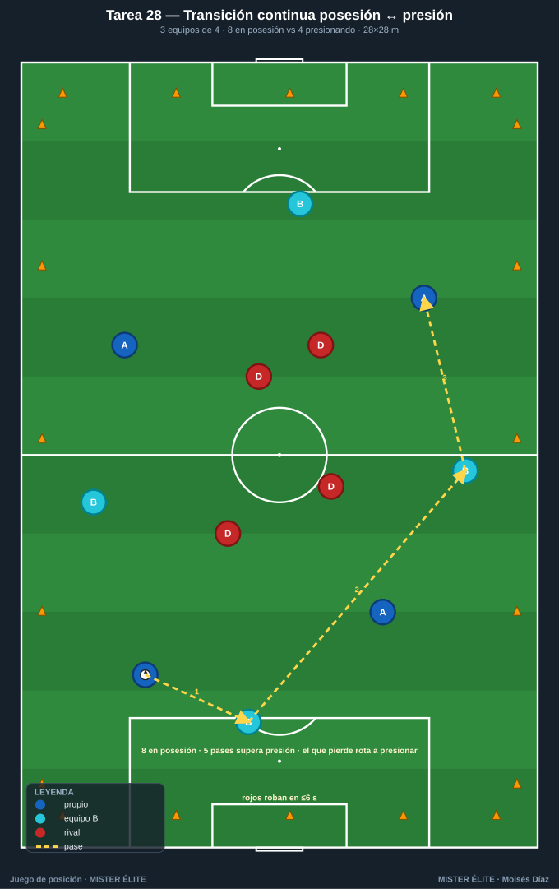
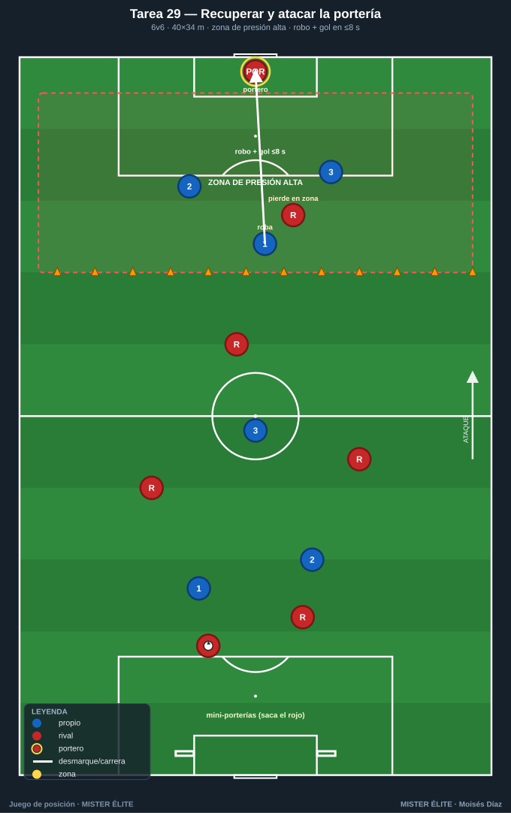
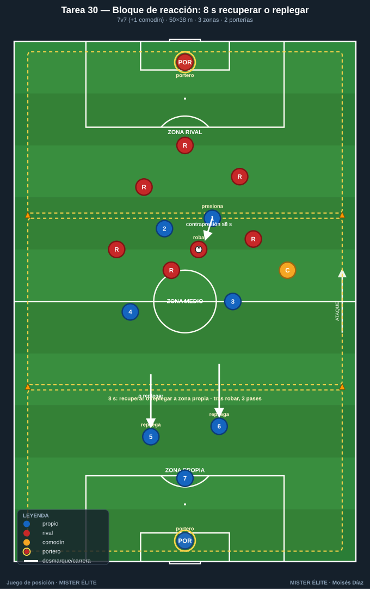

# Familia 6 · Posesión defensiva: recuperar y conservar (T26–30)

> Notación: poseedores **azules**, defensores/recuperadores **rojos**, comodines **ámbar**, 2.º equipo poseedor **azul-cian**. La posesión incluye **qué hacer al perderla**: contrapresión inmediata, conservar tras robar y decidir presionar o replegar. La misma estructura que ataca bien recupera rápido.

---

## Tarea 26 — Contrapresión de los 5 segundos (recuperar tras pérdida)

**Objetivo.** Reaccionar de inmediato tras perder; **recuperar el balón en ≤5 s** con presión coordinada al poseedor y a los apoyos.

**Organización.**
- Relación: **6v6 + 2 comodines** (ámbar, con el poseedor). Cuadrado.
- Medidas: **30×30 m**.
- Material: petos, conos de límite, **cronómetro visible / silbato del coach**, balones en los 4 lados. Sin portería.

**Desarrollo.** Posesión normal del equipo azul (con comodines) frente a los rojos. **En el instante de la pérdida**, el coach activa el cronómetro: el equipo que perdió tiene **5 s para recuperar** = punto de contrapresión. Si el equipo que robó **aguanta 5 s** (o saca por uno de los 4 lados con pase controlado), gana el punto de "supera la presión".

**Provocaciones (medibles).**
- Cronómetro explícito de **5 s** desde la pérdida (el coach cuenta en voz alta o silba).
- Recuperación en ≤5 s = 1 punto; recuperación con el balón **en la misma zona donde se perdió** = 2 puntos.
- "Superar la presión" (aguantar 5 s o sacarla limpia) = 1 punto para ellos.

**Variantes (fácil → difícil).**
1. *Fácil*: 7 s de ventana.
2. *Media*: 5 s (base).
3. *Difícil*: 4 s y campo más grande (35×35).

**Coaching.**
- Reacción **inmediata** del más cercano (presión al portador) + tapar líneas de los apoyos.
- "Pressing trap": orientar la presión hacia la banda/esquina.
- Si no se recupera en el tiempo, **replegar ordenado**.

**Duración.** 4 series de 4 min, 90 s descanso. ≈ 22 min.

---

## Tarea 27 — Robar y conservar 6 pases (transición a posesión)

**Objetivo.** Premiar la **conservación inmediata tras robar**: que el robo se convierta en posesión estable, no en pérdida apresurada.

**Organización.**
- Relación: **2 equipos de 6** + **3 comodines neutrales** (ámbar) que **siempre juegan con quien acaba de robar**.
- Medidas: **35×30 m**.
- Material: petos (2 colores + 3 ámbar), conos, balones de reposición. Sin portería.

**Desarrollo.** Posesión disputada. Cuando un equipo **roba**, los 3 comodines pasan a jugar con él (superioridad de conservación). Objetivo del que roba: **encadenar 6 pases** tras el robo para sumar punto. Si lo pierde antes, los comodines cambian de bando al instante.

**Provocaciones (medibles).**
- **6 pases** seguidos tras robo = 1 punto (el contador reinicia con cada pérdida).
- Si el **primer pase tras robar es progresivo y se mantiene** = punto extra (robar para atacar).
- Comodines máximo 2 toques.

**Variantes (fácil → difícil).**
1. *Fácil*: 8 pases pero 3 comodines fijos con un mismo equipo (más estable).
2. *Media*: base (comodines cambian con el robo).
3. *Difícil*: solo 2 comodines y objetivo de 8 pases.

**Coaching.**
- Primer movimiento tras robar: **alejar el balón de la presión** (apoyos rápidos alrededor del que roba).
- Decidir conservar vs atacar según la posición del rival al perder.
- Calma tras el robo: asegurar el primer pase antes de acelerar.

**Duración.** 4 series de 4 min. ≈ 22 min.

---

## Tarea 28 — Transición continua posesión ↔ presión (3 equipos rotativos)

**Objetivo.** Entrenar el cambio constante de rol **poseedor ↔ recuperador**; reaccionar tanto al perder (contrapresión) como al robar (conservar).

**Organización.**
- Relación: **3 equipos de 4** (azul, azul-cian, rojo). Dos equipos juntan posesión (8) contra **4 que presionan**.
- Medidas: **28×28 m**.
- Material: 3 juegos de petos diferenciados, conos, balones en lados. Sin portería.

**Desarrollo.** Los dos equipos en posesión (8) circulan ante el presionante (4). **El equipo que pierde el balón** baja a presionar; el que presionaba entra a posesión con el otro. Mientras presionan, **robar en ≤6 s**; mientras poseen, **superar la presión** con 5 pases.

**Provocaciones (medibles).**
- Equipo presionante: robo en **≤6 s** desde que entra = 1 punto (cronómetro por ciclo).
- Equipo en posesión: **5 pases** sin que el presionante toque = 1 punto.
- El equipo que provoca la pérdida **siempre rota a presionar** (regla clara y medible).

**Variantes (fácil → difícil).**
1. *Fácil*: media presión (rojos a trote) para asentar la mecánica.
2. *Media*: base.
3. *Difícil*: ventana de robo de 5 s y campo a 26×26.

**Coaching.**
- Reacción mental al cambio de rol: del que ataca al que presiona sin transición lenta.
- En presión: tapar primero el pase de progresión, luego al portador.
- En posesión: el equipo aliado ofrece apoyos para "no quedarse 4 solos".

**Duración.** 4 series de 4 min, 2 min descanso. ≈ 24 min.

---

## Tarea 29 — Recuperar y atacar la portería (contrapresión que termina en gol)

**Objetivo.** Vincular la **recuperación inmediata** con la finalización: robar arriba y atacar la portería antes de que el rival se ordene.

**Organización.**
- Relación: **6v6**, **1 portería con portero** en un fondo; en el opuesto, **2 mini-porterías** (sin portero).
- Medidas: **40×34 m** con una **zona de presión alta** de 15 m delante de la portería con portero.
- Material: portería + portero, 2 mini-porterías, conos de zona, petos, balones.

**Desarrollo.** El equipo rojo "saca" desde su fondo (mini-porterías) e intenta progresar; el azul presiona. Si los azules **roban dentro de la zona de presión alta**, disponen de **8 s para finalizar** en la portería con portero. Si roban fuera, primero meten el balón en la zona y luego finalizan (el reloj cuenta desde el robo en zona).

**Provocaciones (medibles).**
- Robo en zona alta + gol en **≤8 s** = 2 puntos (contrapresión productiva).
- Robo + gol fuera de tiempo o construido lento = 1 punto.
- Si el rojo **supera la zona de presión con el balón controlado**, suma 1 punto y ataca las mini-porterías (premia salir jugando bajo presión).

**Variantes (fácil → difícil).**
1. *Fácil*: zona de presión de 18 m, 10 s para finalizar.
2. *Media*: base (15 m, 8 s).
3. *Difícil*: zona de 12 m, 6 s, y un rojo más para salir (6v7 en defensa).

**Coaching.**
- Activar la presión sobre el **gatillo** (pase malo, control orientado hacia su portería).
- Tras el robo: balón directo a portería, no toque de más.
- Equilibrio: 1-2 jugadores cubren la transición rival a mini-porterías.

**Duración.** 5 series de 3,5 min, 90 s descanso. ≈ 24 min.

---

## Tarea 30 — Bloque de reacción: 8 segundos para recuperar o replegar (síntesis defensiva)

**Objetivo.** Tarea de cierre que integra la decisión completa tras pérdida: **recuperar en contrapresión o replegar ordenado**, según el cronómetro; conservar tras robar.

**Organización.**
- Relación: **7v7 + 1 comodín** (ámbar, con el poseedor) en formato direccional. **2 porterías con portero**.
- Medidas: **50×38 m** en **3 zonas** (propia, medio, rival).
- Material: 2 porterías + 2 porteros, conos de 3 zonas, petos + 1 ámbar, **cronómetro del coach**, balones.

**Desarrollo.** Partido direccional 7v7+comodín, foco en el momento de la pérdida:
- Al perder en **zona rival o media**, el equipo dispone de **8 s para recuperar (contrapresión)**; si lo logra, mantiene ataque y puede finalizar.
- Si **no recupera en 8 s**, debe **replegar a su propia zona** (todos cruzan a su mitad) antes de volver a robar; recuperar tras repliegue también puntúa, pero menos.

Tras cualquier robo, **3 pases obligatorios** antes de poder finalizar (asegurar la conservación post-robo).

**Provocaciones (medibles).**
- Cronómetro explícito de **8 s** tras pérdida en campo rival/medio.
- Recuperación por contrapresión (≤8 s) que termina en gol = **3 puntos**.
- Recuperación tras repliegue ordenado = 1 punto; gol normal = 1 punto.
- Robar y **no** dar los 3 pases de conservación antes de finalizar = gol anulado.

**Variantes (fácil → difícil).**
1. *Fácil*: 10 s de ventana y sin obligación de repliegue total.
2. *Media*: base (8 s, repliegue obligatorio).
3. *Difícil*: 6 s, repliegue obligatorio y **2 comodines** para el que defiende mejor la salida.

**Coaching.**
- Decisión presionar vs replegar en función de cobertura y distancia al balón.
- Coordinación de la contrapresión: portador + apoyos + líneas de pase.
- Tras robar, asegurar (3 pases) y luego buscar la finalización: equilibrio recuperar–conservar–atacar.

**Duración.** 3 bloques de 6 min, 2 min descanso. ≈ 24 min.

---

*MISTER ÉLITE — Moisés Díaz · Familia 6 · Posesión defensiva: recuperar y conservar.*
