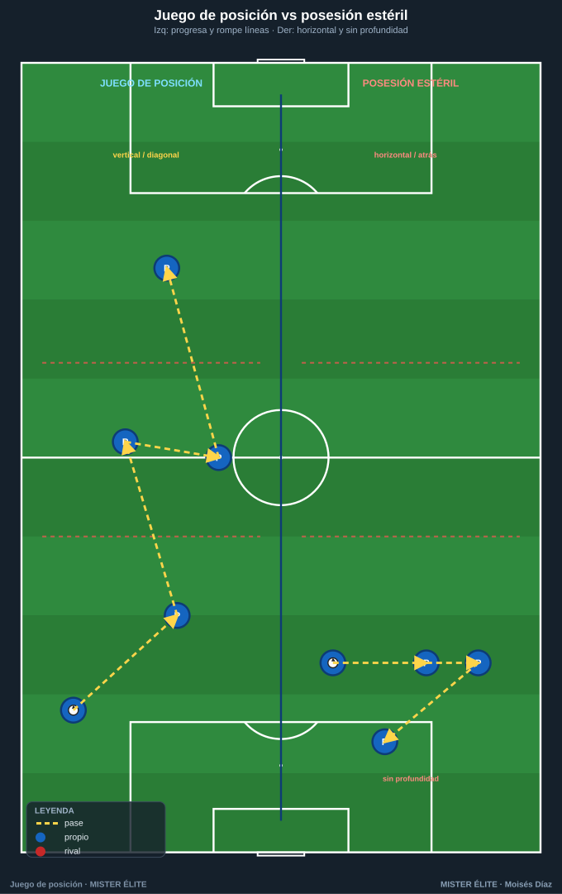
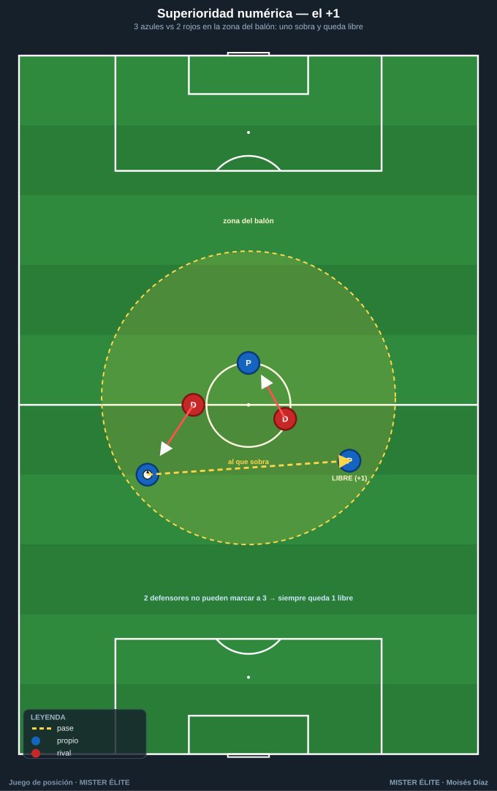
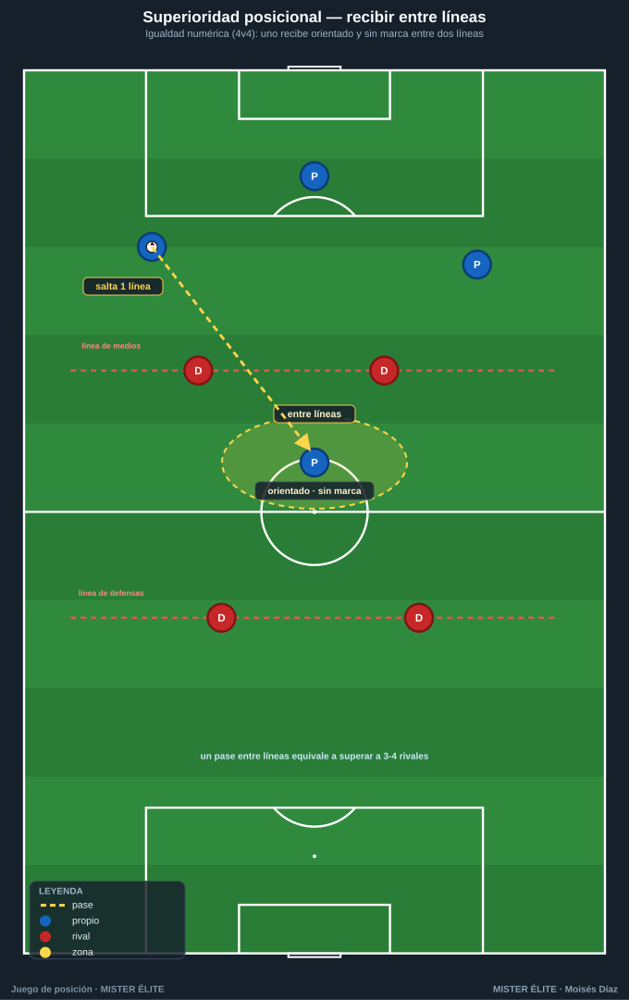
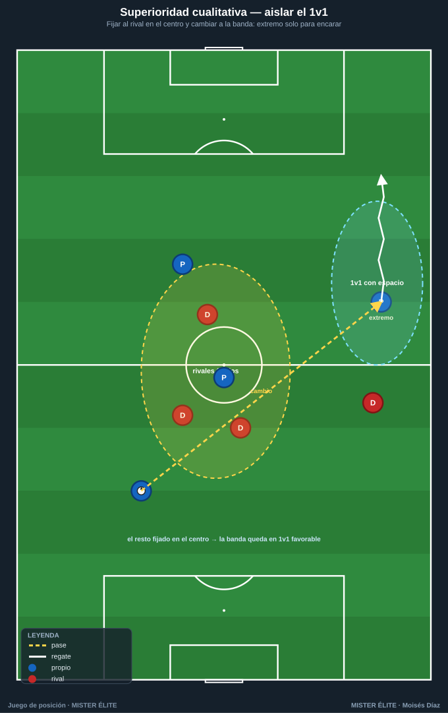
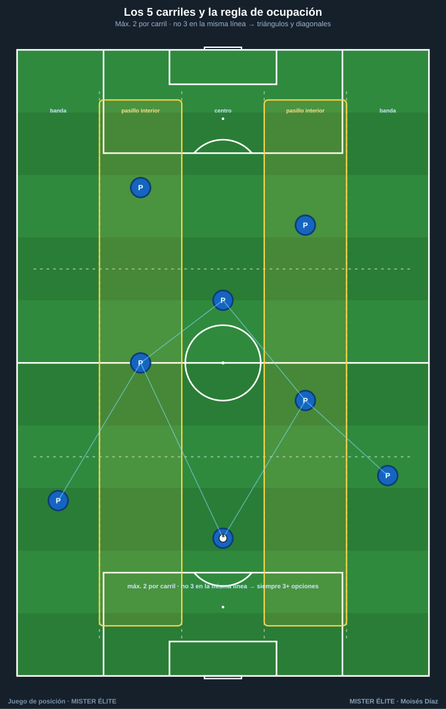

# Módulo 01 · Fundamentos del juego de posición

> Qué es el juego de posición (y qué no es) · las tres superioridades · ocupación racional del espacio · por qué funciona.

---

## 1. Qué es el juego de posición

El **juego de posición** es un modelo de organización del equipo con balón cuyo objetivo no es *tener* el balón, sino **usarlo para progresar generando superioridades**. Se basa en **ocupar el espacio de forma racional y estable** (jugadores repartidos en anchura, profundidad y entre líneas) de modo que el poseedor disponga siempre de **varias líneas de pase orientadas hacia adelante** y el equipo conserve una estructura que permita **atacar bien y, tras la pérdida, recuperar rápido**.

> **Definición de trabajo:** juego de posición = ocupar racionalmente el espacio + crear superioridades + circular el balón con la intención de avanzar y rematar, manteniendo una estructura que facilite la recuperación inmediata.

Tres ideas siempre presentes:

- **Posición antes que balón.** Primero me sitúo bien (perfil, distancia, altura), después recibo. La estructura es estable, no depende de dónde va el balón.
- **El balón se mueve para mover al rival.** Cada pase busca desordenar al adversario, no "pasar por pasar".
- **Finalidad.** Toda circulación apunta a progresar → finalizar, y a proteger (contrapresión tras pérdida).

### Juego de posición vs posesión estéril

La **posesión estéril** es tener mucho el balón **sin progresar ni amenazar**: circulación horizontal y hacia atrás que no rompe líneas ni crea ocasión. Domina en la estadística (alto % de posesión) pero **no genera control real**: no desorganiza al rival.

| | Juego de posición | Posesión estéril |
|---|---|---|
| **Objetivo del pase** | Mover al rival y progresar | Conservar / no perder |
| **Dirección dominante** | Vertical y diagonal (rompe líneas) | Horizontal y hacia atrás |
| **Ocupación** | Racional: anchura + profundidad + entre líneas | Cerca del balón, sin profundidad |
| **Superioridades** | Se buscan y se explotan | No se generan o no se usan |
| **Tras pérdida** | Estructura permite contrapresión | Equipo desordenado, vulnerable |
| **Métrica útil** | Pases que rompen línea, recepciones entre líneas | % de posesión a secas |

> **Regla de oro:** la posesión es buena si, cuando termina, el equipo está **más cerca de la portería rival** o ha obligado al rival a defender peor. Si el balón vuelve siempre al punto de partida sin mover al rival, es estéril.

---

## 2. Las tres superioridades

Crear y aprovechar superioridades es el **fin táctico** del juego de posición.

### Numérica — *somos más aquí*

Tener **más atacantes que defensores** en la zona del balón (el clásico **+1**). Garantiza salida limpia y obliga al rival a elegir a quién marcar: siempre queda **alguien libre**. Se crea con el portero como jugador de campo, un mediocentro que baja entre centrales, o atrayendo presión a un lado para que el contrario quede sobrado.

### Posicional — *estamos mejor colocados*

Estar **mejor situado** que el rival, aprovechando los **espacios entre líneas** y el **hombre libre**. Puede darse incluso en igualdad numérica (4v4) si uno de los nuestros recibe **a espaldas de una línea rival, orientado y sin marca**. Un solo pase que lo encuentra equivale a superar a 3-4 rivales.

### Cualitativa — *ganamos el duelo*

Generar un **1v1 a nuestro favor** (un extremo veloz contra un lateral lento, p. ej.). Se crea **aislando** al jugador de calidad: dar amplitud para dejarlo solo frente a su par, fijar al resto en el centro y **cambiar** el balón a su banda con espacio para encarar.

> **Síntesis:** el juego de posición busca **encadenarlas**: muevo el balón para crear una, y si el rival la tapa, aparece otra. El rival siempre llega un paso tarde.

---

## 3. Ocupación racional del espacio

### Los 5 carriles + las alturas

El campo se divide a lo ancho en **5 carriles verticales**: banda izq · **pasillo interior izq** · centro · **pasillo interior der** · banda der. Y a lo largo en **líneas/alturas** (defensa, medio, ataque). Los **pasillos interiores (2 y 4)** son zonas de oro: desde ahí se recibe entre líneas y se ataca en diagonal.

### La regla: "no más de 2 por carril, no 3 en la misma línea"

- **Máx. 2 por carril vertical:** evita amontonarse, mantiene anchura y estira al rival.
- **No 3 en la misma línea horizontal:** garantiza **escalonamiento** (jugadores a distintas alturas) → siempre hay apoyo por delante y por detrás, y se crean **líneas de pase diagonales** (mejores que las horizontales).
- Resultado: el equipo dibuja **triángulos y rombos**; cada poseedor tiene **3+ opciones** y el balón circula sin callejones.

### Ocupar para FIJAR y para APOYAR

- **Fijar:** un jugador en banda o en profundidad **obliga a un rival a vigilarlo** aunque no reciba, y abre espacio para otros (un extremo a la cal fija al lateral y libera el medio-espacio).
- **Apoyar:** estar bien situado da al poseedor **soluciones reales** (apoyo al pie, profundidad por fuera, descarga por detrás). Sin ocupación correcta no hay a quién pasar → posesión estéril.

> Regla práctica: *ancho cuando atacamos, estrecho cuando defendemos.* La amplitud máxima la dan extremos a la cal; la profundidad, un jugador siempre en la última línea que fija a la defensa.

---

## 4. Por qué funciona

No es estética: produce ventajas concretas.

1. **Da control del partido.** Con triángulos y buena ocupación, el equipo conserva el balón **progresando**, dicta el ritmo y fatiga al rival.
2. **Genera superioridades por diseño.** La estructura hace que aparezcan sistemáticamente: si tapan una, expongo otra.
3. **Facilita la contrapresión.** Como los jugadores están **cerca, escalonados y repartidos**, al perder el balón hay varios a pocos metros para presionar al instante, y el rival está mal posicionado para salir. **Atacar ordenado = recuperar ordenado.**
4. **Reduce el riesgo.** Tener siempre apoyos y un hombre libre baja la probabilidad de pérdida y evita quedar partido.

> **Mensaje para el alumno:** atacamos bien posicionados no solo para meter gol, sino para **no concederlo**. Orden con balón = orden sin balón.

---

## Ideas clave

- El objetivo no es tener el balón, es **usarlo para progresar** creando superioridades.
- **Posición antes que balón**; el pase mueve al rival, no se da por darlo.
- Tres superioridades: **numérica** (somos más), **posicional** (mejor colocados / entre líneas), **cualitativa** (ganamos el 1v1). Se encadenan.
- Ocupación racional: **5 carriles + alturas**, "máx. 2 por carril, no 3 en línea" → triángulos y siempre 3+ opciones.
- El juego de posición es **la mejor defensa**: la estructura que ataca bien recupera rápido.

## Errores comunes

- **Confundir posesión con dominio:** tocar mucho sin progresar ni amenazar. Medir por pases que rompen línea, no por toques.
- **Amontonarse** en el carril del balón: facilita la presión y elimina líneas de pase. Aplicar la regla de ocupación.
- **Falta de profundidad:** nadie amenaza la espalda → el rival sube y comprime. Tener siempre un jugador en la última línea.
- **Buscar la posesión por la posesión** sin finalidad: olvidar que toda circulación apunta a progresar, finalizar y proteger.

---

*MISTER ÉLITE — Moisés Díaz*
