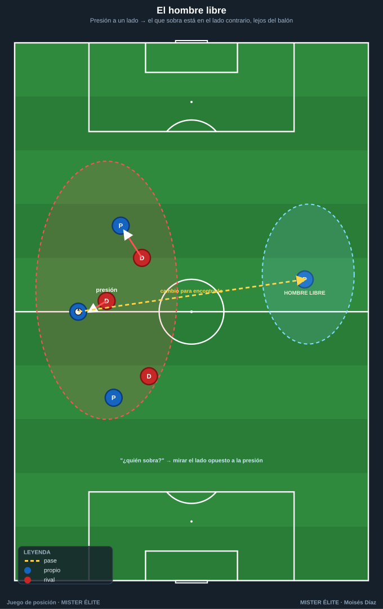
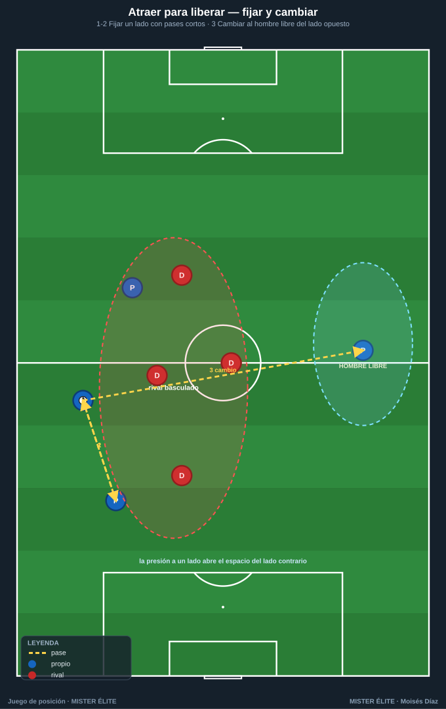
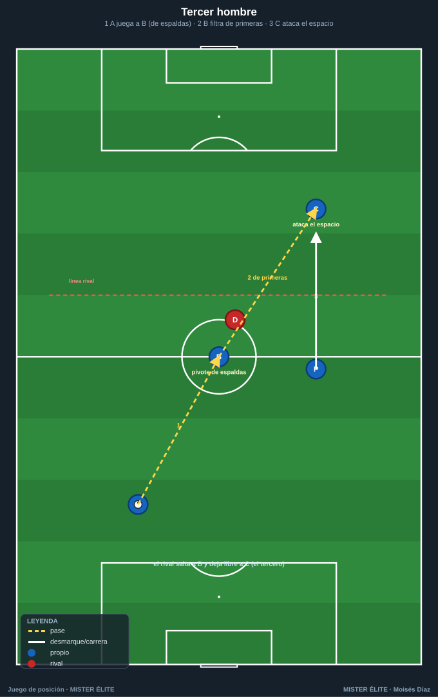
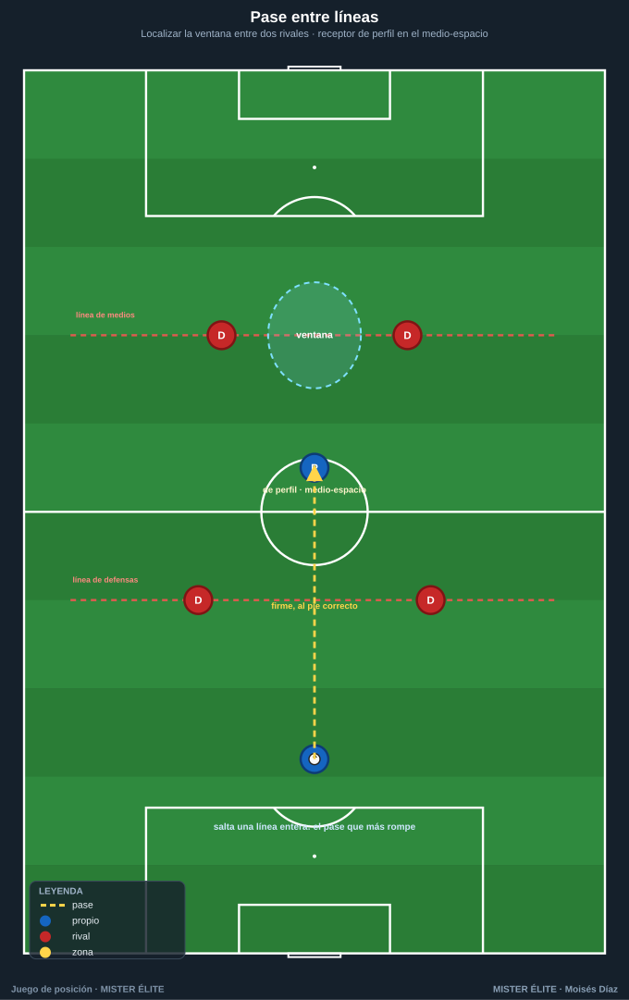
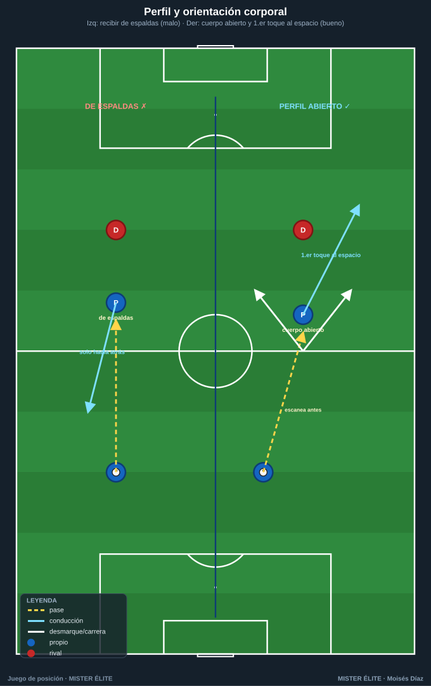
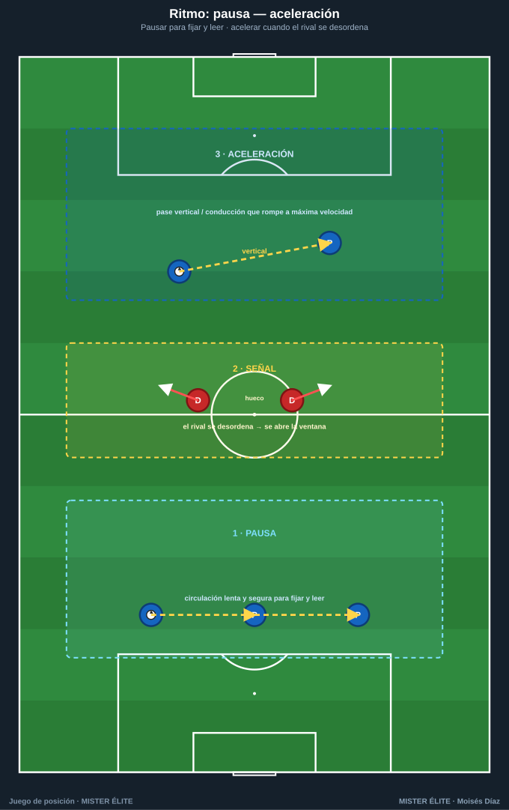

# Módulo 02 · Mecanismos del juego de posición

> Las herramientas concretas con las que se ejecuta el juego de posición. Para cada una: qué es, cómo se hace y cuándo usarla.

---

## 1. El hombre libre (y cómo encontrarlo)

**Qué es.** El jugador **sin marca directa** que, por la estructura, queda **sobrante** respecto a la presión rival. Es la consecuencia natural de una superioridad bien creada. Encontrarlo y usarlo es **el objetivo nº 1 de cada acción**.

**Cómo encontrarlo:**

- **Contar líneas.** Si presionan con 2 y salimos con 3, **uno sobra**: ese es el libre. Identificarlo **antes de recibir** (escaneo).
- **Mirar el lado opuesto a la presión.** El rival no cubre todo; el libre suele estar **lejos del balón**.
- **Es dinámico:** al circular el balón, el sobrante cambia. Hay que leerlo en tiempo real.

**Cuándo usarlo.** Siempre que exista. Si está **orientado y puede progresar**, se le busca de inmediato (vale un cambio de orientación). Si está de espaldas o presionado, primero se mueve el balón para reubicarlo.

> Coaching: "¿Quién sobra?" en cada secuencia. Si nadie lo identifica, la posesión se vuelve estéril.

---

## 2. Atraer para liberar (fijar y cambiar)

**Qué es.** Provocar la presión en una zona (normalmente un lado) para **abrir el espacio contrario** y cambiar allí el juego. Convierte la presión rival en ventaja.

**Cómo se hace:**

1. **Fijar/atraer:** circular en un lado con apoyos cercanos para que el rival **bascule** y concentre jugadores ahí.
2. **Liberar/cambiar:** en cuanto el rival se ha desplazado, **cambiar la orientación** al lado contrario, donde hay superioridad o 1v1 con espacio.
3. El cambio puede ser **largo** (al extremo a la cal) o **escalonado** por dentro vía el hombre libre.

**Cuándo usarlo.** Contra rivales que **presionan o basculan en bloque**. **Cuándo NO:** si el rival defiende muy abierto/pasivo, fijar no abre nada; mejor progresar por dentro.

---

## 3. Tercer hombre

**Qué es.** Combinación de **tres jugadores** para alcanzar a un compañero (el "tercero") que el pasador no podía encontrar directamente. A↔B sirve para que **B encuentre a C**.

**Cómo se hace:** A pasa a B (apoyo que recibe de espaldas o pivote); B, **a un toque**, filtra a C, que **ataca el espacio** entre líneas o la espalda de la defensa. Clave: C **se mueve mientras el balón viaja A→B** (sincronía); B juega de primeras.

**Cuándo usarlo.** Cuando el **pase directo está tapado** pero hay un apoyo intermedio. Recurso estrella contra presiones agresivas: el rival que salta a B deja libre a C.

---

## 4. Pase entre líneas

**Qué es.** El pase introducido en el **espacio entre dos líneas rivales** (típicamente medios y defensas). Es el pase que **más rompe**: salta una línea entera.

**Cómo se hace:** el receptor se sitúa en el **medio-espacio**, en el **punto ciego** del defensor, y temporiza; el pasador busca la **ventana** (hueco entre dos rivales) y juega **firme y al pie correcto** (el que deja al receptor orientado). Si no hay ventana, primero se mueve el balón.

**Cuándo usarlo.** Cuando hay un jugador **libre y orientable** entre líneas. **Cuándo NO arriesgarlo:** receptor de espaldas y muy vigilado en zona propia (pérdida peligrosa).

---

## 5. Perfil y orientación corporal

**Qué es.** La **postura al recibir**: **medio-girado / perfil abierto** para controlar orientado hacia adelante y ver el máximo de campo. Convierte una recepción en progresión.

**Cómo se hace:** orientarse **antes** de que llegue el balón (cuerpo hacia la portería rival, no de cara al pasador); recibir con el **pie más alejado** del defensor y dar el primer toque **hacia el espacio libre**; **escanear** (2-3 vistazos) antes de recibir.

**Cuándo usarlo.** Siempre que se reciba de cara o de costado. Si se recibe de espaldas con un defensor pegado, no se fuerza el giro: se **protege y descarga**.

> Coaching: el primer toque ya es una decisión táctica. "Recibe abierto, mira antes".

---

## 6. Ritmo: pausa — aceleración

**Qué es.** Gestionar la **velocidad del juego**: **pausar** (circular tranquilo, fijar, leer) para **acelerar** en el momento exacto en que se abre la ventaja. El balón cambia de marcha.

**Cómo se hace:** **pausa** = posesión paciente y segura para provocar al rival y leer dónde se abrirá el espacio; **aceleración** = cuando aparece el hombre libre / la ventana / el 1v1, **velocidad máxima** para rematar la ventaja antes de que el rival ajuste. La señal para acelerar la da **el rival desordenado**.

**Cuándo usarlo.** Pausa cuando no hay ventaja clara; acelera cuando aparece. Error típico: acelerar siempre (pérdidas) o pausar siempre (esterilidad).

---

## 7. Conducir vs pasar

**Qué es.** La decisión entre **conducir** o **pasar**. El pase mueve el balón más rápido que cualquier jugada; pero **conducir tiene una función táctica concreta: atraer y fijar**.

**Cuándo CONDUCIR:** para **fijar a un rival** y obligarle a salir (libera a un compañero); cuando hay espacio por delante y nadie mejor situado; para **ganar la línea** y atraer una segunda presión.

**Cuándo PASAR:** cuando el pase progresa más que la conducción; bajo presión cercana; para mover al rival rápido (cambio de orientación).

> **Regla práctica:** *conduzco para crear superioridad (atraer), paso para aprovecharla.* Conducir sin intención es un error.

---

## Ideas clave

- El **hombre libre** es el objetivo nº 1: se encuentra contando líneas y mirando el lado opuesto a la presión.
- **Atraer-cambiar** convierte la presión del rival en ventaja; el **tercer hombre** supera al que salta a un apoyo.
- El **pase entre líneas** es la progresión más rentable; exige ventana y receptor orientado.
- El **perfil** convierte recepción en progresión: cuerpo abierto, mirar antes, primer toque al espacio.
- El **ritmo** es leer cuándo pausar (fijar) y cuándo acelerar (romper); se conduce para fijar, se pasa para aprovechar.

## Errores comunes

| Error | Qué pasa | Corrección |
|---|---|---|
| **Posesión horizontal estéril** | El balón va de lado a lado sin romper líneas. | Buscar siempre un pase vertical/diagonal o al hombre libre. |
| **Amontonarse** | Se quitan espacio, facilitan la presión, no hay líneas limpias. | "Máx. 2 por carril, no 3 en línea"; reocupar carriles vacíos. |
| **Falta de profundidad** | Nadie amenaza la espalda; el rival sube y comprime. | Un jugador siempre en la última línea que fije a la defensa. |
| **Recibir de espaldas sin necesidad** | Se juega hacia atrás, no se progresa. | Orientar el cuerpo antes de recibir; perfil abierto. |
| **No identificar al hombre libre** | Se desperdicia la superioridad creada. | Escaneo + "¿quién sobra?"; jugar al lado contrario de la presión. |
| **Acelerar/pausar a destiempo** | Pérdidas o esterilidad. | Leer al rival: acelerar cuando se desordena, pausar cuando hay equilibrio. |

---

*MISTER ÉLITE — Moisés Díaz*
