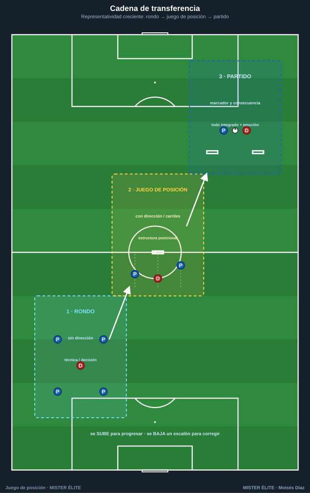
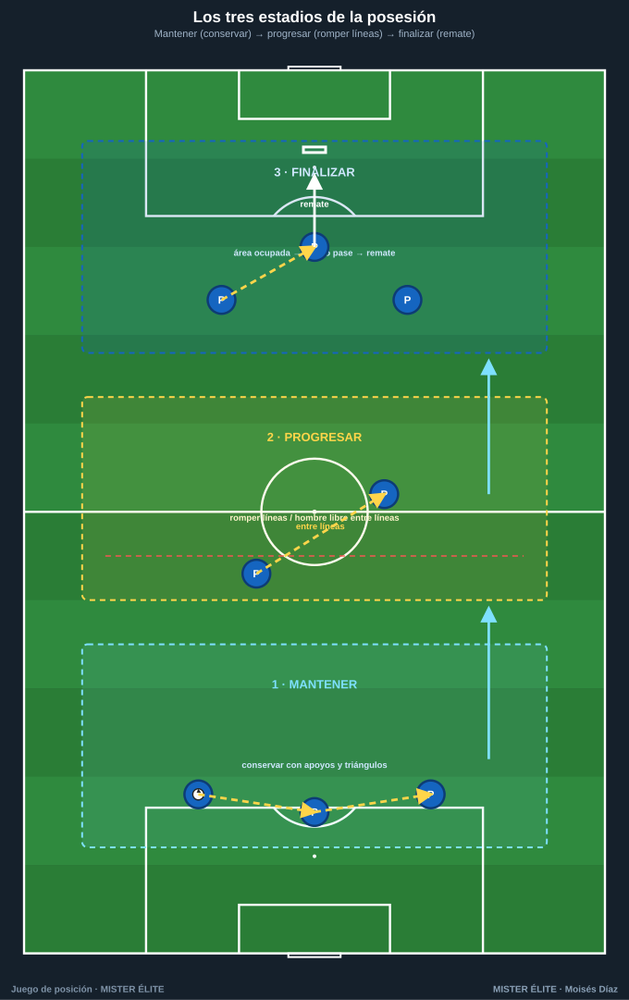
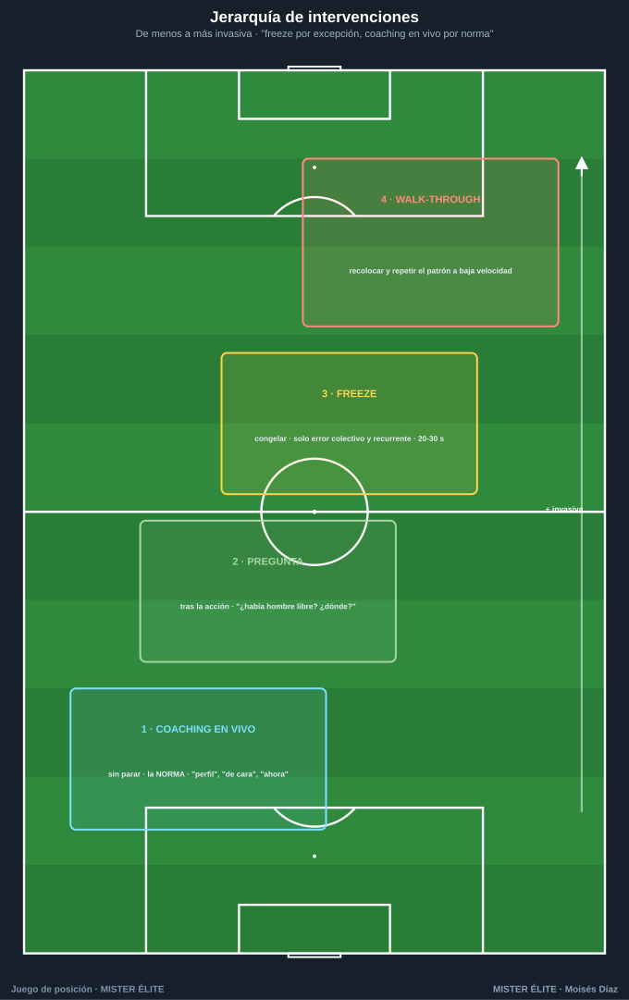

# Módulo 03 · Del rondo al juego de posición (y al partido)

> La cadena de transferencia · cómo progresar y dar dirección a una posesión · cómo coachear el juego de posición.

---

## 1. La cadena de transferencia: rondo → juego de posición → partido

El error metodológico más común es tratar el rondo como un calentamiento lúdico aislado del partido. En realidad rondo, juego de posición y partido son **tres escalones de la misma escalera de transferencia**: cada uno conserva el problema táctico anterior y le añade una capa de realidad competitiva.



```
RONDO              JUEGO DE POSICIÓN          PARTIDO (reducido / 11)
sin dirección  →   con dirección/porterías  →  con marcador y consecuencia
técnica/decisión   estructura posicional      todo integrado + emoción
```

La regla que ordena la cadena es la **representatividad** (cuánto se parece la práctica a la competición). Se incrementa **por capas**, no de golpe.

**Escalón 1 — Rondo.** Posesión en superioridad clara (4v1, 5v2…) y **sin dirección**. Entrena con máxima densidad: **velocidad técnica bajo presión real**, **perfil y "mirar antes de recibir"**, lectura del 1.er defensor y del libre inmediato, tercer hombre elemental. Su límite: no entrena dirección, orientación al espacio ni finalización. Solo rondos = "tocar bonito" sin progresar.

**Escalón 2 — Juego de posición.** Coge el problema del rondo y le añade lo que le falta: **dirección y orientación al espacio**, mediante (1) **porterías/zonas de progresión**, (2) **división en carriles y líneas** (ocupación racional), (3) **comodines posicionados** que reproducen estructura de equipo. Aporta orientación hacia un objetivo, **superioridad posicional**, cambios de orientación y reconocimiento de líneas que romper. Es el **escalón bisagra**.

**Escalón 3 — Partido.** Dos equipos, dos porterías, **marcador y consecuencia**. Aporta oposición plena y bidireccional (transiciones reales, contrapresión en su contexto), finalización con portero y **carga emocional**. Su límite: como todo ocurre a la vez, es difícil aislar un detalle fino → se vuelve al rondo/JdP para pulir.

| Variable | Rondo | Juego de posición | Partido |
|---|---|---|---|
| **Dirección** | No | Sí (a zona/portería) | Sí (marcar) |
| **Orientación al espacio** | Mínima | Alta (carriles/líneas) | Total |
| **Superioridad** | Numérica | Numérica + **posicional** | La que se genere |
| **Finalización** | No | Opcional (mini-meta) | Sí (portero) |
| **Transición/contrapresión** | No | Parcial | Real |
| **Repeticiones técnicas/min** | **Muy alta** | Media-alta | Baja |
| **Representatividad** | Baja | Media | Alta |

> **Idea-fuerza:** el rondo enseña a tocar, el juego de posición enseña a tocar **en una dirección y con estructura**, el partido enseña a hacerlo **cuando importa**. Se progresa subiendo escalones; se corrige bajando uno.

---

## 2. Cómo progresar y dar dirección a una posesión



```
MANTENER  →  PROGRESAR  →  FINALIZAR
(conservar)  (romper líneas)   (terminar en remate)
```

El defecto frecuente es atascarse en "mantener". Progresar y finalizar **no surgen solos**: se provocan modificando la tarea. Palancas, de menor a mayor exigencia:

**a) Añadir DIRECCIÓN.** Porterías/mini-porterías de progresión (de "conservar" a "introducir el balón en una zona"); líneas de progresión (3 franjas; punto al pasar de zona 1 a 3 controlado); de zona a zona **con condición** (el balón pasa solo si lo recibe un jugador de cara o entre líneas).

**b) Añadir ZONAS y CARRILES.** 5 carriles + 3 alturas con la regla de ocupación; zona prohibida / de pase obligado (p. ej. no progresar por el centro sin haber jugado por fuera); zona de "hombre libre entre líneas" que vale doble.

**c) Usar COMODINES para dirigir.** Comodín de progresión (en la zona objetivo); comodín-pivote (entre líneas, fuerza buscar el interior); comodines de banda (amplitud, atraer-cambiar); **quitarlos progresivamente** (+3 → +2 → +1) sube la exigencia.

**d) REGLAS que fuerzan progresar/finalizar.** Límite de toques por zona; nº mínimo de pases antes de progresar/finalizar; **premio por acción de valor** (gol doble tras pase entre líneas o cambio de orientación); límite de tiempo para finalizar.

> **Regla de oro de diseño:** cambia **una sola variable** cada vez para saber qué provocó la mejora.

---

## 3. Cómo coachear el juego de posición

El juego de posición no se "deja correr": se coachea. Pero **sobre-coachear lo mata** (mata el ritmo y la decisión). El arte es saber qué corregir, cuándo intervenir y cómo gestionar la intensidad.

### a) Qué corregir (por prioridad de impacto)

1. **Perfil / orientación corporal antes de recibir.** El fallo nº 1. *"Abre el cuerpo, recíbela de lado, mira tu portería objetivo".*
2. **Mirar antes de recibir (escaneo).** *"¿Qué viste antes de recibir?"*
3. **Primer toque orientado.** Que el control ya vaya hacia donde se progresa.
4. **Peso y dirección del pase.** Fuerte y al pie correcto (al perfil de progresión, no "al jugador").
5. **Ocupar/abandonar carriles.** *"No 2 en el mismo carril; si él baja, tú subes".*
6. **Apoyos y orientación del juego:** línea de cara + línea de seguridad.
7. **Ritmo (pausa-aceleración):** cuándo circular para atraer y cuándo acelerar para romper.

### b) Cuándo intervenir (jerarquía de intervenciones)



De menos a más invasiva (usar siempre la mínima necesaria):

- **Coaching en vivo (sin parar):** la mayoría del tiempo. Indicaciones cortas y posicionales (*"perfil", "de cara", "cambia", "ahora"*).
- **Pregunta tras la acción:** aprovechar una pausa para preguntar (*"¿había hombre libre? ¿dónde?"*). Desarrolla la decisión.
- **FREEZE (congelar la imagen):** parar en el momento exacto del error/acierto recurrente, todos quietos. Solo cuando el error es **colectivo, recurrente y posicional**. Congelar → señalar la mejor opción (idealmente que la vea el jugador) → **rebobinar y repetir bien** → soltar. 20-30 s máx.
- **Parada + repetición guiada (walk-through):** si el fallo es generalizado, recolocar y reproducir el patrón a baja velocidad.

> **Regla:** *freeze por excepción, coaching en vivo por norma.*

### c) Gestión del ritmo y la intensidad

El juego de posición debe entrenarse a **intensidad de competición**: si los defensores (rojos) presionan flojo, no hay presión real y la técnica no transfiere. **Exigir presión auténtica**; series cortas de alta intensidad con descanso suficiente; **penalizar la pasividad** (el que pierde, pisa a recuperar → entrena la contrapresión); **subir/bajar la dificultad** para mantener la **dificultad óptima** (ni trivial ni imposible); intervenciones cortas para no enfriar el ritmo.

---

## Ideas clave

- Rondo, juego de posición y partido son **tres escalones de la misma escalera**: se sube para progresar, se baja para corregir.
- El juego de posición es el **escalón bisagra**: añade al rondo dirección, estructura y superioridad posicional.
- Para progresar, **provoca** con dirección, zonas/carriles, comodines y reglas — **una variable cada vez**.
- Coachea **en vivo por norma, freeze por excepción**; corrige primero perfil y escaneo (lo que más rinde).
- Sin **intensidad de competición** real, la tarea no transfiere nada al domingo.

## Errores comunes

- **Tratar el rondo como calentamiento aislado:** se pierde la transferencia; el equipo toca pero no progresa.
- **Saltar del rondo al partido** sin el escalón intermedio: el salto es demasiado grande.
- **Cambiar varias variables a la vez:** no se sabe qué provocó la mejora (o el empeoramiento).
- **Sobre-coachear / abusar del freeze:** se mata el ritmo que precisamente se quiere entrenar.
- **Permitir presión floja de los defensores:** sin estrés real, la técnica no se transfiere.

---

*MISTER ÉLITE — Moisés Díaz*
