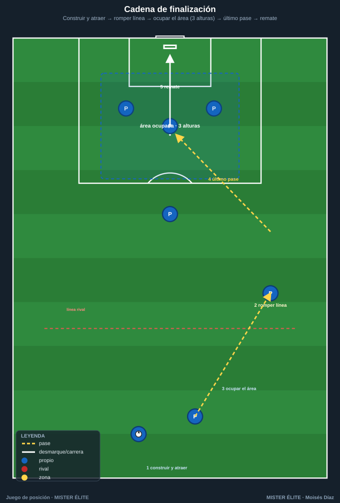
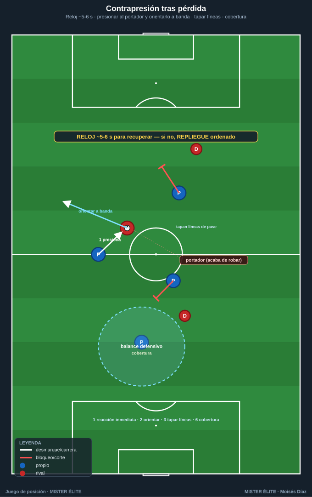

# Módulo 04 · Posesión con finalidad

> La posesión no es un fin (tener el balón), es un medio: progresar, finalizar y, al perderlo, recuperar — sostenido por proteger el balón.

---

## 0. La premisa: posesión ≠ fin, posesión = medio

Tener el balón solo sirve si conduce a algo. Una posesión es buena cuando **progresa, rompe líneas y termina en ocasión**, no cuando acumula pases. Toda la finalidad se resume en tres verbos encadenados —**progresar → finalizar → (al perder) recuperar**— más un cuarto que los sostiene: **proteger**.

---

## 1. Posesión para progresar y para finalizar

### 1.1 Progresar: romper líneas y encontrar al hombre libre entre líneas

**Progresar** es avanzar el balón superando líneas defensivas **en condiciones de seguir jugando** (no es "tirar el balón hacia delante"). El objetivo concreto es encontrar al **hombre libre entre líneas** (el que recibe entre la defensa y la medular rival, de cara y con tiempo).

Mecanismos de progresión (cómo se rompe una línea):

- **Pase entre líneas a jugador de cara** — el más valioso: rompe línea y orienta el ataque de una sola acción.
- **Atraer para liberar (fijar y cambiar)** — la superioridad se crea moviendo al rival, no solo el balón.
- **Tercer hombre** — cuando el receptor que rompe está marcado, se juega a un apoyo que filtra al tercero.
- **Conducir para fijar, fijar para pasar** — conducir hacia un rival lo obliga a salir y libera al que dejó.
- **Superioridad posicional > numérica** — no basta ser más: hay que estar **mejor situados** para que siempre exista una línea que rompa.

**Condición de calidad:** la progresión vale cuando el balón llega **controlable y orientado (de cara)**, no cuando cruza una línea en el aire y se pierde. Por eso las tareas premian recibir **de cara entre líneas**, no solo "llegar arriba".

### 1.2 Finalizar: cómo la posesión termina en ocasión



La posesión que progresa pero no remata es trabajo a medias. **Finalizar** es convertir la superioridad en **un remate en buena posición**. Dos componentes:

- **Posición (la ocasión se construye antes del remate).** Empieza con la **ocupación del área**: alguien al primer palo, al segundo, al punto de penalti, alguien en la frontal para el rechace, y amplitud que estire a la defensa. La posesión debe **llegar a la última línea con esa estructura ya formada**.
- **Remate (la decisión final).** El último pase deja al rematador **de cara y con espacio/tiempo**: pase atrás desde fondo, centro raso/medido a la zona ocupada, o filtrado para el mano a mano.

```
construir y atraer → romper línea (hombre libre entre líneas / banda)
   → llegar a fondo o frontal con el área OCUPADA → último pase a jugador de cara → REMATE
```

**Implicación para el diseño (familia 5):** las tareas de finalización exigen **posición + remate** — punto solo si el gol llega tras romper una línea u ocupar bien el área. Posesión y finalización quedan unidas, no separadas.

---

## 2. Proteger el balón y contrapresión tras pérdida

### 2.1 Proteger el balón

Proteger no es jugar lento, es **asegurar el balón cuando no hay progresión limpia disponible**: cuerpo entre balón y rival (perfil de protección); **apoyo de seguridad siempre disponible** por detrás; **no forzar el pase imposible** (asegurar antes que regalar en zona de riesgo); cuerpo orientado para volver a jugar hacia delante en cuanto baje la presión.

### 2.2 Contrapresión tras pérdida — las reglas



La **contrapresión** es presionar **inmediatamente** tras perder, para recuperar donde se perdió, aprovechando que el rival está mal orientado. El momento más vulnerable de un equipo es **justo después de recuperar**.

1. **Reacción inmediata (1-2 s).** El que pierde y los más cercanos pasan de atacar a presionar **al instante**, sin medio segundo de lamento.
2. **Presionar al portador y orientarlo:** el más cercano impide el pase fácil hacia delante y conduce al rival hacia la banda/atrás.
3. **Los de alrededor tapan líneas de pase, no van todos al balón:** recuperar es colectivo (uno presiona, el resto roba el espacio de pase).
4. **Recuperar en pocos segundos (~5-6 s) o replegar:** si no se recupera en el plazo o el rival saca con control, **se repliega ordenado**. Contrapresión fallida sin repliegue = contraataque encajado.
5. **Compactar y achicar al perder:** subir y juntar líneas para dejar al rival sin opciones cómodas.
6. **Gatillo + cobertura:** definir **cuándo** se contrapresiona y que **siempre quede cobertura** detrás.

### 2.3 Por qué el juego de posición facilita la contrapresión

No es casualidad que los mejores en juego de posición sean los mejores en contrapresión: **la misma estructura que ordena el ataque ordena el robo inmediato**. La ocupación racional mantiene a los jugadores **cerca y escalonados** → al perder, ya hay varios cuerpos alrededor; las distancias cortas hacen la reacción **inmediata y coordinada**; si la pérdida ocurre tras atraer al rival, este está juntado y mal posicionado para defender la contra; y el **balance defensivo ya está hecho** (regla 6).

> **Idea-fuerza:** *atacar bien (con estructura) es la mejor manera de defender rápido.* Orden con balón = orden inmediato sin balón.

---

## 3. Indicadores de una buena posesión

El error de medición más extendido es valorar la posesión por el **nº de pases** o el **% de posesión**: pueden subir mientras el equipo no hace nada útil. Los indicadores que importan miden **finalidad**:

**Sí miden una buena posesión:** progresión (metros ganados, pases que progresan vs laterales); **ruptura de líneas** (líneas superadas con control, pases entre líneas de cara — el indicador estrella); encontrar al hombre libre; ocasiones generadas y calidad de la finalización; recuperación tras pérdida (% recuperado en X s); conservación con sentido (pocas pérdidas en zona de riesgo).

**No sirven por sí solos:** nº de pases / % de posesión; pases completados en zona segura.

> **Regla de evaluación y diseño:** una posesión es buena si **progresa, rompe líneas y termina en ocasión** —y si, al perderse, el equipo está estructurado para recuperar—. Las tareas puntúan por ruptura de línea, hombre libre y remate, no por tocar.

---

## Ideas clave

- La posesión es **medio, no fin**: vale si progresa, rompe líneas y termina en ocasión.
- **Progresar** = romper líneas encontrando al hombre libre **de cara**; la calidad es recibir controlable y orientado.
- **Finalizar** = posición (área ocupada en 3 alturas) + remate (último pase que deja de cara).
- **Proteger** asegura cuando no hay progresión limpia; nunca forzar el pase imposible en zona de riesgo.
- La **contrapresión** se rige por 6 reglas (reacción, orientar, tapar líneas, X s o replegar, compactar, gatillo+cobertura) y se apoya en la misma estructura del ataque.
- Se mide por **ruptura de línea, hombre libre y remate**, no por % de posesión.

## Errores comunes

- **Medir la posesión por el % o el nº de pases:** se puede tener el 70% y no rematar.
- **Progresar "en el aire":** mandar el balón arriba sin que llegue controlable y de cara.
- **Finalizar sin haber ocupado el área:** llegar a fondo sin estructura → no hay rematadores.
- **No reaccionar tras la pérdida:** el medio segundo de lamento regala la transición.
- **Contrapresionar sin gatillo ni cobertura:** quedar abiertos a la contra si el rival supera la primera presión.

---

*MISTER ÉLITE — Moisés Díaz*
