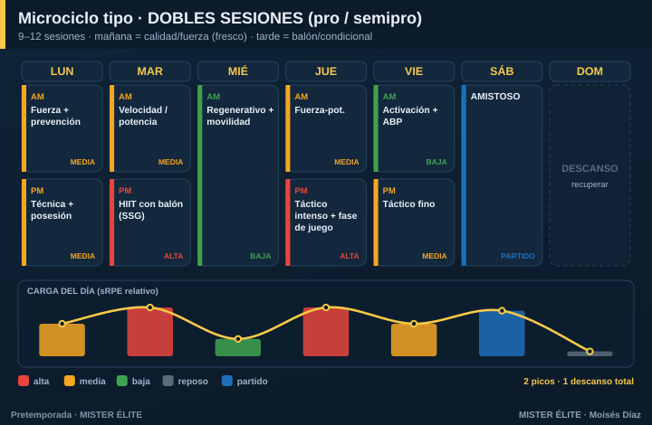

# Plan · DOBLES SESIONES (profesional / semipro)

**Para quién:** equipos profesionales, semipro o en concentración, con **9-12 sesiones por semana** (mañana y tarde). **Pretemporada: 4-6 semanas.**

> **Principio rector:** aquí **sobra tiempo para separar capacidades** y tratarlas en su pureza. El reto no es la falta de tiempo, es **gestionar la fatiga acumulada**. Densidad media por sesión, nunca máxima. La integración es útil pero no obligatoria.

---

## Microciclo tipo

**La lógica mañana / tarde:**
- **Mañana = calidad** (jugador fresco): fuerza de gimnasio, prevención, velocidad y aceleraciones, técnica analítica.
- **Tarde = acumulación**: juegos reducidos, fases de juego, HIIT con balón, resistencia específica.

Esto respeta el orden concurrente (la potencia con el jugador fresco; la resistencia después) y reparte la carga del día en dos dosis digestibles.

---

## Cómo se reparte la carga

- **Dos picos** a la semana (martes y jueves), separados por el miércoles de descarga. Nunca dos días altos de la **misma** capacidad sin 48 h.
- **No encadenes dobles a diario.** Patrón sano: doble-doble-simple/descarga-doble-doble-simple-descanso. **Mínimo 1 día de descanso completo** por semana.
- La gran trampa de las dobles es la **fatiga acumulada**: vigila el wellness matinal a rajatabla. Una caída del 15-20 % en un jugador = ajustar su carga ese día.

## Fuerza, velocidad y prevención

- **Fuerza** de gimnasio 2-3 días/semana, por la mañana.
- **Prevención** (Nordic, core, tobillo) casi a diario en dosis cortas.
- **Velocidad** 1-2 días, siempre en estado fresco (mañana).

## Amistosos

Desde la semana 1-2, frecuencia creciente (1/sem → hasta 2/sem al final). 36-48 h de descarga previa. Minutos progresivos.

## Trabajo individual

Los **no-titulares y readaptados** necesitan compensación de alta intensidad y velocidad para no descolgarse de los titulares (que acumulan minutos en los amistosos). Sesiones de compensación los días de partido.

---

## Progresión por fases (6 semanas tipo)

| Semana | Fase | Énfasis físico | Énfasis táctico | Amistosos |
|---|---|---|---|---|
| 1 | Acumulación | Base aeróbica (gran formato), fuerza general | Principios, estructura | — / 1 suave |
| 2 | Acumulación | Base + primer HIIT, prevención | Subprincipios, posesión | 1 |
| 3 | Transformación | HIIT, inicio RSA | Fases de juego, ABP | 1-2 |
| 4 | Transformación | RSA, velocidad, fuerza-potencia | Automatismos, plan de partido | 2 |
| 5 | Realización | Velocidad/potencia, mantener motor | Once tipo, ritmo de competición | 1-2 fuerte |
| 6 | Realización | **Tapering** −40/60 % volumen | Afinar, plan de debut | Debut |

> **Recuerda:** la forma de la semana (2 picos + descargas) se mantiene; lo que cambia es el contenido y, en la semana 6, el volumen baja para llegar fresco.
