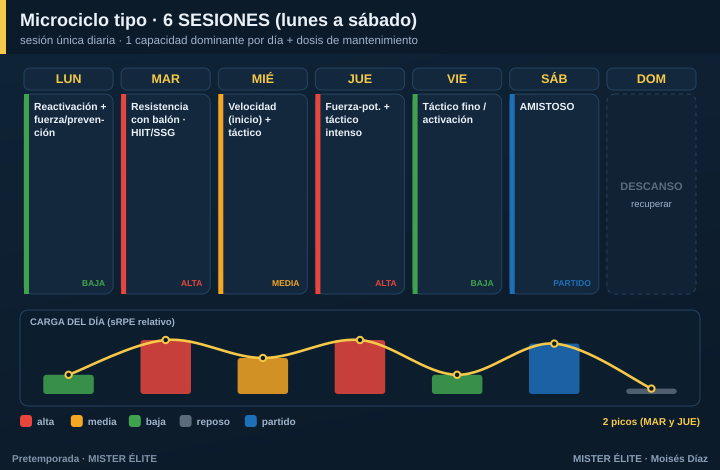

# Plan · 6 SESIONES (lunes a sábado)

**Para quién:** semipro y amateur alto, **6 sesiones** en sesión única de lunes a sábado. **Pretemporada: 5-6 semanas.**

> **Principio rector:** mantienes casi todo el control del modelo de dobles, pero **en sesiones únicas**. Empieza la integración: **una capacidad dominante por día**, más una dosis corta de mantenimiento de otra. Aún caben los dos picos semanales.

---

## Microciclo tipo

**Un dominante por día:**
- **Lunes** — reactivación + fuerza/prevención (post-finde, carga baja).
- **Martes** — **pico 1**: resistencia / HIIT con balón (juegos reducidos grandes).
- **Miércoles** — táctico + velocidad al inicio (fresco), carga media.
- **Jueves** — **pico 2**: fuerza-potencia + táctico intenso.
- **Viernes** — táctico fino / activación (descarga hacia el partido).
- **Sábado** — amistoso.

---

## Cómo se reparte la carga

- **Dos picos** (martes y jueves) con descargas intercaladas. El viernes es ya tapering del amistoso.
- La resistencia va **mayoritariamente con balón** (juegos reducidos); el gimnasio se mantiene 2 días.

## Fuerza, velocidad y prevención

- **Fuerza** 2 días/semana (lunes y jueves).
- **Velocidad** 1-2 días, al **inicio** de la sesión, con el jugador fresco (miércoles).
- **Prevención** en el calentamiento, casi a diario.

## Amistosos

Los sábados, desde la semana 2. El viernes descarga, el domingo descansa.

## Trabajo individual

Poco necesario; core y movilidad como deberes en los días de menor carga (lunes, viernes).

---

## Progresión por fases (6 semanas tipo)

| Semana | Fase | Énfasis físico | Énfasis táctico | Sábado |
|---|---|---|---|---|
| 1 | Acumulación | Base aeróbica gran formato, fuerza general | Principios, estructura | Test / amistoso suave |
| 2 | Acumulación | Base + primer HIIT | Subprincipios, posesión | Amistoso 1 |
| 3 | Transformación | HIIT, inicio RSA | Fases de juego, ABP | Amistoso 2 |
| 4 | Transformación | RSA, velocidad | Automatismos | Amistoso 3 |
| 5 | Realización | Velocidad/potencia, mantener | Once tipo, ritmo real | Amistoso fuerte |
| 6 | Realización | **Tapering** | Plan de debut | Debut |
