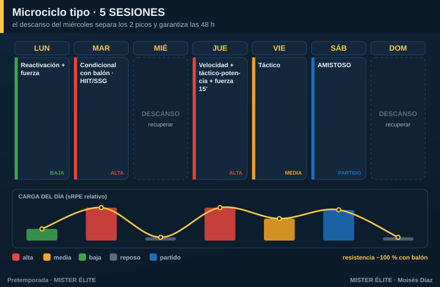

# Plan · 5 SESIONES

**Para quién:** amateur competitivo, **5 sesiones** por semana. **Pretemporada: 5-6 semanas.**

> **Principio rector:** pierdes un día respecto al plan de 6 → toca **agrupar estímulos compatibles** y reforzar la integración con balón. Mantener **dos picos** sigue siendo posible si colocas bien el descanso.

---

## Microciclo tipo

**La clave es el descanso del miércoles:** separa los dos picos (martes y jueves) y garantiza las 48 h entre estímulos de alta intensidad.

- **Lunes** — reactivación + fuerza (carga baja).
- **Martes** — **pico 1**: condicional con balón (HIIT/SSG).
- **Miércoles** — descanso o trabajo regenerativo opcional.
- **Jueves** — **pico 2**: velocidad (inicio, fresco) + táctico-potencia + fuerza corta 15'.
- **Viernes** — táctico (carga media).
- **Sábado** — amistoso.

---

## Cómo se reparte la carga

- Dos picos separados por el descanso del miércoles (cumple las 48 h sin esfuerzo).
- La **resistencia va ~100 % con balón**. Ya no hay sesiones de "correr sin balón".

## Fuerza, velocidad y prevención

- **Fuerza** en **bloques cortos de 15-20'** anexos a la sesión técnica, 2 veces/semana (lunes y jueves).
- **Velocidad** 1 día fijo (jueves), siempre fresco al inicio.
- **Prevención** en los calentamientos.

## Amistosos

1/semana (sábado), desde la semana 2.

## Trabajo individual

En el día libre (miércoles), rodaje aeróbico suave opcional para los jugadores con menos base. No obligatorio para todos.

---

## Progresión por fases (6 semanas tipo)

| Semana | Fase | Énfasis físico | Énfasis táctico | Amistoso |
|---|---|---|---|---|
| 1 | Acumulación | Base aeróbica con balón, fuerza general | Principios | Test / suave |
| 2 | Acumulación | Base + HIIT | Subprincipios, posesión | 1 |
| 3 | Transformación | HIIT, inicio RSA | Fases de juego, ABP | 2 |
| 4 | Transformación | RSA, velocidad | Automatismos | 3 |
| 5 | Realización | Velocidad/potencia | Once tipo, ritmo real | Fuerte |
| 6 | Realización | **Tapering** | Plan de debut | Debut |
