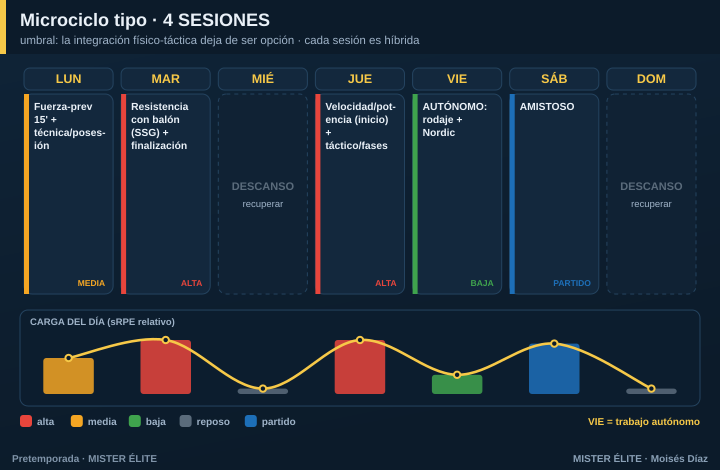

# Plan · 4 SESIONES

**Para quién:** amateur con **4 sesiones** por semana. **Pretemporada: 6 semanas.**

> **Principio rector:** este es el **umbral**. Por debajo de aquí, la integración deja de ser opción y pasa a ser **obligatoria**. Ya no caben sesiones "puras" de un solo objetivo: **cada sesión es híbrida** (un dominante + una capacidad secundaria de mantenimiento). Y aparece el **trabajo autónomo** como pieza del plan, no como extra.

---

## Microciclo tipo

- **Lunes** — fuerza-prevención 15' + técnica/posesión (carga media).
- **Martes** — **pico**: resistencia con balón (SSG) + finalización (carga alta).
- **Jueves** — velocidad/potencia al inicio (fresco) + táctico/fases de juego (carga alta).
- **Viernes** — **autónomo**: rodaje aeróbico + Nordic en casa (carga baja).
- **Sábado** — amistoso.

> Las **sesiones grupales reales son 4** (lunes, martes, jueves + el amistoso del sábado). El viernes es **trabajo autónomo**, no entrenamiento de grupo. Hay **48 h naturales** entre los estímulos exigentes (martes y jueves), gracias al miércoles libre.

---

## Cómo se reparte la carga

- Un **pico claro** (martes) y una sesión media-alta (jueves). Lunes de construcción, sábado competitivo.
- La condición física se **"esconde" en los juegos reducidos** con parámetros controlados (formato, espacio, densidad). Te ahorras el tiempo de "correr sin balón".

## Fuerza, velocidad y prevención

- **Fuerza** en **microdosis de 15-20'** dos veces/semana (lunes y dentro del jueves).
- **Velocidad** SIEMPRE como primer bloque del día más fresco (jueves).
- **Prevención** en los calentamientos + el bloque autónomo del viernes.

## Amistosos

1/semana, desde la semana 2-3.

## Trabajo autónomo (clave en este nivel)

Prescribe **2 sesiones autónomas/semana** en los días libres:
- **1 rodaje aeróbico** de 25-35' (mantiene la base que el grupo ya no alcanza).
- **1 bloque de core + excéntricos de isquios (Nordic)** en casa.

Sin este trabajo, con 4 sesiones grupales no llegas a la base aeróbica necesaria. Es parte del plan, no opcional.

---

## Progresión por fases (6 semanas tipo)

| Semana | Fase | Énfasis físico (grupal) | Autónomo | Táctico | Amistoso |
|---|---|---|---|---|---|
| 1 | Acumulación | Base con balón + fuerza general | 2 rodajes 25' | Principios | Test / suave |
| 2 | Acumulación | Base + primer HIIT | 2 rodajes + Nordic | Subprincipios | 1 |
| 3 | Transformación | HIIT + inicio RSA | Rodaje + Nordic | Fases de juego, ABP | 2 |
| 4 | Transformación | RSA + velocidad | Nordic + movilidad | Automatismos | 3 |
| 5 | Realización | Velocidad/potencia | Reducir | Once tipo | Fuerte |
| 6 | Realización | **Tapering** | Mínimo | Plan de debut | Debut |
