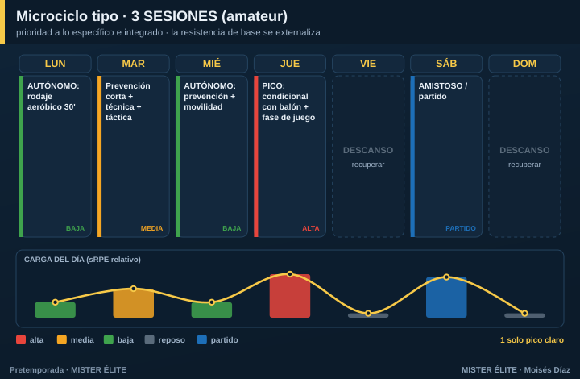

# Plan · 3 SESIONES (amateur típico)

**Para quién:** el amateur más común, **3 sesiones** por semana. **Pretemporada: 6-8 semanas.**

> **Principio rector:** el tiempo es el recurso escaso, así que manda la **prioridad absoluta a lo específico e integrado**. Se prioriza **táctica colectiva + condición con balón**. No se sacrifica la **prevención** (poca, pero innegociable) ni el **pico semanal** de alta intensidad. Se externaliza la **base aeróbica y el gimnasio** → al trabajo autónomo.

---

## Microciclo tipo

- **Lunes** — **autónomo**: rodaje aeróbico de 30' (mantiene la base).
- **Martes** — prevención corta + técnica + táctica (carga media, post-finde).
- **Miércoles** — **autónomo**: prevención + movilidad en casa.
- **Jueves** — **EL PICO**: condicional con balón (HIIT/SSG intensos) + fase de juego (carga alta).
- **Sábado** — amistoso / partido.

**Un solo pico claro** a mitad de semana. Con 3 sesiones es imposible (y contraproducente) meter dos picos: no daría el descanso entre ellos.

> Las **sesiones grupales reales son 3** (martes, jueves + el amistoso del sábado). Lunes y miércoles son **trabajo autónomo** del jugador (deberes), no entrenamiento de grupo.

---

## Cómo se reparte la carga

- Lo físico y lo táctico se **fusionan** vía juegos reducidos: un SSG bien diseñado entrena las dos cosas a la vez.
- La **resistencia de base** se mantiene con **carrera continua autónoma** fuera del campo, porque el campo ya no da para eso.
- **Espacia** las 3 sesiones lo más posible (evita 3 días seguidos + 4 de nada): así no acumulas fatiga ni pierdes el estímulo.

## Fuerza, velocidad y prevención

- **Fuerza** = microdosis de 10-15' integradas + **deberes de gimnasio**.
- **Velocidad** = bloque corto al inicio de la sesión más fresca, 1/semana.
- **Prevención** = 10-15' al inicio del martes, innegociable.

## Amistosos

1/semana (fin de semana), desde la semana 2. **Sustituyen** una sesión de carga alta, **no se suman** encima.

## Trabajo autónomo (imprescindible)

Es lo que mantiene la base que el grupo ya no puede dar:
- **1-2 rodajes aeróbicos/semana** (25-40' continua o fartlek).
- **Prevención de isquios y tobillo** en casa + movilidad.

Sin estos deberes, con 3 sesiones grupales el equipo llega corto de base. Conviértelos en un hábito y contrólalos (un grupo de WhatsApp basta).

---

## Progresión por fases (7 semanas tipo)

| Semana | Fase | Sesión grupal (pico jueves) | Autónomo | Sábado |
|---|---|---|---|---|
| 1 | Acumulación | Técnica + posesión a gran formato | 2 rodajes 30' | Test / suave |
| 2 | Acumulación | Posesión + primer HIIT con balón | 2 rodajes + prevención | Amistoso 1 |
| 3 | Transformación | HIIT/SSG + fase de juego | Rodaje + Nordic | Amistoso 2 |
| 4 | Transformación | SSG intenso + RSA + ABP | Rodaje + Nordic | Amistoso 3 |
| 5 | Transformación | Velocidad + automatismos | Prevención | Amistoso 4 |
| 6 | Realización | Ritmo de competición, once tipo | Reducir | Amistoso fuerte |
| 7 | Realización | **Tapering** | Mínimo | Debut |
