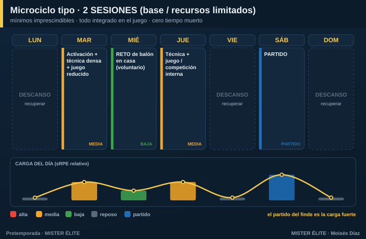

# Plan · 2 SESIONES (fútbol base / recursos muy limitados)

**Para quién:** fútbol base, categorías con pocos recursos o solo **2 sesiones** por semana. **Pretemporada: 4-6 semanas suaves.**

> **Principio rector:** filosofía de **mínimos imprescindibles + máximo aprovechamiento del minuto**. Aquí **no** se persigue rendimiento físico de adulto: se prioriza **técnica, táctica básica y disfrute** (en base, el motor es la motivación). Todo lo físico va **integrado** en el juego o como retos en casa. **Cero tiempo muerto.**

---

## Microciclo tipo

- **Martes** — activación + técnica densa (muchos contactos) + juego reducido (carga media).
- **Jueves** — técnica + juego / competición interna (carga media).
- **Sábado** — partido (la carga fuerte real de la semana).

---

## Qué es lo mínimo imprescindible (en orden)

1. **Activación + técnica con muchos contactos de balón** (colas cortas, mini-estaciones, alto ratio balón/jugador).
2. **Juego reducido** como **vehículo único** de táctica + condición física (se entrena todo a la vez).
3. **Pizca de prevención lúdica** (saltos, equilibrios, frenadas) integrada en el calentamiento.

## Cómo aprovechar cada minuto

- **Estaciones simultáneas**, no esperar turnos. Que nadie esté parado.
- **Calentamiento ya con balón** y con contenido técnico (nada de trotar sin objetivo).
- **Reglas de provocación** en los juegos para que aparezca lo que quieres enseñar.

## Fuerza, velocidad y prevención

Todo **vía juego**: saltar, frenar, arrancar, duelos. **Nada de gimnasio** en base. El trabajo neuromuscular se consigue jugando.

## Amistosos

El partido del fin de semana ya cumple la función de carga y aprendizaje. **1 amistoso/semana es suficiente.**

## Deberes / trabajo autónomo

En base, los deberes son **lúdicos y voluntarios**, orientados a **contactos de balón**, no a correr:
- "**Reto de la semana**": toques, malabares, conducción en casa, juegos con la familia.

---

## Progresión por fases (5 semanas tipo)

| Semana | Foco | Martes | Jueves | Sábado |
|---|---|---|---|---|
| 1 | Reenganche | Técnica + juego libre | Técnica + juego reducido | Partido suave |
| 2 | Base técnica | Conducción/pase + 4v4 | Posesión + finalización | Partido |
| 3 | Táctica básica | Principios + juego de posición | Superioridades + 5v5 | Partido |
| 4 | Aplicación | Fases de juego sencillas | Competición interna | Amistoso |
| 5 | Puesta a punto | Juego + balón parado básico | Activación + partidillo | Debut |

> **Recordatorio para base:** el objetivo no es "ponerse a tono", es **reenganchar la técnica y los hábitos** y que los chavales lleguen con ganas. Si disfrutan, vuelven; si vuelven, mejoran.
