# Banco de 12 sesiones tipo

Estas son las **12 piezas** con las que rellenas los días de tu plan (la **Sesión 0** de tests + **11 sesiones** de trabajo, A→K). Cada una tiene su pizarra, su objetivo y sus parámetros (series, tiempos, densidad). Ajusta el formato al número de jugadores que tengas; los parámetros son orientativos.

> **Cómo usarlas:** mira el contenido que pide el día en tu plan (p. ej. "pico: condicional con balón") y elige la sesión correspondiente del banco. Combina 2-3 piezas para montar una sesión completa (calentamiento + parte principal + ajuste).

---

## Sesión 0 · Tests de campo (sin GPS)

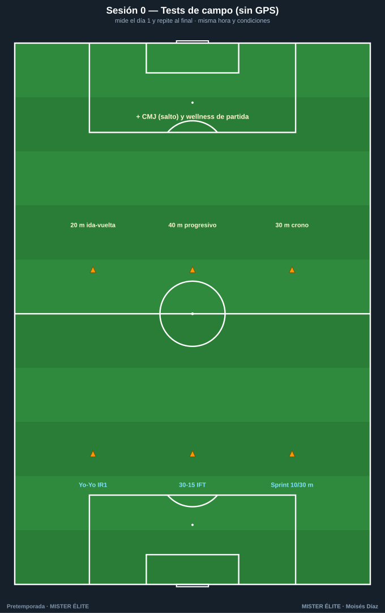

**Objetivo:** medir el punto de partida para saber si la pretemporada funciona. **El día 1 y al final.**
- **Yo-Yo IR1** o **30-15 IFT** — motor aeróbico intermitente (el 30-15 además te da la velocidad para prescribir el HIIT).
- **Sprint 10 y 30 m** con cronómetro — velocidad.
- **CMJ** (salto vertical) — frescura neuromuscular.
- **Wellness de partida** — referencia individual.

> Misma hora, mismo terreno, mismo calentamiento, para que la comparación valga.

---

## BLOQUE FÍSICO

### Sesión A · Base aeróbica: posición a gran formato
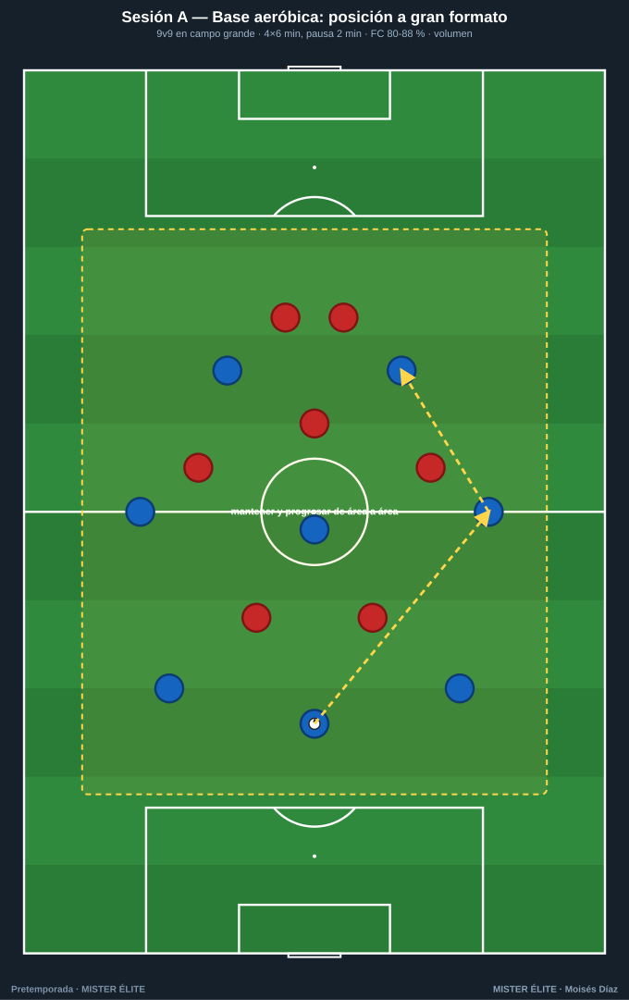

**Objetivo:** base aeróbica (semanas 1-2). **9v9** en campo grande, mantener y progresar de área a área.
**Parámetros:** 4×6 min, pausa 2 min · FC 80-88 % · densidad media. Mucho volumen, intensidad controlada.

### Sesión B · HIIT con balón: 4v4 intermitente
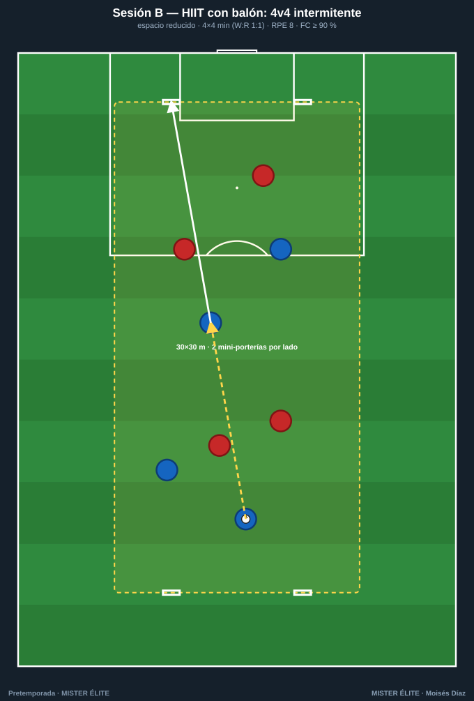

**Objetivo:** potencia aeróbica (semanas 2-4). **4v4** en 30×30 m con 2 mini-porterías por lado.
**Parámetros:** 4×4 min (trabajo:pausa 1:1) · RPE 8 · FC ≥ 90 %. Espacio reducido = mucha intensidad.

### Sesión C · RSA: juego de transiciones
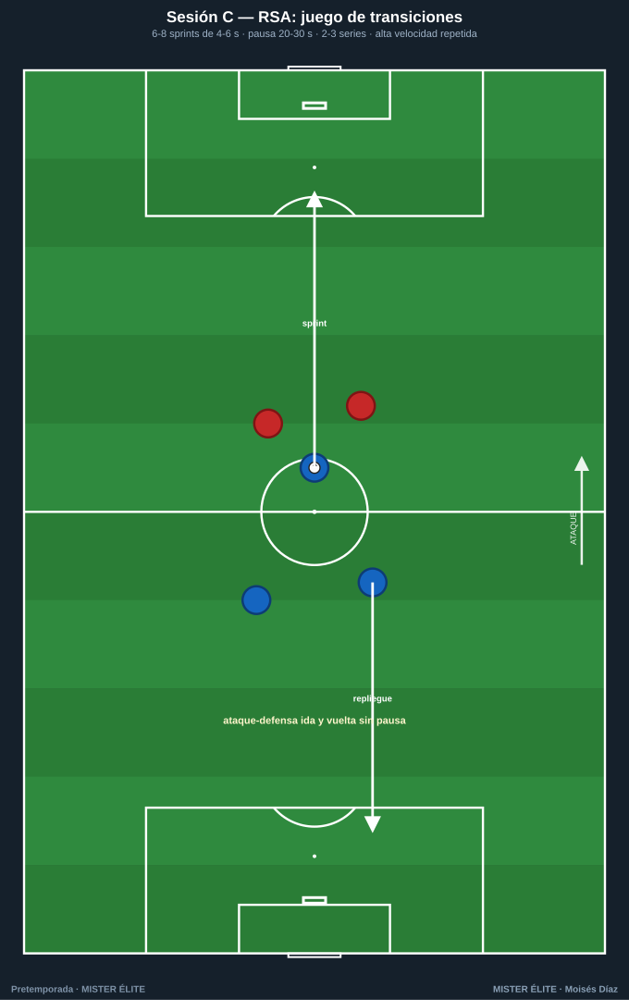

**Objetivo:** capacidad de sprints repetidos (semanas 3-5). Ataque-defensa ida y vuelta sin pausa.
**Parámetros:** 6-8 sprints de 4-6 s, pausa 20-30 s · 2-3 series, descanso 3-4 min entre series.

### Sesión D · Velocidad y aceleraciones (fresco)
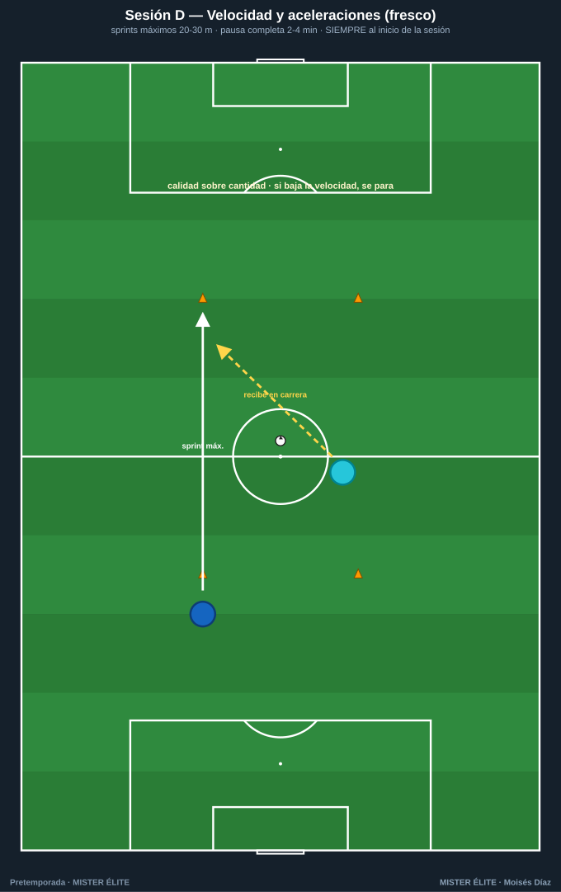

**Objetivo:** velocidad y potencia (semanas 4-6). **Siempre al inicio de la sesión, con el jugador fresco.**
**Parámetros:** sprints máximos 20-30 m, pausa **completa** 2-4 min. Calidad sobre cantidad: si baja la velocidad, se para.

### Sesión E · Fuerza y prevención (circuito)
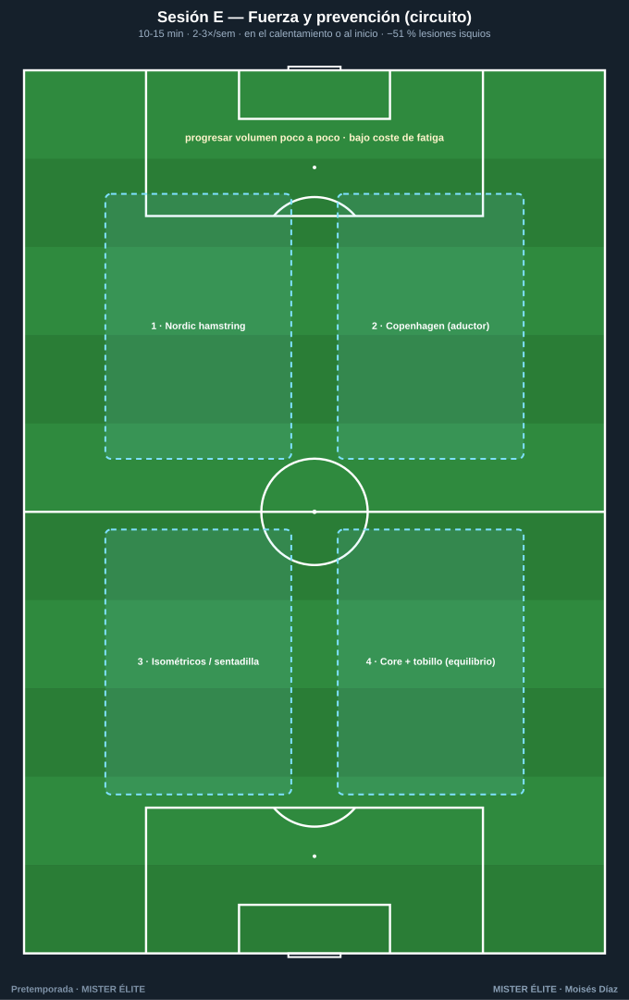

**Objetivo:** prevención de lesiones (todo el bloque, casi a diario). 4 estaciones.
**Parámetros:** 10-15 min · 2-3 veces/semana · en el calentamiento o al inicio. Progresar el volumen poco a poco. Reduce ~51 % las lesiones de isquios.

---

## BLOQUE FÍSICO-TÁCTICO (el físico dentro del balón)

### Sesión F · Rondo de alta densidad
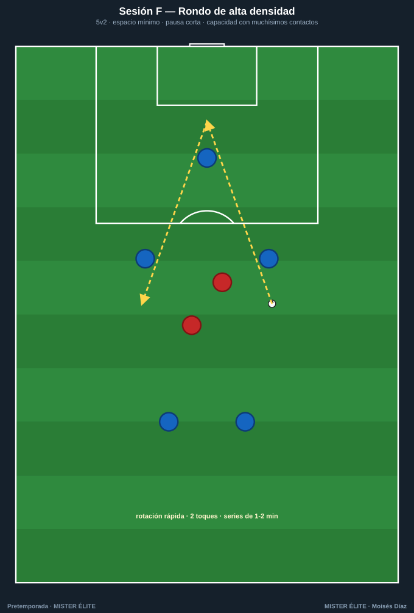

**Objetivo:** capacidad con muchísimos contactos. **5v2** en espacio mínimo.
**Parámetros:** rotación rápida, 2 toques, pausa corta · series de 1-2 min. Calentamiento o trabajo de capacidad.

### Sesión G · Juego de posición condicional
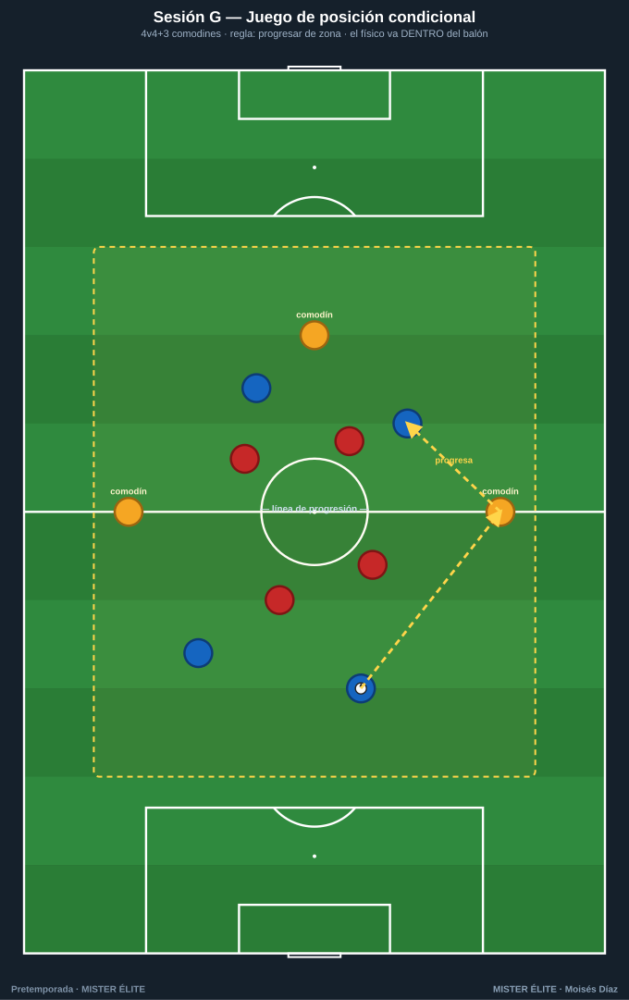

**Objetivo:** físico **dentro** del balón + táctica de posición. **4v4+3** comodines.
**Parámetros:** regla "progresar de zona para puntuar" · series de 3-4 min. Ajusta espacio para subir/bajar la intensidad.

---

## BLOQUE TÁCTICO

### Sesión H · Fase de juego: salida de balón
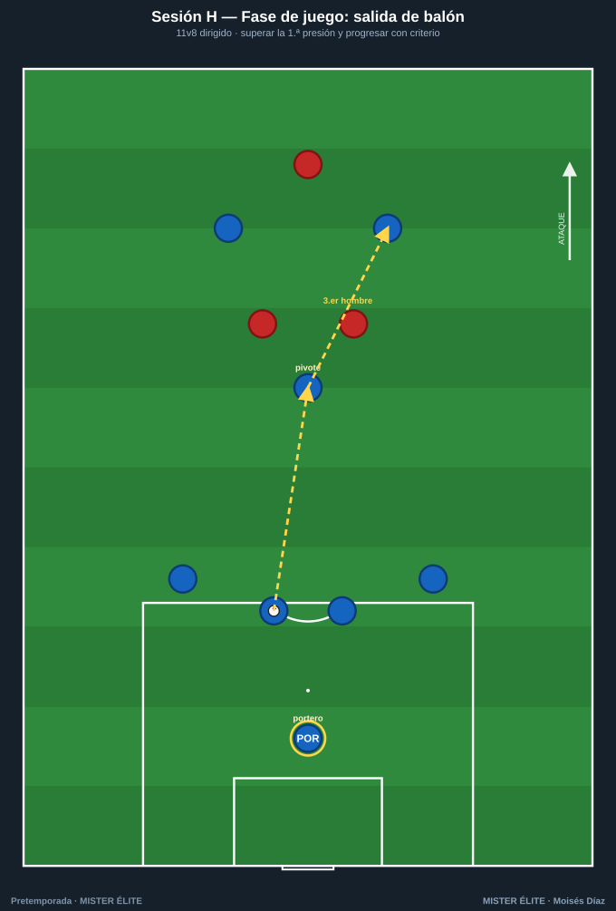

**Objetivo:** superar la 1.ª presión y progresar. **11v8** dirigido.
**Clave:** atraer, encontrar al hombre libre, jugar al tercer hombre. Introduce en transformación (semana 3).

### Sesión I · Presión tras pérdida (contrapresión)
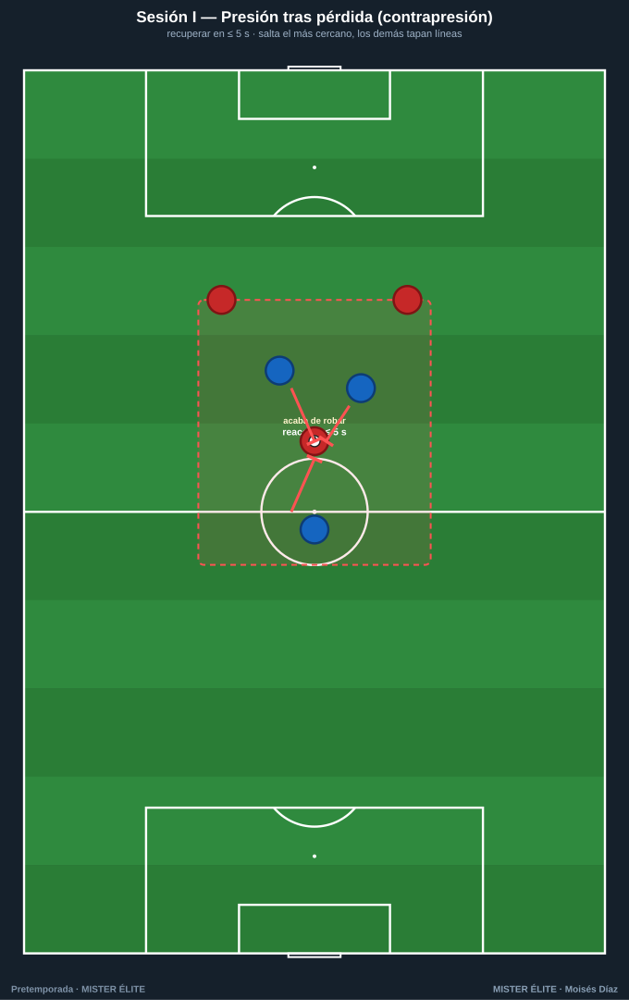

**Objetivo:** recuperar en **≤ 5 s** tras perder. Salta el más cercano, los demás tapan líneas.
**Clave:** reacción inmediata; la zona de reacción marca dónde apretar. Buen estímulo físico-cognitivo.

### Sesión J · Posesión para finalizar
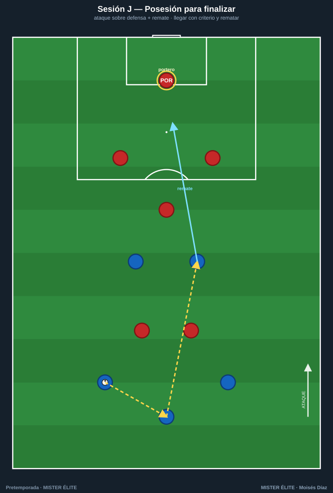

**Objetivo:** llegar con criterio al área y rematar. Ataque sobre defensa + portero.
**Clave:** posesión con finalidad, no estéril. Premia el remate tras romper líneas.

### Sesión K · Partido dirigido a gran formato
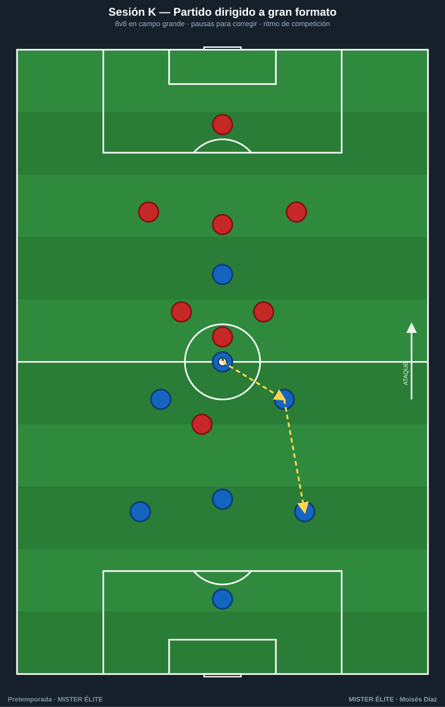

**Objetivo:** integrar todo a ritmo de competición. **8v8** en campo grande.
**Clave:** pausas para corregir (congelar y reposicionar). Gran herramienta de transformación y realización.

---

> **Montar una sesión completa (ejemplo, día de pico con 5 sesiones):** calentamiento con **Sesión E** (prevención, 12') → parte principal con **Sesión B** (HIIT 4v4) → cierre con **Sesión H** (fase de salida) o **Sesión K** (partido dirigido). Total ~75-85 min, orientación dominante clara (intensidad), prevención cubierta.
