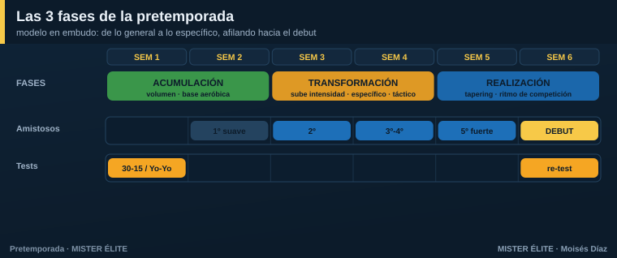

# Módulo 01 · Fundamentos de la pretemporada

## Qué es —y qué NO es— la pretemporada

La pretemporada **no es "machacar"**. Es el periodo en el que construyes tres cosas a la vez, sin que un mal resultado te cueste puntos: una **base física** que protegerá al equipo todo el año, una **identidad de juego** y la **cohesión** del grupo.

El error histórico es medir la pretemporada por el sufrimiento ("hemos reventado a los chicos"). La evidencia dice lo contrario: lo que protege durante la temporada no es haber sufrido, sino haber **acumulado carga de forma progresiva**. Tim Gabbett lo llamó la *paradoja entrenamiento-lesión*: los equipos que llegan a la competición con **poca carga acumulada** se lesionan **más**, no menos. El objetivo no es cansar; es **construir un depósito** de forma. 

> **Tres objetivos, no uno:**
> - **Físico** — base aeróbica, tolerancia a la carga, exposición progresiva a la alta velocidad. Llegar con "motor".
> - **Táctico** — instalar el modelo de juego: principios → subprincipios → automatismos.
> - **Humano** — integrar fichajes, fijar roles, crear lenguaje común y hábitos de concentración.

### Los 5 mitos que este curso desmonta

| Mito | Realidad |
|---|---|
| "Cuanto más volumen y más sufrimiento, mejor" | Los picos bruscos de carga (ACWR > 1,5) **disparan** las lesiones. |
| "Lo físico primero, lo táctico cuando estemos en forma" | Se entrenan **a la vez**: el físico se mete dentro del balón. |
| "La pretemporada va bien si ganamos los amistosos" | El resultado del amistoso es un **mal indicador**. Son un medio, no un fin. |
| "Hay que empezar a tope desde el primer día" | El primer día se **mide y se construye base**, no se revienta. |
| "Sin GPS no se puede controlar la carga" | Con **RPE, papel y wellness** controlas el 90 % de lo que importa. |

---

## Las tres fases: el modelo en embudo

Toda pretemporada bien planificada va de lo **general** a lo **específico**, y termina **afilando** hacia el debut. Son tres fases encadenadas:

1. **Acumulación** (≈ primeras 2 semanas) — **volumen alto**, base aeróbica genérica, fuerza general. Construyes el depósito. Intensidad controlada.
2. **Transformación** (≈ semanas 3-4) — **sube la intensidad**, aparece el trabajo específico y los amistosos. La carga se parece cada vez más a la competición.
3. **Realización / puesta a punto** (≈ últimas 1-2 semanas) — **tapering**: bajas el volumen manteniendo la intensidad. El microciclo ya es idéntico al de competición. Llegas fresco al debut.

**Duración total orientativa:** profesional/semipro **4-6 semanas**; amateur y base **6-8 semanas** (al tener menos sesiones por semana, necesitan más semanas para acumular el mismo volumen). Más de 6-8 microciclos suele ser excesivo.

---

## Microciclo, mesociclo y el lenguaje MD

- **Microciclo** = la **semana** de entrenamiento (la unidad con la que vas a trabajar todo el curso).
- **Mesociclo** = un bloque de varias semanas con un objetivo (p. ej., el bloque de "acumulación").
- **MD (Match Day)** = se planifica **respecto al partido**. `MD-4`, `MD-3`… `MD-1`, `MD`, `MD+1`. Cada día tiene un perfil de carga distinto según lo lejos o cerca que esté del partido. Es el idioma que usan los cuerpos técnicos profesionales (Buchheit) y el que usaremos en los planes.

---

## Tres modelos de periodización (y cuál usar)

No hay un único modo correcto de planificar. Conviene conocer los tres grandes marcos:

**A) Periodización tradicional (modelo de cargas).** Bloques separados: primero volumen, después intensidad. *Ventaja:* simple y ordenada. *Crítica (Seirul·lo):* nace del atletismo y **separa lo físico de lo táctico**, algo poco coherente con un deporte de balón e incertidumbre.

**B) Periodización táctica (Vítor Frade).** El eje es el **modelo de juego**; lo físico se subordina a la táctica. La semana ("morfociclo") repite siempre la **misma forma**; cambian los contenidos. *Ventaja:* todo se entrena jugando. *Coste:* exige método y es difícil de cuantificar.

**C) Microciclo estructurado (Seirul·lo).** Enfoque integral: el jugador como estructura compleja (físico, técnico, táctico, psicológico, socioafectivo). Distribuye la carga según los días respecto al partido. *Ventaja:* individualiza. *Coste:* requiere staff amplio.

> **Recomendación del curso:** no te cases con una etiqueta. Quédate con lo mejor de cada una: **el balón como medio principal** (B y C), **la carga repartida con cabeza según el día** (A y C) y **una forma de semana estable** que el equipo reconozca (B). Es exactamente lo que hacen los planes de este curso.

---

## ¿Va bien mi pretemporada? Indicadores

No mires el marcador del amistoso. Mira esto:

- **Tests físicos** repetidos al inicio y al final: **30-15 IFT** o **Yo-Yo IR1** (motor aeróbico intermitente), **CMJ** (salto, frescura neuromuscular), sprint 10-30 m. Si mejoran, vas bien.
- **Carga acumulada progresiva** sin picos peligrosos (lo verás en el Módulo 2 con el ACWR).
- **Comportamientos del modelo**: ¿el equipo **reconoce los patrones** sin que tengas que gritarlos? Eso son automatismos instalados.
- **Wellness y sensaciones**: sueño, fatiga, dolor muscular y ánimo estables o en mejora.

---

### En una frase

> La pretemporada perfecta **construye un depósito de forma sin picos**, **instala el modelo de juego** y llega **fresca y afilada** al debut. Ni se sufre por sufrir, ni se mide por los amistosos.

*Siguiente módulo: qué es exactamente la carga física y cómo controlarla sin tecnología.*
