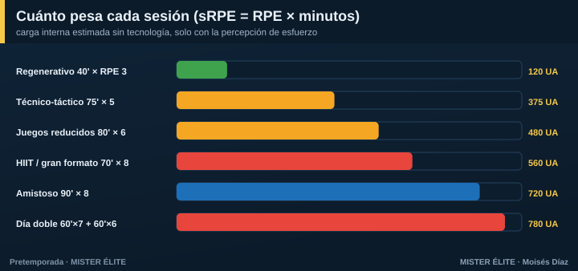
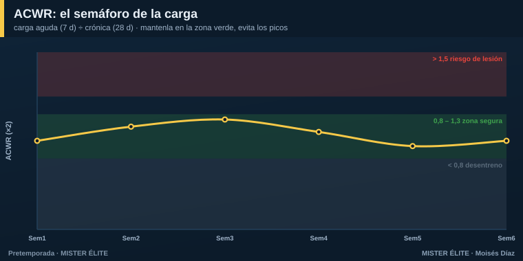
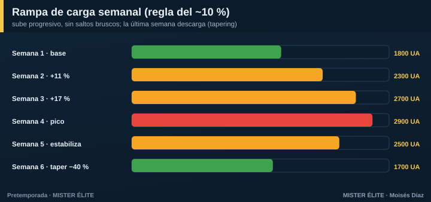
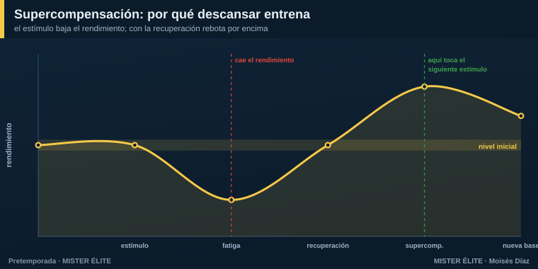

# Módulo 02 · La carga física (y cómo controlarla sin tecnología)

## Qué es "carga"

**Carga externa** = el trabajo que prescribes tú, al margen del jugador: minutos, metros, número de sprints, series, saltos. Se **cuenta**.

**Carga interna** = la respuesta biológica del jugador a ese trabajo: frecuencia cardiaca, esfuerzo percibido, fatiga. Se **siente**. La misma carga externa produce distinta carga interna según la forma, la fatiga, el calor o la edad. **Es la que de verdad importa** para la adaptación y el riesgo.

> En pretemporada los jugadores llegan **desentrenados**: una carga externa moderada genera una carga interna **alta**. Por eso hay que empezar suave aunque "parezca poco".

### Los cuatro mandos que manejas

| Componente | Qué es | Cómo se SUBE | Cómo se BAJA |
|---|---|---|---|
| **Volumen** | cantidad total (min, distancia, repeticiones) | más minutos/series | menos minutos/series |
| **Intensidad** | esfuerzo por unidad de tiempo | espacios grandes, menos jugadores, menos pausa | espacios pequeños, más jugadores, más pausa |
| **Densidad** | relación trabajo : pausa | bajar la pausa (1:1 → 2:1) | subir la pausa (1:3) |
| **Complejidad** | carga mental/coordinativa | más oposición, más reglas, más decisiones | tareas analíticas, sin oponente |

**Con balón**, la intensidad y la densidad se manejan sobre todo cambiando **espacio, número de jugadores y reglas** (Hill-Haas). Esto es clave: te permite "dosificar el físico" sin sacar el balón.

---

## Medir la carga SIN tecnología: el método sRPE

No necesitas GPS. Necesitas una pregunta y una libreta. El método **sRPE** (Foster) es válido, barato y se usa hasta en la élite.

> **Carga de la sesión (UA) = RPE × minutos.**
> Pregunta al jugador, **30 minutos después** de acabar (no en caliente): *"¿Cómo de dura ha sido la sesión, del 0 al 10?"*

**Escala CR-10 (anclajes):** 0 reposo · 2-3 fácil · 4-5 algo duro · 6-7 duro · 8-9 muy duro · 10 máximo.

**Ejemplo:** una sesión de 75 min que el equipo valora en RPE 6 → **450 UA**. Un amistoso de 90 min a RPE 8 → **720 UA**. Sumando los días tienes la **carga semanal**.

### Dos cifras que valen oro (Foster)

- **Monotonía** = carga media diaria ÷ **desviación estándar** de las cargas diarias de la semana. Una semana **plana** (todos los días igual) da monotonía **> 2 = riesgo**. Antídoto: **alterna días duros y suaves**.
- **Strain (tensión)** = carga semanal × monotonía. Semanas muy cargadas Y muy planas → enfermedad y lesión.

### Wellness: el termómetro de la mañana

Cada mañana, 5 preguntas (1 a 5): **sueño, fatiga, dolor muscular, estrés, ánimo**. Suma de 5 a 25. Si un jugador **cae > 15-20 %** respecto a su media, **bandera roja**: ajusta su carga. Cuesta un papel o un mensaje de WhatsApp y detecta la fatiga antes que cualquier dato objetivo.

*(En el material de Herramientas tienes las plantillas listas de sRPE y wellness.)*

---

## El ACWR: el semáforo de la carga

El **ACWR** (Gabbett) compara lo que has hecho esta semana con lo que tu cuerpo está acostumbrado a hacer:

> **ACWR = carga aguda (suma de sRPE de los últimos 7 días) ÷ carga crónica (media semanal de las últimas 4 semanas).**

- **Zona verde 0,8 – 1,3** → menor riesgo. Ahí quieres estar.
- **> 1,5** → **rojo**: salto de carga peligroso, el riesgo de lesión se multiplica.
- **< 0,8** → desentrenamiento (pierdes forma).

**Honestidad científica:** el ACWR tiene críticas serias (Impellizzeri, Lolli, Windt). No es una bola de cristal y **no debe usarse como verdad absoluta**. Úsalo como lo que es: un **semáforo** que te avisa de saltos bruscos. Combínalo siempre con el wellness y el sentido común.

### El "ramp-up": sube despacio

La regla práctica: **no subas la carga semanal más de ~10 %** respecto a la semana anterior. Subidas de **> 15 %** se asocian a más lesiones. Es una orientación, no un dogma; lo importante es el **principio**: progresión gradual, sin picos.

> **Por qué la pretemporada es la ventana de más riesgo:** los jugadores llegan con la carga crónica baja, así que cualquier carga "normal" dispara el ACWR. Construye base **2-3 semanas antes** de meter alta velocidad y competición.

---

## Supercompensación: por qué descansar también entrena

El estímulo de entrenamiento **baja** el rendimiento (fatiga). Con la recuperación, el cuerpo no solo vuelve a su nivel: **rebota por encima**. Eso es la supercompensación.

- Si el **siguiente estímulo** cae en el pico de supercompensación → **progresas**.
- Si caes siempre demasiado pronto, sin recuperar → **sobrecarga y sobreentrenamiento**.
- Si caes demasiado tarde → pierdes la adaptación.

De ahí la regla de oro: **48 horas entre estímulos máximos de la misma capacidad** (fuerza máxima, sprint, HIIT duro).

**Las palancas de recuperación más baratas y potentes:**
- **Sueño** — la nº 1. Objetivo **≥ 8-9 h** en pretemporada. Dormir poco = más lesión y peor recuperación.
- **Nutrición** — reponer hidratos tras la sesión; **1,6-2,0 g/kg/día de proteína** para reparar.
- **Hidratación** — perder > 2 % del peso ya baja el rendimiento. Pésate antes y después.

---

## Prevención de lesiones: la pretemporada se juega aquí

Más del **50 % de las roturas de isquios** ocurren en las ~7 semanas de pretemporada (Ekstrand). La relación carga-lesión tiene **forma de U**: tanto **poca** carga (tejido frágil) como **demasiada** (picos) lesionan. El mínimo de la U —el sitio seguro— es **carga crónica alta y bien construida**.

**Las tres claves de la evidencia:**
1. **Exponer al sprint de forma progresiva.** El sprint rompe isquios, pero **no exponerse** a la alta velocidad también: el tejido llega sin preparar. Empieza con carreras al 70-85 % en la semana 1-2 y sube hasta el 100 % de forma gradual.
2. **Nordic hamstring.** Los programas que lo incluyen reducen ~**51 %** las lesiones de isquios (van Dyk/Al Attar). Hay matices metodológicos, pero sigue siendo la herramienta más recomendada. Progresar hasta 3×3-10 reps, 1-3 veces/semana.
3. **Multicomponente** (tipo FIFA 11+): reduce ~30 % las lesiones globales. Incluye isométricos, core, tobillo y equilibrio.

---

### En una frase

> Controla la carga con **RPE y wellness**, súbela **despacio (~10 %/semana)**, vigila el **semáforo ACWR**, respeta las **48 h** entre picos y mete **prevención casi a diario**. Eso es el 90 % de la prevención de lesiones.

*Siguiente módulo: cómo meter todo esto, día a día, dentro del microciclo.*
