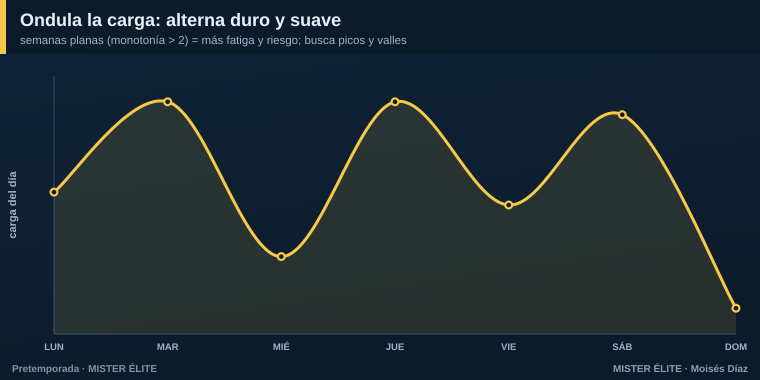
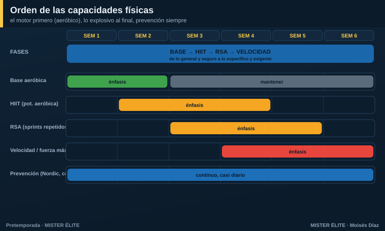
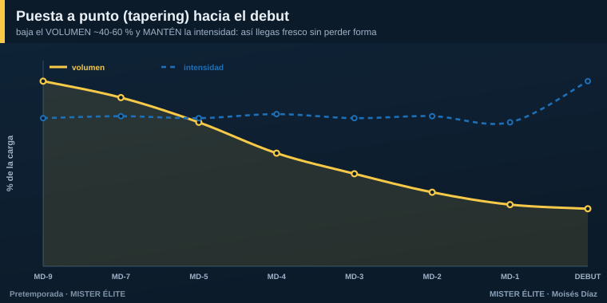

# Módulo 03 · Cómo meter las cargas (el módulo central)

Ya sabes **qué** es la carga y **cómo** medirla. Ahora lo importante: **cómo se mete**, día a día, dentro de la semana. Este módulo es el corazón del curso.

---

## Regla nº 1: una orientación dominante por sesión

El error más común del entrenador amateur es **meter todo en cada sesión**: fuerza, resistencia, velocidad y táctica, todo al máximo, todos los días. Resultado: el equipo se satura, acumula fatiga y **no supercompensa ninguna** capacidad.

> **La regla:** cada sesión tiene **una orientación dominante**. Lo demás, en dosis de mantenimiento. Y entre dos estímulos máximos de la misma capacidad, **48 horas**.

---

## Ondula la carga: alterna duro y suave

Una semana donde todos los días pesan lo mismo (monotonía alta) fatiga sin construir. La carga tiene que **ondular**: picos y valles.

El patrón sano de una semana es una **onda**: día medio → día alto → día bajo → día alto → día medio → partido → descanso. Nunca dos días altos **de la misma capacidad** seguidos. El descanso no es "tiempo perdido": es cuando ocurre la supercompensación.

---

## Mete el físico DENTRO del balón

La pieza que lo cambia todo, sobre todo si tienes pocas sesiones: **el acondicionamiento con balón**. Los **juegos reducidos** (SSG) desarrollan a la vez fisiología + técnica + táctica en el mismo tiempo. Manipulando tres mandos decides qué efecto físico produces:

| Si quieres… | Haz esto en el juego reducido |
|---|---|
| Más **aeróbico / volumen** (base) | **+ espacio** y **+ jugadores** (8v8, 9v9 en campo grande): mucha distancia, FC sostenida |
| Más **intensidad / HIIT** | **− jugadores** (3v3, 4v4) en espacio reducido: FC ≥ 90 %, muchas aceleraciones |
| Más **sprints repetidos (RSA)** | espacios **abiertos** con **transiciones**: obligan a correr a tope una y otra vez |
| Más **táctico, menos físico** | tarea analítica, sin oposición o con pausa amplia |

> Esto es **oro para la baja frecuencia**: en lugar de "correr sin balón" media hora, metes el mismo estímulo aeróbico en un 9v9, y de paso entrenas el modelo de juego. Dos pájaros de un tiro.

---

## El orden de las capacidades

No todo se entrena a la vez ni en cualquier orden. La secuencia segura va del **motor** a lo **explosivo**:

1. **Base aeróbica** (semanas 1-2) — volumen, FC 75-85 %. Juegos de posición a gran formato, posesiones largas. Construye el motor.
2. **HIIT / potencia aeróbica** (semanas 2-4) — FC ≥ 90 %, RPE 8. Juegos reducidos 3v3-4v4, intervalos. 2-3 veces/semana.
3. **RSA — sprints repetidos** (semanas 3-5) — 6-10 sprints de 4-6 s, pausa 20-30 s. Juegos abiertos con transiciones.
4. **Velocidad / potencia / fuerza máxima** (semanas 4-6) — sprints máximos 20-40 m con **pausa completa**, con el jugador **fresco**. Calidad, no cantidad.

**La prevención (Nordic, core, isométricos) va en paralelo, casi a diario**, en dosis cortas de 10-15 min.

---

## Concurrente: el orden dentro de la sesión

Cuando en una misma sesión conviven fuerza/velocidad y resistencia, el orden importa (efecto interferencia):

> **La calidad primero, con el jugador fresco.** Velocidad, potencia y fuerza explosiva → al **inicio**. Resistencia y volumen táctico → **después**. **Nunca** sprints máximos tras 60 minutos de juego.

Si puedes separar (mañana y tarde, o con 6 h de margen), mejor: fuerza por la mañana, balón por la tarde. Eso es justo lo que permite el plan de **dobles sesiones**.

---

## El microciclo tipo: cómo se ve una semana

Juntando todo lo anterior, una semana de pretemporada de frecuencia media (5-6 sesiones) tiene esta lógica:

- **Lunes** — reactivación + fuerza/prevención (carga baja). Se recupera del finde y se "enciende el motor".
- **Martes** — **pico 1**: resistencia/HIIT con balón (carga alta).
- **Miércoles** — descarga o descanso (separa los picos, da las 48 h).
- **Jueves** — **pico 2**: fuerza-potencia + táctico intenso (carga alta).
- **Viernes** — táctico fino + activación (carga baja). Empieza la descarga hacia el partido.
- **Sábado** — amistoso (carga de partido).
- **Domingo** — descanso.

Dos picos, separados, flanqueados por descargas. Esa **forma** se repite semana a semana (lo que cambia son los contenidos y el énfasis de cada fase). En la sección de **Planes** verás esta lógica adaptada a cada frecuencia.

---

## El tapering: llegar fresco al debut

La última semana **no** es para seguir cargando. Es para **disipar la fatiga manteniendo la forma**:

> **Baja el VOLUMEN un 40 a 60 %. MANTÉN la intensidad.**

- Reduce minutos y series, **no** la intensidad: conserva tareas cortas de alta velocidad y algún sprint máximo. Lo que mantiene las adaptaciones es la **intensidad**, no el volumen.
- **Mantén la frecuencia** de sesiones (no pares del todo), solo acórtalas.
- Duración: **7-14 días** en una pretemporada normal; un **mini-taper de 4-7 días** si es corta.
- El día previo (MD-1): sesión corta, activación, algo de velocidad, baja carga, foco táctico.

Si bajas también la intensidad, llegas descansado pero **desentrenado** (ACWR < 0,8). El taper bien hecho es la diferencia entre llegar "bien" y llegar **enchufado**.

---

## Y cuando tengo pocas sesiones, ¿qué cambia?

Este es el corazón del curso, así que adelantamos el principio (los planes lo desarrollan):

> **A menos sesiones, NO se entrena "lo mismo pero más apretado".** Se **reordenan prioridades**, se **integra** el físico dentro del balón y se **externaliza** lo que el grupo ya no alcanza (carrera de base, gimnasio) hacia el **trabajo autónomo** del jugador.

Lo que **cambia** al bajar de frecuencia: la **densidad** (cuánto contenido por sesión) y el grado de **integración**. Lo que **nunca** cambia: la progresión gradual, las 48 h entre picos y la necesidad de descargar antes del partido.

---

### En una frase

> Una orientación por sesión, **ondula** la carga, mete el **físico dentro del balón**, respeta el **orden de capacidades** y el **tapering** final. Cuando falten sesiones, **prioriza e integra**, no apretujes.

*Siguiente módulo: qué táctica entrenar y en qué orden para construir tu identidad de juego.*
