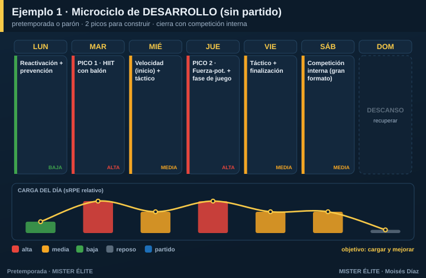
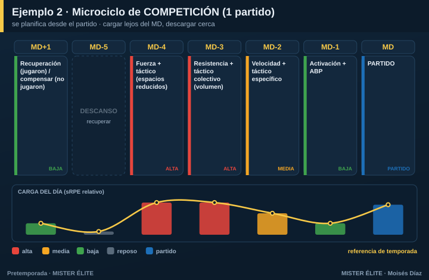
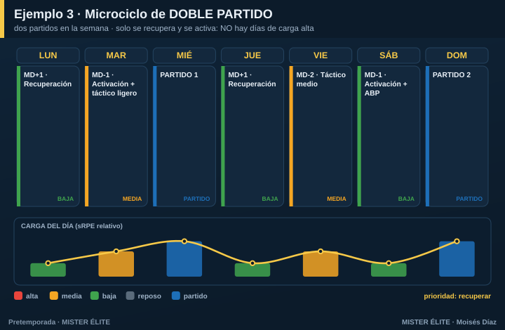
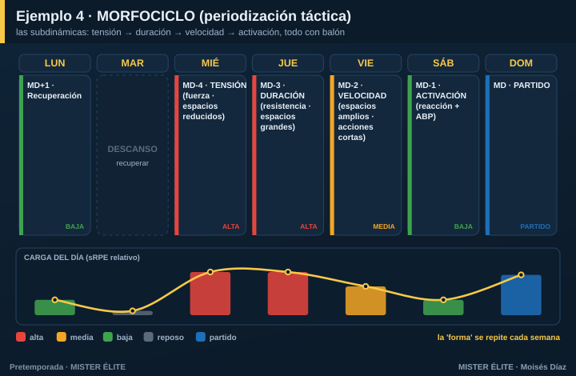

# Módulo 05 · Diseña tu propio microciclo

Los planes de este curso son plantillas. Pero el buen entrenador no copia: **entiende la lógica y construye el suyo** para su contexto, su calendario y su semana. Este módulo te enseña a **crear un microciclo desde cero**, sus principios y varios ejemplos distintos.

> **El microciclo es la unidad de trabajo.** Es la semana. Si sabes diseñar un microciclo, sabes planificar: una pretemporada son 6-8 microciclos encadenados, y una temporada, una sucesión de ellos.

---

## Los 7 principios del diseño del microciclo

Son la base, vengas de donde vengas (periodización tradicional, táctica o estructurada). Si los respetas, tu semana funcionará.

**1. Empieza desde el partido.** El microciclo no se planifica de lunes a domingo: se planifica **alrededor del partido**. Marca el día de partido (MD) y el descanso obligatorio; todo lo demás se coloca en relación a ellos.

**2. Cada día tiene un propósito (el perfil MD-x).** No hay días "de entrenar por entrenar". Cada día se nombra por su distancia al partido (MD-4, MD-3… MD-1) y tiene un objetivo de carga y contenido distinto.

**3. Carga lejos del partido, descarga cerca.** La mayor carga e intensidad va en los días **alejados** del partido (cuando el jugador está recuperado y hay margen para recuperar). Según se acerca el MD, la carga **baja** (alternancia horizontal). Nunca llegues fundido al partido.

**4. Alterna duro y suave (ondulación).** Días altos y bajos intercalados. Evita la semana plana: la **monotonía > 2** (carga media ÷ desviación estándar) fatiga sin construir y aumenta el riesgo.

**5. Respeta las 48 h.** Entre dos estímulos **máximos de la misma capacidad** (fuerza máxima, sprint, HIIT duro) deja **48 horas**. Si no, no hay supercompensación.

**6. Sigue la lógica interna: recuperación → adquisición → activación.** Tras el partido o el día duro, **recuperas**. En el centro de la semana, **adquieres** (los estímulos fuertes). Antes del partido, **activas** (afilar, no cansar). Es la estructura que propone Buchheit para el microciclo de élite.

**7. Mantén la “forma”, cambia los contenidos.** La estructura de la semana (qué día es duro, cuál suave) se **repite** semana a semana. Lo que cambia son los **contenidos y el énfasis**. Esa repetición es la que crea los **automatismos** (de ahí el "morfociclo": misma forma, distinto contenido).

---

## Método paso a paso: construye tu microciclo

Sigue estos 6 pasos y tendrás tu semana montada:

**Paso 1 · Fija los puntos fijos.** Marca el/los **partido(s)** y el **día de descanso** obligatorio. Son inamovibles; el resto se organiza entre ellos.

**Paso 2 · Etiqueta los días en MD-x.** Cuenta hacia atrás desde el partido: MD-1 (víspera), MD-2, MD-3, MD-4… y hacia delante MD+1 (día después).

**Paso 3 · Asigna una orientación dominante por día.** Un objetivo claro cada día (resistencia, fuerza-potencia, velocidad, táctico…), nunca "todo a la vez". Coloca los dominantes exigentes **lejos** del partido.

**Paso 4 · Dibuja la curva de carga.** Pon los **picos** (alta) en los días alejados del partido y la **descarga** (baja) en los cercanos. Comprueba que ondula (duro-suave) y que no hay dos picos de la misma capacidad sin 48 h.

**Paso 5 · Encaja fuerza, velocidad y prevención.** La **velocidad y la potencia**, con el jugador fresco y al **inicio** de la sesión. La **prevención** (Nordic, core), casi a diario en dosis cortas. Respeta la concurrencia (la calidad antes que el volumen).

**Paso 6 · Comprueba.** Pásale el checklist: ¿una orientación por día? ¿ondula? ¿48 h entre picos? ¿descarga antes del partido? ¿prevención 2-3 veces? ¿avanza el modelo de juego? Si todo está, listo.

---

## Ejemplos diferentes (la misma lógica, distintos escenarios)

El mismo método produce semanas muy distintas según tu situación. Mira cuatro casos:

### Ejemplo 1 · Semana de desarrollo (sin partido)
Pretemporada o parón, cuando **no hay partido** y el objetivo es **construir**. Te lo puedes permitir: **dos picos** de carga alta, separados, y cierras con una competición interna.

### Ejemplo 2 · Semana de competición con 1 partido (MD-x)
La semana **de temporada** más común. Se planifica desde el partido: carga alta en MD-4 y MD-3, se baja en MD-2 y MD-1. Es la referencia que adaptan los seis planes del curso.

### Ejemplo 3 · Semana con doble partido
Dos partidos (p. ej. miércoles y domingo). Aquí el principio manda: con dos partidos **no hay días de carga alta**, solo **recuperar y activar**. Querer "entrenar fuerte" entre dos partidos es el error clásico.

### Ejemplo 4 · El morfociclo (periodización táctica)
La versión de Vítor Frade: las **subdinámicas** se reparten en tres días de adquisición —**tensión** (fuerza, espacios reducidos), **duración** (resistencia, espacios grandes), **velocidad** (espacios amplios, acciones cortas)— más la activación. Todo **con balón**, y la forma se repite cada semana.

> **Lo que NO cambia entre los cuatro:** se parte del partido, se carga lejos y se descarga cerca, se ondula, se respetan las 48 h y la prevención está siempre. **Lo que cambia:** el número de picos y el peso de cada día, según haya 0, 1 o 2 partidos.

---

## Plantilla en blanco: diseña el tuyo

Cópiala y rellénala con tu semana real:

| Día | MD-x | Carga (alta/media/baja) | Orientación dominante | Fuerza / velocidad / prevención |
|---|---|---|---|---|
| LUN | | | | |
| MAR | | | | |
| MIÉ | | | | |
| JUE | | | | |
| VIE | | | | |
| SÁB | | | | |
| DOM | | | | |

**Antes de darlo por bueno, el checklist:**
- [ ] ¿Partí desde el partido y marqué el descanso?
- [ ] ¿Cada día tiene **una** orientación dominante?
- [ ] ¿Los picos están **lejos** del partido y descargo al acercarme?
- [ ] ¿La carga **ondula** (duro-suave)? ¿Monotonía < 2?
- [ ] ¿Hay **48 h** entre estímulos máximos de la misma capacidad?
- [ ] ¿Velocidad/potencia con el jugador **fresco** y prevención 2-3 veces?

---

### En una frase

> Un microciclo se construye **desde el partido**: etiqueta los días en MD-x, da a cada uno **una orientación**, pon los **picos lejos** y la **descarga cerca**, **ondula**, respeta las **48 h** y repite la **forma** cada semana. Cambia el escenario (0, 1 o 2 partidos), no los principios.

*Con esto ya no dependes de plantillas: sabes diseñar la semana que tu equipo necesita.*
