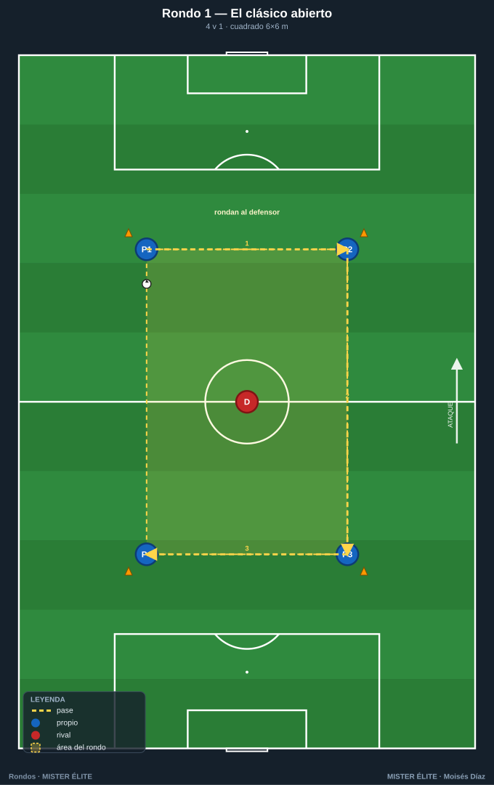
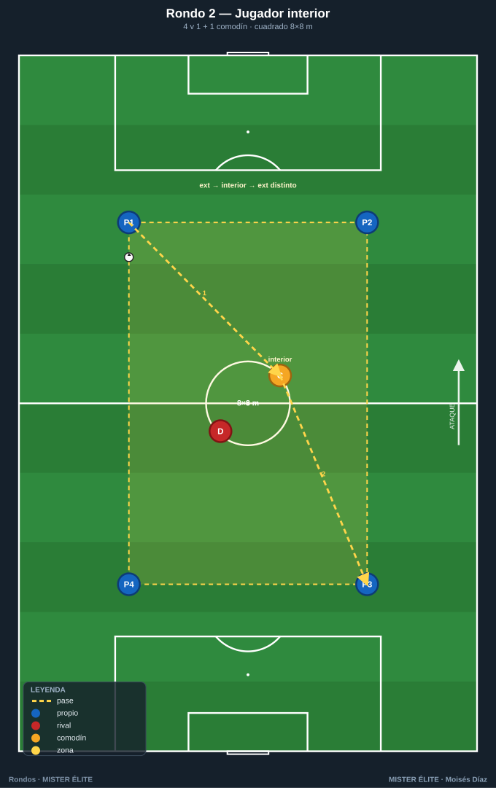
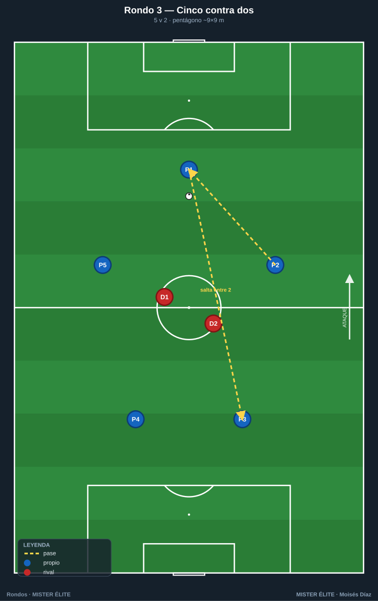
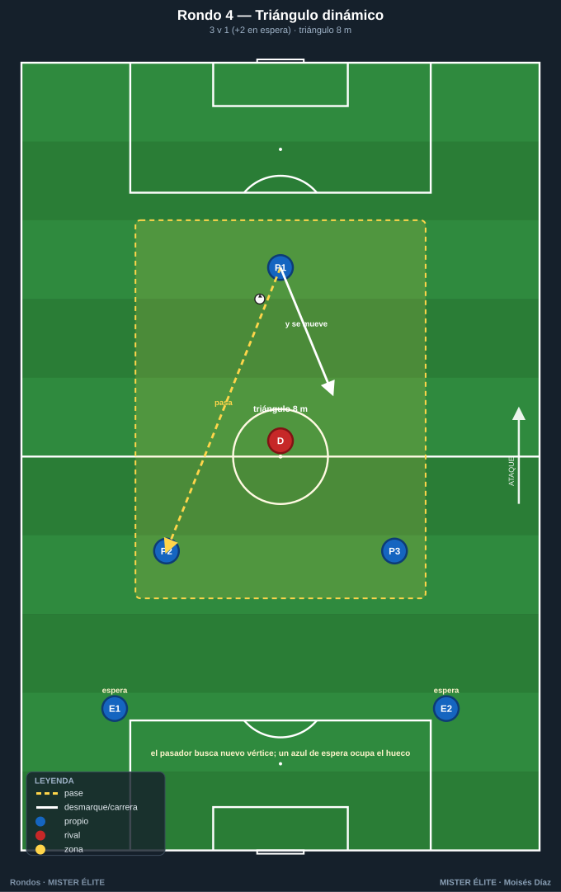
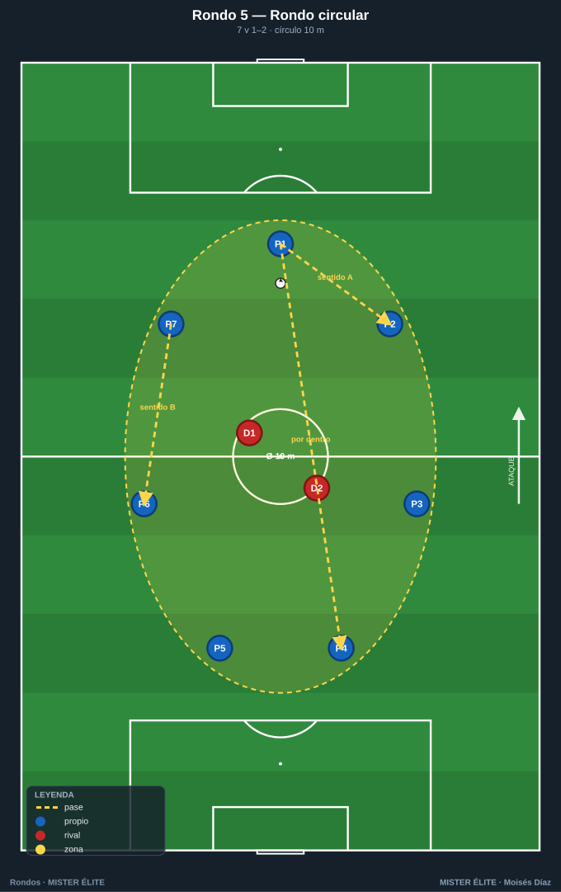
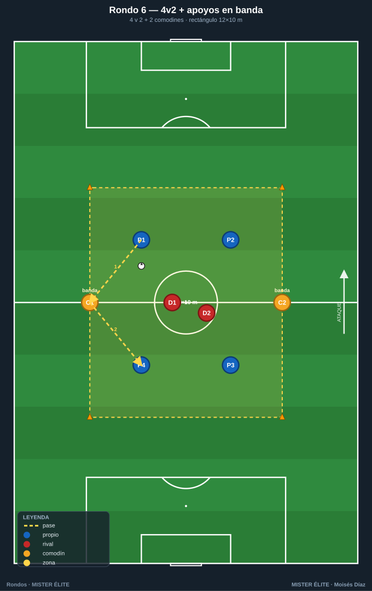
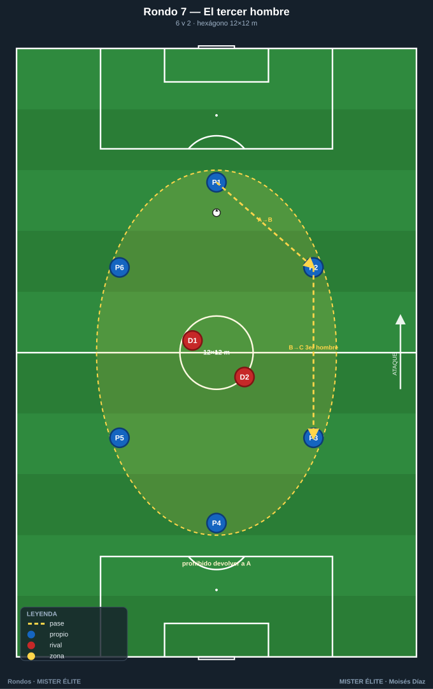

# Familia 1 · Iniciación y mantenimiento (Rondos 1–7)

> **Base técnica:** calidad de pase, orientación del primer apoyo, fijar para pasar, ofrecer línea de pase. Foco en el **POSEEDOR**.
>
> **Notación:** poseedores = **azules**, defensores/recuperadores = **rojos**, comodines = **ámbar**. Espacio delimitado con conos. Flechas: pase (amarillo discontinuo), conducción (azul), desmarque (blanco), presión (la del defensor).

---

## Rondo 1 — "El clásico abierto" (4v1)

**Objetivo**
- *Técnico:* precisión y peso del pase raso, superficie de contacto (interior), control orientado del receptor.
- *Táctico:* concepto de apoyo y triángulo permanente; pasar la línea del defensor.
- *Cognitivo:* escaneo previo a recibir (¿de qué lado viene la presión?).

**Organización**
- Relación: **4 v 1** (4 azules en las esquinas, 1 rojo dentro).
- Espacio: **cuadrado de 6×6 m** — conos en las 4 esquinas, los azules sobre los conos.
- Material: 1 balón, 4 conos, 4 petos azules, 1 peto rojo.

**Desarrollo**
1. Los 4 azules conservan el balón rondando al rojo. Posiciones fijas en las esquinas al inicio.
2. El defensor presiona para robar o forzar la salida del balón del cuadrado.
3. Quien recibe orienta el control al lado libre y busca al compañero que el defensor "deja".

**Provocaciones (medibles)**
- **Toques libres** la 1.ª serie; **máximo 2 toques** la 2.ª.
- El defensor cambia cuando roba, saca el balón del cuadro o el azul da más toques de los permitidos.
- Reto de equipo: **10 pases seguidos = 1 punto**; el defensor reinicia el contador al robar.

**Variantes (fácil → difícil)**
- *Fácil:* cuadro 7×7, toques libres, defensor pasivo (50 %).
- *Medio:* 6×6, máximo 2 toques.
- *Difícil:* **a 1 toque** y el cuadro se reduce a **5×5**.

**Coaching**
- "Recibe de perfil, nunca de frente al balón."
- "Fija al defensor con tu cuerpo antes de pasar; oblígale a comprometerse a un lado."
- Pase **al pie del lado contrario** a la presión.

**Duración / series:** 3 series de 3 min, 45–60 s de descanso. Rotar el defensor en cada robo.

---

## Rondo 2 — "Rondo con jugador interior" (4v1 + 1 comodín central)

**Objetivo**
- *Técnico:* pase entre líneas y control de espaldas del jugador interior.
- *Táctico:* uso del hombre libre entre el defensor y la línea de pase; jugar el "tercer hombre".
- *Cognitivo:* leer cuándo el interior está disponible (defensor de espaldas a él).

**Organización**
- Relación: **4 v 1 + 1 comodín** (4 azules en esquinas, 1 ámbar dentro junto al rojo).
- Espacio: **cuadrado de 8×8 m**, conos en esquinas.
- Material: 1 balón, 4 conos, petos (4 azul, 1 ámbar, 1 rojo).

**Desarrollo**
1. Los 4 azules exteriores rondan; el comodín ámbar se mueve **dentro** del cuadro buscando línea de pase.
2. Cuando el interior recibe, devuelve de primeras o gira para cambiar el sentido del balón (pared interior).
3. El defensor debe elegir: tapar el interior o presionar la línea exterior.

**Provocaciones (medibles)**
- **+1 punto** cada vez que el balón pasa por el comodín interior y vuelve al exterior sin pérdida.
- Exteriores **a 2 toques**; el comodín interior **siempre a 1 toque**.
- El interior no puede recibir dos veces seguidas → fuerza variar el juego.

**Variantes (fácil → difícil)**
- *Fácil:* interior libre de toques, 9×9.
- *Medio:* interior a 1 toque, 8×8.
- *Difícil:* **dos comodines interiores** alternándose; solo puntúa si el balón entra por uno y sale por el lado opuesto.

**Coaching**
- "Busca al interior cuando el defensor le da la espalda."
- Comodín: "ofrécete en el carril que el defensor no ve."
- Jugar el **tercer hombre**: el que da la pared no es quien finaliza.

**Duración / series:** 3×3 min. Rotar comodín cada serie.

---

## Rondo 3 — "Cinco contra dos" (5v2)

**Objetivo**
- *Técnico:* velocidad de circulación, primer toque hacia adelante.
- *Táctico:* mantener anchura y profundidad para tener siempre **dos líneas de pase**; superar a dos presionadores.
- *Cognitivo:* decidir entre pase corto seguro o pase que salta a un defensor.

**Organización**
- Relación: **5 v 2** (5 azules en pentágono, 2 rojos dentro).
- Espacio: **pentágono inscrito en ~9×9 m** (5 conos formando el pentágono; los azules sobre los conos).
- Material: 1 balón, 5 conos, petos (5 azul, 2 rojo).

**Desarrollo**
1. Los 5 azules conservan; los 2 rojos presionan coordinados.
2. El poseedor asegura **siempre 2 opciones** (el de al lado y el que salta una posición).
3. Si los dos defensores se juntan en un lado, abrir al contrario.

**Provocaciones (medibles)**
- Máximo **2 toques**.
- **+1 punto** por cada pase que "salte" entre los dos defensores (pase interior).
- Si los azules completan **8 pases**, los defensores hacen 5 abdominales al cambiar.

**Variantes (fácil → difícil)**
- *Fácil:* 10×10, toques libres.
- *Medio:* 9×9, 2 toques.
- *Difícil:* **1 toque** y prohibido devolver al que te la dio → fuerza circular.

**Coaching**
- "Abre el cuerpo para ver los dos lados antes de recibir."
- "Si te cierran un lado, el otro está libre: cámbialo rápido."
- Mantener distancias: ni tan cerca (roban a dos) ni tan lejos (pase impreciso).

**Duración / series:** 4×3 min. Rotar la pareja de defensores.

---

## Rondo 4 — "Triángulo dinámico" (3v1 con relevos)

**Objetivo**
- *Técnico:* pase y control en movimiento (no en posición fija).
- *Táctico:* sostener el triángulo aunque los apoyos roten; movilidad de los apoyos.
- *Cognitivo:* coordinación del que pasa y del que se desmarca para rehacer el triángulo.

**Organización**
- Relación: **3 v 1** con **2 azules en espera** que entran por relevo.
- Espacio: **triángulo de 8 m de lado** (3 conos), zona de espera fuera.
- Material: 1 balón, 3 conos, petos (5 azul total, 1 rojo).

**Desarrollo**
1. Tres azules forman triángulo y rondan al rojo, pero **tras pasar, el pasador se desplaza** a un nuevo vértice y un azul de espera ocupa el hueco.
2. El triángulo "viaja": no es estático.
3. El defensor persigue el balón intentando robar en la transición de posiciones.

**Provocaciones (medibles)**
- **Obligatorio moverse tras pasar**; quien se queda quieto, su equipo pierde el punto del pase.
- A **2 toques**.
- **+1 punto** por cada 6 pases manteniendo el triángulo en movimiento.

**Variantes (fácil → difícil)**
- *Fácil:* triángulo fijo, sin relevos.
- *Medio:* con relevos de los de espera.
- *Difícil:* triángulo de 6 m + defensor al 100 % + **1 toque** en las paredes.

**Coaching**
- "Pasa y muévete: el balón descansa, tú no."
- "Reconstruye el triángulo siempre: amplitud y un apoyo por detrás."
- Timing del desmarque: salir cuando el compañero recibe, no antes.

**Duración / series:** 4 series de 2,5 min. Rotar defensor por robo.

---

## Rondo 5 — "Rondo circular" (7v1–2 en círculo)

**Objetivo**
- *Técnico:* pase de primera en superficie reducida, calidad bajo orientación 360°.
- *Táctico:* romper la simetría del círculo cambiando ritmo y dirección del balón.
- *Cognitivo:* percepción periférica total (apoyos a izquierda y derecha).

**Organización**
- Relación: **7 v 1** o **7 v 2** (azules en círculo, rojos dentro).
- Espacio: **círculo de 10 m de diámetro** (8 conos marcando el perímetro).
- Material: 1 balón, 8 conos, petos.

**Desarrollo**
1. Los azules en círculo conservan; el balón puede circular en ambos sentidos.
2. Para batir al defensor se cambia de sentido o se salta por dentro a un compañero alejado.
3. El defensor cierra un sentido; los azules juegan por el otro.

**Provocaciones (medibles)**
- **A 1 toque** (objetivo del círculo: ritmo).
- Prohibido pasar al de al lado **dos veces seguidas en el mismo sentido** → obliga a cambiar el sentido.
- **+1 punto** por cada pase "por dentro" del círculo que salta al defensor.

**Variantes (fácil → difícil)**
- *Fácil:* círculo 12 m, 2 toques, 1 defensor.
- *Medio:* 10 m, 1 toque, 1 defensor.
- *Difícil:* **2 defensores** y permitido jugar por dentro del círculo.

**Coaching**
- "Cabeza arriba: tienes apoyos a los dos lados, decide antes de que llegue el balón."
- "Cambia el sentido para descolocar al del medio."
- Pase tenso y al pie (la distancia es corta: precisión, no fuerza).

**Duración / series:** 3×3 min. Rotar defensor(es) por robo o por tiempo.

---

## Rondo 6 — "Cuatro contra dos con apoyos en banda" (4v2 + 2 comodines)

**Objetivo**
- *Técnico:* pase exterior–interior y descarga; control orientado hacia el apoyo.
- *Táctico:* uso de apoyos fijos para mantener cuando los 2 defensores aprietan; superioridad por fuera.
- *Cognitivo:* identificar el apoyo libre cuando el centro está cerrado.

**Organización**
- Relación: **4 v 2 + 2 comodines** (4 azules dentro, 2 ámbar fijos en lados opuestos, 2 rojos dentro).
- Espacio: **rectángulo de 12×10 m**; comodines en las dos líneas largas.
- Material: 1 balón, 4 conos, petos (4 azul, 2 ámbar, 2 rojo).

**Desarrollo**
1. Los 4 azules conservan con ayuda de los 2 comodines de banda (a 1 toque, no entran al campo).
2. Si los rojos cierran el interior, se sale por un comodín y se vuelve a entrar (apoyo–descarga).
3. Los comodines mantienen anchura permanente.

**Provocaciones (medibles)**
- Comodines **a 1 toque** y sin moverse del lado asignado.
- **+1 punto** por la secuencia *interior → comodín → interior distinto* (no devolver al que se la dio).
- 6 pases = punto extra.

**Variantes (fácil → difícil)**
- *Fácil:* 14×11, comodines a 2 toques.
- *Medio:* 12×10, comodín a 1 toque.
- *Difícil:* solo **1 comodín** disponible y defensores al 100 %.

**Coaching**
- "El comodín es la válvula de escape: úsalo y vuelve a entrar."
- "No devuelvas al que te la dio; cambia el punto de juego."
- Apoyo de banda siempre con el cuerpo abierto al campo.

**Duración / series:** 4×3 min. Rotar comodines cada serie.

---

## Rondo 7 — "El tercer hombre" (6v2 con devolución prohibida)

**Objetivo**
- *Técnico:* control orientado y pase encadenado a dos toques; calidad del pase que salta una posición.
- *Táctico:* automatizar el **tercer hombre** — quien recibe la pared no es quien la inició; circular en vez de devolver.
- *Cognitivo:* anticipar al receptor libre (el "tercer hombre") antes de recibir.

**Organización**
- Relación: **6 v 2** (6 azules en hexágono sobre los conos, 2 rojos dentro).
- Espacio: **cuadro de 12×12 m** (6 conos repartidos en el perímetro formando hexágono).
- Material: 1 balón, 6 conos, petos (6 azul, 2 rojo).

**Desarrollo**
1. Los 6 azules conservan; los 2 rojos presionan en pareja.
2. **Prohibido devolver el pase al jugador que te lo dio**: el balón sigue hacia un tercero, lo que obliga a que el apoyo y el tercer hombre se ofrezcan a la vez.
3. Secuencia tipo: A→B (pared), B→C libre (tercer hombre), sin B de vuelta a A.

**Provocaciones (medibles)**
- **Prohibido el pase de devolución** al último pasador (si ocurre, balón a los rojos = punto rojo).
- Azules **a 2 toques**.
- **+1 punto** por cada 6 pases respetando la no-devolución; **+1 extra** por secuencia clara de tercer hombre.

**Variantes (fácil → difícil)**
- *Fácil:* 7v2, 14×14, toques libres (solo la regla de no devolver).
- *Medio:* 6v2, 12×12, 2 toques.
- *Difícil:* 6v2 en 10×10 + un toque en la pared (el apoyo descarga de primeras al tercer hombre).

**Coaching**
- "Si no puedes devolver, ya debes saber dónde está el tercer hombre antes de recibir."
- "El apoyo se ofrece para descargar, no para tener el balón: pasa y libera."
- Escaneo previo: el tercer hombre se localiza con la cabeza, no con la suerte.

**Duración / series:** 4 series de 3 min, 60 s descanso. Rotar la pareja defensora por tiempo o por robo.

---

*MISTER ÉLITE — Moisés Díaz*
