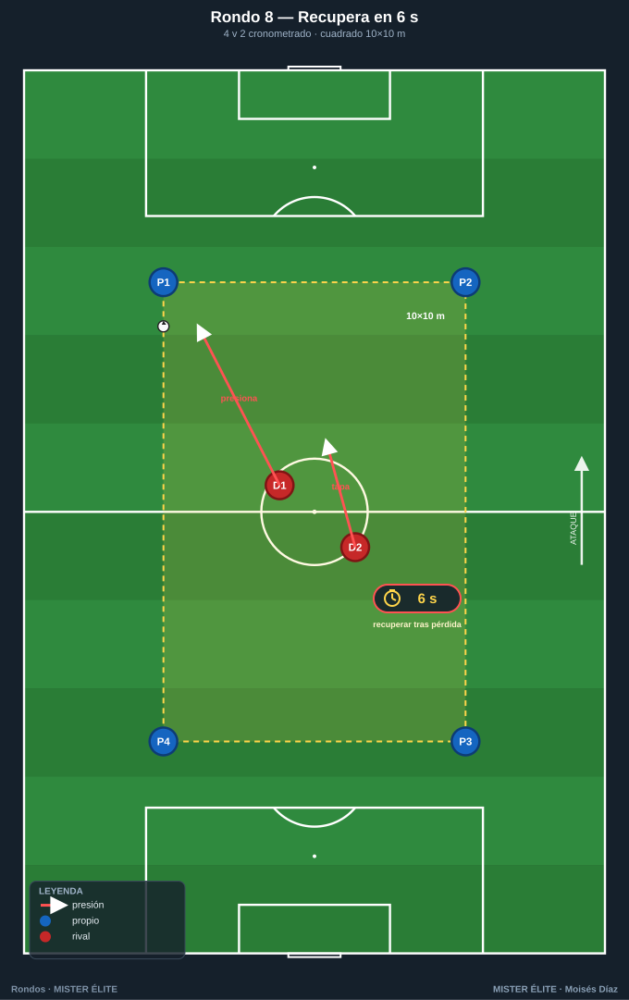
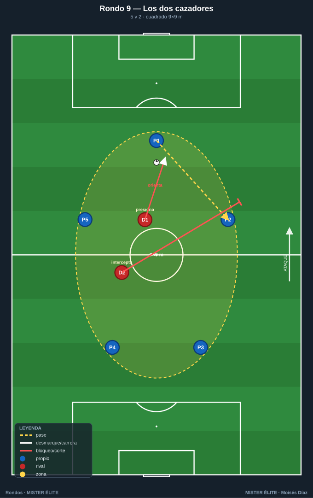
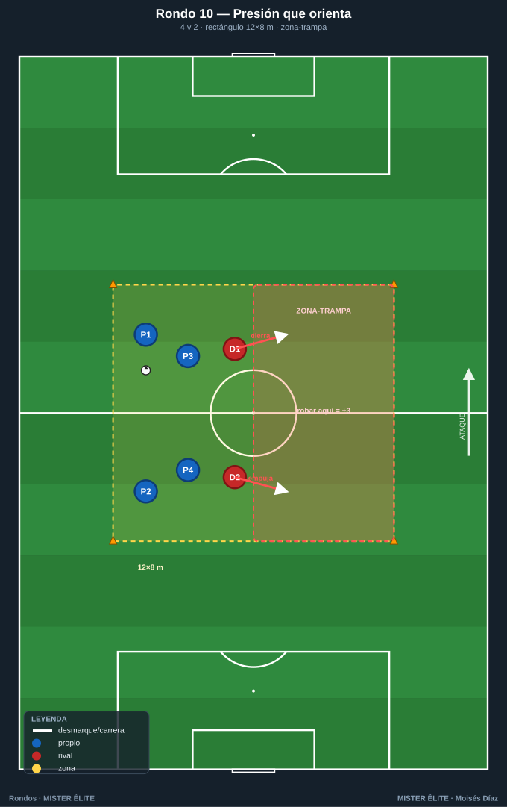
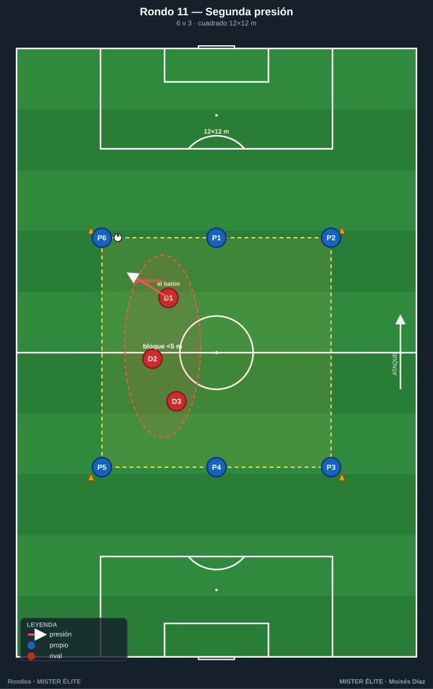
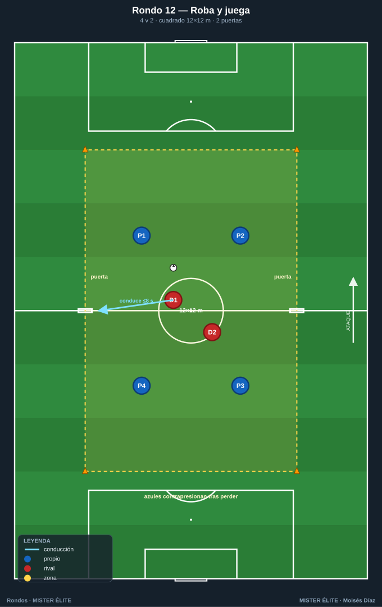
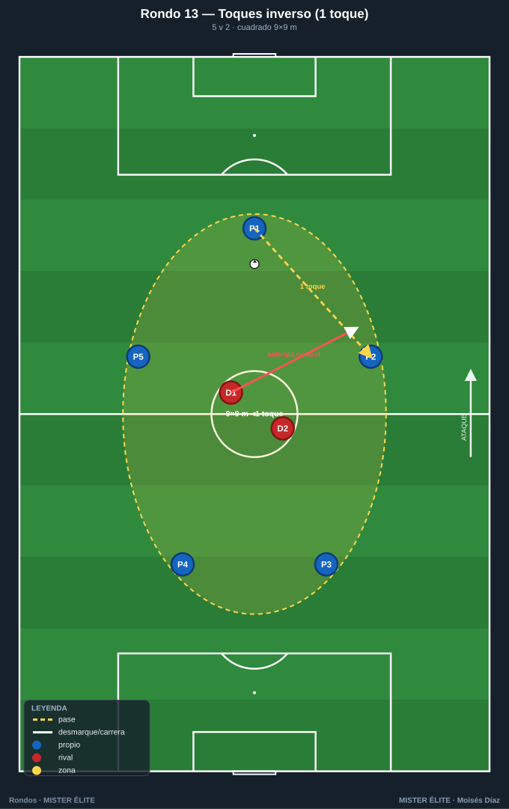
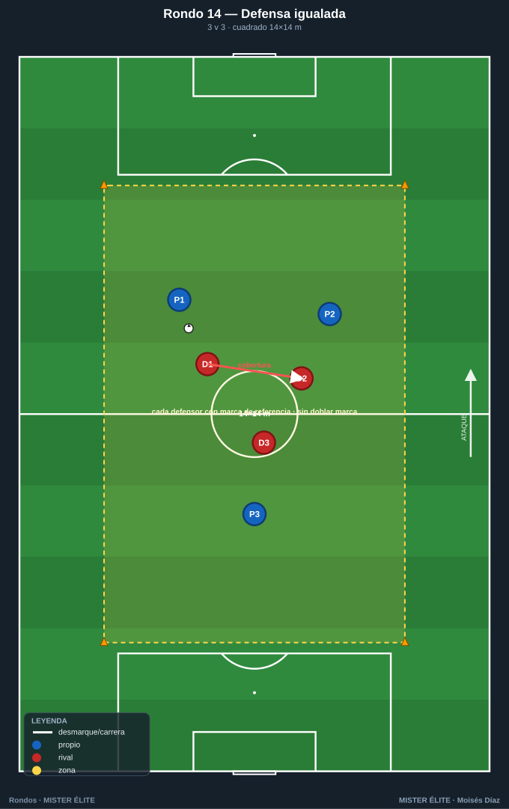

# Familia 2 · Presión y recuperación (Rondos 8–14)

> **Foco en el DEFENSOR/RECUPERADOR:** presión tras pérdida, recuperar en X segundos, coordinación de presionadores, orientar la presión, transición ofensiva-defensiva.
>
> **Notación:** poseedores = **azules**, defensores/recuperadores = **rojos**, comodines = **ámbar**. Espacio con conos; flechas según `README`.

---

## Rondo 8 — "Recupera en 6 segundos" (4v2, cronometrado)

**Objetivo**
- *Táctico (defensivo):* presión inmediata tras pérdida (contrapresión); reducir el tiempo de recuperación.
- *Cognitivo:* leer el momento de saltar a robar.
- *Físico:* esfuerzo explosivo corto.

**Organización**
- Relación: **4 v 2**.
- Espacio: **cuadrado de 10×10 m**.
- Material: 1 balón, 4 conos, petos, **cronómetro/silbato**.

**Desarrollo**
1. Los 4 azules conservan; los 2 rojos defienden.
2. Cuando los rojos roban (o sale el balón), se **cronometran 6 segundos**: deben recuperar tras una nueva pérdida simulada en ese tiempo, o se mide cuánto tardan de media.
3. Énfasis en saltar juntos, no esperar.

**Provocaciones (medibles)**
- Meta: **recuperar en menos de 6 s**. Se registra el tiempo de cada recuperación.
- Recuperar bajo el umbral **3 veces seguidas** = ganan la serie.
- Azules **a 2 toques** (les obliga a ser rápidos y abre ventana de presión).

**Variantes (fácil → difícil)**
- *Fácil:* 11×11, umbral 8 s.
- *Medio:* 10×10, umbral 6 s.
- *Difícil:* 9×9, umbral 4 s, azules a toque libre.

**Coaching**
- "Presión a la primera, no a la segunda: el momento es cuando el balón viaja."
- "Uno presiona al balón, el otro cierra el pase de seguridad."
- Postura del defensor: orientar al rival hacia donde queremos robar.

**Duración / series:** 5 series de 2 min (alta intensidad). Rotar parejas cada serie.

---

## Rondo 9 — "Los dos cazadores" (5v2, coordinación de pareja)

**Objetivo**
- *Táctico:* coordinación de los **dos defensores** (uno al balón, otro a la cobertura/intercepción).
- *Cognitivo:* comunicación y gatillo de presión compartido.

**Organización**
- Relación: **5 v 2**.
- Espacio: **cuadrado de 9×9 m**.
- Material: 1 balón, 4 conos, petos.

**Desarrollo**
1. Cinco azules conservan; los **dos rojos actúan como pareja**: nunca van los dos al balón.
2. El "presionador" sale al poseedor orientándolo a un lado; el "interceptor" se coloca en la línea de pase de ese lado.
3. Al cambiar el balón de lado, los roles **se intercambian**.

**Provocaciones (medibles)**
- **Prohibido** que los dos rojos vayan al mismo poseedor (si lo hacen, +1 gratis para los azules).
- Recuperación **por intercepción** = **+2**; robo directo = +1.
- Azules a 2 toques.

**Variantes (fácil → difícil)**
- *Fácil:* 10×10, sin obligación de roles.
- *Medio:* 9×9, roles obligatorios.
- *Difícil:* 8×8, azules a 1 toque → la pareja debe anticipar más.

**Coaching**
- "Uno aprieta, otro tapa. Nunca los dos al balón."
- "Orienta el pase con tu carrera y tu compañero intercepta."
- Hablar: "¡voy!" / "¡tapo!".

**Duración / series:** 4×3 min. Parejas fijas una serie para que se entiendan.

---

## Rondo 10 — "Presión que orienta" (4v2 con zona-trampa)

**Objetivo**
- *Táctico:* **orientar la presión** hacia un lado predeterminado (la "trampa"); guiar al rival.
- *Cognitivo:* reconocer la zona-trampa y conducir al rival hacia ella.

**Organización**
- Relación: **4 v 2**.
- Espacio: **rectángulo 12×8 m** dividido en dos mitades (una sombreada = zona-trampa).
- Material: 1 balón, 6 conos, petos.

**Desarrollo**
1. Los rojos **fuerzan** que el balón llegue a la **zona-trampa** y roban allí.
2. La presión no es "ir a por el balón" sino cerrar salidas para empujar el juego a la trampa.
3. Los azules conservan evitando la zona marcada.

**Provocaciones (medibles)**
- Robo en la zona-trampa = **+3**; robo fuera = +1.
- 8 pases sin entrar en la trampa = +1 azul.
- El presionador cierra **el lado fuerte** con su cuerpo.

**Variantes (fácil → difícil)**
- *Fácil:* zona-trampa grande (60 % del campo).
- *Medio:* zona-trampa = una mitad.
- *Difícil:* zona-trampa pequeña (una esquina) → presión muy precisa.

**Coaching**
- "No persigas el balón, condúcelo. Cierra un lado para abrir el que tú quieres."
- "El cuerpo del defensor es una pared: orienta con él."
- El segundo defensor cubre la salida de la trampa.

**Duración / series:** 4×3 min. Cambiar el lado de la trampa entre series.

---

## Rondo 11 — "Rondo con segunda presión" (6v3 en cadena)

**Objetivo**
- *Táctico:* presión escalonada con **tres defensores**: 1.º al balón, 2.º a la línea de pase, 3.º cobertura.
- *Cognitivo:* basculación del bloque de 3 según el lado del balón.

**Organización**
- Relación: **6 v 3**.
- Espacio: **cuadrado de 12×12 m**.
- Material: 1 balón, 4 conos, petos (6 azul, 3 rojo).

**Desarrollo**
1. Seis azules conservan; los tres rojos **basculan en bloque** hacia el lado del balón.
2. El más cercano presiona; los otros dos **achican** y cierran líneas del lado fuerte.
3. Al cambiar el balón de lado, todo el bloque se desplaza.

**Provocaciones (medibles)**
- Los 3 defensores a **menos de 5 m** entre el más cercano y el siguiente (bloque compacto).
- Recuperación tras basculación correcta = **+2**.
- Azules: 2 cambios de lado sin pérdida = +1.

**Variantes (fácil → difícil)**
- *Fácil:* 14×14, sin obligación de compactar.
- *Medio:* 12×12, bloque compacto obligatorio.
- *Difícil:* 10×10 → basculación más exigente.

**Coaching**
- "Bloque corto: si te separas, abres un pasillo."
- "Bascula al lado del balón, deja el lejano."
- Ajustar **distancias** continuamente, nunca quietos.

**Duración / series:** 4 series de 3 min. Rotar el trío defensor.

---

## Rondo 12 — "Roba y juega" (4v2 con transición premiada)

**Objetivo**
- *Táctico:* **transición ofensiva tras robar** — el equipo defensor, al recuperar, busca un objetivo.
- *Cognitivo:* cambio inmediato de mentalidad defensa→ataque.

**Organización**
- Relación: **4 v 2**, con **2 mini-porterías de conos** en lados opuestos.
- Espacio: **cuadrado 12×12 m** con una puerta de conos (2 m) en cada lado largo.
- Material: 1 balón, 8 conos, petos.

**Desarrollo**
1. Los azules conservan (rondo normal 4v2).
2. Cuando los **rojos roban**, tienen **8 segundos** para conducir el balón por cualquiera de las dos puertas.
3. Si lo logran, suman; si no, devuelven y se reinicia.

**Provocaciones (medibles)**
- Robar **+1**; conducir por una puerta en ≤8 s tras robar **+2 adicional**.
- Los azules, al perder, hacen **contrapresión** para impedir la puerta.
- Toques libres para los azules (foco en la fase defensiva-transición).

**Variantes (fácil → difícil)**
- *Fácil:* sin límite de tiempo para la puerta.
- *Medio:* 8 s para la puerta.
- *Difícil:* 5 s + 3 puertas.

**Coaching**
- "Robar no es el final: la primera decisión tras el robo gana el ejercicio."
- "Al perder, los dos primeros segundos son para frenar, no para lamentarse."
- Antes de robar, mirar **dónde está la puerta libre**.

**Duración / series:** 5×2,5 min. Alta exigencia de transición.

---

## Rondo 13 — "Presión con límite de toques inverso" (5v2)

**Objetivo**
- *Táctico:* presionar para **forzar el error técnico** del poseedor restringiendo su tiempo.
- *Cognitivo:* el defensor cronometra mentalmente el toque del rival y salta en el control malo.

**Organización**
- Relación: **5 v 2**.
- Espacio: **cuadrado 9×9 m**.
- Material: 1 balón, 4 conos, petos.

**Desarrollo**
1. Los azules juegan **obligatoriamente a 1 toque** (condición que les presiona).
2. Los rojos saltan **anticipando** el control de primera; buscan el balón que rebota mal.
3. El defensor presiona al **receptor**, no al pasador.

**Provocaciones (medibles)**
- Azules **a 1 toque obligado**; 2 toques = balón a los defensores (punto rojo).
- Recuperación por **anticipación al control** = +2.
- 10 pases a 1 toque encadenados = +1 azul.

**Variantes (fácil → difícil)**
- *Fácil:* azules a 2 toques.
- *Medio:* 1 toque obligado.
- *Difícil:* 1 toque obligado + cuadro 8×8.

**Coaching**
- "Presiona al que va a recibir, no al que pasa: roba en el control."
- "Si el rival está obligado a 1 toque, su error está cerca: aprieta."
- Arrancar la presión cuando el balón sale del pie del pasador.

**Duración / series:** 4×3 min. Rotar pareja defensora.

---

## Rondo 14 — "Defensa numéricamente igualada" (3v3 de mantenimiento defensivo)

**Objetivo**
- *Táctico:* defender **sin superioridad ofensiva del rival** (igualdad); marcaje, cobertura y robo en 3v3.
- *Cognitivo:* asignar marcas y leer el desmarque.

**Organización**
- Relación: **3 v 3** (un equipo conserva, el otro recupera; al robar, **se invierten los roles**).
- Espacio: **cuadrado 14×14 m** (más amplio por la igualdad).
- Material: 1 balón, 4 conos, petos de dos colores.

**Desarrollo**
1. Tres conservan, tres recuperan; en igualdad no hay rondo "cómodo".
2. Al robar, el equipo que recupera **da 3 pases** para "ganar" la posesión y entonces cambian los roles formalmente.
3. Cada defensor tiene una marca de referencia con coberturas.

**Provocaciones (medibles)**
- Recuperar + **3 pases de consolidación** = posesión ganada (+1) y cambio de rol.
- 6 pases mantenidos = +1.
- Prohibido el marcaje doble a un mismo poseedor.

**Variantes (fácil → difícil)**
- *Fácil:* 4v3 (vuelve la superioridad para el que conserva).
- *Medio:* 3v3, consolidación de 3 pases.
- *Difícil:* 3v3 en 12×12 + 2 toques al conservar.

**Coaching**
- "En igualdad defiende tu zona y comunica las marcas."
- "Tras robar, asegura antes de atacar: 3 pases para respirar."
- Cobertura: nunca dos defensores al mismo hombre.

**Duración / series:** 4 series de 3 min. Descanso 1 min (esfuerzo alto por la igualdad).

---

*MISTER ÉLITE — Moisés Díaz*
