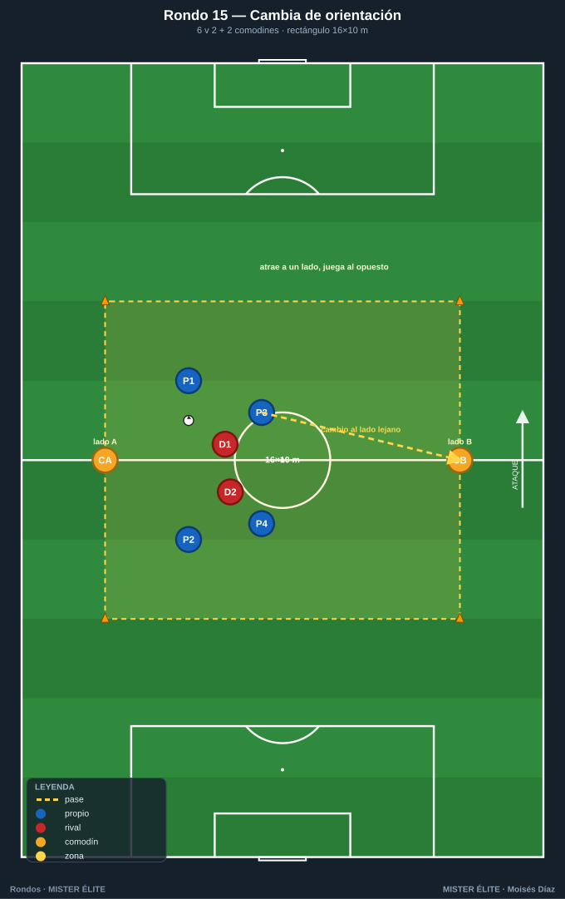
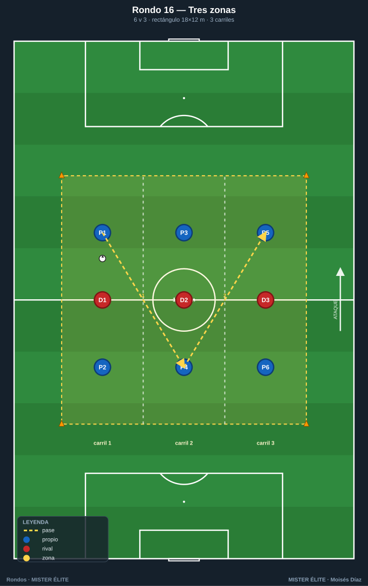
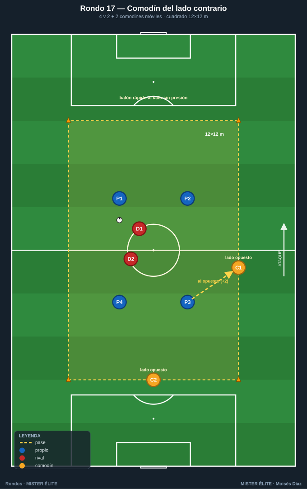
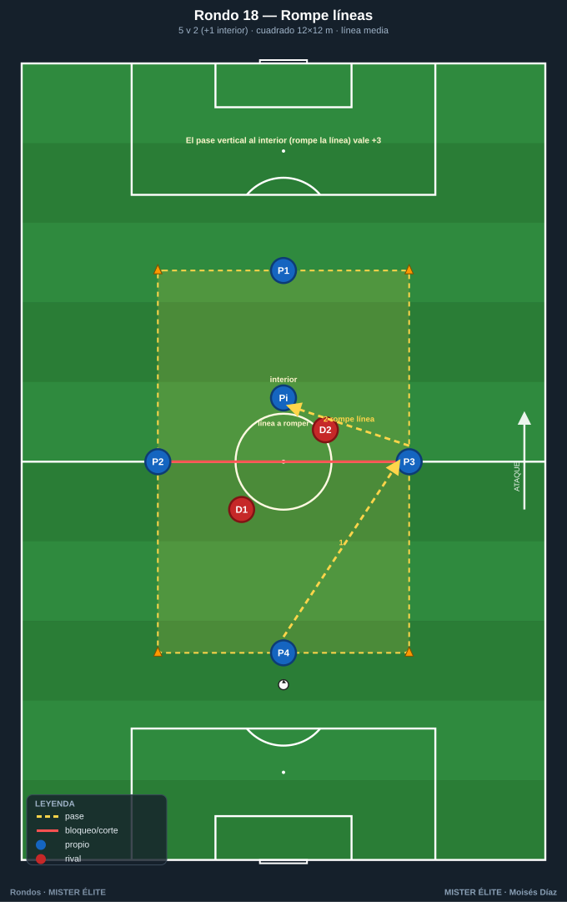
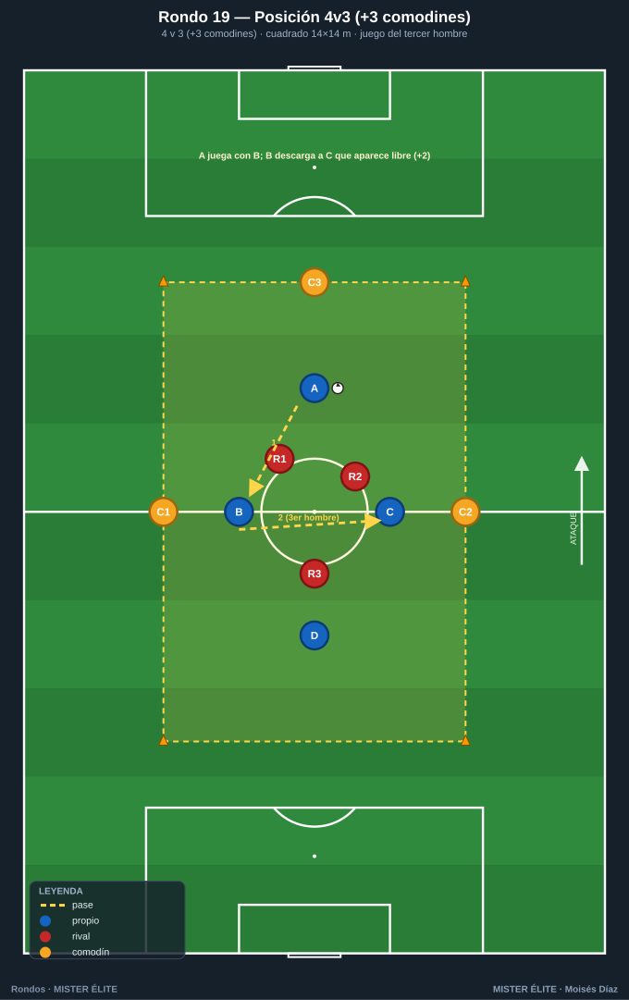
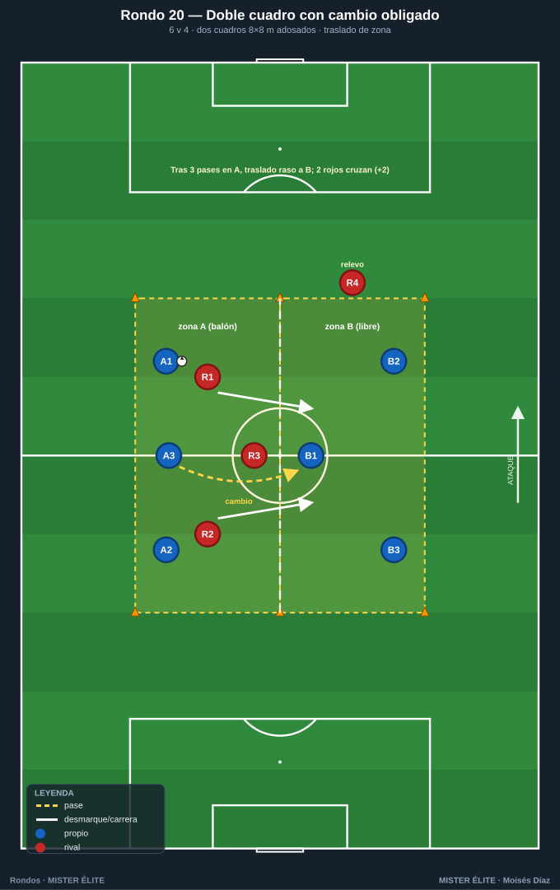
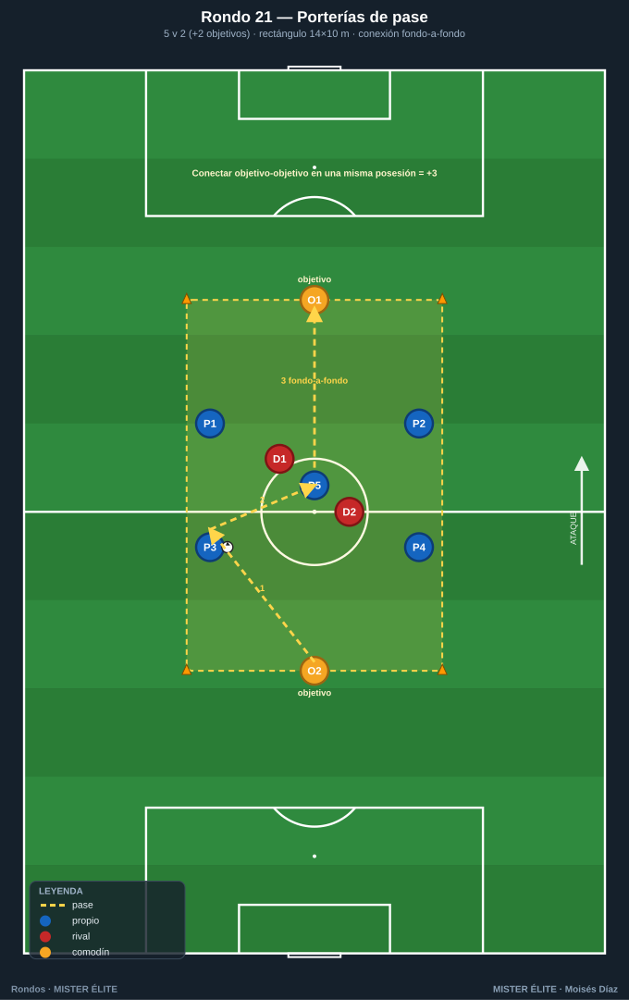

# Familia 3 · Posicionales y de orientación (Rondos 15–21)

> **Cambio de orientación, rondo por zonas, jugar al comodín del lado contrario, romper líneas, juego de posición con sentido.**
>
> **Notación:** poseedores = **azules**, defensores = **rojos**, comodines = **ámbar**. Espacio con conos; flechas según `README`.

---

## Rondo 15 — "Cambia de orientación" (6v2 con dos comodines de banda)

**Objetivo**
- *Táctico:* **cambio de orientación**: mantener en un lado para atacar el contrario; encontrar al comodín del lado lejano.
- *Cognitivo:* identificar el lado débil (donde no está la presión).

**Organización**
- Relación: **6 v 2 + 2 comodines** (4 azules dentro, 2 ámbar fijos en bandas opuestas, 2 rojos).
- Espacio: **rectángulo 16×10 m**; comodines en las dos líneas largas (lado A y lado B).
- Material: 1 balón, 4 conos, petos.

**Desarrollo**
1. Los azules conservan atrayendo a los dos rojos a un lado.
2. El objetivo es **cambiar el balón al comodín del lado contrario** a la presión.
3. El comodín devuelve y se reinicia desde el nuevo lado.

**Provocaciones (medibles)**
- **+3** por cada cambio de orientación completado de un comodín al opuesto.
- Para validar, **3 pases previos** en el lado de la presión (atraer primero).
- Comodines a 2 toques, fijos en su banda.

**Variantes (fácil → difícil)**
- *Fácil:* 18×10, cambio libre.
- *Medio:* 16×10, atraer 3 pases antes de cambiar.
- *Difícil:* 14×10 + cambio **directo** de un comodín al otro puntúa doble.

**Coaching**
- "Atrae a un lado para abrir el otro: el cambio nace de fijar primero."
- "Mira al lado lejano antes de recibir; el cambio ya debe estar decidido."
- Pase de cambio firme y al pie del comodín libre.

**Duración / series:** 4×3 min. Rotar comodines.

---

## Rondo 16 — "Rondo en tres zonas" (posición por carriles)

**Objetivo**
- *Táctico:* **juego por carriles**, ocupar racionalmente el espacio; progresar de zona en zona.
- *Cognitivo:* reconocer en qué carril hay superioridad.

**Organización**
- Relación: **6 v 3** repartidos por zonas.
- Espacio: **rectángulo 18×12 m dividido en 3 carriles verticales** de 6 m.
- Material: 1 balón, conos de 3 colores para los carriles, petos.

**Desarrollo**
1. Dos azules por carril (uno por zona mínimo), un rojo por carril.
2. El balón debe **circular pasando por los tres carriles**; no se salta ninguno.
3. Se busca el carril con superioridad para progresar.

**Provocaciones (medibles)**
- **+1** cada vez que el balón recorre los **3 carriles** sin perderlo.
- Prohibido tener **más de 2 azules en el mismo carril**.
- Defensores no cambian de carril salvo coberturas pactadas.

**Variantes (fácil → difícil)**
- *Fácil:* carriles anchos (7 m), se permite saltar un carril.
- *Medio:* 6 m, paso obligado por los 3 carriles.
- *Difícil:* defensores libres de carril + 2 toques.

**Coaching**
- "Ocupa tu carril; no te amontones donde está el balón."
- "Progresa carril a carril: paciencia para encontrar el lado fuerte."
- Recibir orientado hacia el carril de avance.

**Duración / series:** 4×3,5 min. Rotar tríos.

---

## Rondo 17 — "Comodín del lado contrario" (4v2 + 2 comodines móviles)

**Objetivo**
- *Táctico:* jugar **siempre al comodín opuesto al balón**; cambiar el punto de juego con apoyos móviles.
- *Cognitivo:* localizar el comodín libre que se reposiciona constantemente.

**Organización**
- Relación: **4 v 2 + 2 comodines móviles**.
- Espacio: **cuadrado 12×12 m**; los 2 comodines se mueven **por todo el perímetro**.
- Material: 1 balón, 4 conos, petos (4 azul, 2 ámbar, 2 rojo).

**Desarrollo**
1. Los azules conservan dentro; los comodines se reposicionan por el perímetro buscando estar **siempre en el lado opuesto al balón**.
2. La regla obliga a buscar al comodín lejano de la presión.
3. Los comodines coordinan para no estar los dos en el mismo lado.

**Provocaciones (medibles)**
- **Solo puntúa** el pase al comodín del **lado contrario** al balón (+2).
- Comodines a 1 toque.
- Pase al comodín cercano (lado del balón) = no puntúa.

**Variantes (fácil → difícil)**
- *Fácil:* comodines fijos en lados opuestos.
- *Medio:* comodines móviles por el perímetro.
- *Difícil:* 1 solo comodín móvil + defensores al 100 %.

**Coaching**
- "El balón rápido al lado donde no hay presión."
- Comodín: "lee dónde está el balón y colócate enfrente."
- Antes de recibir, saber ya en qué lado está el comodín libre.

**Duración / series:** 4×3 min. Rotar comodines.

---

## Rondo 18 — "Rompe líneas" (5v2 con defensores escalonados)

**Objetivo**
- *Táctico:* **pase que rompe línea** (vertical, entre los defensores); valorar el pase interior sobre el horizontal.
- *Cognitivo:* ver el momento exacto en que se abre el carril vertical.

**Organización**
- Relación: **5 v 2 + 1 interior** (4 azules en perímetro, 1 azul interior, 2 rojos escalonados).
- Espacio: **cuadrado 12×12 m**, con una **línea media** marcada (un defensor por delante y otro por detrás).
- Material: 1 balón, conos, cinta para la línea media, petos.

**Desarrollo**
1. Los azules circulan en su lado; el objetivo es **encontrar al azul interior por detrás de la línea defensiva**.
2. El pase que "rompe la línea" vale más que el de mantenimiento.
3. El interior recibe entre líneas y devuelve o gira.

**Provocaciones (medibles)**
- **+3** por cada pase que llega al interior **rompiendo la línea** (superando al primer defensor).
- Pase horizontal de mantenimiento: 0 puntos (solo prepara).
- El interior no recibe dos veces seguidas.

**Variantes (fácil → difícil)**
- *Fácil:* defensores en una sola línea, interior libre.
- *Medio:* defensores escalonados, romper línea puntúa.
- *Difícil:* dos interiores y el pase debe llegar al segundo (rompe **dos** líneas).

**Coaching**
- "El pase que rompe líneas es el que progresa: priorízalo sobre el seguro."
- "Espera a que el carril vertical se abra; no fuerces el balón a un cuerpo."
- Interior: ofrecerse en el ángulo ciego del defensor.

**Duración / series:** 4×3 min. Rotar defensores e interior.

---

## Rondo 19 — "Rondo de posición 4v3 (+3 comodines)"

**Objetivo**
- *Táctico:* reproducir una **estructura posicional** (no solo conservar): apoyos fijos por dentro y por fuera, jugar el tercer hombre.
- *Cognitivo:* leer la estructura completa y elegir la línea de progresión.

**Organización**
- Relación: **4 v 3 + 3 comodines** (4 azules interiores, 3 comodines perimetrales fijos en posiciones de estructura, 3 rojos).
- Espacio: **cuadrado 14×14 m**; comodines en 3 lados, estructura tipo "rombo + apoyos".
- Material: 1 balón, 4 conos, petos (4 azul, 3 ámbar, 3 rojo).

**Desarrollo**
1. Estructura de juego de posición: interiores generan superioridad, comodines dan amplitud y apoyo.
2. Se busca el **tercer hombre**: A juega con B (apoyo), B descarga a C que aparece libre.
3. Los 3 rojos defienden la estructura.

**Provocaciones (medibles)**
- **+2** por cada acción del "tercer hombre" (pase–pared–jugador libre).
- Mantener la estructura: si dos interiores se juntan en la misma zona, pierden el punto.
- Comodines a 1 toque.

**Variantes (fácil → difícil)**
- *Fácil:* 4+3 v 2 (más superioridad).
- *Medio:* 4+3 v 3.
- *Difícil:* 4+3 v 4 (igualdad casi total, estructura bajo presión real).

**Coaching**
- "El tercer hombre: el que recibe la pared no es el que la devuelve."
- "Mantén la forma; los apoyos no se mueven de su posición de estructura."
- Pensar en líneas de pase, no en jugadores: jugar el espacio.

**Duración / series:** 4×4 min. Rotar tríos defensores.

---

## Rondo 20 — "Doble cuadro con cambio obligado" (orientación entre zonas)

**Objetivo**
- *Táctico:* mantener en una zona para **cambiar a la zona opuesta** superando a la presión; orientación de zona a zona.
- *Cognitivo:* decisión de cuándo cambiar de zona.

**Organización**
- Relación: **6 v 4** en dos cuadros con **3 defensores activos** que pueden cruzar.
- Espacio: **dos cuadrados de 8×8 m** adosados (rectángulo 16×8 dividido en dos).
- Material: 1 balón, 6 conos, petos (6 azul, 4 rojo; 3 defienden, 1 espera relevo).

**Desarrollo**
1. Los azules conservan en una zona; deben **trasladar el balón a la otra** con un pase que cruce la línea divisoria.
2. Los defensores presionan en la zona activa; al cambiar el balón, **dos defensores cruzan** a la nueva zona.
3. La ventaja: quien cambia rápido juega antes de que llegue la presión.

**Provocaciones (medibles)**
- **+2** por cada traslado limpio de zona; **doble** si se juega en la nueva zona antes de que lleguen los 2 defensores.
- Mínimo **3 pases** en la zona antes de cambiar.
- El traslado debe ser **raso**.

**Variantes (fácil → difícil)**
- *Fácil:* línea divisoria libre, 1 defensor cruza.
- *Medio:* 2 defensores cruzan tras el cambio.
- *Difícil:* zonas de 7×7 + cambio directo a un apoyo de la otra zona.

**Coaching**
- "Atrae en una zona, juega en la otra: el espacio libre está donde no está la presión."
- "Cambia y juega rápido: tu ventaja dura 2 segundos."
- Preparar siempre un receptor orientado en la zona de destino.

**Duración / series:** 4×3,5 min. Rotar defensores.

---

## Rondo 21 — "Rondo orientado con porterías de pase" (5v2 + objetivos)

**Objetivo**
- *Táctico:* dar **dirección/sentido** al rondo: progresar hacia unos "objetivos" en vez de conservar sin más.
- *Cognitivo:* elegir el objetivo correcto según la presión.

**Organización**
- Relación: **5 v 2** con **2 jugadores-objetivo (comodines) en dos lados (frente/fondo)**.
- Espacio: **rectángulo 14×10 m**; comodines-objetivo en las dos líneas cortas.
- Material: 1 balón, 4 conos, petos (5 azul, 2 ámbar objetivo, 2 rojo).

**Desarrollo**
1. Los azules conservan en el medio; el objetivo es **conectar de un comodín-objetivo al otro** (de fondo a fondo) = progresión completa.
2. La direccionalidad convierte el rondo en juego de progresión.
3. Los 2 rojos cortan la línea de progresión.

**Provocaciones (medibles)**
- **+3** por conectar objetivo–objetivo en una misma posesión.
- No vale conectar dos veces seguidas al mismo objetivo (obliga a progresar).
- Objetivos a 1 toque.

**Variantes (fácil → difícil)**
- *Fácil:* objetivos a 2 toques, sin límite de tiempo.
- *Medio:* conexión fondo-a-fondo puntúa.
- *Difícil:* conexión fondo-a-fondo en **menos de 5 pases**.

**Coaching**
- "El rondo ya tiene portería: el objetivo de enfrente es tu progreso."
- "No te apoyes siempre atrás; busca avanzar al objetivo lejano."
- Cuerpo orientado a portería/objetivo desde la recepción.

**Duración / series:** 4×3 min. Rotar objetivos y defensores.

---

*MISTER ÉLITE — Moisés Díaz*
