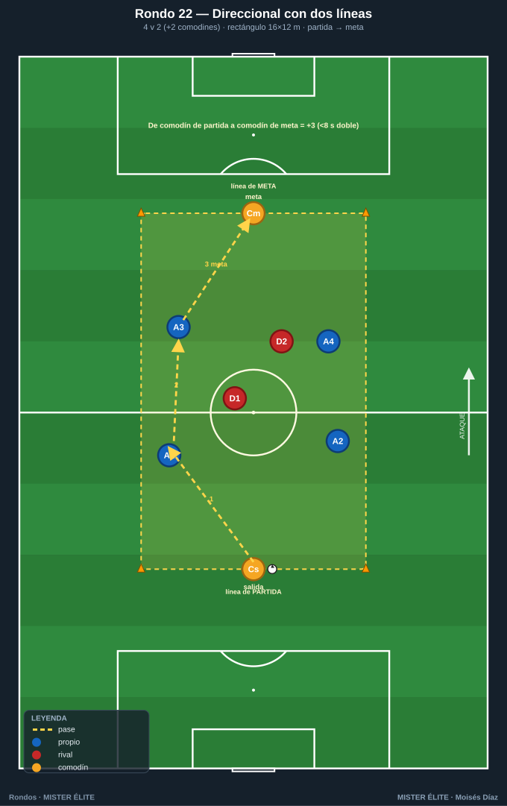
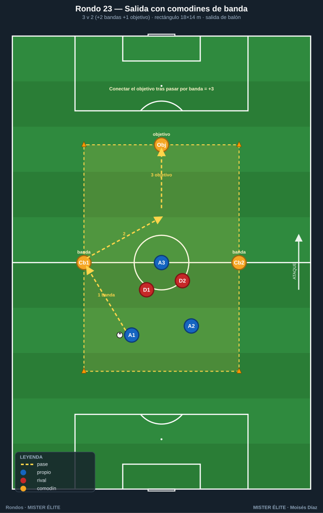
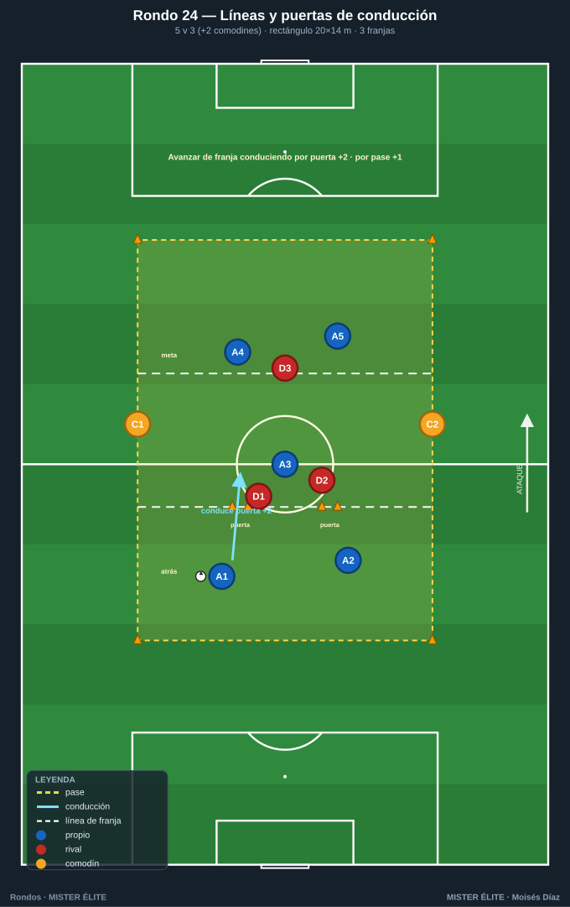
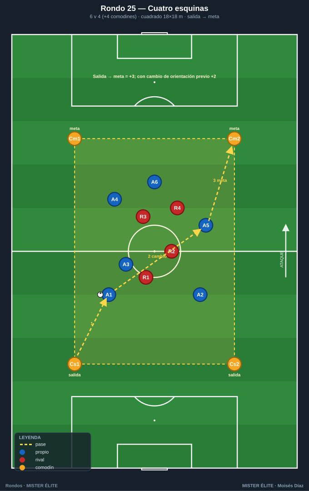
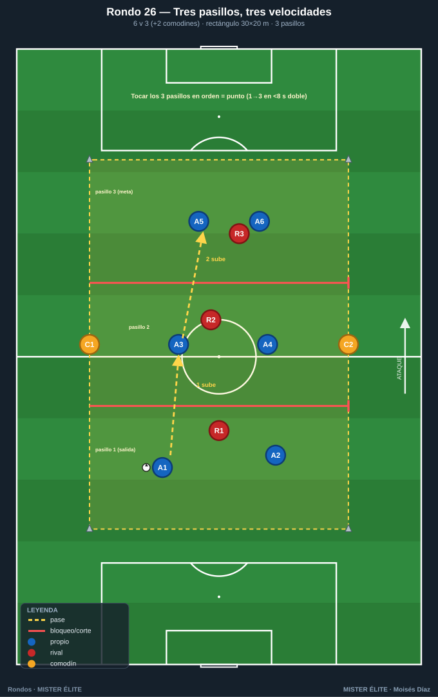
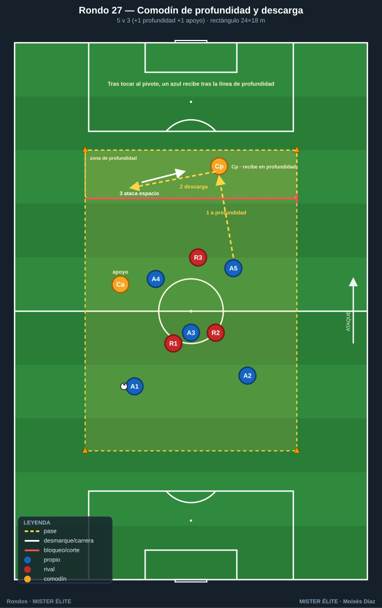
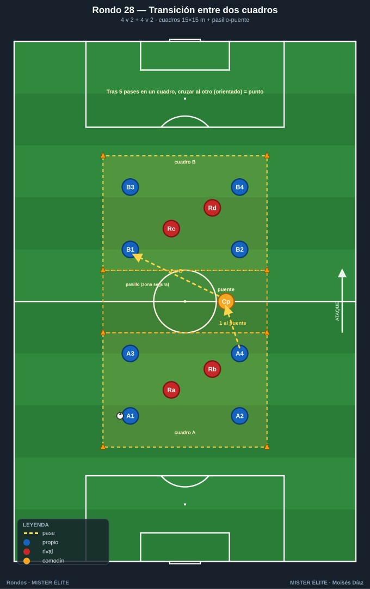

# Familia 4 · Con líneas y comodines — progresión y dirección (Rondos 22–28)

> **Rondos con dirección/progresión real y comodines exteriores que dan el sentido del juego.** Puente hacia el juego de posición direccional.
>
> **Notación:** poseedores = **azules**, defensores = **rojos**, comodines = **ámbar**. Espacio con conos; flechas según `README`.

---

## Rondo 22 — "Rondo direccional con dos líneas" (4v2 progresivo)

**Objetivo**
- *Táctico:* progresar de una **línea de partida** a una **línea de meta** superando a dos defensores; dirección clara.
- *Cognitivo:* decidir entre conservar o progresar según la presión.

**Organización**
- Relación: **4 v 2 + 2 comodines exteriores** (uno tras cada línea).
- Espacio: **rectángulo 16×12 m** con **línea de partida** y **línea de meta** marcadas.
- Material: 1 balón, 6 conos, petos (4 azul, 2 ámbar, 2 rojo).

**Desarrollo**
1. Los azules salen desde el comodín de la línea de partida y deben **progresar** hasta el comodín de la línea de meta.
2. Los 2 rojos defienden el avance.
3. Los comodines exteriores apoyan salida y llegada (a 1 toque).

**Provocaciones (medibles)**
- **+3** por llegar de comodín de partida a comodín de meta.
- Si pierden, **vuelven a empezar** desde la línea de partida.
- Progresión en **menos de 8 s** = punto extra.

**Variantes (fácil → difícil)**
- *Fácil:* 18×12, comodines a 2 toques.
- *Medio:* 16×12, progresión normal.
- *Difícil:* 14×12 + 4v3.

**Coaching**
- "El rondo tiene una dirección: no es conservar, es llegar."
- "Usa los comodines de salida para fijar y progresar limpio."
- Orientación del primer control hacia la meta, no hacia atrás.

**Duración / series:** 4×3 min. Rotar defensores.

---

## Rondo 23 — "Salida en superioridad con comodines de banda" (3v2 + bandas + objetivo)

**Objetivo**
- *Táctico:* **salida de balón** desde atrás bajo presión, usando las bandas para progresar (transferencia a la primera fase de construcción).
- *Cognitivo:* elegir la banda libre para salir.

**Organización**
- Relación: **3 v 2 + 2 comodines de banda + 1 comodín-objetivo** delante.
- Espacio: **rectángulo 18×14 m**; 2 comodines en bandas, 1 comodín-objetivo en la línea de meta.
- Material: 1 balón, 6 conos, petos (3 azul, 2 ámbar banda, 1 ámbar objetivo, 2 rojo).

**Desarrollo**
1. Los 3 azules inician la salida en superioridad sobre los 2 rojos.
2. Progresan apoyándose en bandas y buscan **conectar con el comodín-objetivo** avanzado.
3. Los rojos presionan la salida intentando robar en la primera línea.

**Provocaciones (medibles)**
- **+3** por conectar con el comodín-objetivo tras pasar por **al menos una banda**.
- Salir **jugado**: balón directo al objetivo sin pasar por banda = no puntúa.
- Robo de rojos en la primera línea = **+2 rojos**.

**Variantes (fácil → difícil)**
- *Fácil:* 4v2, bandas a 2 toques.
- *Medio:* 3v2.
- *Difícil:* 3v3 (igualdad).

**Coaching**
- "Sal jugando: la banda libre es tu salida, no el pelotazo."
- "Fija al presionador y abre a la banda contraria."
- Comodín-objetivo: ofrecerse cuando la salida ya superó la presión.

**Duración / series:** 4×3,5 min. Rotar defensores y objetivo.

---

## Rondo 24 — "Rondo con líneas y porterías de conducción" (5v3 progresivo)

**Objetivo**
- *Táctico:* progresar por líneas conduciendo o pasando a través de **puertas de conducción**; combinar conservar y avanzar.
- *Cognitivo:* leer si conviene conducir el espacio libre o pasar.

**Organización**
- Relación: **5 v 3 + 2 comodines exteriores**.
- Espacio: **rectángulo 20×14 m dividido en 3 franjas** (atrás–medio–meta); 2 **puertas de conducción** (2 m) en la franja media.
- Material: 1 balón, conos (incl. 2 puertas), petos (5 azul, 2 ámbar, 3 rojo).

**Desarrollo**
1. Los azules conservan en la franja de atrás y deben **progresar a la franja de meta**.
2. Para avanzar entre franjas, **conducen por una puerta** o pasan a un compañero ya situado en la franja avanzada.
3. Los 3 rojos defienden el avance por franjas.

**Provocaciones (medibles)**
- **+2** por avanzar de franja conduciendo por una puerta; **+1** por avanzar mediante pase.
- Llegar a la franja de meta y conectar con un comodín = **+3**.
- No volver a la franja de atrás dos veces seguidas.

**Variantes (fácil → difícil)**
- *Fácil:* 5v2, puertas anchas (3 m).
- *Medio:* 5v3, puertas de 2 m.
- *Difícil:* 5v4 + progresar en menos de 10 s.

**Coaching**
- "Si tienes espacio, condúcelo; si no, pásalo: las dos progresan."
- "La puerta de conducción es una invitación a atacar el espacio."
- Apoyos en la franja siguiente preparados para recibir entre líneas.

**Duración / series:** 4×3,5 min. Rotar el trío defensor.

---

## Rondo 25 — "Posesión direccional con comodines en las cuatro esquinas" (6v4 + 4 comodines)

**Objetivo**
- *Táctico:* combinar **cambio de orientación + progresión direccional** con comodines en las 4 esquinas; síntesis de la familia.
- *Cognitivo:* gestionar muchas opciones (4 comodines) y elegir la que progresa.

**Organización**
- Relación: **6 v 4 + 4 comodines** (uno por esquina, ámbar).
- Espacio: **cuadrado 18×18 m**; **dos esquinas de un lado = "meta"**, dos del otro = "salida".
- Material: 1 balón, 4 conos, petos (6 azul, 4 ámbar, 4 rojo).

**Desarrollo**
1. Los 6 azules conservan en superioridad con apoyo de las 4 esquinas; los 4 rojos presionan.
2. El objetivo es **progresar de las esquinas de salida a las de meta**, pudiendo cambiar de orientación para encontrar el lado libre.
3. Combina conservación, cambio de orientación y progresión direccional.

**Provocaciones (medibles)**
- **+3** por conectar una esquina de salida con una de meta en la misma posesión.
- **+2** adicional si en esa posesión hubo un **cambio de orientación** antes de progresar.
- Comodines de esquina a 1 toque, fijos.

**Variantes (fácil → difícil)**
- *Fácil:* 6v3, comodines a 2 toques.
- *Medio:* 6v4.
- *Difícil:* 6v5 + 2 toques a los azules interiores.

**Coaching**
- "Tienes cuatro apoyos: el bueno es el que está libre y te hace progresar."
- "Cambia de orientación para abrir, luego progresa a la meta."
- Cabeza arriba: cuatro esquinas = mucha información, prioriza la que avanza.

**Duración / series:** 4 series de 4 min. Rotar comodines y defensores. Ideal como cierre de bloque.

---

## Rondo 26 — "Tres pasillos, tres velocidades"

**Objetivo**
- *Táctico:* progresión orientada con cambio de ritmo; reconocer cuándo conservar y cuándo acelerar al saltar de zona.
- *Cognitivo:* toma de decisiones sobre la dirección de juego.

**Organización**
- Relación: **6 v 3 (+2 comodines)**.
- Espacio: **rectángulo 30×20 m dividido en 3 pasillos horizontales** de 10 m (líneas de conos que cruzan el ancho).
- Material: 12 conos (delimitar + 2 líneas internas), petos de 3 colores, balones en el pasillo de salida.

**Desarrollo**
1. Se inicia en el pasillo 1 (salida). Objetivo: **mínimo 3 pases por pasillo** y luego progresar al siguiente cruzando la línea con pase filtrado o conducción.
2. Los comodines ámbar de banda apoyan, pero solo devuelven hacia el pasillo del balón o el siguiente (nunca dos zonas atrás).
3. Balón controlado al pasillo 3 = **1 punto**, reinicio desde el 1. Si los rojos roban e intentan sacarlo del rectángulo, rota un rojo por el azul que perdió.

**Provocaciones (medibles)**
- Para puntuar hay que **tocar los 3 pasillos** en orden ascendente.
- Máx. **2 toques** en pasillo central y final; libres en el de salida.
- Prohibido el pase que retroceda **más de un pasillo** (penaliza con pérdida).
- Bonus: progresar de pasillo 1 a 3 en **menos de 8 s** vale doble.

**Variantes (fácil → difícil)**
- *Fácil:* 7v2, toques libres, comodines también en pasillos.
- *Medio:* la descrita (6v3 + 2).
- *Difícil:* 5v4; prohibido que dos azules ocupen el mismo pasillo más de 3 s.

**Coaching**
- Orientar el primer control hacia la línea a superar; el hombre del pasillo de destino se ofrece ANTES del pase; cabeza arriba para leer qué pasillo está libre de rojos; acelerar el ritmo justo en el salto de zona.

**Duración / series:** 4 series de 3 min, 90 s de descanso. Total ~18 min.

---

## Rondo 27 — "Comodín de profundidad y descarga"

**Objetivo**
- *Táctico:* progresión con apoyo en punta; jugar de cara y de espaldas; el comodín como referencia para fijar y descargar (pared / tercer hombre).

**Organización**
- Relación: **5 v 3 (+1 comodín de profundidad +1 comodín de apoyo)**.
- Espacio: **rectángulo 24×18 m** con una **línea de meta** al fondo. Comodín de profundidad **fijo en los últimos 4 m**; comodín de apoyo **móvil**.
- Material: 10 conos, petos 3 colores, balones en la partida opuesta a la profundidad.

**Desarrollo**
1. Los azules circulan para **encontrar al comodín de profundidad de espaldas**.
2. El comodín de profundidad recibe, aguanta o devuelve de primeras al comodín de apoyo o a un azul que ataca el espacio (tercer hombre).
3. **Se puntúa** cuando, tras tocar el comodín de profundidad, un azul recibe el balón controlado **por detrás de la línea de profundidad**.

**Provocaciones (medibles)**
- El comodín de profundidad juega a **1 toque**.
- El punto solo vale si **el pase a profundidad** lo da un azul, no el comodín de apoyo.
- Si los rojos roban y conservan 4 pases entre ellos = 1 punto rojo.
- Combo bonus: pared con el comodín de profundidad = punto doble.

**Variantes (fácil → difícil)**
- *Fácil:* comodín de profundidad a 2 toques y puede recibir de cara.
- *Medio:* la descrita.
- *Difícil:* añadir 1 rojo (5v4) que vigila exclusivamente al comodín de profundidad.

**Coaching**
- El comodín de profundidad fija al rojo con el cuerpo antes de descargar; el tercer hombre arranca cuando el balón viaja hacia el pivote, no después; la descarga busca al jugador **orientado** hacia la profundidad.

**Duración / series:** 5 series de 2:30, 75 s descanso. Total ~17 min.

---

## Rondo 28 — "Rondo de transición entre dos cuadros"

**Objetivo**
- *Táctico:* transición entre zonas y cambio de orientación largo; encadenar conservación en una zona y progresión a otra con apoyo de comodín-puente.

**Organización**
- Relación: **dos cuadros 4 v 2** unidos por un **pasillo neutral de 6 m** con **1 comodín-puente ámbar** dentro.
- Espacio: cada cuadro **15×15 m**, separados por el pasillo (total ~36 m de largo).
- Material: 12 conos (2 cuadros + pasillo), 1 peto ámbar, petos. Balón empieza en el cuadro A.

**Desarrollo**
1. Los 4 azules del cuadro A conservan ante sus 2 rojos.
2. Tras **mínimo 5 pases**, deben **cambiar de cuadro** pasando por el comodín-puente (o con pase directo que cruce el pasillo).
3. Cuando el balón entra en el cuadro B, ese equipo conserva otros 5 pases y devuelve. **Punto** por cada transición A↔B con los 5 pases previos. El comodín-puente no puede ser presionado dentro del pasillo (zona segura), pero juega a **1 toque**.

**Provocaciones (medibles)**
- Hay que dar los **5 pases** en el cuadro antes de cruzar.
- El cambio de cuadro **debe ir orientado**: el receptor en B juega de cara, no de espaldas.
- Si los rojos de un cuadro roban e intentan sacar el balón del cuadro = 1 punto rojo y rotan.
- 2 transiciones seguidas sin pérdida = punto extra.

**Variantes (fácil → difícil)**
- *Fácil:* pasillo más ancho, comodín a 2 toques, solo 3 pases exigidos.
- *Medio:* la descrita.
- *Difícil:* prohibido pasar por el comodín una de cada dos transiciones (obliga al cambio directo por encima de la presión).

**Coaching**
- Preparar el cuerpo para recibir orientado hacia el cuadro destino; el comodín-puente como acelerador, no como freno; el equipo que recibe se abre al ancho del cuadro ANTES de que llegue el balón.

**Duración / series:** 4 series de 3:30, 90 s descanso. Total ~20 min.

---

*MISTER ÉLITE — Moisés Díaz*
