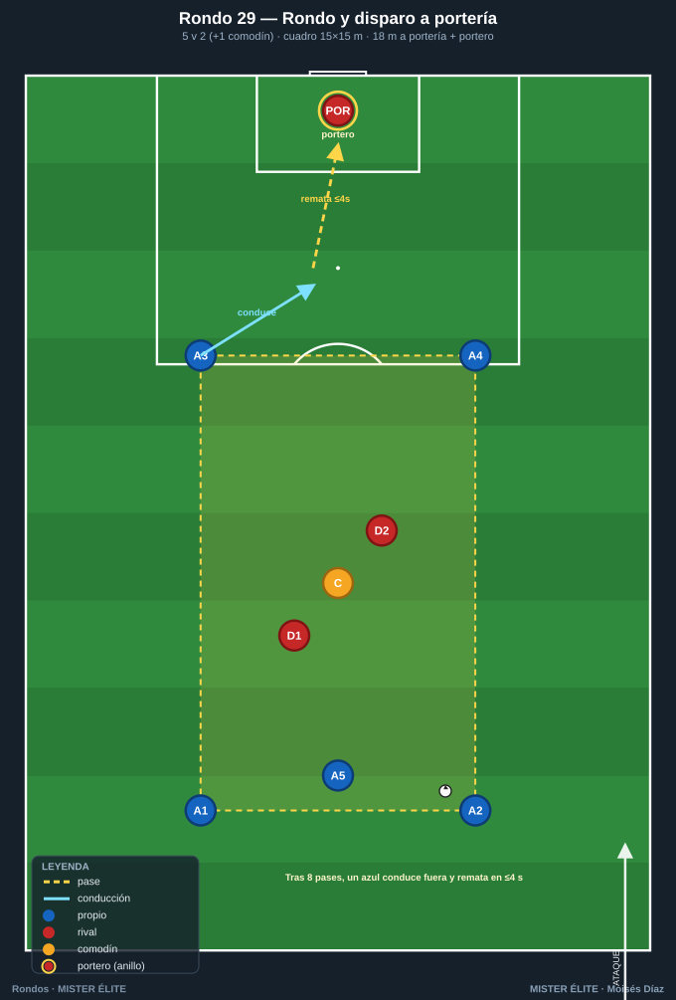
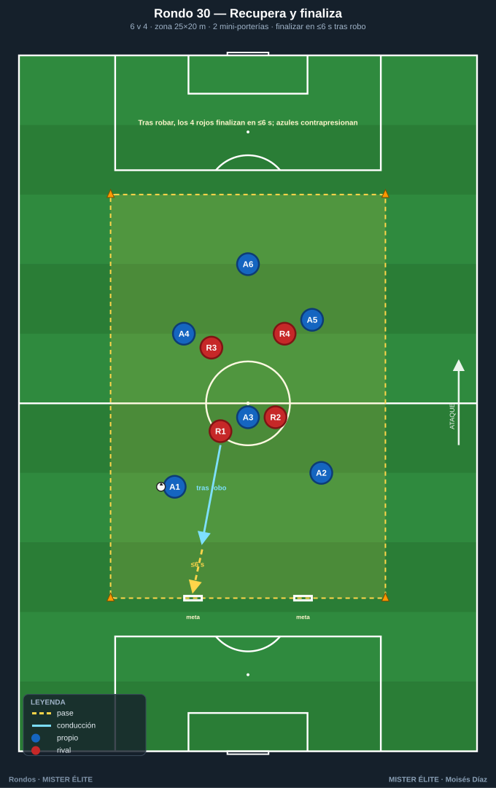
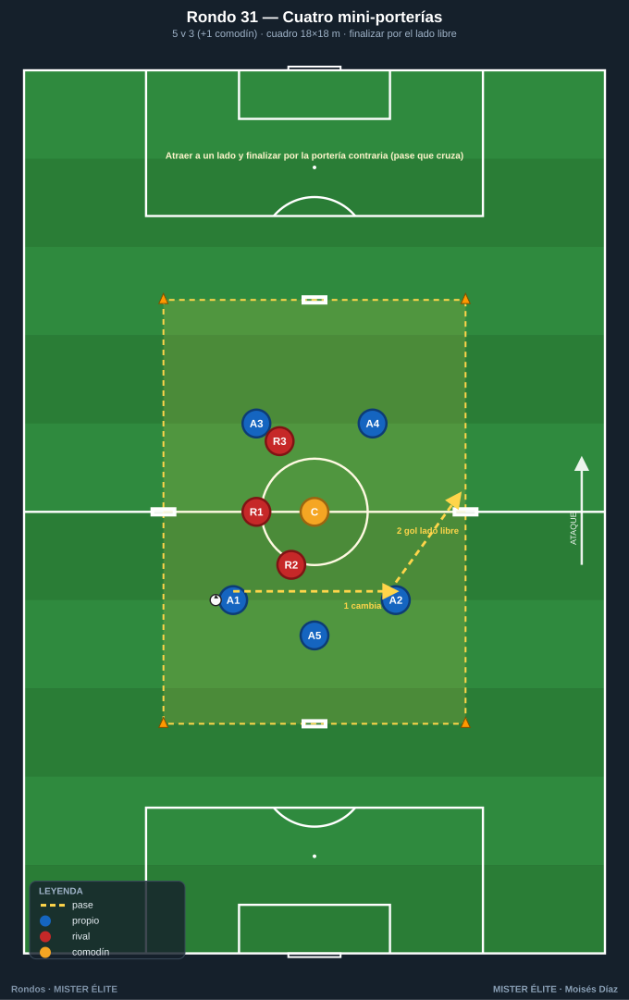
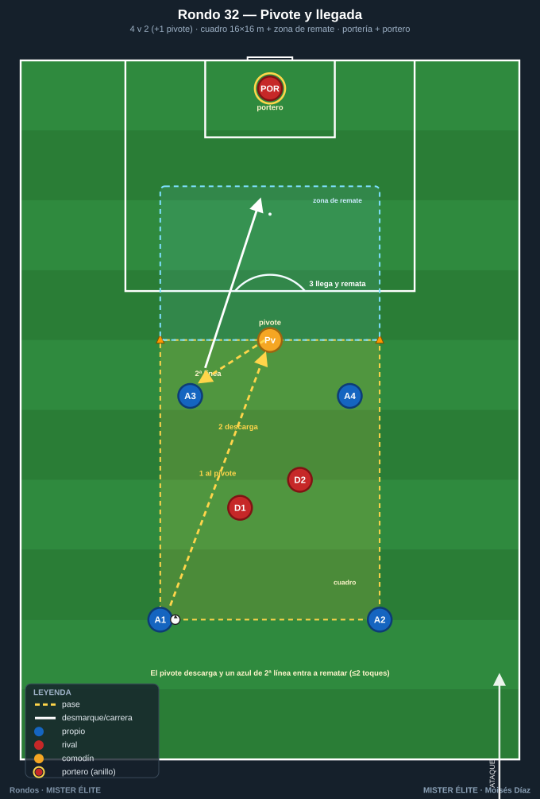
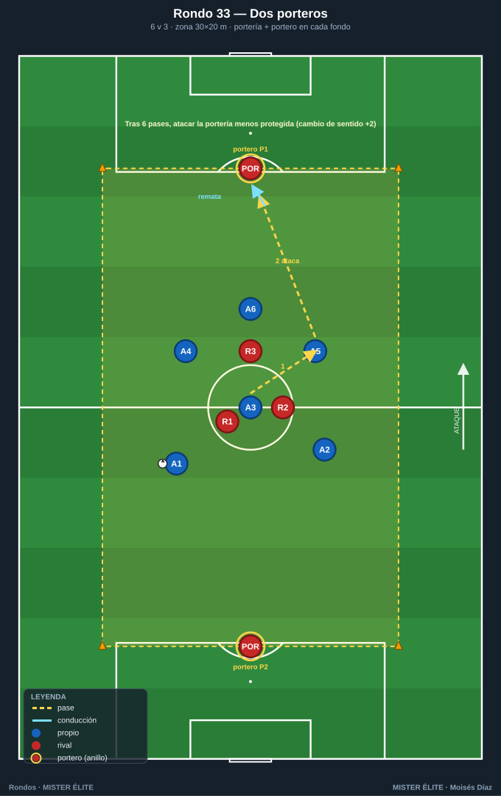
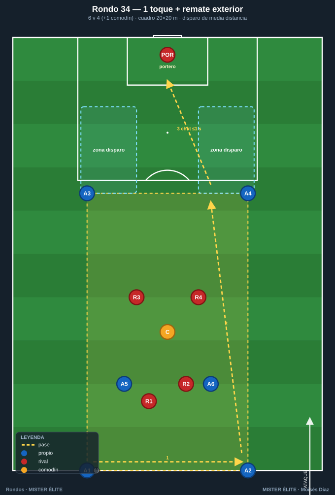
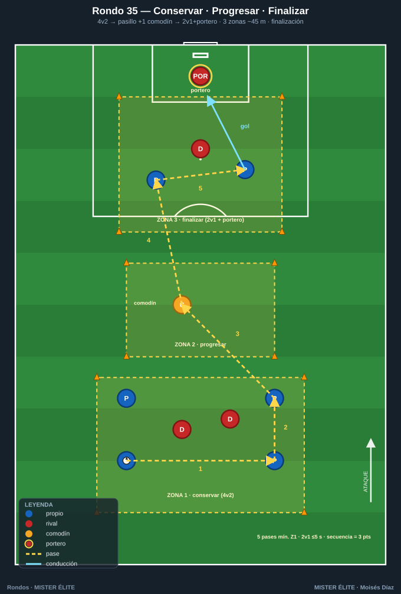

# Familia 5 · Finalización — del rondo al remate (Rondos 29–35)

> **Convertir la posesión en gol:** última pasada, llegada, definición, ataque del espacio tras la superioridad. Porterías y/o portero.
>
> **Notación:** poseedores = **azules**, defensores = **rojos**, comodines = **ámbar**. Espacio con conos; flechas según `README`.

---

## Rondo 29 — "Rondo y disparo a portería"

**Objetivo**
- *Táctico:* del mantenimiento al remate; finalizar tras una secuencia de conservación; activar la concentración para rematar después de circular.

**Organización**
- Relación: **5 v 2 (+1 comodín)** en cuadro de **15×15 m** situado **a 18 m de una portería reglamentaria con portero**, centrado frente a ella.
- Material: 8 conos, 1 portería + portero, balones repartidos en el cuadro y de reserva.

**Desarrollo**
1. Rondo normal 5v2 + comodín.
2. A la señal del entrenador (o tras **8 pases**), el azul con balón **conduce fuera del cuadro hacia la portería y remata** en los siguientes 4 segundos.
3. Tras rematar, el cuadro se reordena con un balón nuevo y sigue el rondo hasta la siguiente señal. Portería frontal a 18 m; el portero juega.

**Provocaciones (medibles)**
- El remate en **≤ 4 s** desde que el balón sale del cuadro.
- Solo cuenta gol si antes hubo **mínimo 8 pases** o la señal.
- 1 punto gol, 0 si para el portero, **–1 si el remate sale fuera** (penaliza la precipitación).
- Bonus: gol a primer toque tras recibir fuera del cuadro = doble.

**Variantes (fácil → difícil)**
- *Fácil:* remate sin oposición, balón parado a la salida.
- *Medio:* la descrita.
- *Difícil:* 1 rojo del cuadro sale a perseguir al rematador (presión por detrás).

**Coaching**
- Levantar la cabeza al salir del cuadro para fijar al portero; primer apoyo orientado hacia portería; golpeo con decisión, sin frenar la conducción.

**Duración / series:** 4 series de 3 min (rotando los 2 rojos), 90 s descanso. Total ~18 min.

---

## Rondo 30 — "Recupera y finaliza" (transición ofensiva al remate)

**Objetivo**
- *Táctico:* finalizar tras robar; transición defensa-ataque inmediata; los recuperadores se convierten en rematadores.

**Organización**
- Relación: **6 v 4** en zona de **25×20 m** con **dos mini-porterías (1,5 m, sin portero)** en la línea de fondo del lado de los azules.
- Material: 10 conos, 2 mini-porterías, petos, balones.

**Desarrollo**
1. Los 6 azules mantienen la posesión.
2. Cuando los **4 rojos roban**, tienen **6 segundos** para finalizar en una de las dos mini-porterías.
3. Tras gol o pérdida fuera, balón nuevo a los azules.

**Provocaciones (medibles)**
- Gol rojo válido solo en **≤ 6 s** desde el robo.
- Azules: **1 punto por cada 10 pases** consecutivos sin pérdida.
- Si los azules recuperan antes del gol, anulan la acción y reinician su cuenta.
- Cada gol rojo = **2 puntos**.

**Variantes (fácil → difícil)**
- *Fácil:* mini-porterías más anchas (2,5 m), 8 s.
- *Medio:* la descrita.
- *Difícil:* 4 s; los azules pueden volver a robar.

**Coaching**
- Rojos: primer pase tras el robo siempre hacia la portería; reconocer al compañero mejor orientado. Azules: presión inmediata tras pérdida para evitar el gol.

**Duración / series:** 5 series de 2:30, 75 s descanso. Total ~17 min.

---

## Rondo 31 — "Rondo a cuatro mini-porterías"

**Objetivo**
- *Táctico:* orientación + finalización multidireccional; decidir hacia qué portería atacar según la presión; cambio de orientación que termina en gol.

**Organización**
- Relación: **5 v 3 (+1 comodín)** en cuadro de **18×18 m** con **una mini-portería (2 m, sin portero) en el centro de cada lado**.
- Material: 8 conos, 4 mini-porterías, petos, balones.

**Desarrollo**
1. Los azules circulan (con apoyo del comodín) buscando hueco para **pasar el balón a través de cualquier mini-portería** a un compañero al otro lado (gol = pase que cruza y es controlado por un azul).
2. Hay 4 porterías: siempre hay una desprotegida. Atraer a los rojos a un lado y finalizar por el contrario.

**Provocaciones (medibles)**
- Gol = balón cruza la mini-portería **a ras de suelo** y lo recibe un azul al otro lado.
- No marcar **dos veces seguidas por la misma portería**.
- Mínimo **5 pases** antes de finalizar.
- El comodín no marca, solo asiste.

**Variantes (fácil → difícil)**
- *Fácil:* 6v2 + comodín, sin límite de pases previos.
- *Medio:* la descrita.
- *Difícil:* 5v4; gol doble si se finaliza ≤ 2 s tras un cambio de orientación de banda a banda.

**Coaching**
- Mirar la portería contraria a la presión antes de recibir; fijar al rojo en un lado y abrir al libre; pase de gol al pie del compañero, no a la portería vacía sin receptor.

**Duración / series:** 4 series de 3 min, 90 s descanso. Total ~18 min.

---

## Rondo 32 — "Pivote y llegada" (remate de segunda línea)

**Objetivo**
- *Táctico:* finalización de llegada desde segunda línea tras descarga del pivote; timing de la incorporación al remate.

**Organización**
- Relación: **4 v 2 (+1 comodín-pivote)** en cuadro de **16×16 m** pegado a una **zona de remate de 12 m** que da a **portería con portero**.
- Material: 8 conos, 1 portería + portero, balones.

**Desarrollo**
1. Rondo 4v2 con apoyo del pivote ámbar.
2. Cuando el pivote recibe orientado, **descarga atrás/lateral** y **un azul de segunda línea** entra en la zona de remate para **finalizar de primeras o tras un control**.
3. Clave: el rematador no arranca hasta que el pivote toca el balón. Portería frontal con portero a 12 m.

**Provocaciones (medibles)**
- El remate lo hace un azul que **estaba dentro del cuadro** y llega corriendo (no el pivote).
- Solo válido si hubo **descarga del pivote** en la jugada.
- Remate en **≤ 2 toques** dentro de la zona.
- Gol = 1; gol de primeras = 2.

**Variantes (fácil → difícil)**
- *Fácil:* sin portero, zona de remate más cerca.
- *Medio:* la descrita.
- *Difícil:* 1 rojo persigue al rematador hasta la zona.

**Coaching**
- El pivote juega de cara cuando puede; de espaldas descarga al primer toque; el rematador lee el momento del pase y ataca el espacio, no el balón; golpeo cruzado lejos del portero.

**Duración / series:** 5 series de 2:30, 75 s descanso. Total ~17 min.

---

## Rondo 33 — "Rondo dinámico con dos porteros" (finalización a dos lados)

**Objetivo**
- *Táctico:* finalización bidireccional con portero real; cambiar el sentido del ataque tras conservar; remate ajustado bajo presión.

**Organización**
- Relación: **6 v 3** en zona de **30×20 m** con **portería + portero en cada fondo**.
- Material: 8 conos, 2 porterías, 2 porteros, petos, balones.

**Desarrollo**
1. Los azules mantienen la posesión en el espacio central.
2. Tras **6 pases**, quedan **habilitados** para atacar **cualquiera de las dos porterías**, eligiendo la menos protegida.
3. Tras el remate, balón nuevo del entrenador y vuelta a la conservación. Los rojos, si roban, finalizan en cualquier portería sin requisito de pases.

**Provocaciones (medibles)**
- Azules: **6 pases** habilitan el remate; remate antes = anulado.
- Solo **1 remate por posesión**; si falla, vuelven a conservar.
- Rojos finalizan libres tras robo.
- Gol = 1; gol a la portería que NO se atacaba al inicio (cambio de sentido) = 2.

**Variantes (fácil → difícil)**
- *Fácil:* 7v2, 4 pases para habilitar.
- *Medio:* la descrita.
- *Difícil:* 6v4, 8 pases y rematar en ≤ 5 s tras habilitarse.

**Coaching**
- Leer dónde están los rojos para elegir portería; el cambio de orientación largo abre la portería opuesta; finalizar al primer hueco, sin sobreelaborar.

**Duración / series:** 4 series de 4 min, 90 s descanso. Total ~22 min.

---

## Rondo 34 — "Rondo 1 toque + remate exterior"

**Objetivo**
- *Táctico:* circulación a un toque y disparo de media distancia; la velocidad de circulación genera el espacio para el chut exterior.

**Organización**
- Relación: **6 v 4 (+1 comodín)** en cuadro de **20×20 m** con una **zona de disparo exterior** marcada por arcos de conos en dos esquinas, frente a **portería con portero a 16 m**.
- Material: 10 conos, 1 portería + portero, balones.

**Desarrollo**
1. Rondo a **1 toque obligatorio** (comodín a 2).
2. La circulación rápida arrastra a los rojos hacia un lado.
3. Cuando un azul recibe en una **zona de disparo exterior** con espacio, **chuta de media distancia**. Tras remate, balón nuevo.

**Provocaciones (medibles)**
- Toda la circulación a **1 toque**; segundo toque = punto para rojos.
- El disparo solo cuenta **desde la zona exterior marcada**.
- Disparo en **≤ 1 s** tras recibir en la zona (de primeras o control orientado máximo).
- Gol de media distancia = 2 puntos; parada = 0.

**Variantes (fácil → difícil)**
- *Fácil:* 2 toques permitidos, sin portero.
- *Medio:* la descrita.
- *Difícil:* 1 toque estricto y un rojo puede saltar a cerrar la zona de disparo.

**Coaching**
- Ritmo alto de circulación para descolocar la presión; preparar el cuerpo para el chut antes de recibir; golpeo con interior-empeine, abajo y a los palos.

**Duración / series:** 5 series de 2:30, 75 s descanso. Total ~17 min.

---

## Rondo 35 — "Rondo continuo: conservar–progresar–finalizar"

**Objetivo**
- *Táctico:* integrar las tres fases en una sola tarea; encadenar mantenimiento, progresión entre zonas y remate; resistencia específica a la toma de decisiones.

**Organización**
- Espacio: **3 zonas en línea** hacia portería (total ~45 m). Zona 1 (conservación, 15×20): **4 v 2**. Zona 2 (progresión, 15×20): pasillo con **1 comodín ámbar**. Zona 3 (finalización, 15×20): **2 azules v 1 rojo + portero**.
- Material: 12 conos, 1 portería + portero, petos, balones.

**Desarrollo**
1. Se inicia en zona 1 conservando ante 2 rojos.
2. Tras **5 pases**, se progresa a zona 2 apoyándose en el comodín, superando la línea de forma orientada.
3. En zona 3, los 2 azules que entran resuelven un **2 v 1 + portero** y finalizan. Tras gol o pérdida, balón nuevo en zona 1. Los azules rotan posiciones entre zonas cada serie.

**Provocaciones (medibles)**
- Respetar el orden de zonas (no saltarse la 2).
- **5 pases mínimos** en zona 1 antes de progresar.
- El 2v1 final se resuelve en **≤ 5 s**.
- Secuencia completa conservar-progresar-gol sin pérdida = 3 puntos.

**Variantes (fácil → difícil)**
- *Fácil:* 3v1 final con portero, zonas más cortas.
- *Medio:* la descrita.
- *Difícil:* 2v2 + portero en zona 3, y zona 1 pasa a 4v3.

**Coaching**
- Cada salto de zona orientado hacia portería; en el 2v1, fijar al rojo y soltar en el momento; mantener calidad de pase pese a la fatiga acumulada.

**Duración / series:** 4 series de 4 min (rotando), 2 min descanso. Total ~24 min.

---

*MISTER ÉLITE — Moisés Díaz*
