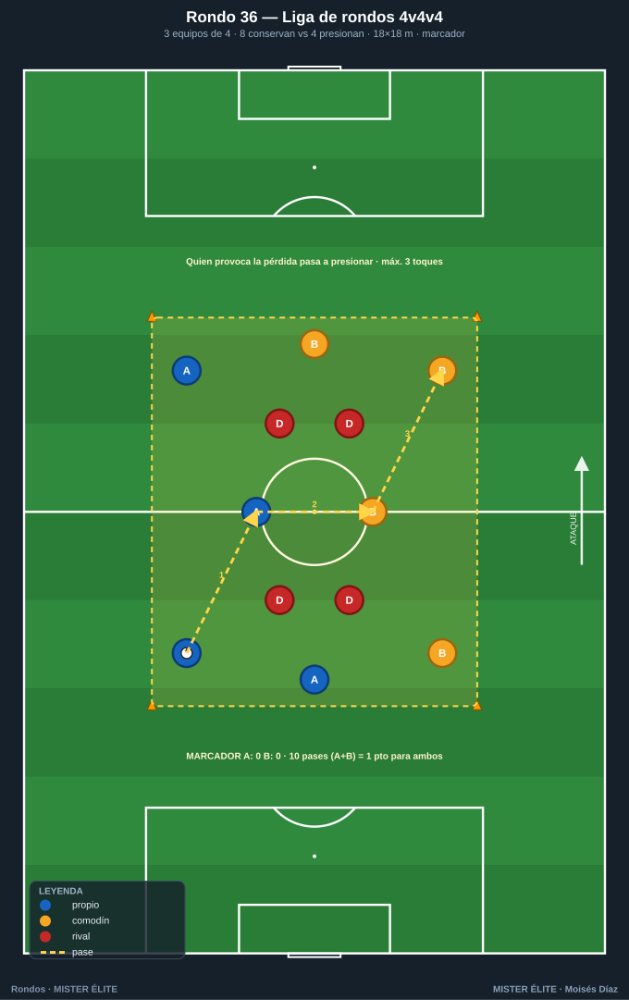
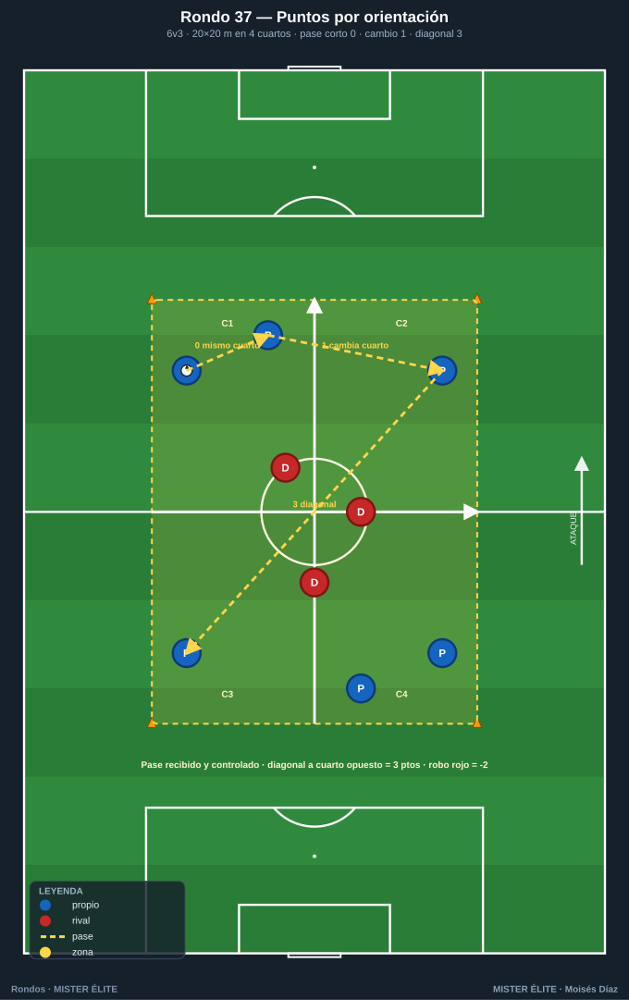
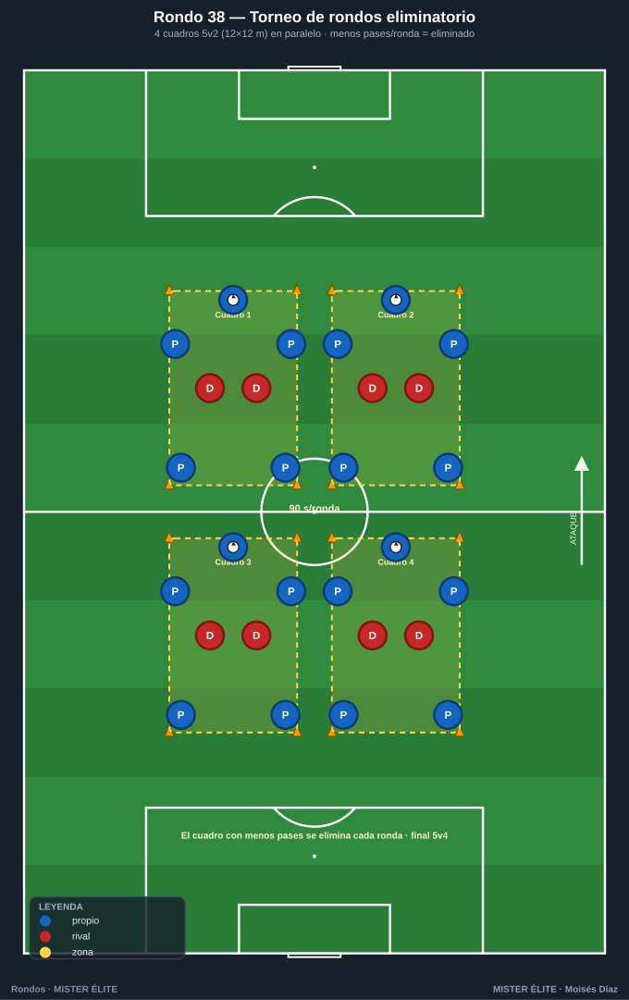
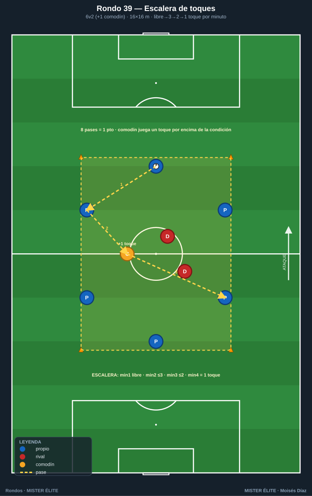
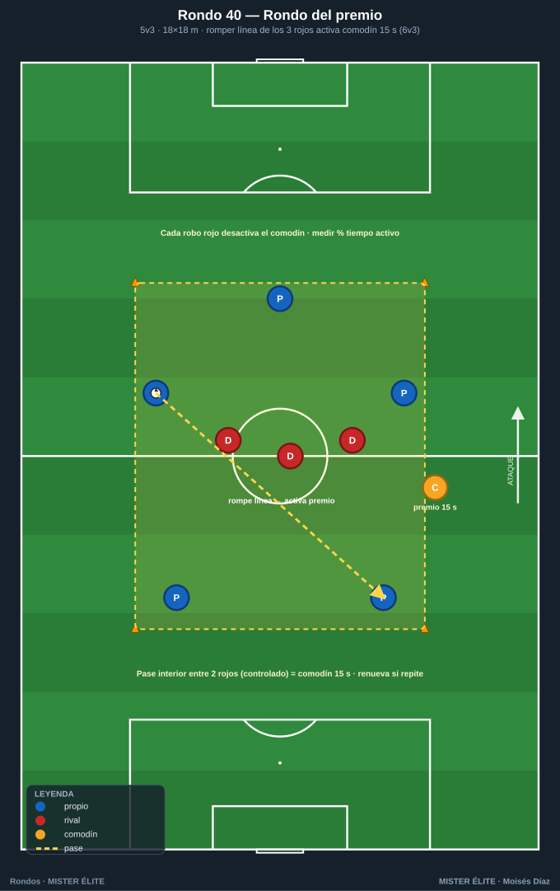
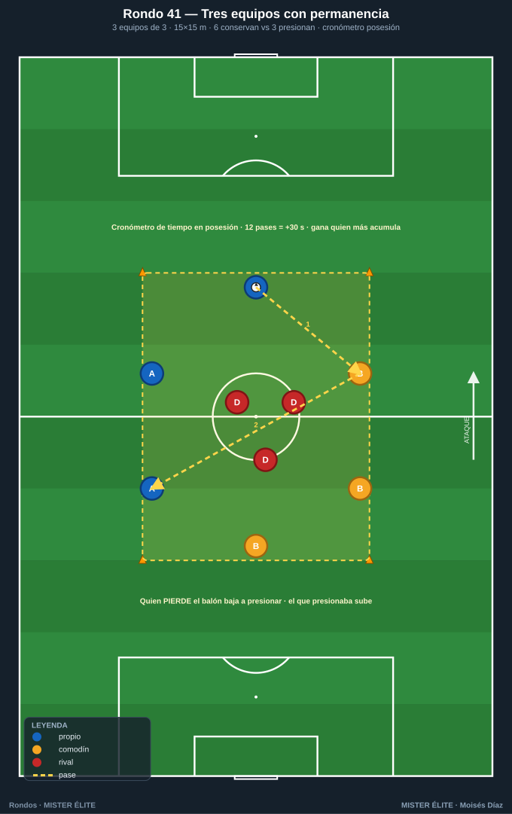
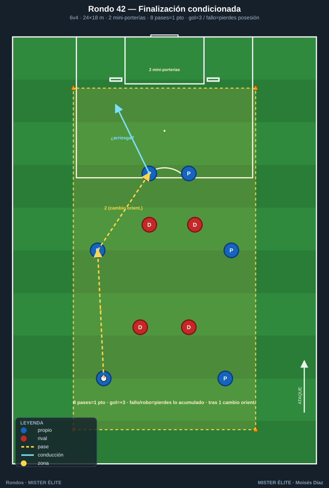
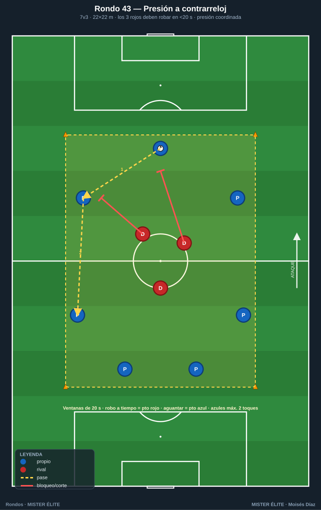

# Familia 6 · Competitivos y condicionados (Rondos 36–43)

> **Las dos fases con marcador, toma de decisión bajo presión, transiciones.** Lo más cercano al partido: tensión competitiva real.
>
> **Notación:** poseedores = **azules**, defensores = **rojos**, comodines = **ámbar**. Espacio con conos; flechas según `README`.

---

## Rondo 36 — "Liga de rondos 4 v 4 v 4" (rotación por equipos)

**Objetivo**
- *Táctico:* competir conservando y presionando con rotación; mentalidad competitiva; cambio rápido de rol poseedor↔presionador.

**Organización**
- Relación: **3 equipos de 4** (azul A, azul B con petos distintos, rojo) en cuadro de **18×18 m**. Dos equipos conservan (8 v 4) y uno presiona.
- Material: 8 conos, 3 juegos de petos, balones, pizarra de marcador.

**Desarrollo**
1. Dos equipos juntan **8 jugadores que conservan** ante los **4 que presionan**.
2. Cada **10 pases** de los poseedores = 1 punto para AMBOS equipos poseedores.
3. Si los presionadores roban (o el balón sale), **entra a presionar el equipo que perdió el balón** y los presionadores pasan a conservar. Gana quien acumule más puntos.

**Provocaciones (medibles)**
- **10 pases = 1 punto** para los dos equipos que poseen.
- El equipo que **provoca la pérdida** pasa a presionar.
- Máx. **3 toques** por jugador.
- Marcador visible; "minijornadas" de 3 min.

**Variantes (fácil → difícil)**
- *Fácil:* 8 pases por punto, toques libres.
- *Medio:* la descrita.
- *Difícil:* 2 toques máximo y los presionadores roban con solo tocar el balón fuera.

**Coaching**
- Comunicación entre los dos equipos poseedores (juegan juntos un momento); concentración para no ser el que pierde; al presionar, robar en bloque, no individualmente.

**Duración / series:** 5 minijornadas de 3 min. Total ~20 min con marcador acumulado.

---

## Rondo 37 — "Rondo con puntos por orientación"

**Objetivo**
- *Táctico:* premiar el juego orientado y el cambio de orientación; un sistema de puntos que recompensa decisiones de calidad, no solo conservar.

**Organización**
- Relación: **6 v 3** en cuadro de **20×20 m** dividido visualmente en **4 cuartos** con conos de color.
- Material: 8 conos perimetrales + 4 conos de color interiores, petos, balones, marcador.

**Desarrollo**
Rondo normal con **puntuación condicionada al valor del pase**:
- Pase corto dentro del mismo cuarto = 0 puntos.
- Pase que **cambia de cuarto** = 1 punto.
- Pase que **cruza en diagonal** a un cuarto opuesto = 3 puntos.
Los rojos roban; cada robo resta 2 puntos al marcador azul. Se acumula por serie.

**Provocaciones (medibles)**
- Solo el pase **recibido y controlado** suma.
- Diagonal larga (cuarto a cuarto opuesto) = **3 puntos**.
- Cada robo de los rojos = **–2** al azul.
- Objetivo de serie: superar 15 puntos = los rojos hacen prenda física.

**Variantes (fácil → difícil)**
- *Fácil:* 7v2, sin penalización por robo.
- *Medio:* la descrita.
- *Difícil:* 6v4 y los cambios diagonales deben ser **antes del 3.er toque del equipo**.

**Coaching**
- Buscar siempre el pase de más valor disponible (escanear antes de recibir); no abusar del pase de seguridad; el cambio diagonal exige que alguien se ofrezca en el cuarto opuesto.

**Duración / series:** 4 series de 3 min, 90 s descanso. Total ~18 min.

---

## Rondo 38 — "Torneo de rondos eliminatorio"

**Objetivo**
- *Táctico:* alta intensidad competitiva por eliminación; gestionar la presión del marcador y el error que elimina.

**Organización**
- Relación: **4 cuadros de 5 v 2** simultáneos (**12×12 m** cada uno).
- Material: 16 conos (4 cuadros), petos, balones, cronómetro.

**Desarrollo**
1. **Formato torneo a rondas.** En cada ronda de **90 s**, el equipo poseedor de cada cuadro intenta encadenar el máximo de pases.
2. El cuadro con **menos pases acumulados** queda eliminado (sus jugadores pasan a presionar en los cuadros restantes).
3. Se reduce hasta una **final** de un solo cuadro con relación ajustada (p. ej. 5 v 4). Gana el último equipo en pie.

**Provocaciones (medibles)**
- Cada ronda dura **90 s**; se cuenta el máximo de pases consecutivos por cuadro.
- El cuadro con **menor marca** se elimina cada ronda.
- Una pérdida reinicia la cuenta a 0.
- En la final, relación numérica más exigente.

**Variantes (fácil → difícil)**
- *Fácil:* rondas de 2 min, sin reinicio total al perder (solo resta).
- *Medio:* la descrita.
- *Difícil:* rondas de 60 s y los eliminados presionan de forma agresiva.

**Coaching**
- Gestionar nervios al ir por detrás; calidad antes que prisa; en la final, leer la presión extra de los eliminados.

**Duración / series:** torneo completo ~16–20 min según nº de rondas.

---

## Rondo 39 — "Rondo condicionado por toques (escalera)"

**Objetivo**
- *Táctico:* adaptarse a una restricción de toques creciente; mejorar el control orientado y la velocidad de circulación bajo condición.

**Organización**
- Relación: **6 v 2 (+1 comodín)** en cuadro de **16×16 m**.
- Material: 8 conos, petos, balones, marcador/cartel de toques.

**Desarrollo**
Rondo con **"escalera de toques"** que cambia cada minuto: minuto 1 libre, minuto 2 máx. 3, minuto 3 máx. 2, minuto 4 a 1 toque obligatorio. El equipo poseedor suma **1 punto por cada 8 pases** sin pérdida; el reto es mantener el rendimiento al apretar la restricción. El comodín ámbar siempre juega **un toque por encima** de la condición.

**Provocaciones (medibles)**
- Restricción de toques **decreciente cada minuto** (libre→3→2→1).
- **8 pases = 1 punto**; un toque de más = pérdida + un azul al medio.
- Comodín juega +1 toque respecto a la condición vigente.
- Récord de la sesión: máxima racha a 1 toque.

**Variantes (fácil → difícil)**
- *Fácil:* escalera libre→3→2 (sin llegar al 1 toque).
- *Medio:* la descrita.
- *Difícil:* 6v3, escalera más rápida (cada 45 s) y sin comodín.

**Coaching**
- Anticipar la condición de toques que viene; primer control que ya orienta hacia el siguiente pase; cuanto menos toque, más importa el desmarque de apoyo previo.

**Duración / series:** 3 bloques de 4 min (una escalera por bloque), 90 s descanso. Total ~16 min.

---

## Rondo 40 — "Rondo del premio: gana espacio, gana ventaja"

**Objetivo**
- *Táctico:* asociar la calidad del juego a una ventaja tangible; condicionante que premia romper líneas con superioridad creada.

**Organización**
- Relación: **5 v 3** en cuadro de **18×18 m** con un **comodín ámbar "de premio" en banda** que se activa.
- Material: 8 conos, petos, balones, marcador.

**Desarrollo**
Rondo 5v3. Cada vez que los azules logran un **pase interior que rompe la línea de los 3 rojos** (entre dos defensores), se **activa el comodín de premio durante 15 s**, convirtiendo el rondo en 6v3. Si pasan 15 s sin romper línea, el comodín se desactiva. Objetivo: mantener el comodín activo el mayor tiempo posible encadenando pases que rompen líneas.

**Provocaciones (medibles)**
- **Pase que rompe línea** (entre dos rojos, recibido y controlado) = activa comodín 15 s.
- Romper línea de nuevo dentro de los 15 s = **renueva** el tiempo.
- Cada robo rojo desactiva el comodín inmediatamente.
- Medir el **% de tiempo con comodín activo** por serie.

**Variantes (fácil → difícil)**
- *Fácil:* comodín activo 25 s, premio por cualquier cambio de orientación.
- *Medio:* la descrita.
- *Difícil:* 5v4 y el comodín solo dura 10 s.

**Coaching**
- Generar la línea de pase interior fijando con pases laterales; reconocer la ventana entre defensores; aprovechar de inmediato la superioridad del premio para volver a romper.

**Duración / series:** 4 series de 3 min, 90 s descanso. Total ~18 min.

---

## Rondo 41 — "Rondo a tres equipos con permanencia"

**Objetivo**
- *Táctico:* competir por permanecer en posesión; intensidad y concentración para no caer al medio; presión coordinada para subir.

**Organización**
- Relación: **3 equipos de 3** en cuadro de **15×15 m** (relación **6 v 3**).
- Material: 8 conos, 3 juegos de petos, balones, marcador.

**Desarrollo**
Dos equipos conservan (6) y uno presiona (3). **Regla de permanencia:** el equipo cuyo jugador **pierde el balón** baja a presionar; el que presionaba sube a conservar. Cada equipo lleva su **contador de tiempo total en posesión**: gana quien acumule más minutos arriba.

**Provocaciones (medibles)**
- El **responsable de la pérdida** baja a presionar (individual o por equipo según versión).
- Se cronometra el **tiempo en posesión** de cada equipo.
- Robar = subir; el equipo que sube reinicia con balón.
- Bonus: 12 pases seguidos = 30 s extra de "tiempo en posesión".

**Variantes (fácil → difícil)**
- *Fácil:* baja el equipo completo, sin cronómetro.
- *Medio:* la descrita con cronómetro.
- *Difícil:* baja solo el jugador que pierde (rondo numéricamente cambiante, 6v3 → 5v4…).

**Coaching**
- Responsabilidad individual en la pérdida; al presionar, salir los 3 a una para subir rápido; gestionar el riesgo (no arriesgar el pase que te puede mandar abajo en momento clave).

**Duración / series:** 1 bloque continuo de 12–15 min con marcador acumulado.

---

## Rondo 42 — "Rondo bonificado por finalización condicionada"

**Objetivo**
- *Táctico:* combinar conservación competitiva con condición de finalización; decidir cuándo arriesgar el pase de gol.

**Organización**
- Relación: **6 v 4** en zona de **24×18 m** con **2 mini-porterías (2 m, sin portero)** en un fondo.
- Material: 8 conos, 2 mini-porterías, petos, balones, marcador.

**Desarrollo**
Los azules conservan y suman **1 punto cada 8 pases**. En cualquier momento pueden **arriesgar a finalizar** en una mini-portería: gol = **3 puntos**, pero si fallan o los rojos roban el intento, **pierden los puntos acumulados de esa posesión** (mecánica "banca o arriesga"). Los rojos, si roban, finalizan a la portería que defienden los azules.

**Provocaciones (medibles)**
- **8 pases = 1 punto** (se acumulan en la posesión).
- Finalizar: gol = **+3**; fallo/robo = **se pierden los puntos de la posesión**.
- Robo de rojos con finalización = puntos para rojos.
- Condición: solo se finaliza tras **mínimo 1 cambio de orientación** en la posesión.

**Variantes (fácil → difícil)**
- *Fácil:* el fallo no resta lo acumulado; porterías más anchas.
- *Medio:* la descrita.
- *Difícil:* el gol exige asistencia de primeras (pase-gol al primer toque del rematador).

**Coaching**
- Leer el momento de arriesgar (riesgo-recompensa); no malgastar una posesión larga con un remate precipitado; el cambio de orientación previo abre el lado para finalizar.

**Duración / series:** 4 series de 3 min, 90 s descanso. Total ~18 min.

---

## Rondo 43 — "Rondo de alta intensidad: presión a contrarreloj"

**Objetivo**
- *Táctico:* intensidad máxima en la presión y resistencia específica; recuperar lo antes posible; condicionante temporal para el equipo defensor.

**Organización**
- Relación: **7 v 3** en cuadro de **22×22 m**.
- Material: 8 conos, petos, balones, cronómetro, marcador.

**Desarrollo**
Los 3 rojos tienen el **reto a contrarreloj**: **robar el balón en menos de 20 s**. Si lo logran, suman 1 punto y descansa la pareja que más corrió; si no, los azules suman 1 punto y los rojos siguen otra ventana. Se rotan los tríos de presión cada 2 ventanas. El espacio amplio obliga a recorrer mucho campo presionando.

**Provocaciones (medibles)**
- Ventanas de **20 s**: robo a tiempo = punto rojo; aguantar = punto azul.
- Rotación de presionadores cada **2 ventanas**.
- Azules a máx. **2 toques** (circular rápido, exigir más a la presión).
- Registrar nº de robos dentro de tiempo por trío.

**Variantes (fácil → difícil)**
- *Fácil:* ventana de 30 s, espacio más pequeño.
- *Medio:* la descrita.
- *Difícil:* ventana de 15 s y cuadro de 25×25 m.

**Coaching**
- Presión coordinada: orientar el robo hacia una zona, no perseguir el balón en desorden; cubrir líneas de pase mientras se aprieta; los azules circulan rápido para fundir a la presión.

**Duración / series:** 6 ventanas por bloque, 2 bloques, 2 min descanso entre bloques. Total ~16 min muy intensos.

---

*MISTER ÉLITE — Moisés Díaz*
