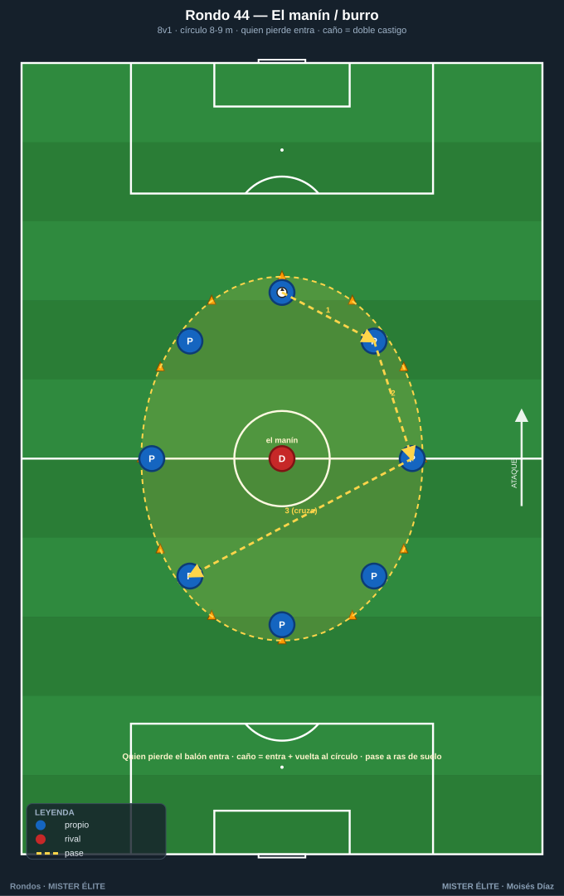
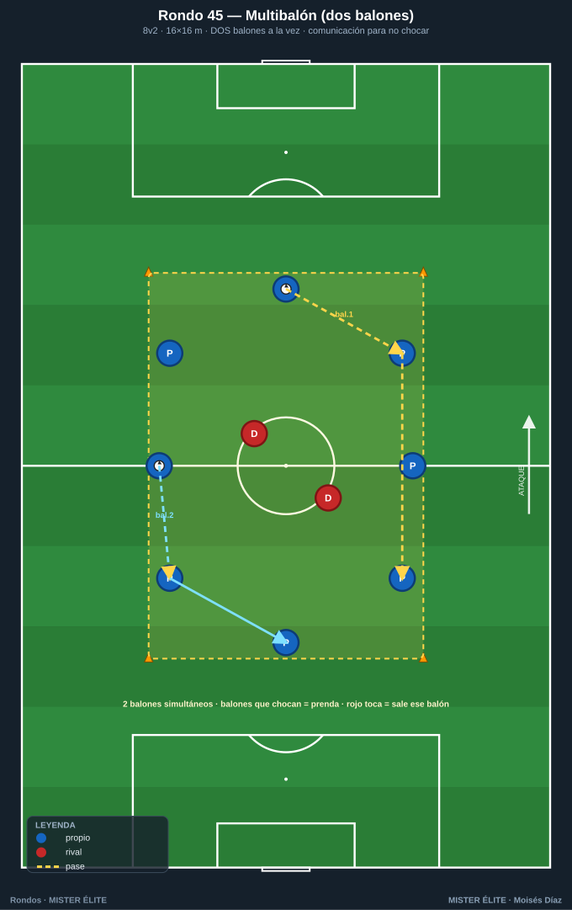
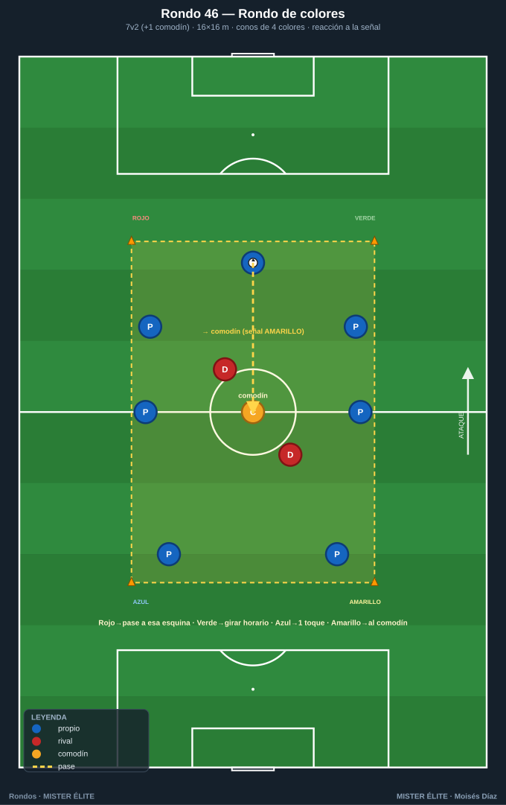
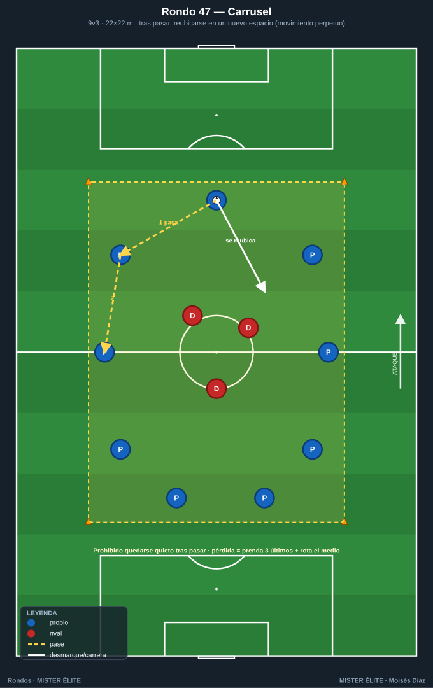
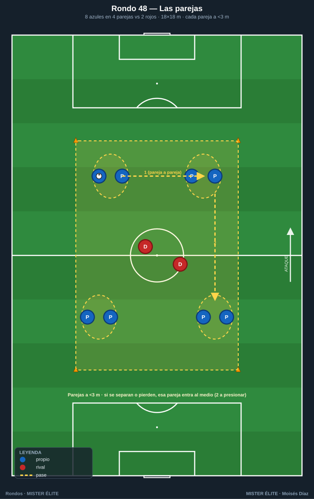
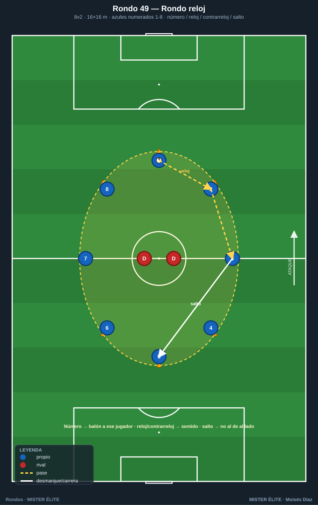
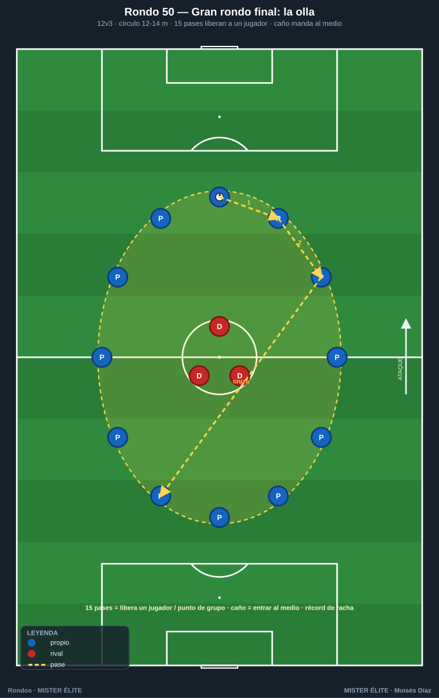

# Familia 7 · Lúdicos y de calentamiento (Rondos 44–50)

> **Activación neuromuscular, ritmo, técnica bajo fatiga ligera, cohesión.** Preparan el cuerpo y el "ojo" para la sesión o el partido.
>
> **Notación:** poseedores = **azules**, defensores = **rojos**, comodines = **ámbar**. Espacio con conos; flechas según `README`.

---

## Rondo 44 — "El manín / burro clásico con castigo activado"

**Objetivo**
- *Socioemocional/técnico:* activación técnica, ambiente competitivo de grupo y castigo que mantiene la concentración; calentamiento divertido con foco en el pase preciso.

**Organización**
- Relación: **8 v 1** en círculo de **8–9 m de diámetro** (un solo defensor, "el manín/burro").
- Material: 8 conos para el círculo, 1 balón, petos opcionales.

**Desarrollo**
1. Rondo clásico: 8 poseedores en círculo, 1 en el medio que intenta robar o tocar el balón.
2. **Quien pierde el balón** (mal pase, balón tocado, o "túnel" sufrido) **pasa al medio**.
3. Castigo: si el del medio hace un **caño/túnel**, el castigado entra y da **una vuelta corriendo al círculo** antes de incorporarse. Ideal como primer ejercicio de la sesión.

**Provocaciones (medibles)**
- Quien pierde el balón **entra al medio**.
- **Caño = doble castigo** (entra + vuelta al círculo).
- Pase a ras de suelo obligatorio (nada de balones altos).
- Récord: cuántos pases seguidos sin que entre nadie.

**Variantes (fácil → difícil)**
- *Fácil:* 10 v 1, balón libre.
- *Medio:* 8 v 1 a 2 toques.
- *Difícil:* 6 v 2 a 1 toque, dos "burros" en el medio.

**Coaching**
- Calidad del pase desde el primer minuto (no es solo juego); abrir ángulos para el compañero; el del medio aprende a cerrar líneas con el cuerpo.

**Duración / series:** 8–10 min de activación al inicio de sesión.

---

## Rondo 45 — "Rondo multibalón (dos balones a la vez)"

**Objetivo**
- *Cognitivo-perceptivo:* atención dividida y visión periférica; calentamiento con alta exigencia de escaneo.

**Organización**
- Relación: **8 v 2** en cuadro de **16×16 m** con **DOS balones en juego simultáneamente**.
- Material: 8 conos, 2 balones, petos.

**Desarrollo**
Rondo normal pero con **dos balones circulando a la vez**. Los 8 azules conservan ambos evitando que choquen o que los 2 rojos los toquen. Exige mirar antes de recibir y comunicar ("¡balón!", "¡voy!"). Si los rojos tocan un balón o dos balones se cruzan, **prenda corta** para los implicados y se reinicia.

**Provocaciones (medibles)**
- **2 balones** simultáneos siempre en juego.
- Balones que **chocan** = prenda para los dos últimos pasadores.
- Rojo toca un balón = ese balón sale, prenda al que lo perdió, se repone.
- Reto: aguantar 60 s con los dos balones vivos sin incidencias.

**Variantes (fácil → difícil)**
- *Fácil:* 1 balón y se añade el 2.º a mitad.
- *Medio:* la descrita (2 balones, 2 rojos).
- *Difícil:* 2 balones a 2 toques, o 3 balones con 9–10 azules.

**Coaching**
- Cabeza arriba y comunicación verbal constante; no fijarse solo en "tu" balón; repartir la atención y anticipar dónde está el otro balón.

**Duración / series:** 8 min de calentamiento cognitivo, 3 mini-rondas con prenda.

---

## Rondo 46 — "Rondo de colores (cognitivo por señal)"

**Objetivo**
- *Cognitivo-perceptivo:* reacción a estímulos externos; asociar color/señal a una acción técnica mientras se conserva.

**Organización**
- Relación: **7 v 2 (+1 comodín)** en cuadro de **16×16 m**. Conos de **4 colores** en las esquinas (los colores son los conos, no los petos).
- Material: 8 conos perimetrales + 4 conos/petos de color, petos, balón.

**Desarrollo**
Rondo de conservación con **señal cognitiva**. El entrenador grita un color de cono y el equipo **reacciona** según el código pactado sin perder el balón:
- **Rojo** → el siguiente pase va hacia la esquina de ese color.
- **Verde** → todos cambian de posición girando en sentido horario.
- **Azul** → siguiente pase a 1 toque.
- **Amarillo** → buscar al comodín obligatoriamente.
El reto es no equivocarse de acción y no perder el balón.

**Provocaciones (medibles)**
- Reaccionar a la señal **antes del 2.º pase** tras oírla.
- Error de código = prenda corta o entrar al medio.
- Mantener el balón mientras se ejecuta la consigna.
- Subir el ritmo de señales hacia el cierre del calentamiento.

**Variantes (fácil → difícil)**
- *Fácil:* solo 2 colores/códigos, señal lenta.
- *Medio:* la descrita (4 códigos).
- *Difícil:* señal **invertida** (rojo significa lo del verde) para forzar inhibición cognitiva.

**Coaching**
- Atención al entrenador sin descuidar el balón; reacción rápida pero técnica limpia; el componente cognitivo prepara la mente para leer estímulos en el partido.

**Duración / series:** 8–10 min de activación cognitiva.

---

## Rondo 47 — "Rondo carrusel con prenda divertida"

**Objetivo**
- *Físico/lúdico:* activación dinámica con desplazamientos; calentamiento músculo-articular integrado en el juego; ambiente desenfadado con castigo motivador.

**Organización**
- Relación: **9 v 3** en cuadro grande de **22×22 m** donde los azules deben **rotar constantemente** (carrusel).
- Material: 8 conos, petos, balón, marcador de prendas.

**Desarrollo**
Rondo de conservación con regla del **carrusel**: tras pasar, el jugador **debe desplazarse a un nuevo espacio** (no se queda quieto), generando movimiento continuo de calentamiento dinámico. Cuando los rojos roban o el balón sale, los **tres últimos azules que tocaron el balón** hacen una **prenda divertida** y se rota quién va al medio.

**Provocaciones (medibles)**
- **Prohibido quedarse quieto** tras pasar (si te pillan parado, prenda).
- Pérdida = prenda para los 3 últimos pasadores + rota el medio.
- Mantener el balón vivo el máximo tiempo (récord de grupo).
- Progresión del calentamiento: empezar suave, subir intensidad de desplazamientos.

**Variantes (fácil → difícil)**
- *Fácil:* 10 v 2, desplazamientos cortos.
- *Medio:* la descrita.
- *Difícil:* 8 v 3 a 2 toques con desplazamiento obligatorio a la banda contraria a la que pasas.

**Coaching**
- Movimiento con intención (ofrecer línea de pase, no correr por correr); calentar gradualmente; mantener calidad técnica pese al ambiente lúdico.

**Duración / series:** 8–10 min como parte central del calentamiento.

---

## Rondo 48 — "Rondo de las parejas (cooperación lúdica)"

**Objetivo**
- *Socioemocional:* activación con componente cooperativo; coordinación por parejas; calentamiento divertido que exige comunicación.

**Organización**
- Relación: **8 azules en 4 parejas v 2 rojos** en cuadro de **18×18 m**. Los azules juegan **emparejados** (cada pareja a menos de 3 m).
- Material: 8 conos, petos, balón, petos de pareja del mismo color.

**Desarrollo**
Rondo cooperativo: los 8 azules forman 4 parejas que permanecen **juntas** (a menos de 3 m). Conservan ante 2 rojos. El reto es coordinarse con tu pareja para ofrecer apoyos sin separarse. Si una pareja se separa demasiado o pierde el balón, esa pareja **entra al medio** (los 2 a presionar) y los rojos suben.

**Provocaciones (medibles)**
- Las parejas no se separan **más de 3 m** (penalización: prenda o entrar al medio).
- Pérdida de balón = la pareja responsable baja a presionar.
- 6 pases seguidos sin separación = punto de grupo.
- Sube la dificultad reduciendo la distancia permitida (2 m).

**Variantes (fácil → difícil)**
- *Fácil:* distancia de pareja amplia (5 m), 1 rojo.
- *Medio:* la descrita.
- *Difícil:* parejas cogidas de la mano todo el rondo.

**Coaching**
- Comunicación con la pareja; ofrecer apoyo sin romper la unión; el componente socioemocional refuerza la cohesión del grupo.

**Duración / series:** 8 min de activación cooperativa.

---

## Rondo 49 — "Rondo reloj (señales numéricas y direccionales)"

**Objetivo**
- *Cognitivo-perceptivo:* reacción a números/direcciones; agilidad mental y cambios de sentido; preparar la lectura rápida de situaciones.

**Organización**
- Relación: **8 v 2** en círculo/cuadro de **16×16 m** con los azules numerados del **1 al 8**.
- Material: 8 conos, petos numerados, balón.

**Desarrollo**
Rondo de conservación donde el entrenador **dicta el orden o el sentido**:
- **Número** → el balón va a ese jugador.
- **"Reloj"** → pases en sentido horario obligatorio.
- **"Contrarreloj"** → sentido antihorario.
- **"Salto"** → prohibido pasar al de al lado, hay que saltar a uno más lejano.
Los azules ejecutan sin perder el balón ante 2 rojos. Equivocarse = entrar al medio.

**Provocaciones (medibles)**
- Reaccionar a la consigna en el **siguiente pase**.
- Pase a número/sentido equivocado = entra al medio.
- Mantener el balón vivo bajo la consigna activa.
- Acelerar el ritmo de órdenes hacia el final del calentamiento.

**Variantes (fácil → difícil)**
- *Fácil:* solo "reloj/contrarreloj", sin números.
- *Medio:* la descrita.
- *Difícil:* combinar dos consignas ("contrarreloj + salto") simultáneas.

**Coaching**
- Escaneo previo para saber dónde está cada número; reacción ágil con técnica limpia; el reto cognitivo activa la concentración antes del trabajo principal.

**Duración / series:** 8–10 min de activación cognitiva.

---

## Rondo 50 — "Gran rondo final: olla con premio y castigo"

**Objetivo**
- *Socioemocional:* cierre lúdico-competitivo de la sesión; descarga emocional y diversión manteniendo técnica; rondo de gran grupo que une al equipo.

**Organización**
- Relación: **gran rondo de todo el grupo**, p. ej. **12 v 3** en círculo amplio de **12–14 m de diámetro** (la "olla").
- Material: conos para el círculo, 1 balón, marcador de prendas/premios.

**Desarrollo**
Rondo de cierre con **sistema de premio y castigo**:
- Cada **15 pases seguidos** del grupo = se **libera a un jugador** del medio o se anota un punto de grupo hacia el premio final.
- **Caño/túnel** del defensor a un poseedor = ese poseedor entra al medio y el grupo le dedica un "ole".
- Quien pierde el balón entra al medio; si ya hay 3, sale el que más tiempo lleve.
Es el broche de la sesión: alta participación, risas y calidad técnica bajo presión emocional.

**Provocaciones (medibles)**
- **15 pases = premio** (liberar jugador / punto de grupo).
- **Caño = castigo** (entrar al medio).
- Récord de la sesión: máxima racha de pases del grupo entero.
- Premio final tangible pactado (menos prenda física, elegir el siguiente ejercicio, etc.).

**Variantes (fácil → difícil)**
- *Fácil:* 14 v 2, balón libre, 12 pases para premio.
- *Medio:* la descrita (12 v 3).
- *Difícil:* 10 v 4 a 2 toques, 20 pases para premio.

**Coaching**
- Mantener calidad técnica aunque sea el cierre y haya cansancio; ambiente positivo que refuerza la cohesión; el premio colectivo fomenta el juego en equipo por encima del lucimiento individual.

**Duración / series:** 8–12 min como cierre de la sesión.

---

*MISTER ÉLITE — Moisés Díaz*
