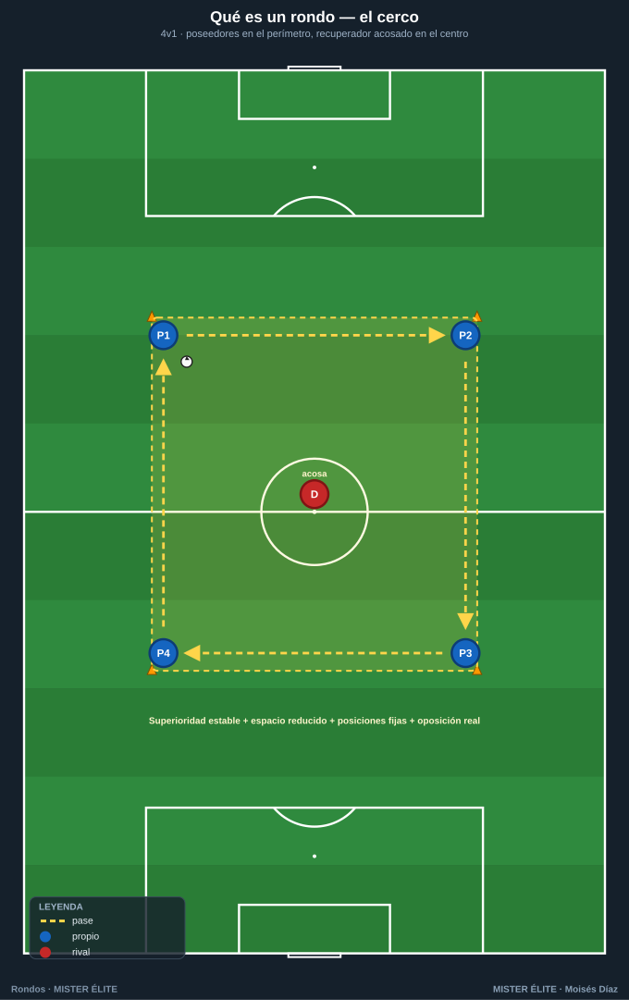
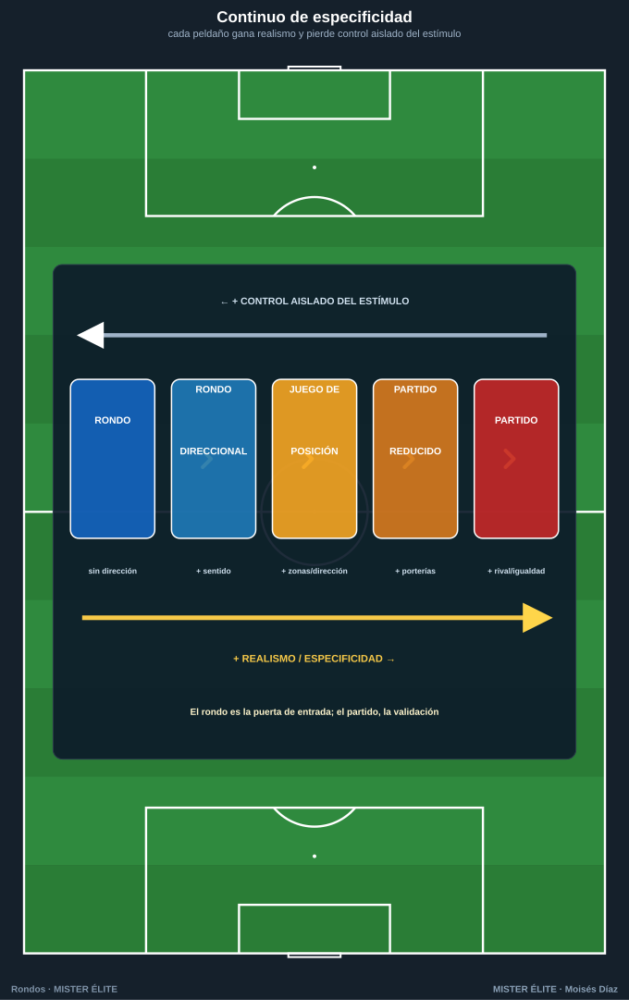
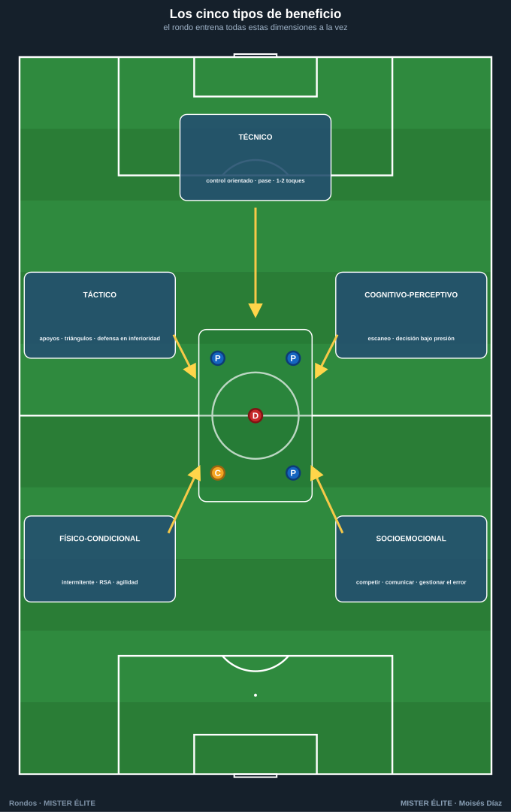

# Módulo 01 · Fundamentos de los rondos

> Poca teoría, mucha práctica. Este módulo te da lo justo para entender **qué es** un rondo, **de dónde viene** y **por qué** es la tarea reina. A partir del módulo 02 ya estamos diseñando; del 04 en adelante, ejecutando los 50 rondos.

---

## 1. Qué es un rondo (definición operativa)

Un rondo es una **tarea jugada de mantenimiento–recuperación del balón en superioridad numérica**, dentro de un **espacio reducido y delimitado**, con **posiciones de partida fijadas** (poseedores normalmente en el perímetro, recuperadores en el centro), donde un grupo conserva la posesión y otro, en inferioridad, intenta robarla.

Cuatro rasgos lo definen y lo distinguen de cualquier otra tarea:

1. **Superioridad numérica estable para el poseedor** (4v1, 5v2, 6v3…). La ventaja es estructural y permanente, no coyuntural.
2. **Espacio reducido y delimitado** (cuadrado, rectángulo, círculo o rombo con conos), que comprime el tiempo y el espacio de decisión.
3. **Posiciones de partida pre-fijadas**: los poseedores ocupan el contorno; el o los recuperadores, el interior. De ahí el característico "cerco" alrededor del que roba.
4. **Doble objetivo simultáneo y opuesto**: un equipo **conserva** y el otro **recupera**. Hay oposición real; no es una rueda de pases.

> **Origen del nombre.** En España se le llamó *torello* ("torito"), porque el del centro persigue el balón como un toro al capote; en el mundo anglosajón, *piggy in the middle*. "Rondo" (de *redondo*, jugar en círculo) se impuso después.

### Diferencias con tareas vecinas

El rondo se confunde a menudo con el **juego de posición** y con el **partido reducido (SSG)**. No son lo mismo:

| Criterio | **Rondo** | **Juego de posición** | **Partido reducido (SSG)** |
|---|---|---|---|
| Naturaleza | Tarea / herramienta | Tarea **y** concepto del modelo de juego | Forma reducida del partido |
| Relación numérica | Superioridad estable (4v1, 5v2…) | Superioridades zonales (3v2, 4v3) por zonas | Tiende a la igualdad |
| Estructura del espacio | Un solo espacio, posiciones fijas | Espacio **sectorizado** por zonas/pasillos | Campo con porterías, estructura de partido |
| Dirección del juego | Habitualmente **sin dirección** | Direccional o semidireccional | **Direccional**: hay portería |
| Objetivo dominante | Conservar y recuperar | Ocupar el espacio para progresar | Competir cercano al partido (con gol) |
| Especificidad | Media (sin porterías) | Alta (dirección, zonas, fases) | Muy alta (es el partido en pequeño) |

**Claves para no confundirlos:**

- El **rondo** es la **célula básica**: máximo control del entrenador, pocas variables, mucha repetición de fundamentos en superioridad.
- El **juego de posición** añade **dirección y sectorización**: ya no se conserva por conservar, sino para **progresar ocupando bien el espacio**. El rondo es su puerta de entrada.
- El **partido reducido** añade **finalización, porterías e igualdad**: máxima transferencia, menor control del entrenador.

Conviene verlo como un **continuo de especificidad**: cada peldaño gana realismo y pierde control aislado del estímulo.

---

## 2. Origen e historia (la versión honesta)

- **Tradición neerlandesa y Total Football.** El rondo es inseparable del *Totaalvoetbal* del Ajax y la selección neerlandesa de los 70 (Rinus Michels, con Johan Cruyff como referencia). El fútbol total exige recibir, orientarse y pasar bajo presión en espacios pequeños: el rondo es su laboratorio.
- **Laureano Ruiz en Barcelona.** Un matiz a menudo omitido: el rondo como herramienta sistemática de formación en La Masia se asocia al técnico cántabro **Laureano Ruiz**, responsable del fútbol base del FC Barcelona desde comienzos de los 70 (y del primer equipo en 1976). Es decir, el rondo estaba en Barcelona **antes** del Cruyff entrenador.
- **Cruyff y la universalización.** Cruyff, síntesis de la escuela neerlandesa y la española, lo convirtió en seña de identidad al volver como entrenador del Barça en **1988** (el "Dream Team"), llevándolo al entrenamiento diario y a la rutina previa al partido.
- **La Masia y Guardiola.** La generación formada en esa cultura (Guardiola incluido) heredó el rondo como gramática básica. Con **Pep Guardiola** (2008–2012) y su éxito global, las imágenes del rondo dieron la vuelta al mundo: hoy es patrimonio común de cualquier estilo.

> *"Todo lo que ocurre en un partido, excepto el remate, lo puedes hacer en un rondo."* — Johan Cruyff

**Cronología en una frase:** ejercicios de mantenimiento en círculo ya existían en los 50–60; en los **70** confluyen dos focos (neerlandés y catalán); Cruyff lo institucionaliza (1988–96); Guardiola lo universaliza (2008→). Lo correcto es presentarlo como **tradición compartida**, sin una paternidad única no documentable.

---

## 3. Por qué es la "tarea reina": el principio de especificidad

El jugador **se adapta a aquello que entrena de forma parecida a como compite**. Por eso el entrenamiento moderno prefiere tareas jugadas frente a ejercicios analíticos: una rueda de pases sin oposición mejora el gesto, pero no la **lectura** ni la **decisión** que el partido exige.

El rondo cumple la especificidad mejor que casi cualquier tarea simple:

1. **Hay balón, oposición y compañeros** → se percibe, decide y ejecuta con adversario, no en el vacío.
2. **El espacio reducido comprime tiempo y distancias** → obliga a percibir antes y decidir más rápido; luego el partido "parece más lento".
3. **Densidad de acciones altísima** → decenas de controles, pases, apoyos y presiones por jugador en pocos minutos.
4. **Integra todas las dimensiones a la vez** (técnica, táctica, cognitiva, condicional, emocional), como en la competición.
5. **Es infinitamente regulable**: cambiando número, espacio, toques, comodines y reglas, el mismo formato sirve para objetivos opuestos.

Esa combinación de **alta especificidad + alta densidad + máxima regulabilidad** es lo que lo hace *tarea reina*.

> Matiz: el rondo es reina, **no monarca absoluta**. En su forma básica no tiene dirección ni finalización. Por eso necesita progresar hacia rondos direccionales, juego de posición y partido reducido para cerrar la transferencia (módulo 03).

---

## 4. Los tipos de beneficio

El rondo entrena todas estas dimensiones **a la vez**. Las separamos solo para describirlas.

### 4.1 Técnico
Control orientado y primer toque útil; calidad, peso y timing del pase; uso de todas las superficies y ambas piernas; protección y conducción breve para fijar; ritmo de circulación a uno o dos toques.

### 4.2 Táctico
Apoyos y ángulos que abren línea de pase; triángulos y rombos permanentes (siempre dos opciones); ampliación del espacio y búsqueda del hombre libre; orientación corporal y cambio de orientación; y, para los del centro, **presión tras pérdida y defensa en inferioridad** (el lado defensivo del rondo, muy infravalorado).

### 4.3 Cognitivo-perceptivo
Toma de decisiones bajo presión temporal; **escaneo / visión periférica** (mirar antes de recibir); anticipación de la presión y del compañero; atención sostenida; reconocimiento de patrones (localizar al hombre libre, la línea abierta).

### 4.4 Físico-condicional
Acciones intermitentes de alta intensidad (sobre todo para el recuperador); cambios de ritmo y agilidad en espacio corto; **RSA** (capacidad de repetir esfuerzos cortos); carga regulable con el tamaño del espacio, la relación numérica y el tiempo en el centro.

### 4.5 Socioemocional
Tensión competitiva del marcador implícito; cohesión y comunicación; gestión del error y del "castigo" simbólico de quedar en el centro; liderazgo y autoexigencia entre iguales.

---

## Ideas clave

- El rondo = **superioridad estable + espacio reducido + posiciones fijas + oposición real**. Sin oposición y sin reglas, no es un rondo: es una rueda de pases.
- No es lo mismo que el juego de posición (añade dirección y zonas) ni que el partido reducido (añade porterías e igualdad). Son **peldaños de un continuo de especificidad**.
- Es **tradición compartida** (neerlandesa + catalana), consolidada en los 70, popularizada por Cruyff y universalizada por Guardiola. Sin paternidad única.
- Es la **tarea reina** por especificidad + densidad + regulabilidad, pero **no monarca absoluta**: necesita progresar para llegar al gol.
- Entrena **cinco dimensiones a la vez**; el jugador del centro entrena la **defensa en inferioridad**, no pierde el tiempo.

## Errores comunes

- **Tratarlo solo como calentamiento.** Es un uso legítimo, pero reduccionista: bien diseñado, es tarea principal (conservación, presión, RSA, decisión).
- **Confundirlo con "jugar al toro" sin objetivo.** Sin objetivo, reglas ni feedback, degenera en pasarse el balón.
- **Creer que solo sirve a equipos posesionales.** Su fase defensiva (presión, robo en inferioridad) es oro para equipos de transición.
- **Pensar que no transfiere por no tener porterías.** La transferencia se construye **progresando** (módulo 03), no descartando la herramienta.
- **Verlo como ejercicio "solo técnico".** Su mayor virtud es integrar técnica, táctica, cognición y condición a la vez.
- **"Cuanto más rato, mejor".** La calidad cae con la fatiga: **series cortas e intensas con foco**, no rondos eternos.

---

*MISTER ÉLITE — Moisés Díaz*
