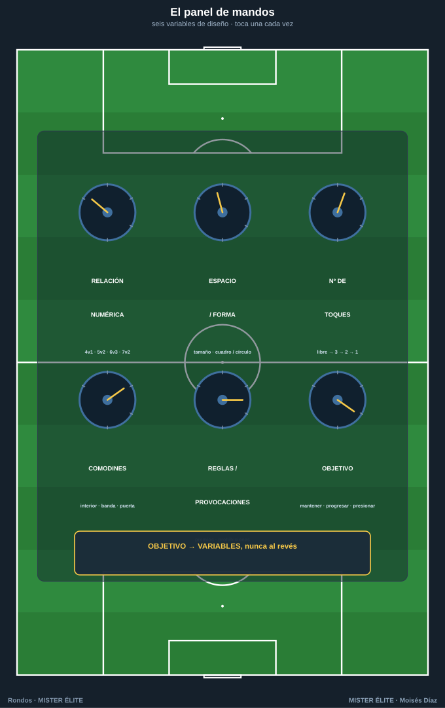
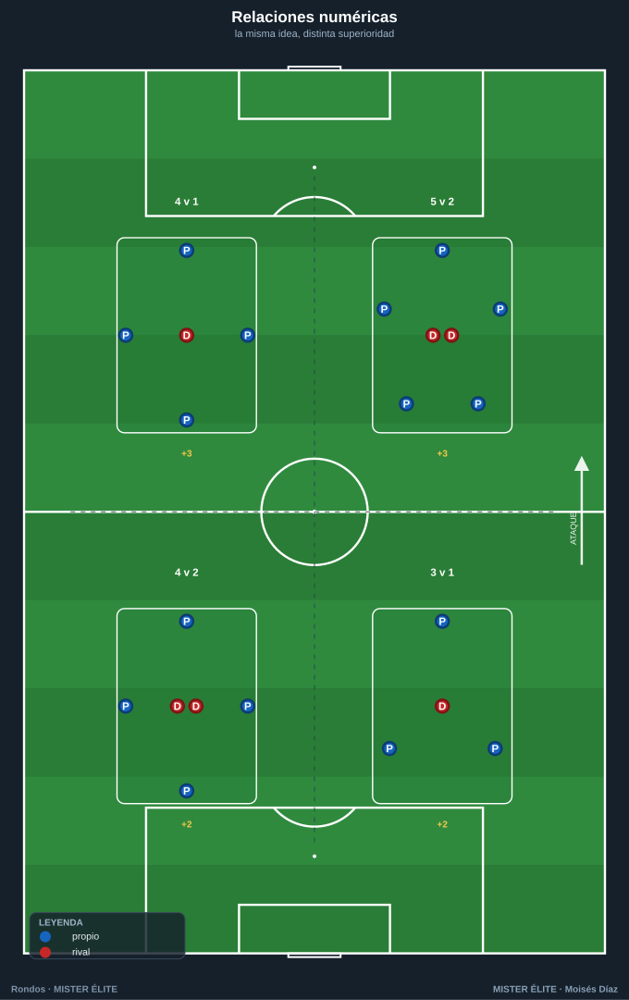
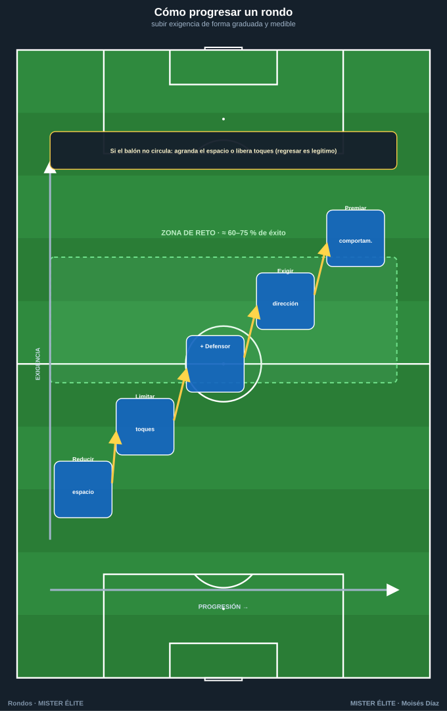
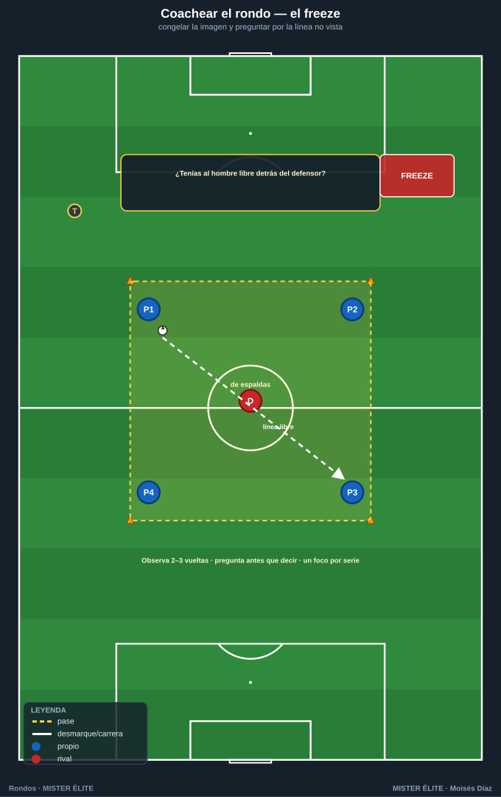

# Módulo 02 · Metodología y diseño del rondo

> El rondo no es un juego que "sale bien o mal": es una **tarea diseñada**. El entrenador no improvisa, manipula variables para provocar exactamente el comportamiento que quiere entrenar. Cambiar una sola variable cambia el estímulo. Este módulo es el panel de mandos.

---

## 1. Las variables de diseño (el panel de mandos)

Toda tarea de rondo se construye combinando **seis variables**. Modificar una altera la carga cognitiva, técnica, defensiva o física. Regla maestra: **se toca una variable cada vez** para saber qué causó el cambio.

### 1.1 Relación numérica (poseedores v defensores)

Fija la **dificultad estructural**. Se lee como ratio de superioridad: cuantos más poseedores por defensor, más fácil conservar.

| Relación | Superioridad | Estímulo dominante | Para qué |
|---|---|---|---|
| **4v1 / 5v1** | +3 / +4 | Confort, ritmo, primer toque | Iniciación, calentamiento, técnica pura |
| **4v2 / 5v2** | +2 / +3 | El clásico: líneas de pase y "tercer hombre" | Mantenimiento y circulación |
| **3v1** | +2 | Triángulo permanente, apoyo constante | Base técnica con poco espacio |
| **6v3 / 7v3** | +3 / +4 | Muchas líneas, exige levantar la cabeza | Posicional, escaneo |
| **7v2** | +5 | Superioridad enorme: foco en **calidad** del pase | Calentamiento de élite, ritmo alto |
| **Igualdad + comodines** | ≈ par | Tensión real, parecido a partido | Competitivo, transferencia |

**Principio:** a menor superioridad → más velocidad, más errores, más fatiga del defensor → más realista pero menos tiempo para el detalle técnico. A mayor superioridad → laboratorio limpio para pulir el gesto.

### 1.2 Espacio y forma

El espacio regula **tiempo y distancias**. Es la segunda palanca de dificultad.

- **Tamaño**: grande = más tiempo y pases largos (más fácil); pequeño = todo más rápido, primer toque y orientación obligatorios (más difícil). **Reducir el espacio es la forma nº 1 de subir exigencia sin tocar jugadores.**
- **Forma**:
  - **Cuadrado** → simetría, líneas equidistantes, mantenimiento puro.
  - **Rectángulo** → genera un sentido (largo/ancho); base para orientar y cambiar de orientación.
  - **Círculo** → sin esquinas, apoyos infinitos, ideal para 1–2 toques (iniciación).
  - **Dividido en zonas / pasillos** → introduce **dirección y prohibiciones** ("cambiar de zona obligatorio"): aquí nace el juego de posición.

### 1.3 Número de toques

Ataja directamente la **velocidad de pensamiento y la calidad técnica**.

- **Libre** → confort, noveles, primeras repeticiones.
- **3 toques** → control–perfil–pase; transición a la exigencia.
- **2 toques** → estándar de mantenimiento: obliga al **primer toque orientado**.
- **1 toque** → máxima exigencia cognitiva: obliga a **escanear antes de recibir**. No introducir hasta dominar el de 2.
- **Condicionado / mixto** → "comodín a 1 toque, resto libre"; individualiza la carga.

### 1.4 Comodines (apoyos neutrales, fichas ámbar)

Juegan siempre con quien posee. Crean superioridad artificial y, sobre todo, **fijan dónde queremos que circule el balón**. Su ubicación es la enseñanza.

- **Interiores** → enseñan a jugar **entre líneas** y el rol de pivote.
- **Exteriores / perimetrales** → amplían el campo, dan salida segura.
- **De banda** → fuerzan el **cambio de orientación** y la amplitud.
- **Comodín "puerta"** entre zonas → premia la **progresión** (solo se usa para avanzar de zona).

Variar sus toques (p. ej. a 1) lo convierte en pared/relé, no en refugio.

### 1.5 Reglas y provocaciones

Las **provocaciones** fuerzan un comportamiento sin pedirlo verbalmente. Es la herramienta más fina: no se explica el principio, se **provoca** que aparezca.

- "Pase al jugador enfrente del defensor que presiona" → juega la línea que abre el rival.
- "Vale doble el pase de primeras tras recibir entre líneas" → premia el pase interior.
- "Si el balón cambia de zona, suma punto" → provoca el cambio de orientación.
- "Prohibido devolver al que te la dio" → obliga al **tercer hombre**.
- "3 toques seguidos del que roba = gol del defensor" → exige juego colectivo también al recuperar.

### 1.6 Objetivo de la tarea (la intención táctica)

Da **sentido** a todas las demás variables. Antes de medir nada, define qué entrenas:

- **Mantener** → conservar bajo presión (4v2, 5v2).
- **Progresar** → avanzar con dirección (zonas, comodín-puerta).
- **Orientar** → cambiar el punto de juego, escanear (rectángulo, comodines de banda).
- **Presionar / recuperar** → foco en el defensor: robar y transición.

> **Regla de oro: objetivo → variables, nunca al revés.** Primero decides el principio a entrenar; luego eliges relación, espacio, toques, comodines y provocaciones que lo hagan aparecer de forma inevitable.

---

## 2. Cómo progresar un rondo (fácil → difícil)

Progresar = subir exigencia de forma **graduada y medible**, manteniendo la tasa de éxito en una "zona de reto" (orientativo: los poseedores conservan en torno al **60–75 %** de las series). Palancas, de menor a mayor coste de explicar:

1. **Reducir el espacio** → la palanca más limpia: misma tarea, menos tiempo.
2. **Limitar los toques** (libre → 3 → 2 → 1) → exige primer toque orientado y escaneo.
3. **Añadir un defensor** (4v1 → 4v2 → 5v3…) → presión real y fatiga.
4. **Exigir orientación / dirección** → de "mantener" a "jugar al lado libre" o "progresar de zona".
5. **Premiar comportamientos** (puntos dobles, condiciones) → afina el detalle sin endurecer la mecánica.

**Ejemplo de progresión real (misma familia, 4 escalones):**

| Escalón | Diseño | Qué añade |
|---|---|---|
| 1 | 5v2 · cuadro 12×12 · libres | Circular cómodo, leer las dos sombras del defensor |
| 2 | 5v2 · 10×10 · 3 toques | Menos espacio + control orientado |
| 3 | 4v2 · 10×10 · 2 toques | Menos superioridad, primer toque obligado |
| 4 | 4v2 · 9×9 · 2 toques + "doble el pase interior entre los dos defensores" | Provocación táctica: jugar la línea que rompe |

Regresar es igual de legítimo: si el balón no circula, **agranda el espacio o libera toques** antes que repetir instrucciones.

---

## 3. Cómo coachear un rondo

El rondo es alta densidad de repeticiones; el entrenador es **gestor del estímulo**, no espectador.

### 3.1 Feedback: cuándo y cómo

- **Cuándo**: prioriza el feedback **en frío** (entre series). Interviene "en caliente" solo para un error que se fija y repite. Regla práctica: **observa 2–3 vueltas antes de hablar**.
- **Cómo**:
  - **Preguntar antes que decir** ("¿tenías al hombre libre detrás del defensor?") → desarrolla el escaneo.
  - **Congelar (freeze)** una imagen concreta cuando la enseñanza es posicional: parar, señalar la línea no vista, reanudar. Breve.
  - **Demostrar** el gesto cuando el fallo es de ejecución.
  - Dosis: **poco y concreto**. Un foco por serie.

### 3.2 Momentos de intervención

- **Antes**: objetivo en una frase ("hoy: primer toque hacia donde voy a jugar").
- **Durante**: solo correcciones puntuales y de intensidad; mantener el ritmo.
- **Pausas**: el grueso del coaching. Pregunta, congela, reajusta una variable.
- **Cierre**: 30" de conexión con el partido ("esto es la salida presionada del domingo").

### 3.3 Detalles técnicos a corregir (la checklist del ojo)

- **Perfil / orientación corporal**: recibir **medio girado**, viendo la siguiente línea de pase.
- **Primer toque orientado**: el control ya direcciona hacia donde se va a jugar.
- **Escaneo (head-check)**: mirar **antes** de recibir. Es la causa raíz de la mayoría de pérdidas.
- **Calidad y peso del pase**: al pie correcto, raso, **firme** (un pase blando lo intercepta el defensor).
- **Cuerpo y apoyos**: ofrecerse en línea de pase, proteger con el cuerpo, **moverse tras pasar** (pasar y apoyar, no pasar y mirar).

### 3.4 Gestión de la intensidad

- El rondo decae solo: **series cortas e intensas** con descanso claro.
- Controlar la carga del **defensor** (es quien más corre): rotarlo con frecuencia para que la presión sea real.
- Distinguir el rondo de **activación** (media, técnico, riesgo bajo) del **competitivo** (alta, con marcador) y ubicarlos en consecuencia.

---

## 4. Errores comunes, carga y ubicación

### 4.1 Errores de diseño

- **No definir el objetivo** → un rondo "bonito" que no entrena nada.
- **Relación mal calibrada** → demasiada superioridad (aburre) o demasiado poca (no circula).
- **Espacio inadecuado** → grande mata la exigencia técnica; pequeño con noveles colapsa la tarea.
- **Demasiadas reglas a la vez** → satura el cognitivo. **Una** provocación clave.
- **Comodines mal ubicados** → se colocan **donde quieres que ocurra el juego**, o sobran.

### 4.2 Errores al dirigir

- **Hablar demasiado / parar constantemente** → mata el ritmo y la densidad.
- **Corregir solo la ejecución y nunca la decisión** → mejora el gesto, no el jugador.
- **No rotar al defensor** → presión falsa y carga injusta.
- **No conectar con el partido** → el jugador lo hace "porque toca".
- **Tolerar baja intensidad** o **alargar hasta la fatiga técnica**.

### 4.3 Carga y ubicación en la sesión

- **Calentamiento / activación**: alta superioridad (5v2, 7v2), técnicos, riesgo bajo, intensidad creciente.
- **Parte principal**: rondos con objetivo táctico (orientación, progresión, presión) y, si procede, marcador.
- **Según el día del microciclo (MD)**: ajustar la carga a la proximidad del partido (se desarrolla en el módulo 03).
- **Como herramienta**: el rondo puede abrir, vertebrar o servir de transición entre bloques. No es solo "el calentamiento".

---

## Ideas clave

- **Seis variables**: relación numérica, espacio/forma, toques, comodines, reglas/provocaciones y objetivo. Toca **una cada vez**.
- **Objetivo → variables, nunca al revés.** Primero el principio; luego el diseño que lo provoca.
- **Reducir el espacio** es la palanca más limpia para subir exigencia; **liberar toques o agrandar** la mejor para bajarla.
- Mantén la **zona de reto** (≈60–75 % de éxito): ni aburre ni colapsa.
- Coaching: **observa 2–3 vueltas**, feedback **en frío**, pregunta y congela, **un foco por serie**.
- **Rota al defensor**: es quien recibe el estímulo condicional y quien hace real la presión.

## Errores comunes

- Diseñar sin objetivo, o cambiar varias variables a la vez (no sabrás qué causó el cambio).
- Relación numérica o espacio mal calibrados respecto a la zona de reto.
- Amontonar reglas y saturar el cognitivo.
- Comodines decorativos que no refuerzan el principio.
- Hablar de más, corregir solo la ejecución, no rotar al defensor y no conectar con el partido.

---

*MISTER ÉLITE — Moisés Díaz*
