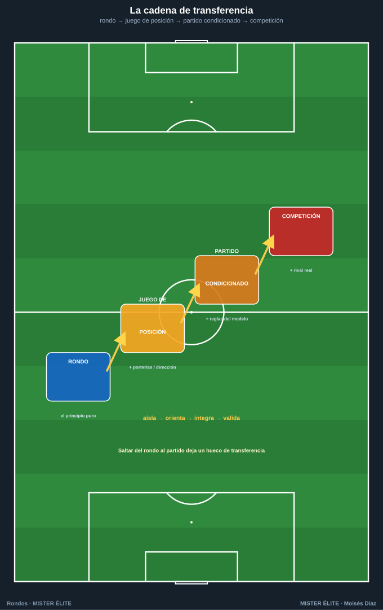
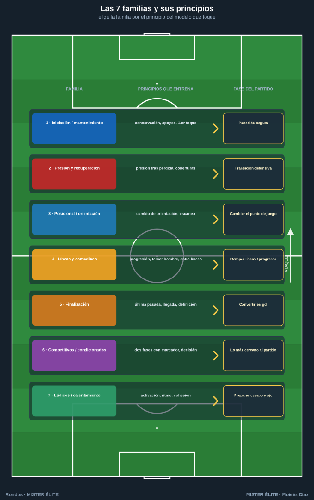
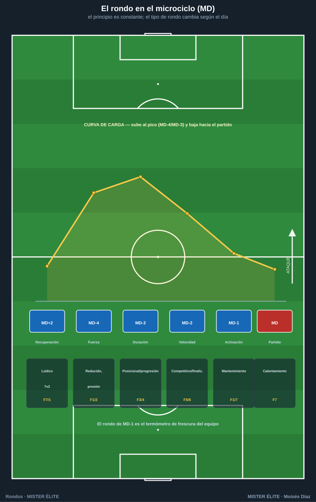

# Módulo 03 · Del rondo al juego: la transferencia

> Un rondo que no se parece a nada del partido es un ejercicio físico-técnico, no de entrenamiento del juego. La metodología moderna exige que cada tarea **transfiera**: que el jugador resuelva en el partido lo que ha repetido en la pizarra. Este módulo conecta el rondo con el modelo de juego.

---

## 1. La cadena de transferencia

El rondo es el primer escalón de una progresión que aumenta **realismo y especificidad** sin perder el principio que se entrena. Cada escalón añade una capa de la realidad del partido.

```
RONDO  →  JUEGO DE POSICIÓN  →  PARTIDO CONDICIONADO  →  COMPETICIÓN
(principio)  (+ porterías/dirección)  (+ reglas del modelo)   (+ rival real)
```



| Escalón | Qué es | Qué añade | Qué entrena |
|---|---|---|---|
| **1. Rondo** | Espacio cerrado, conservar/recuperar, sin dirección | El **principio puro**: superioridad, líneas de pase, primer toque, escaneo | El gesto y la decisión básica, alta densidad |
| **2. Juego de posición** | Rondo con **zonas, dirección y posiciones** reconocibles | **Orientación del campo**, ocupación, relaciones por puestos | Jugar posicionado: ataque organizado, salida |
| **3. Partido condicionado** | Juego real con reglas que provocan el comportamiento | **Oposición real con objetivo**, transiciones, finalización | El principio dentro del caos del partido |
| **4. Competición** | El partido o el amistoso | **El rival real**, marcador, contexto emocional | Integrar todo bajo presión de competición |

**Lectura clave:** se sube de escalón cuando el principio aparece con solvencia en el anterior. El rondo **aísla**; el juego de posición **orienta**; el partido condicionado **integra**; la competición **valida**. Saltarse escalones (rondo → partido) deja un hueco de transferencia: el jugador conserva en círculo pero no sabe progresar hacia una portería.

---

## 2. Qué principios entrena cada familia de rondos

Cada una de las **7 familias** del curso ataca un bloque de principios del juego. Esto permite **elegir la familia según el principio del modelo** que quieras entrenar esa semana.



| Familia | Principios que entrena | Conexión con el partido |
|---|---|---|
| **1. Iniciación / mantenimiento** | Conservación, apoyos, líneas de pase, primer toque, paciencia | Posesión segura, construcción tranquila |
| **2. Presión y recuperación** | Presión tras pérdida, coberturas, intensidad defensiva, recuperación colectiva | **Transición defensiva**, presión alta, robo y contra |
| **3. Posicional / orientación** | Cambio de orientación, escaneo, jugar al lado libre, atraer-y-girar | Cambiar el punto de juego, salida bajo presión |
| **4. Con líneas y comodines** | **Progresión**, superación de líneas, tercer hombre, juego entre líneas | Avanzar el balón, romper líneas, juego interior |
| **5. Finalización** | Última pasada, llegada, definición, ataque del espacio | Convertir la posesión en **gol** |
| **6. Competitivos / condicionados** | Las dos fases con marcador, decisión bajo presión, transiciones | Lo más cercano al partido: tensión real |
| **7. Lúdicos / calentamiento** | Activación neuromuscular, ritmo, técnica bajo fatiga ligera, cohesión | Preparar el cuerpo y el "ojo" |

> Síntesis: las familias 1 y 3 construyen la **fase ofensiva con balón**; la 2 la **transición y defensa**; la 4 la **progresión**; la 5 cierra con **finalización**; la 6 lo **integra** y la 7 lo **activa**.

---

## 3. Cómo encadenar rondos: sesión y microciclo

### 3.1 Dentro de una sesión

El rondo no va suelto: se encadena con la progresión de transferencia para dar **hilo conductor** a la sesión (un solo principio por sesión, atacado a creciente especificidad):

1. **Activación** → rondo lúdico/mantenimiento de alta superioridad (familia 7 o 1).
2. **Rondo del principio del día** → la familia que corresponda al objetivo (p. ej. orientación, familia 3).
3. **Juego de posición** → el mismo principio con dirección y posiciones (escalón 2).
4. **Partido condicionado** → el mismo principio en juego real (escalón 3).

Todo orbita el **mismo principio**: el jugador lo ve nacer en el rondo y lo resuelve en el partido.

### 3.2 A lo largo del microciclo (MD = matchday)

El microciclo semanal (periodización táctica) distribuye la **carga** y el **foco táctico** según la distancia al partido. El rondo se adapta a cada día: cambia su exigencia física, su densidad y la familia elegida.



| Día | Foco | Carga | Tipo de rondo recomendado |
|---|---|---|---|
| **MD+1 / MD+2** | Recuperación / descarga | Baja | Lúdicos, alta superioridad (7v2), sin desgaste (familia 7/1) |
| **MD-4 (fuerza)** | Acciones cortas, muchos cambios de dirección | Alta (tensión) | Pequeños y rápidos, 1–2 toques, espacios reducidos, presión (familia 1/2) |
| **MD-3 (duración)** | Mayor volumen, más espacio | Alta (volumen) | Grandes, posicionales y de progresión, juego de posición (familia 3/4) |
| **MD-2 (velocidad)** | Acciones rápidas, finalización, transiciones | Media-alta | Competitivos cortos, finalización (familia 5/6) |
| **MD-1 (activación)** | Frescura, ritmo, confianza | Baja | Corto de mantenimiento a alta superioridad, técnico (familia 1/7) |
| **MD (partido)** | Competición | — | Rondo de calentamiento pre-partido (familia 7) |

**Principios para encadenar el microciclo:**

- **Especificidad creciente y luego decreciente**: la semana sube de exigencia desde MD+2 hasta el pico (MD-4/MD-3) y desciende hacia MD-1 para llegar fresco.
- **El principio táctico se entrena toda la semana**, pero el **tipo de rondo** cambia para repartir la carga.
- **El rondo como termómetro**: si en MD-1 el balón circula limpio y rápido, el equipo llega bien; si se atasca, hay fatiga residual.

> Conclusión: el rondo deja de ser "el calentamiento" para ser una herramienta **modulable** que, bien elegida y ubicada, entrena el modelo de juego de lunes a domingo y conecta cada repetición con lo que pasará el día del partido.

---

## Ideas clave

- La transferencia es una **cadena**: rondo → juego de posición → partido condicionado → competición. Cada peldaño añade realismo.
- El rondo **aísla** el principio; sube de escalón cuando aparece con solvencia. No saltes del rondo al partido directamente.
- Cada una de las **7 familias** entrena un bloque concreto de principios: elige la familia por el principio del modelo que toque esa semana.
- Dentro de la sesión, encadena todo **en torno a un único principio**.
- En el microciclo, **el principio es constante; el tipo de rondo cambia** según el día (MD) para repartir la carga.
- Usa el rondo de MD-1 como **termómetro** de frescura del equipo.

## Errores comunes

- Quedarse en el rondo básico sin progresar: se conserva en círculo pero no se sabe progresar a portería.
- Saltar de escalón sin que el principio esté consolidado (transferencia con huecos).
- Elegir la familia por gusto y no por el principio del modelo de la semana.
- Mezclar principios distintos en la misma sesión (se pierde el hilo conductor).
- Usar siempre el mismo tipo de rondo todos los días del microciclo, sin modular la carga según el MD.

---

*MISTER ÉLITE — Moisés Díaz*
