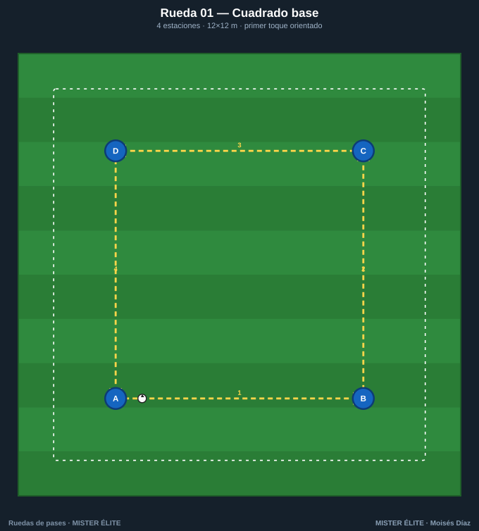
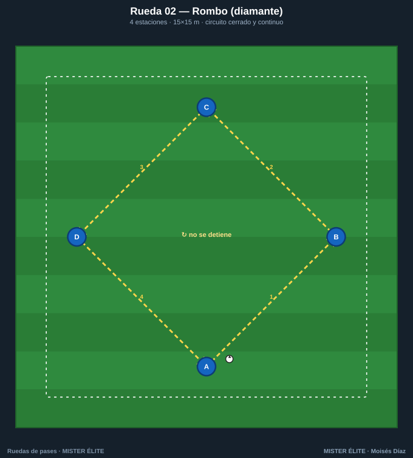
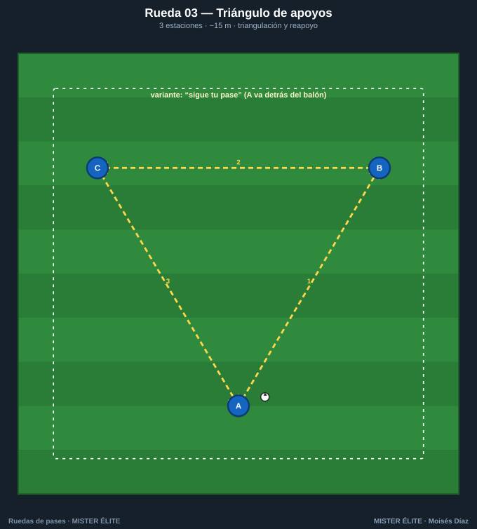
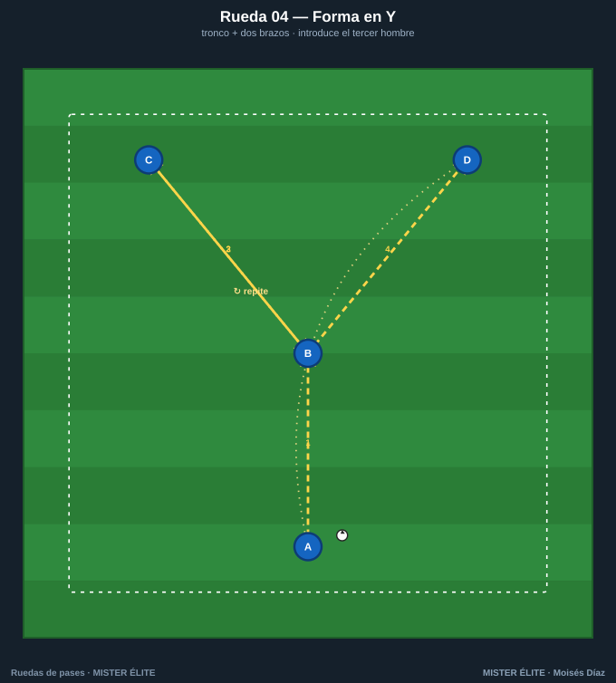
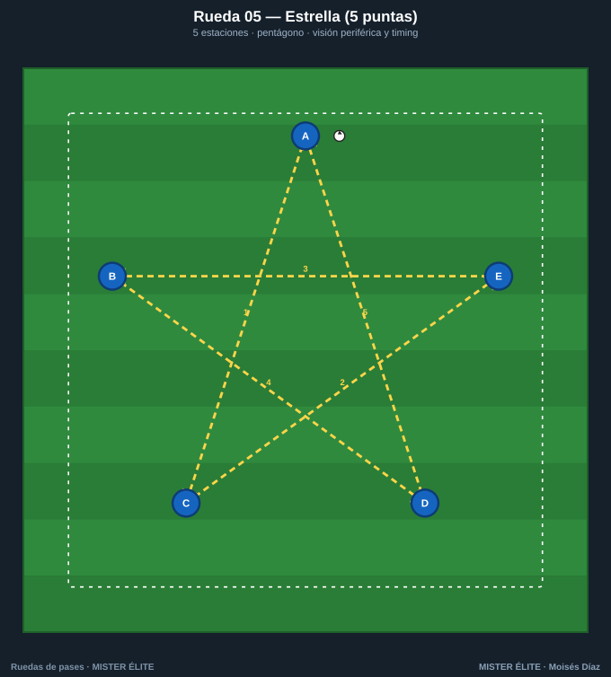

# Familia 1 · Ruedas básicas (01–05)

Formas geométricas fijas. El jugador no cambia de estación: el foco está 100 % en la **técnica** —peso del pase, primer toque orientado y perfil—. Son el calentamiento técnico perfecto y la base sobre la que se construye todo lo demás.

> **Coaching points de la familia:** primer toque orientado · peso del pase al pie · cuerpo de semiperfil · las dos piernas (cambia el sentido).

---

## Rueda 01 — Cuadrado base

- **Objetivo:** primer toque orientado y pase a estación fija. Calentamiento técnico.
- **Secuencia:** 1) A→B. 2) B→C. 3) C→D. 4) D→A. Circulación horaria continua.
- **Medidas:** cuadrado de 12×12 m. 2-3 por estación, 1 balón.
- **Variante:** a 2 toques → 1 toque · invertir el sentido a la señal · el pasador **sigue su pase**.

## Rueda 02 — Rombo (diamante)

- **Objetivo:** orientación del cuerpo en diagonal; recibir de semiperfil. Base del juego por dentro.
- **Secuencia:** 1) A→B. 2) B→C. 3) C→D. 4) D→A, por las diagonales del rombo.
- **Medidas:** ejes de 15 m.
- **Variante:** doble balón en sentidos opuestos · primer toque siempre con la pierna exterior.

## Rueda 03 — Triángulo de apoyos

- **Objetivo:** triangulación, ángulo de pase y reapoyo; primer toque obligado.
- **Secuencia:** 1) A→B. 2) B→C. 3) C→A. Circulación continua reorientando el cuerpo al siguiente.
- **Medidas:** lados de 10-15 m.
- **Variante:** "sigue tu pase" (A pasa a B y corre a B) · a 1 toque cuando salga limpio.

## Rueda 04 — Forma en Y

- **Objetivo:** pasar desde un apoyo a un vértice y descargar; recepción de cara. Introduce la elección de brazo.
- **Secuencia:** 1) A→B (tronco). 2) B se gira y abre a C. 3) C devuelve a B. 4) B abre a D. Alternar brazos.
- **Medidas:** A-B 10 m; brazos B-C y B-D 8 m en diagonal.
- **Variante:** B juega a 1 toque (deja de cara) · rotar B con quien le pasa.

## Rueda 05 — Estrella (5 puntas)

- **Objetivo:** circulación con cambio de orientación constante; visión periférica y comunicación.
- **Secuencia:** pase "saltando un vértice" dibujando la estrella: 1) A→C. 2) C→E. 3) E→B. 4) B→D. 5) D→A.
- **Medidas:** pentágono de ~14 m de diámetro.
- **Variante:** alternar el trazo de estrella con el pase al contiguo · añadir "sigue tu pase".
