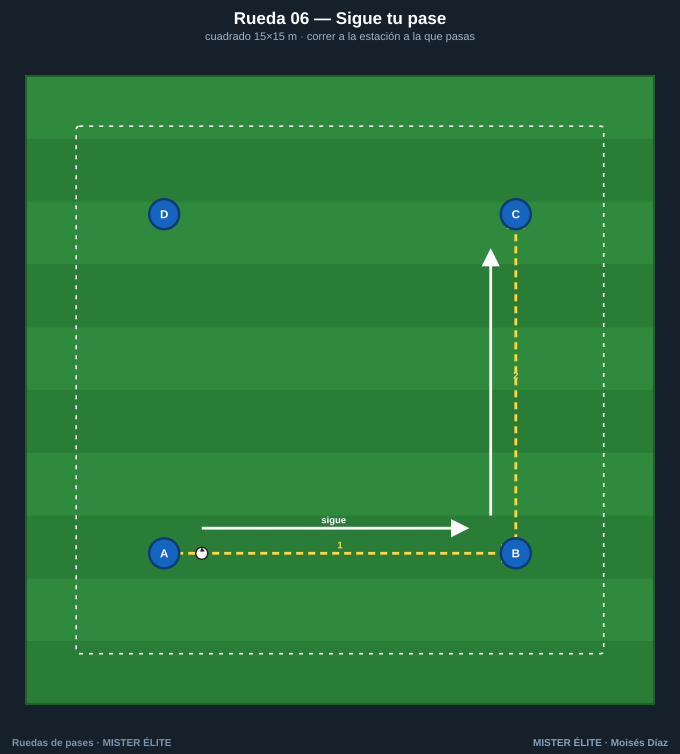
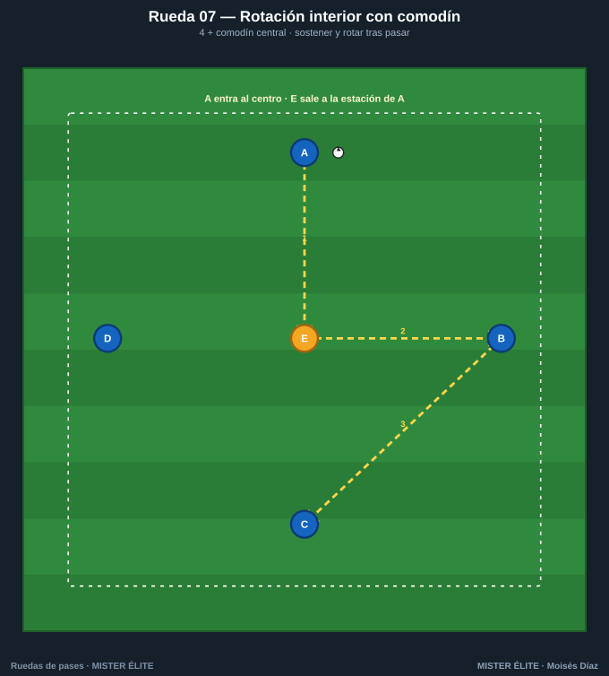
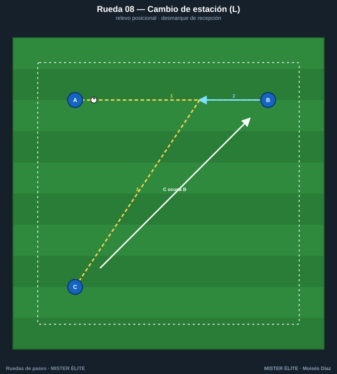
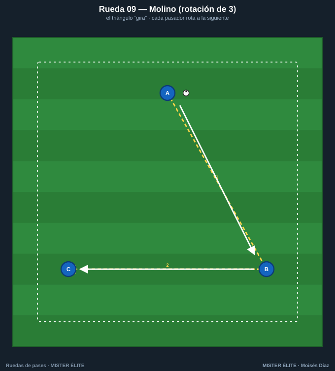
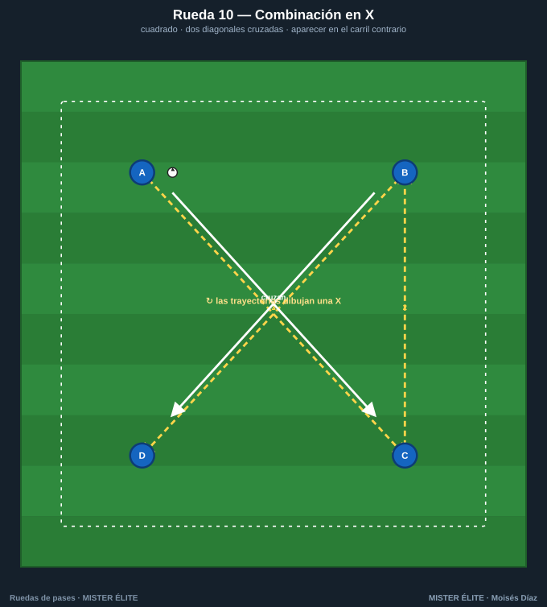

# Familia 2 · Movilidad y rotación (06–10)

Ahora el jugador **se mueve tras pasar**. Se añade el desmarque, la rotación y la permuta: la rueda deja de ser estática y empieza a parecerse al juego, donde nadie se queda quieto después de dar el balón.

> **Coaching points de la familia:** correr **detrás del balón** tras el pase · timing del desmarque · ocupar el espacio que deja el compañero · no chocar (comunicación).

---

## Rueda 06 — Sigue tu pase

- **Objetivo:** automatizar la carrera tras el pase; ocupar la estación siguiente. El patrón base de movilidad.
- **Secuencia:** 1) A pasa a B y **corre detrás del balón** a la cola de B. 2) B a C y corre a C. Cadena continua.
- **Medidas:** cuadrado de 15×15 m, 2 por estación.
- **Variante:** doble balón · cambiar el sentido a la señal.

## Rueda 07 — Rotación interior con comodín

- **Objetivo:** sostener el balón y **rotar de posición** tras pasar; juego con apoyo central.
- **Secuencia:** 1) A→E (central). 2) E deja de cara a B. 3) B→C. 4) **A entra al centro** y E sale a la estación de A.
- **Medidas:** círculo de ~16 m con comodín en el centro.
- **Variante:** dos comodines centrales · máximo 2 toques.

## Rueda 08 — Cambio de estación (L)

- **Objetivo:** desmarque de recepción y **relevo posicional** (dejar tu sitio al compañero).
- **Secuencia:** 1) A→B. 2) B controla, conduce hacia A y deja su sitio. 3) B→C; C ocupa la estación que vació B.
- **Medidas:** brazos de la L de 12 m.
- **Variante:** conducción obligatoria de 3 m antes del pase · trabajar las dos piernas.

## Rueda 09 — Molino (rotación de 3)

- **Objetivo:** rotación coordinada tipo carrusel; timing del apoyo.
- **Secuencia:** 1) A→B y A **corre** a la posición de B. 2) B→C y B corre a la posición de C. 3) C→A. El triángulo "gira".
- **Medidas:** triángulo de 12 m.
- **Variante:** invertir el giro · a 1 toque manteniendo la rotación.

## Rueda 10 — Cruce y permuta

- **Objetivo:** permutas y desmarques cruzados sin chocar; coordinación.
- **Secuencia:** 1) A→C (vertical por el centro). 2) C→B. 3) B→D (horizontal). 4) **B y D permutan** corriendo cruzados.
- **Medidas:** rombo de 16 m.
- **Variante:** permuta de las cuatro estaciones en cada vuelta · doble balón.
