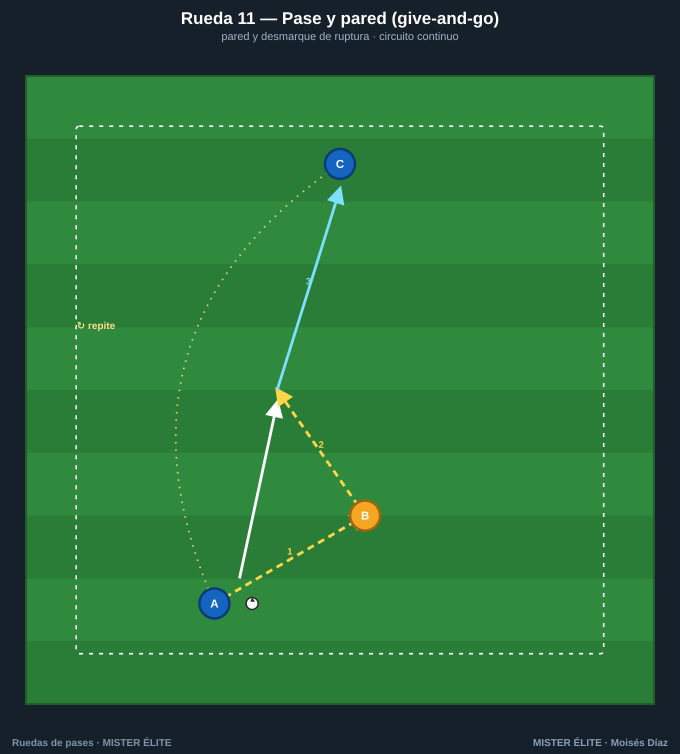
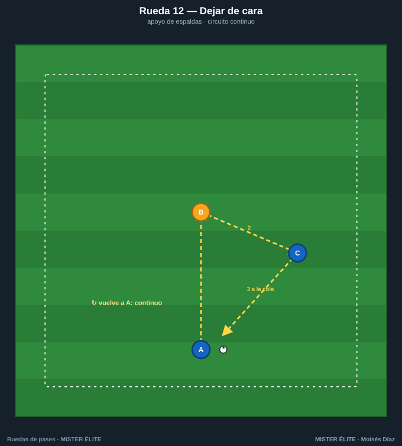
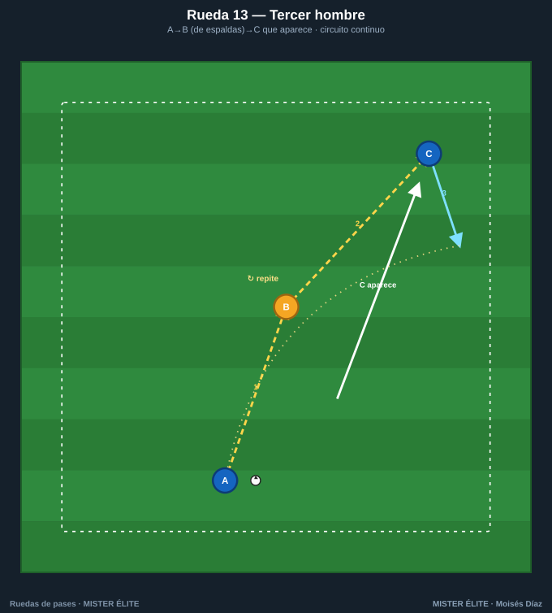
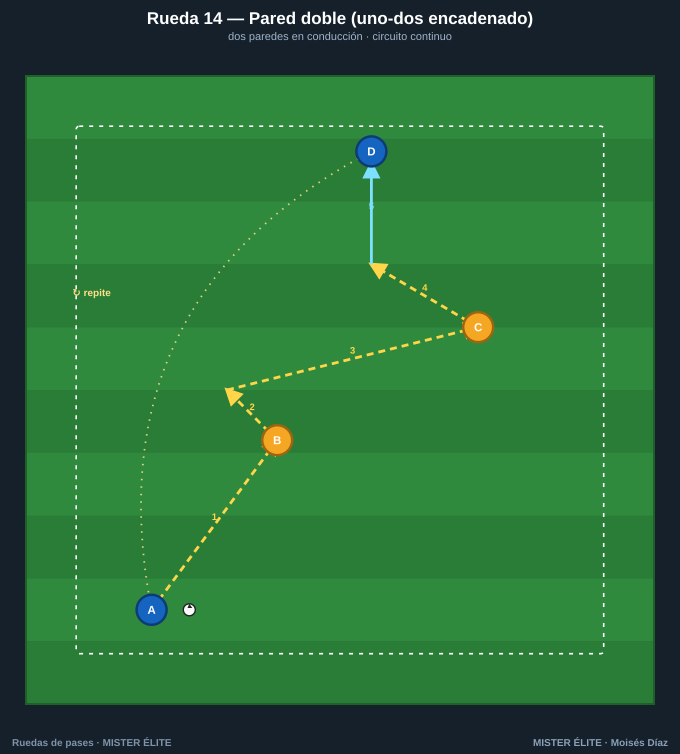
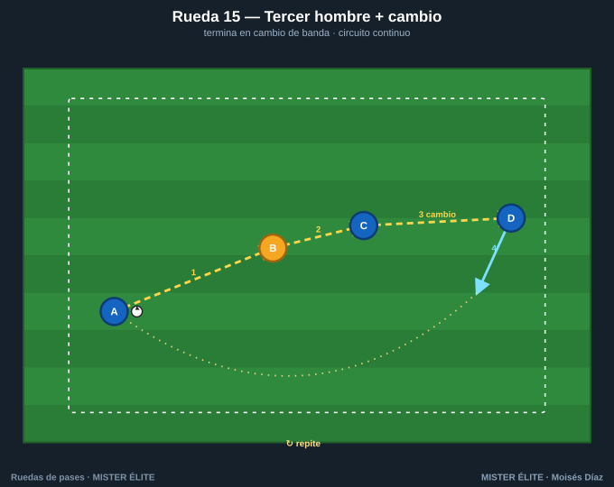

# Familia 3 · Pared y tercer hombre (11–15)

Aparece la **combinación**: pase-pared (uno-dos), dejar de cara y tercer hombre. Son los patrones que más se repiten en el partido y los más difíciles de defender cuando se ejecutan rápido. Aquí la rueda empieza a "oler" a fútbol real.

> **Coaching points de la familia:** devolución a 1 toque · pase al espacio (no al pie) en la pared · timing de la aparición del tercer hombre · primer toque orientado del que recibe.

---

## Rueda 11 — Pase y pared (give-and-go)

- **Objetivo:** ejecutar el uno-dos y el desmarque de ruptura.
- **Secuencia:** 1) A pasa a B y **arranca al frente**. 2) B devuelve a 1 toque **al espacio** por delante de A. 3) A conduce y pasa a C.
- **Medidas:** A-B 6 m; A-C 12 m. Pasillo de 12×6 m.
- **Variante:** pared con interior y con exterior · A finaliza a portería tras la pared.

## Rueda 12 — Dejar de cara

- **Objetivo:** recibir de espaldas y descargar de primeras (juego de pivote).
- **Secuencia:** 1) A al pie de B. 2) B **deja de cara a 1 toque** al lado, a C. 3) C controla orientado y devuelve a la cola.
- **Medidas:** A-B 8 m; B-C 6 m.
- **Variante:** B recibe con un defensa pasivo a la espalda · C remata si hay portería.

## Rueda 13 — Tercer hombre

- **Objetivo:** automatizar el patrón del tercer hombre (pasar a uno para llegar a otro).
- **Secuencia:** 1) A→B (al pie). 2) B deja de cara a C, que **aparece desde atrás**. 3) C recibe en carrera y conduce. A ocupa el sitio de C.
- **Medidas:** A-B 8 m; aparición de C a 12-15 m. Zona de 18×12 m.
- **Variante:** dos pares en espejo trabajando a la vez · final con pase filtrado.

## Rueda 14 — Pared doble (uno-dos encadenado)

- **Objetivo:** enlazar **dos paredes** seguidas avanzando en conducción.
- **Secuencia:** 1) A-B pared, A sigue. 2) A-C pared, A sigue. 3) A conduce y pasa a D.
- **Medidas:** corredor de 25×8 m, apoyos cada 8 m alternando lados.
- **Variante:** las paredes a 1 toque · cronometrar el recorrido.

## Rueda 15 — Tercer hombre con cambio de orientación

- **Objetivo:** encadenar el tercer hombre con un **cambio de orientación** a la banda opuesta.
- **Secuencia:** 1) A→B. 2) B deja de cara a C. 3) C **abre en largo a D** (cambio). 4) D controla y conduce.
- **Medidas:** A-B 12 m; cambio C-D de 25-30 m.
- **Variante:** D centra tras el cambio · añadir un rematador.
