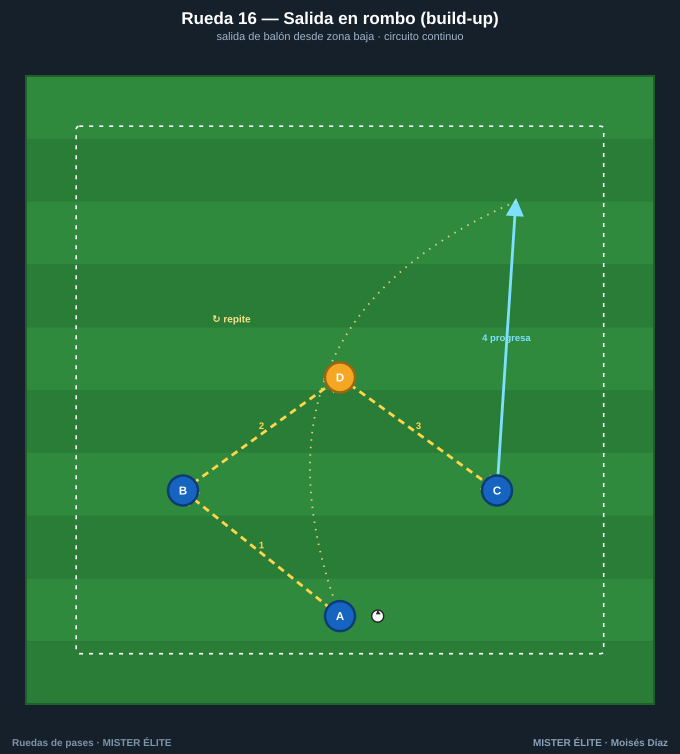
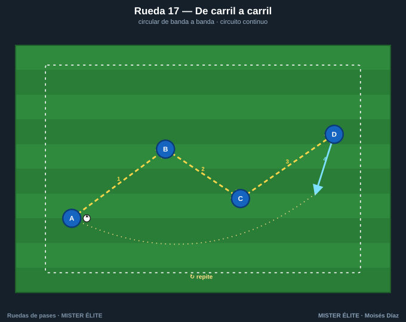
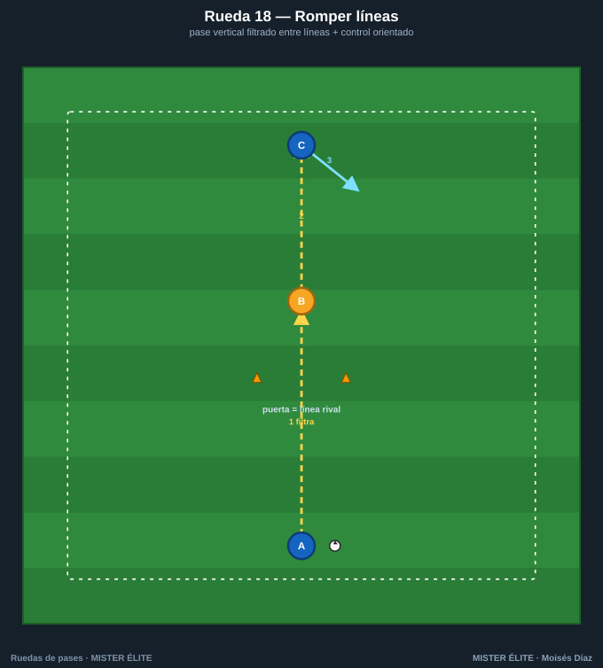
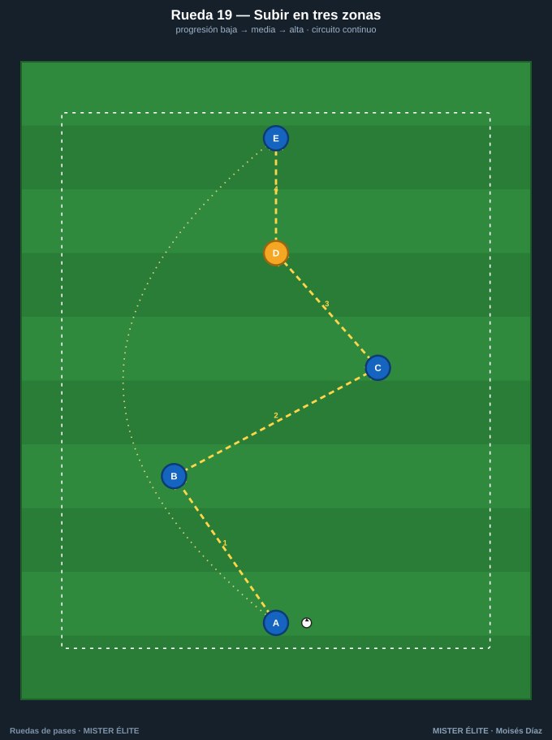
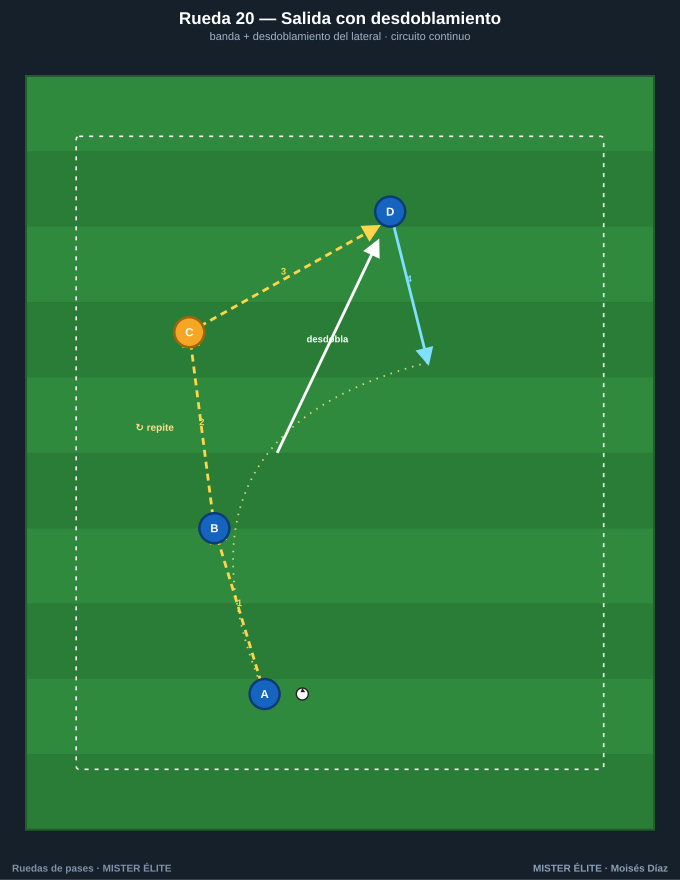

# Familia 4 · Progresión por zonas (16–20)

La rueda toma **dirección de juego**: ya no circula en círculo, sino que **sube el balón** de zona a zona reproduciendo la salida, la progresión por dentro o por fuera y el cambio de orientación. Es el puente directo entre la técnica y el modelo de juego.

> **Coaching points de la familia:** control orientado hacia delante · pase entre líneas con el peso justo · recibir de semiperfil para progresar · timing de los apoyos escalonados.

---

## Rueda 16 — Salida en rombo (build-up)

- **Objetivo:** salida de balón desde portero/centrales con el rombo de inicio.
- **Secuencia:** 1) A→B (central). 2) B→D (pivote, entre líneas). 3) D se gira y abre a C. 4) C progresa en conducción.
- **Medidas:** centrales separados 25-30 m; pivote 12 m por delante.
- **Variante:** el pivote, presionado, se apoya y devuelve (salida en peine) · añadir una punta que fija.

## Rueda 17 — De carril a carril

- **Objetivo:** circular de un carril al opuesto rompiendo por dentro (cambio de orientación corto).
- **Secuencia:** 1) A→B (diagonal interior). 2) B→C (horizontal por dentro). 3) C→D (diagonal a banda). 4) D conduce.
- **Medidas:** saltos de carril de ~10-12 m.
- **Variante:** un toque en los interiores · añadir un defensa que orienta el pase.

## Rueda 18 — Romper líneas

- **Objetivo:** pase vertical filtrado **entre líneas** y control orientado del receptor.
- **Secuencia:** 1) A **filtra entre los conos** a B. 2) B controla de cara y la da a C. 3) C ataca el espacio en conducción.
- **Medidas:** puerta de 2 m; A-B 10 m; B-C 8 m.
- **Variante:** dos puertas sucesivas (romper dos líneas) · B juega de primeras al delantero.

## Rueda 19 — Subir el balón en tres zonas

- **Objetivo:** progresión zona baja → media → alta con apoyos escalonados.
- **Secuencia:** 1) A→B. 2) B→C (cambio de lado en zona media). 3) C→D (entre líneas). 4) D de cara a E.
- **Medidas:** saltos verticales de 8-10 m.
- **Variante:** cada zona a 1 toque · final con remate de E.

## Rueda 20 — Salida con desdoblamiento

- **Objetivo:** salida por banda con **desdoblamiento** del lateral (sobremarca).
- **Secuencia:** 1) A→B. 2) B al pie de C (extremo). 3) C deja de cara a D, que **desdobla por fuera**. 4) D conduce por la banda.
- **Medidas:** A-B 12 m; carrera de desdoblamiento 15-20 m.
- **Variante:** terminar en centro de D · añadir un defensa al extremo.
