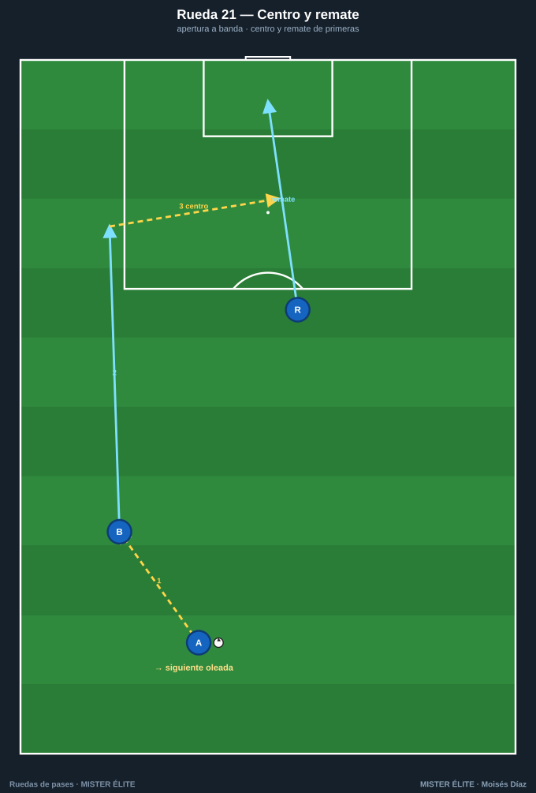
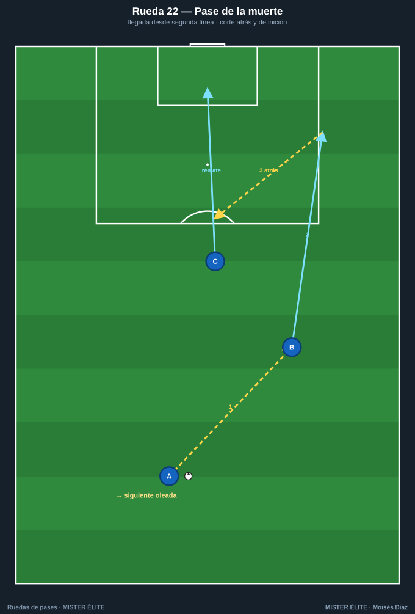
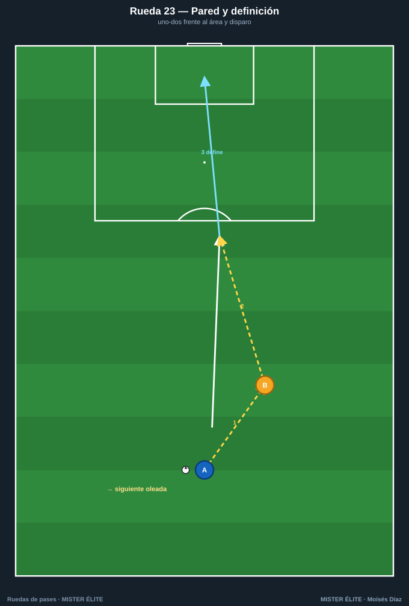
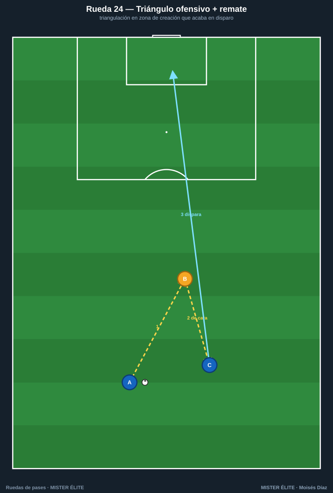
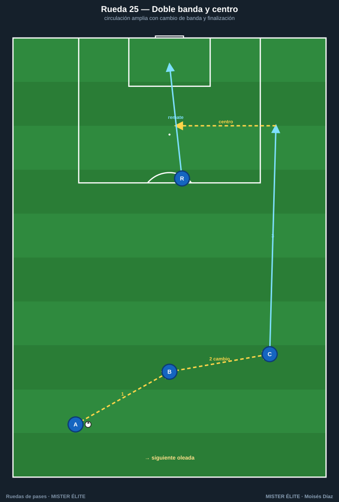

# Familia 5 · Finalización (21–25)

La rueda **termina en gol**: centro y remate, cut-back (pase atrás), pase de la muerte, definición tras pared. Son la última acción del ataque. Mantienen la calidad técnica de las familias anteriores, pero con la portería como destino y la exigencia del remate de primeras. Se trabajan por **oleadas** y se reinician alternando bandas y rotando al rematador.

> **Coaching points de la familia:** calidad y peso del último pase/centro · timing de la llegada ("no llegues antes que el balón") · remate de primeras (no controlar) · leer primer/segundo palo.

---

## Rueda 21 — Centro y remate (primer/segundo palo)

- **Objetivo:** apertura a banda, centro lateral y remate de dos puntas (señuelo al primer palo, llegada al segundo).
- **Secuencia:** 1) A abre a B (banda). 2) B conduce al fondo y **centra**. 3) R1 ataca el primer palo (arrastra marca); R2 llega al segundo y **remata**.
- **Reinicio:** oleadas; R1↔R2 rotan, B a la cola de banda. Alternar banda.
- **Parámetros:** 5-6 jugadores · 1-2 balones · apertura ~20 m, centro desde fondo · remate de primeras.
- **Coaching:** disparar la carrera cuando el centrador levanta la cabeza; timing escalonado R1→R2.
- **Subir nivel:** centro raso vs bombeado · defensor pasivo en el área · doble rematador.

## Rueda 22 — Pase de la muerte (cut-back)

- **Objetivo:** finalización de la llegada que ataca el punto de penalti tras **pase atrás raso** desde el fondo.
- **Secuencia:** 1) A lanza a B al espacio en banda. 2) B llega al fondo y saca **centro raso atrás** a la zona de penalti. 3) C llega de cara y remata de primeras.
- **Reinicio:** oleadas; C↔B rotan; alternar banda.
- **Parámetros:** 5-6 jugadores · 1-2 balones · lanzamiento 15-18 m, cut-back al penalti (11 m).
- **Coaching:** "no llegues antes que el balón"; rematar con el interior redirigiendo, sin pegarle fuerte.
- **Subir nivel:** segundo rematador al borde del área para el rechace · defensor pasivo entre B y C.

## Rueda 23 — Pared y definición

- **Objetivo:** rematar tras una pared que rompe la línea; disparo en carrera.
- **Secuencia:** 1) A conduce para fijar y pasa a B, **arrancando**. 2) B devuelve a 1 toque al espacio. 3) A **define** ante el portero.
- **Reinicio:** A rota al puesto de pared, B a la cola; alternar lado.
- **Parámetros:** 4 jugadores · 1 balón · A-B 6 m, disparo a 14-16 m · remate antes de que la jugada se cierre.
- **Coaching:** el pasador continúa la carrera al instante; la devolución llega al ritmo exacto.
- **Subir nivel:** pared en diagonal hacia dentro (underlap) · pared con tercer hombre · todo a 1 toque.

## Rueda 24 — Triángulo ofensivo + remate

- **Objetivo:** combinación central (mediapunta — delantero de espaldas — llegada del interior) que termina en disparo.
- **Secuencia:** 1) A (mediapunta) al pie de B (9 de espaldas). 2) B **descarga de cara** a C (interior que llega). 3) C controla orientado y **dispara**, o asiste a A que ha continuado.
- **Reinicio:** rotación A→B→C→cola; alternar el lado de llegada.
- **Parámetros:** 6 jugadores · 1 balón · A-B 9 m, remate a 16-18 m · descarga *cushioned*, remate de primeras.
- **Coaching:** la descarga es parada y orientada; el interior dispara sin parar el balón.
- **Subir nivel:** B gira y filtra al hueco en vez de descargar · defensor pasivo a la espalda de B.

## Rueda 25 — Doble banda y centro (doble oleada)

- **Objetivo:** finalización repetida desde ambas bandas a alta intensidad (volumen de remate), con cambio de orientación previo.
- **Secuencia:** 1) A→B. 2) B **cambia** a C (banda opuesta). 3) C conduce y centra. 4) R remata. Inmediatamente arranca la oleada por la otra banda.
- **Reinicio:** alternancia automática izquierda↔derecha (a 2 balones desfasados); rematadores rotan a banda.
- **Parámetros:** 6-7 jugadores · **2 balones** · cambio de banda 30-35 m · ritmo de partido.
- **Coaching:** que el cambio caiga al espacio (no a los pies marcados); remate de primeras.
- **Subir nivel:** un rematador hace decoy al primer palo y otro espera el cut-back · defensor pasivo en el área.
