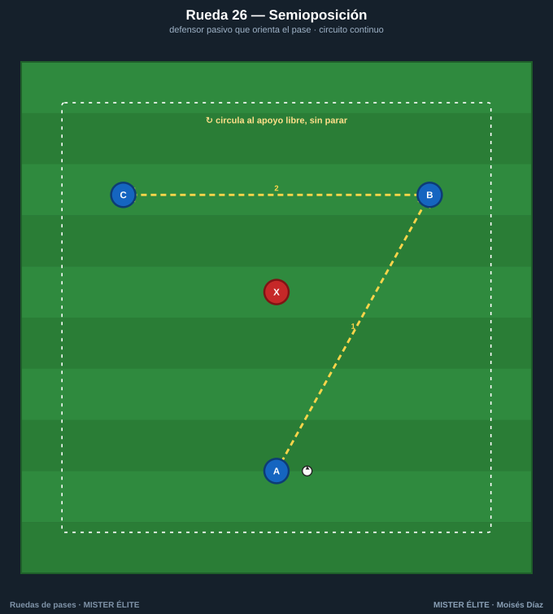
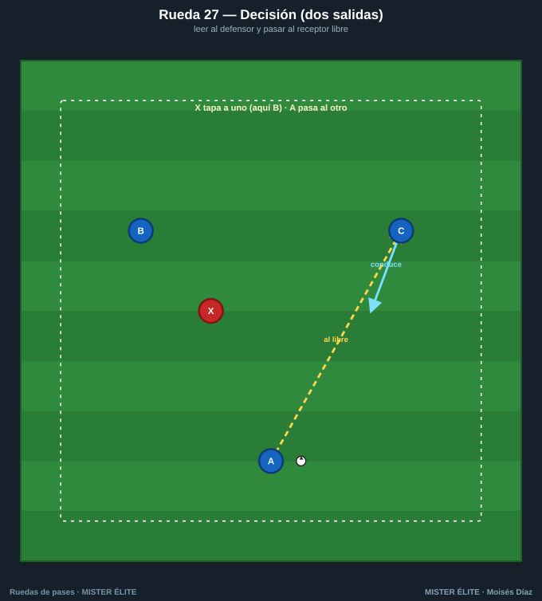
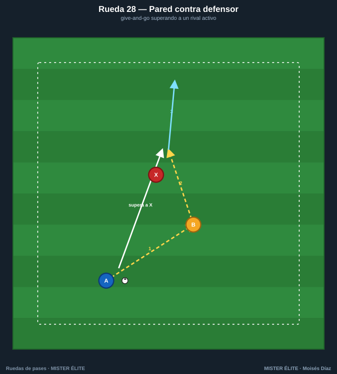
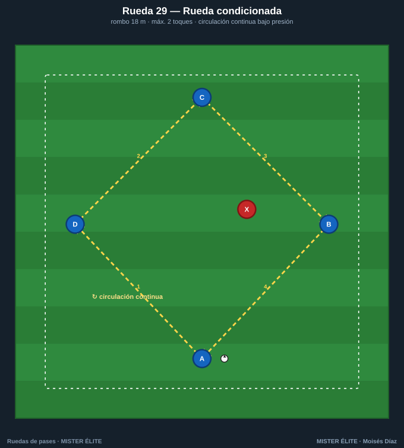
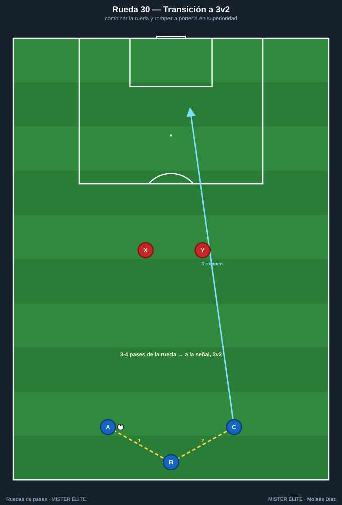

# Familia 6 · Oposición y transferencia (26–30)

El último escalón: aparece el **rival** y, con él, la **decisión**. Aquí la rueda deja de "dar la respuesta" y empieza a obligar a buscarla. Es el puente final hacia el partido —exactamente lo que enseña el Módulo 4—.

> **Coaching points de la familia:** leer al defensor antes de recibir · pasar al apoyo libre · ejecutar el patrón **rápido** para que la oposición no llegue · resolver con criterio en superioridad.

---

## Rueda 26 — Semioposición

- **Objetivo:** introducir un adversario que **orienta** el pase sin robar (primer paso hacia la decisión).
- **Secuencia:** 1) A lee dónde está X y pasa al apoyo libre (B o C). 2) Se circula evitando que X corte líneas. 3) "Sigue tu pase".
- **Medidas:** triángulo de 12 m con X en el centro.
- **Variante:** subir X a semiactivo (intercepta al 70 %) → activo total.

## Rueda 27 — Decisión (dos salidas)

- **Objetivo:** toma de decisión: leer el desmarque correcto entre dos opciones.
- **Secuencia:** 1) X cierra a B o C de forma aleatoria. 2) A pasa **al que queda libre**. 3) El receptor conduce y reinicia por el otro lado.
- **Medidas:** B y C separados 15-18 m; X entre ambos.
- **Variante:** señal de color/voz que indica el destino obligado · añadir un segundo defensor.

## Rueda 28 — Pared contra defensor

- **Objetivo:** ejecutar el pase-pared **superando a un rival activo**.
- **Secuencia:** 1) A encara a X y juega la pared con B. 2) A **supera a X por su espalda** recibiendo la devolución. 3) A conduce a meta.
- **Medidas:** A-B 6-7 m; pasillo de 18×10 m.
- **Variante:** premio si supera limpio · añadir portería y portero para finalizar.

## Rueda 29 — Rueda condicionada

- **Objetivo:** transferir el patrón a **condicionantes de juego** real.
- **Secuencia:** 1) Circulación libre del rombo. 2) **Condición:** máximo 2 toques y el pase de salida va al lado contrario de X. 3) Si X roba, intercambia con quien perdió.
- **Medidas:** rombo de 18 m con X presionando la recepción.
- **Variante:** sumar un segundo defensor · recompensa por completar 6 pases bajo presión.

## Rueda 30 — Transición a 3v2 a portería

- **Objetivo:** transferir la combinación a una situación real con oposición y finalización.
- **Secuencia:** 1) A-B-C combinan 3-4 pases de la rueda (pared + tercer hombre). 2) A la señal, **rompen hacia portería en 3v2**. 3) Resuelven y finalizan.
- **Medidas:** zona de ataque de 30×40 m, portería con portero.
- **Variante:** empezar 3v1 → 3v2 → 3v3 · límite de tiempo para rematar (6-8 s).

---

> **Cierre del banco:** has recorrido la escalera completa —de la forma básica (Rueda 01) a la situación real con oposición y portería (Rueda 30)—. Esa es la transferencia: el gesto que automatizaste en la rueda cerrada ahora aparece bajo presión. Del patrón al partido.
